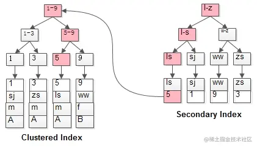

## 索引的使用和设计原则

### 索引的声明和使用

#### 索引分类

- 从功能逻辑上说，索引主要有 4 种，分别是普通索引、唯一索引、主键索引、全文索引。
- 按照物理实现方式，索引可以分为 2 种:一级索引（聚簇索引）和二级索引（非聚簇索引）。
  - 一级索引:索引和数据存储在一起，都存储在同一个B+tree中的叶子节点。一般主键索引都是一级索引。
  - 二级索引树的叶子节点存储的是主键而不是数据。也就是说，在找到索引后，得到对应的主键，再回到一级索引中找主键对应的数据记录。

- 按照作用字段个数进行划分，分成单列索引和联合索引。 

#### 创建索引

```mysql
# 建表时建立索引
CREATE TABLE table_name [col_name data_type] 
[UNIQUE | FULLTEXT | SPATIAL] [INDEX | KEY] [index_name] (col_name [length]) [ASC | DESC]

# 在已存在的表上创建索引
ALTER TABLE table_name 
ADD [UNIQUE | FULLTEXT | SPATIAL] [INDEX | KEY] [index_name] (col_name[length],...) [ASC | DESC]

CREATE [UNIQUE | FULLTEXT | SPATIAL] INDEX index_name 
ON table_name (col_name[length],...) [ASC | DESC]
```

- `UNIQUE`、`FULLTEXT`和`SPATIAL`为可选参数，分别表示唯一索引、全文索引和空间索引；
- `INDEX`与`KEY`为同义词，两者的作用相同，用来指定创建索引；
- `index_name`指定索引的名称，为可选参数，如果不指定，那么MySQL默认col_name为索引名；
- `col_name`为需要创建索引的字段列，该列必须从数据表中定义的多个列中选择；
- `length`为可选参数，表示索引的长度，只有字符串类型的字段才能指定索引长度；
- `ASC`或`DESC`指定升序或者降序的索引值存储。 

### 查看索引

```mysql
SHOW INDEX FROM table_name
```

### 删除索引

```mysql
ALTER TABLE table_name DROP INDEX index_name;
或
DROP INDEX index_name ON table_name;
```

### 隐藏索引（8.0新特性）

从 MySQL8.x 开始支持隐藏索引（invisible indexes），只需要将待删除的索引设置为隐藏索引，使查询优化器不再使用这个索引（即使使用force index（强制使用索引），优化器也不会使用该索引），确认将索引设置为隐藏索引后系统不受任何响应，就可以彻底删除索引。这种通过先将索引设置为隐藏索引，再删除索引的方式就是软删除。

```mysql
# 切换成隐藏索引 
ALTER TABLE tablename ALTER INDEX index_name INVISIBLE; 

# 切换成非隐藏索引
ALTER TABLE tablename ALTER INDEX index_name VISIBLE; 

# 也可以在创建索引时指定 INVISIBLE 
# 索引创建时默认是 VISIBLE
```

（当索引被隐藏时，其内容仍是实时更新的，因此不推荐长期隐藏索引）

### 创建索引原则（推荐创建索引的场景）

#### 字段的数值有唯一性的限制

索引本身可以起到约束的作用，比如唯一索引、主键索引都可以起到唯一性约束的，因此在我们的数据表中，如果**某个字段是唯一的**，就可以**直接创建唯一性索引**，或者**主键索引**。这样可以更快速地通过该索引来确定某条记录。

> 参考:[普通索引的性能会不会比唯一索引好？ - 掘金 (juejin.cn)](https://juejin.cn/post/7040110129512972325)
>
> [Mysql - 普通索引与唯一索引之间性能差别change buffer_it_lihongmin的博客-CSDN博客](https://blog.csdn.net/it_lihongmin/article/details/115315120)

#### 频繁作为 WHERE 查询条件且具有明显区分特性的字段

某个字段在SELECT语句的 WHERE 条件中经常被使用到并且具有明显区分特性（例如username，而不是sex这种），那么就需要给这个字段创建索引了。尤其是在数据量大的情况下，创建普通索引就可以大幅提升数据查询的效率。

#### 经常 GROUP BY 和 ORDER BY 的列

某个字段在 SELECT 语句的 WHERE 条件中经常被使用到，那么就需要给这个字段创建索引了。尤其是在数据量大的情况下，创建普通索引就可以大幅提升数据查询的效率。索引就是让数据按照某种顺序进行存储或检索，因此当我们使用 GROUP BY 对数据进行分组查询，或者使用 ORDER BY 对数据进行排序的时候，就需要对**分组或者排序的字段进行索引**。如果待排序的列有多个，那么可以在这些列上建立**组合索引**。

#### UPDATE、DELETE 的 WHERE 条件列

对数据按照某个条件进行查询后再进行 UPDATE 或 DELETE 的操作，如果对 WHERE 字段创建了索引，就能大幅提升效率。原理是因为我们需要先根据 WHERE 条件列检索出来这条记录，然后再对它进行更新或删除。**如果进行更新的时候，更新的字段是非索引字段，提升的效率会更明显，这是因为非索引字段更新不需要对索引进行维护。**

#### 查询 DISTINCT 字段

有时候我们需要对某个字段进行去重，使用 DISTINCT，那么对这个字段创建索引，也会提升查询效率。

#### 多表 JOIN 

- **连接表的数量尽量不要超过 3 张**，因为每增加一张表就相当于增加了一次嵌套的循环，数量级增长会非常快，严重影响查询的效率。
- **对 WHERE 条件创建索引**，因为 WHERE 才是对数据条件的过滤。如果在数据量非常大的情况下，没有 WHERE 条件过滤是非常可怕的。
- **对用于连接的字段创建索引**，并且该字段在多张表中的**类型必须一致**。

#### 使用列的类型小的创建索引

我们这里所说的类型大小指的就是**该类型表示的数据范围的大小**。

- 数据类型越小，在查询时进行的比较操作越快
- 数据类型越小，索引占用的存储空间就越少，在一个数据页内就可以放下更多的记录，从而减少磁盘 I/O 带来的性能损耗，也就意味着可以把更多的数据页缓存在内存中，从而加快读写效率。

这个建议对于表的主键来说更加适用，因为不仅是聚簇索引中会存储主键值，其他所有的二级索引的节点处都会存储一份记录的主键值，如果主键使用更小的数据类型，也就意味着节省更多的存储空间和更高效的I/O。

#### 使用字符串前缀创建索引

如果某个字段是 varchar 类型的（或者 text 等等），那么其中可能存储了很长的字符串，当建立索引时，可以不用整个字符串建立索引，而是指截取前面部分建立索引

拓展:Alibaba《Java开发手册》

**【强制】**在 varchar 字段上建立索引时，必须指定索引长度，没必要对全字段建立索引，根据实际文本区分度决定索引长度。

说明:索引的长度与区分度是一对矛盾体，一般对字符串类型数据，长度为 20 的索引，区分度会高达 90% 以上。

区分度计算公式:`count(distinct left(列名, 索引长度))/count(*)`

#### 区分度高的列适合作为索引

列的基数指的是某一列中不重复数据的个数，比方说某个列包含值 2,5,8,2,5,8,2,5,8，虽然有 9 条记录，但该列的基数却是 3 。也就是说，**在记录行数一定的情况下，列的基数越大，该列中的值越分散；列的基数越小，该列中的值越集中。**这个列的基数指标非常重要，直接影响我们是否能有效的利用索引。最好为列的基数大的列建立索引，为基数太小的列建立索引效果可能不好。

可以使用公式 `select count(distinct a)/count(*) from t1` 计算区分度，越接近 1 越好，一般超过 33% 就算是比较高效的索引了。

拓展:联合索引把区分度高（散列性高）的列放在前面。

#### 使用频率高的列放到联合索引的左侧

#### 多个字段都要创建索引的情况下，联合索引优于单值索引

#### 单张表的索引不超过6个

### 不适合创建索引的场景

- where 中使用不到的字段不要使用索引
- 数据量小的表不要使用索引
- 有大量重复数据的列上不要创建索引
- 避免对经常更新的表创建过多索引
- 不建议用无序的值作为索引
- 删除不再使用或者很少使用的索引
- 不要定义冗余或重复的索引

## 插入 1KW 条测试数据

创建测试表t_user

```mysql
CREATE TABLE `t_user` (
  `id` int(11) NOT NULL AUTO_INCREMENT,
  `c_user_id` varchar(36) NOT NULL DEFAULT '' COMMENT '用户Id',
  `c_name` varchar(22) NOT NULL DEFAULT '' COMMENT '用户名',
  `c_province_id` int(11) NOT NULL COMMENT '省份Id',
  `c_city_id` int(11) NOT NULL COMMENT '城市Id',
  `create_time` datetime NOT NULL COMMENT '创建时间',
  PRIMARY KEY (`id`),
  KEY `idx_user_id` (`c_user_id`)
) ENGINE=InnoDB DEFAULT CHARSET=utf8mb4;
```

创建临时表

```mysql
CREATE TABLE `tmp_table` (
  `id` int(11) NOT NULL,
  PRIMARY KEY (`id`)
) ENGINE=InnoDB DEFAULT CHARSET=utf8;
```

用 python 生成 1kw 个数据

```bash
[root@fengye tmp]# python -c "for i in range(1, 1+10000000): print(i)" > base.txt
```

在 mysql 中执行导入命令

```mysql
load data infile '\home\tmp\base.txt' replace into table  tmp_table
```

> 可能出现的报错
>
> `1290 - The MySQL server is running with the --secure-file-priv option so it cannot execute this statement`
>
> 原因:mysql默认没有开启 `secure_file_priv` 
>
> 解决:在 `my.ini(/etc/my.cnf)` 中的 `[mysqld]` 节点中添加
>
> secure_file_priv = ''，然后重启
>
> 说明:
>
> secure_file_prive = null 限制mysqld 不允许导入导出
>
> secure_file_priv = /var/lib/mysql-files/ 限制mysqld的导入导出只能发生在/var/lib/mysql-files/目录下
>
> secure_file_priv = '' 不对mysqld的导入导出做限制

从临时表中的数据插入到 `t_user` 中

```mysql
insert into t_user
select id,uuid(),concat('userNickName',id),floor(rand()*1000),floor(rand()*100),now()
from tmp_table
```

打乱创建时间

```mysql
UPDATE t_user SET create_time=date_add(create_time, interval FLOOR(1 + (RAND() * 7)) year);
```


## 性能分析工具

### 查看系统性能参数

`SHOW STATUS LIKE '参数'` 

常用的性能参数:

```
Connections:连接 MySQL 服务器的次数
Uptime:MySQL服务器上线事件
Slow_queries:慢查询次数
Innodb_rows_read:已select的行数
Innodb_rows_inserted:已inserted的行数Innodb_rows_updated:已updated的行数Innodb_rows_deleted:已deleted的行数
Com_select:查询操作的次数
Com_insert:插入操作的次数
Com_update:更新操作的次数
Com_delete:删除操作的次数
```

### 查看上一条SQL语句的查询成本

```mysql
SHOW STATUS LIKE 'last_query_cost' 
```

SQL 查询是一个动态的过程，从页加载的角度来看，我们可以得到以下两点结论:

1. **位置决定效率**。如果页就在数据库**缓冲池**中，那么效率是最高的，否则还需要从内存或者**磁盘**中进行读取，当然针对单个页的读取来说，如果页存在于内存中，会比在磁盘中读取效率高很多。
2. **批量决定效率**。如果我们从磁盘中对单一页进行**随机读取**，那么效率是很低的（差不多10ms），而采用**顺序读取**的方式，批量对页进行读取，平均一页的读取效率就会提升很多，甚至要快于单个页面在内存中的随机读取。

所以说，遇到I/O并不用担心，方法找对了，效率还是很高的。我们首先要考虑数据存放的位置，如果是经常使用的数据就要尽量放到**缓冲池**中，其次我们可以充分利用磁盘的吞吐能力，一次性批量读取数据，这样单个页的读取效率也就得到了提升。

### 慢查询日志

MySQL的慢查询日志，用来记录在MySQL中**响应时间超过阈值**（即 `long_query_time` ，默认为`10s`）的语句。

慢查询日志默认为关闭状态，需要手动开启，支持持久化到文件。

**建议在测试环境中开启，正式环境中关闭，因为该功能会影响性能**。

> 补充说明:
>
> 除了 `long_query_time` 外，还有一个系统变量 `min_examined_row_limit`，表示查询扫描过的最小记录数。
>
> 当一条查询扫描的记录数大于 `min_examined_row_limit` 同时查询的执行事件超过 `long_query_time` ，那么这个查询就会被记录到慢查询日志中。
>
> 这个值默认是 `0` ，可以在 `my.ini/my.cnf` 中修改，也可用 `SET` 命令修改。

#### 修改慢查询配置

查看慢查询是否开启

```mysql
SHOW VARIABLES LIKE 'slow_query_log';
```

查看慢查询日志位置

```mysql
SHOW VARIABLES LIKE 'slow_query_log_file';
```

开启慢查询

```mysql
SET GLOBAL slow_query_log='ON';
```

查看慢查询阈值

```mysql
show variables like '%long_query_time%';
```

修改慢查询阈值

```mysql
#测试发现:设置global的方式对当前session的long_query_time失效。对新连接的客户端有效。所以可以一并 执行下述语句 
mysql> set global long_query_time = 1; 
mysql> show global variables like '%long_query_time%'; 

mysql> set long_query_time=1; 
mysql> show variables like '%long_query_time%';
```

#### 查看慢查询数量

```mysql
SHOW GLOBAL STATUS LIKE '%Slow_queries%';
```

#### 慢查询日志分析

```bash
#得到按照时间排序的前10条里面含有左连接的查询语句 
mysqldumpslow -s t -t 10 -g "left join" /var/lib/mysql/atguigu-slow.log 

参数:
-s 表示按照何种方式排序
    c 访问次数
    l 锁定时间
    r 返回记录
    t 查询时间
    al 平均锁定时间
    ar 平均返回记录数
    at  平均查询时间
-t 返回前面多少条数据
-g 后边搭配一个正则匹配模式，大小写不敏感
```

>可能会出现的报错:
>
>`mysqldumpslow: command not found...`
>
>原因:系统默认去 `/usr/bin` 下查找命令
>
>解决方法:找到 mysql 的安装目录下的 `/bin/mysqldumpslow` 
>
>执行 `ln -s /www/server/mysql/bin/mysqldumpslow /usr/bin`

#### 重置慢查询日志

```bash
mysqladmin -uroot -p flush-logs slow
```

### EXPLAIN 分析查询语句

> 参考:[mysql explain详解 - 天下没有收费的bug - 博客园 (cnblogs.com)](https://www.cnblogs.com/LoveBB/p/15181075.html)

#### 语法

```mysql
EXPLAIN 查询语句
```

#### EXPLAIN 语句输出的各个列的作用如下

| 列名          | 描述                                                   |
| ------------- | ------------------------------------------------------ |
| id            | 在一个大的查询语句中每个SELECT关键字都对应一个唯一的id |
| select_type   | SELECT关键字对应的那个查询的类型                       |
| table         | 表名                                                   |
| partitions    | 匹配的分区信息                                         |
| type          | 针对单表的访问方法                                     |
| possible_keys | 可能用到的索引                                         |
| key           | 实际上使用的索引                                       |
| key_len       | 实际使用到的索引长度                                   |
| ref           | 当使用索引列等值查询时，与索引列进行等值匹配的对象信息 |
| rows          | 预估的需要读取的记录条数                               |
| filtered      | 某个表经过搜索条件过滤后剩余记录条数的百分比           |
| Extra         | 一些额外的信息                                         |

- ##### id

  SELECT识别符（执行顺序的标识）。

  1. id值越大优先级越高，越先被执行
  2. id相同时，执行顺序由上至下

- select_type

  - SIMPLE(简单SELECT，不使用UNION或子查询等)
  - PRIMARY(子查询中最外层查询，查询中若包含任何复杂的子部分，最外层的select被标记为PRIMARY)
  - UNION(UNION中的第二个或后面的SELECT语句)
  - DEPENDENT UNION(UNION中的第二个或后面的SELECT语句，取决于外面的查询)
  - UNION RESULT(UNION的结果，union语句中第二个select开始后面所有select)
  - SUBQUERY(子查询中的第一个SELECT，结果不依赖于外部查询)
  - DEPENDENT SUBQUERY(子查询中的第一个SELECT，依赖于外部查询)
  - DERIVED(派生表的SELECT, FROM子句的子查询)
  - UNCACHEABLE SUBQUERY(一个子查询的结果不能被缓存，必须重新评估外链接的第一行)

- table

  显示这一步所访问数据库中表名称（显示这一行的数据是关于哪张表的），有时不是真实的表名字，可能是简称，例如上面的e，d，也可能是第几步执行的结果的简称

- **type**

  对表的访问方式，表示 mysql 在表中找到所需行的方式，又称访问类型。

  - ALL 

    不用索引，遍历全表（效率最低）

  - index 

    使用索引，遍历全表（效率还是很低）

    `select count(*) from user;`

  - range 

    范围查询，用在 `between/like/<=` 等等

    `select * from user where user_name like 'test';`

  - ref 

    通过普通的二级索引进行等值查询（普通指的是不唯一索引，因此查询结果可能有多条）

    `select * from user where user_name = 'test';`

  - ref_or_null 

    与 `ref` 类似，条件中多了一个 `is null` 判断 

    `select * from user where address = 'test' or address is null;`

  - eq_ref 

    连表查询时，连接的条件是**主键**或**唯一二级索引**，这是连表查询中连接效率最高的

    `select * from user join department on department.user_id = user.id;`

  - const

    根据**主键**或**唯一二级索引**与常数进行等值匹配

    `select * from user where id = 100;`

  - system

    const的特例，当查询的表只有一条数据时，用system（innodb不支持）

  结果从好到坏:**system > const > eq_ref > ref** **> fulltext > ref_or_null > index_merge > unique_subquery > index_subquery >** **range > index > ALL** 

  SQL性能优化的目标:至少达到range级别，要求是ref级别，最好是consts级别

- possible_keys & key

  `possible_key` 表示可能用到的索引

  `key` 表示实际用到的索引

- key_len

  实际使用的索引的长度

- ref

  查询条件的类型

- **rows**

  预计需要读取的行数（越小越好）

- filtered

  某个表经过搜索条件过滤后剩余记录条数的百分比

- **extra**

  记录了一些额外的信息来帮助理解MySQL实际查询的过程

#### EXPLAIN 输出格式

`EXPLAIN FORMAT=<xxx> ...`

- 传统格式
- JSON 格式（最详细）
- TREE 格式（8.0.16+）
- 可视化输出（Mysql workbench）

### 分析优化执行计划:trace

```mysql
# 开启
SET optimizer_trace="enabled=on",end_markers_in_json=on; 
# 设置大小
set optimizer_trace_max_mem_size=1000000;
# 使用
select * from student where id < 10;
select * from information_schema.optimizer_trace\G
```

### MySQL监控分析视图 sys schema

#### 索引情况

```mysql
#1. 查询冗余索引 
select * from sys.schema_redundant_indexes; 
#2. 查询未使用过的索引 
select * from sys.schema_unused_indexes; 
#3. 查询索引的使用情况 
select index_name,rows_selected,rows_inserted,rows_updated,rows_deleted from sys.schema_index_statistics where table_schema='dbname' ;
```

#### 表相关

```mysql
# 1. 查询表的访问量 
select table_schema,table_name,sum(io_read_requests+io_write_requests) as io from sys.schema_table_statistics group by table_schema,table_name order by io desc; 
# 2. 查询占用bufferpool较多的表 
select object_schema,object_name,allocated,data
from sys.innodb_buffer_stats_by_table order by allocated limit 10; 
# 3. 查看表的全表扫描情况 
select * from sys.statements_with_full_table_scans where db='dbname';
```

#### 语句相关

```mysql
#1. 监控SQL执行的频率 
select db,exec_count,query from sys.statement_analysis order by exec_count desc; 
#2. 监控使用了排序的SQL 
select db,exec_count,first_seen,last_seen,query
from sys.statements_with_sorting limit 1; 
#3. 监控使用了临时表或者磁盘临时表的SQL 
select db,exec_count,tmp_tables,tmp_disk_tables,query
from sys.statement_analysis where tmp_tables>0 or tmp_disk_tables >0 order by (tmp_tables+tmp_disk_tables) desc;
```

#### IO相关

```mysql
#1. 查看消耗磁盘IO的文件 
select file,avg_read,avg_write,avg_read+avg_write as avg_io
from sys.io_global_by_file_by_bytes order by avg_read limit 10;
```

#### Innodb 相关

```mysql
#1. 行锁阻塞情况 
select * from sys.innodb_lock_waits;
```

## 索引优化和查询优化

### 索引失效的几种情况

>参考:[mysql索引失效的常见原因和如何用好索引 - 问题大白 - 博客园 (cnblogs.com)](https://www.cnblogs.com/technologykai/articles/14172224.html)

- 不满足最佳左前缀原则
- `where` 条件后使用计算、函数、类型转换
- 范围条件右边索引失效（指的是**联合索引**中的范围**列**）
- 使用了 `select *` （会引起回表）
- 字段不允许为空，则 `is null` 和 `is not null` 都失效；若字段允许为空，则 `is null` 走 `ref` 类型的索引，而 `is not null` 走 `range` 类型的索引。 
- `like` 查询左边有 `%`
- `OR` 前后存在非索引的列
- 使用 `not in`
- 使用 `!=` 、 `<` 、 `>`

### 回表问题和索引覆盖

> 参考:[避免写出致命 SQL，搞懂 MySQL 回表 - 掘金 (juejin.cn)](https://juejin.cn/post/6938357172791148575)

在 `InnoDB` 中，索引分为聚簇索引和普通索引。

- 聚簇索引的叶子节点存储的是完整的行记录
- 普通索引的叶子节点存储的是主键

可见，`InnoDB` 的聚簇索引负责存储完整的行数据，而普通索引只能帮助找到主键。因此，`InnoDB` 必须也只能有一个聚簇索引。

1. 如果表定义的主键，那么主键就是聚簇索引
2. 如果表没有定义主键，那么第一个 `not null` 的 `unique` 列就是聚簇索引
3. 否则，`InnoDB` 会创建一个隐藏的 `DB_ROW_ID` 作为聚簇索引

#### 回表



利用普通索引查询到某条数据的主键后，又返回到聚簇索引，重新定位该数据。

回表查询的性能比扫一遍索引树低。

#### 索引覆盖

> 如果一个索引包含（覆盖）了所需要查询的字段的值，那么就称为**索引覆盖**

在 InnoDB 中，普通索引树的叶子节点存储的都是主键+索引列值。

为了避免回表，可以对需要查询的数据建立联合索引。

### 连接查询优化

> 参考:[MySQL查询优化——连接以及连接原理 - 简书 (jianshu.com)](https://www.jianshu.com/p/048d93d3ee54)
>
> 文章中有一处有误，MySQL 从 8.0.18 版本开始添加 hash join，并从 8.0.20 开始移除 BNLJ

#### 连接查询原理

在 MySQL 中，`A left join B on condition` 的执行过程如下:

1. 以 table_A 为驱动表，检索 table_B
2. **根据 on 条件过滤 table_B 的数据**，构建 table_A 结果集，并且添加外部行。
3. 对结果集执行 where 条件过滤。如果A中有一行匹配 where 子句但是B中没有一行匹配on条件，则生成另一个B行，其中所有列设置为 NULL。

驱动表:用来最先获得数据，并以此表为依据，逐步获得其他表的数据，直至最终查询到所有符合条件的数据的第一个表。外连接:根据连接方向，主表是驱动表；内连接:小表驱动大表（where条件后的小的结果集将作为驱动表）。

在上述过程中，根据 on 条件过滤 table_B 的数据的算法，就被称为 join 算法。

- SNLJ（Simple Nested Loop Join）:
  1. 从驱动表中选取数据，遍历被驱动表，匹配到的数据放入结果集
  2. 重复选取驱动表中的其他数据，直到遍历完驱动表
  3. 匹配效率非常低，并且还伴随着大量的 IO
- INLJ（Index Nested Loop Join）
  1. 相比于 SNLJ ，从驱动表中选取出的数据和被驱动表中的匹配时，使用索引进行遍历
  2. 因此要求 on 的匹配条件是被驱动表的索引
  3. 提高了匹配效率
- BNLJ（Block Nested Loop Join）
  1. 相比于 SNLJ ，在遍历被驱动表时，会读取整块的数据并将其缓存在内存的 join buffer 中
  2. 是被驱动表没有索引情况下的默认算法（8.0.18以前）
  3. 减少 IO 次数

总体性能:INLJ > BNLJ > SNLJ

#### 优化

1. 为被驱动表的 on 匹配条件添加索引
2. 增加 join buffer 的大小（通过增加缓存数据的大小，减少 IO 次数）
3. 减少驱动表不必要的字段查询（字段越少，join buffer 缓存的数据就越多）

**MySQL 从 8.0.18 版本开始添加 Hash Join，并从 8.0.20 开始移除 BNLJ**

- Nested Loop:对于被连接的**数据子集较小**的情况下，Nested Loop是个较好的选择。
- Hash Join是做**大数据集连接**时的常用方式，优化器使用两个表中较小（相对较小）的表利用Join Key在内存中建立散列值，然后扫描较大的表并探测散列值，找出与Hash表匹配的行。
  - 这种方式适用于较小的表完全可以放入内存中的情况，这样总成本就是访问两个表的成本之和。
  - 在表很大的情况下并不能完全放入内存，这时优化器会将它分割成若干不同的分区，不能放入内存的部分就把该分区写入磁盘的临时段，此时要求有较大的临时段从而尽量提高 I/O 的性能。
  - 它能够很好的工作于没有索引的大表和并行查询的环境中，并提供最好的性能。Hash Join 只能应用于等值连接，这是由 Hash 的特点决定的。

### 子查询优化

> 参考:[MySQL 子查询优化 - 简书 (jianshu.com)](https://www.jianshu.com/p/3989222f7084)

子查询执行慢的原因:

- 执行子查询时，MySQL 需要为内层查询语句的查询结果建立一个临时表，然后外层查询语句从临时表中查询记录。查询完毕后，再撤销这些临时表。这样会消耗过多的 CPU 和 IO 资源，产生大量的慢查询。
- 子查询的临时表中不会存在索引。

优化方法:用连接查询（join）替代子查询

### 排序优化

MySQL两种排序方法:

- index:直接使用索引，因为索引是有序的，所以不需要额外的排序。效率高。
- filesort:通过相应的排序算法，将取得的数据在系统变量设置的内存排序区（sort_buffer_size）中进行排序，如果内存装载不下，会将磁盘上的数据进行分块，再对各个数据块进行排序，再将各个块合并成有序的结果集。效率低。

优化排序的思路就是尽量使用 index，迫不得已的情况下也要使用优化的 filesort。

然而，并非是 `只要 order by 的列上有索引，排序就一定会用 index` ，需要分情况来看。

#### 几种常见的排序情况

> 参考:[MySQL优化篇:排序分组优化](https://blog.csdn.net/u012068483/article/details/105593352)

- order by 的列上建立了索引并且使用了 limit 关键字，则会使用索引:

  ```mysql
  select * from student order by age limit 100;
  ```

  如果没有使用 limit ，排序就不会走索引。因为如果使用了索引， `select *` 会引起大量回表，执行器会判断这种行为得不偿失，就将其优化成了 filesort。

  但是如果实现了索引覆盖，那么不加 limit 关键字，也会走索引:

  ```mysql
  select age from student order by age limit 100;
  ```

- 排序的列不满足联合索引的最左前缀原则，不使用索引；排序的顺序和索引相反，不使用索引。

- 没有 where 条件过滤，不使用索引

#### filesort 的两种排序法

- 双路排序（慢）

  扫描两次磁盘最终得到数据。第一次扫描获取到排序列和主键，将其放入 sort_buffer 中按照 order by 排序后，再进行第二次扫描，获取到完整的行数据返回。

- 单路排序（快）

  扫描一次最终得到数据。直接从磁盘读取查询需要的所有列，按照 order by 在 sort_buffer 中排序，然后返回。

整体来看，单路排序各方面优于双路排序，但是会占用更多的内存空间，并且需要适当提高 sort_buffer_size 。

优化思路:

1. 提高 sort_buffer_size
2. 提高 max_length_for_sort_data （数据总量超过这个值则会用双路，低于这个值用单路）
3. select 尽量只选择必要的字段

### 分组优化

- group by 使用索引的原则几乎跟order by一致 ，group by 即使没有过滤条件用到索引，也可以直接使用索引。
- group by 先排序再分组，遵照索引建的最佳左前缀法则
- 当无法使用索引列，可以增大 `max_length_for_sort_data` 和 `sort_buffer_size` 参数的设置
- where效率高于having，能写在where限定的条件就不要写在having中了
- 减少使用order by，和业务沟通能不排序就不排序，或将排序放到程序端去做。Order by、group by、distinct这些语句较为耗费CPU，数据库的CPU资源是极其宝贵的。
- 包含了order by、group by、distinct这些查询的语句，where条件过滤出来的结果集请保持在1000行以内，否则SQL会很慢。

### 分页优化

> 参考:[数据量很大，分页查询很慢，怎么优化？ - 简书 (jianshu.com)](https://www.jianshu.com/p/864d0bd80115)

分页查询例子:

```mysql
select * from student limit 10000,100;
# 查询 10000-10100 条数据，默认是按照主键排序
```

上述例子虽然只查询出了100条数据，但实际上是先读取10100条数据，再抛弃前10000条数据。如果偏移量或者查询数量较多，那么查询的效率是很低的。

优化:

- 先用子查询，检索出指定范围内的主键

  ```mysql
  select * from student t,(select id from student limit 10000,100) a where t.id = a.id;
  ```

  由于子查询满足了索引覆盖，所以查询的效率很高

- 如果主键是连续递增的，可以用 id 的范围

  ```mysql
  select * from student where id between 10000 and 10100;
  ```

### 索引条件下推

> 参考:[MySQL--索引条件下推优化 - zengkefu - 博客园 (cnblogs.com)](https://www.cnblogs.com/zengkefu/p/5684101.html)

简称 ICP (Index Condition Pushdown)

假设有联合索引 `idx(class_id,student_name,address)`:

```mysql
select * from student
  where class_id = "1"
  and student_name like "%王%"
  and address like "%江苏%";
# like 条件不走索引
```

- 不开启 ICP 执行过程:先根据 class_id 回表找到数据，然后将数据与 like 条件匹配。数据量大时有大量回表。
- 开启 ICP 执行过程:先在索引树中判断是否符合 like 条件，再将筛选完的数据回表（由于创建的是联合索引，所以索引树的叶子结点上有完整的 class_id、student_name、address）。减少回表次数。

ICP 默认开启，也可以用 `set optimizer_switch='index_condition_pushdown=off/on'` 手动开启或关闭

### 其他优化建议

- exist 和 in 的区别

  ```mysql
  select * from A where A_id exists (select A_id from B)
  # 以 A 为主表
  
  select * from A where A_id in (select A_id from B)
  # 以 B 为主表
  ```

  根据小表驱动大表的原则，A表大则用exists，B表大则用in

- 如果确定查询的结果只有一条，可以加上 `limit 1` 来提高效率（避免找到结果后继续扫描）

## 数据库设计规范

### 范式

> [理解数据库范式-通俗易懂 - Strawberry丶 - 博客园 (cnblogs.com)](https://www.cnblogs.com/lca1826/p/6601395.html)

**在关系型数据库中，关于数据表设计的基本原则、规则就称为范式。**可以理解为，一张数据表的设计结构需要满足的某种设计标准的级别。要想设计一个结构合理的关系型数据库，必须满足一定的范式。

目前关系型数据库有六种常见范式，按照范式级别，从低到高分别是:第一范式（1NF）、第二范式（2NF）、第三范式（3NF）、巴斯-科德范式（BCNF）、第四范式(4NF）和第五范式（5NF，又称完美范式）。高级别的范式满足低级别的范式。

范式只是设计的标准，实际上设计数据表时，不一定要完全满足这些标准。

>一些概念:
>
>**属性**:表中的字段
>
>**元组**:表中的一行数据。
>
>**码**:表中可以唯一确定一个元组的某个属性（或者属性组），如果这样的码有不止一个，那么大家都叫候选码，我们从候选码中挑一个出来做老大，它就叫**主码**。
>
>**全码**:如果一个码包含了所有的属性，这个码就是全码。
>
>**主属性**:一个属性只要在任何一个候选码中出现过，这个属性就是主属性。
>
>**非主属性**:与上面相反，没有在任何候选码中出现过，这个属性就是非主属性。
>
>**外码**:一个属性（或属性组），它不是码，但是它别的表的码，它就是外码。

#### 第一范式

定义:确保数据表中的每个字段的值具有原子性，即不可拆分

#### 第二范式

定义:满足第一范式，所有非主属性完全依赖码（每条数据都可以唯一标识，并且普通字段完全依赖于主键）

>完全依赖:设X,Y是关系R的两个属性集合，X’是X的真子集，存在X→Y，但对每一个X’都有X’!→Y，则称Y完全函数依赖于X。
>
>部分依赖:设X,Y是关系R的两个属性集合，存在X→Y，若X’是X的真子集，存在X’→Y，则称Y部分函数依赖于X。

例如有一张表中有key1，key2，列1，列2，列3。完全依赖就是只有知道了key1和key2的值，才能唯一确定列1，列2，列3。而如果只知道key1或key2，则无法唯一确定列1，列2，列3。

通俗来说，第二范式的就是要求一张表只做一件事。

#### 第三范式

定义:满足第二范式，消除传递依赖

即每一个非主属性都直接依赖码，而非主属性之间不能互相依赖

#### 巴斯范式

定义:满足第三范式，主属性之间没有互相依赖

----

**范式的优点:**有助于消除数据冗余。

**范式的缺点:**可能会降低查询效率，因为范式等级越高，设计的表就越多，越精细，查询时就需要关联更多的表。

在实际开发中，一般只满足到第三范式或巴斯范式；为了提高查询的效率，可能会适当增加冗余数据。

### 反范式化 

当冗余信息有价值或者能够大幅提高查询效率，就会采取反范式化来优化。

添加冗余字段的建议:

1. 冗余字段不需要经常修改
2. 冗余字段查询时不可或缺

### 数据表的设计原则

1. 表的个数越少越好
2. 表中的字段个数越少越好
3. 表中联合主键的字段个数越少越好
4. 使用主键和外键越多越好

### 设计建议

#### 库相关

1. 【强制】库的名称必须控制在32个字符以内，只能使用英文字母、数字和下划线，建议以英文字母开头。

2. 【强制】库名中英文`一律小写`，不同单词采用`下划线`分割。须见名知意。

3. 【强制】库的名称格式:业务系统名称_子系统名。

4. 【强制】库名禁止使用关键字（如type,order等）。

5. 【强制】创建数据库时必须`显式指定字符集`，并且字符集只能是utf8mb4。创建数据库SQL举例:CREATE DATABASE crm_fund `DEFAULT CHARACTER SET 'utf8mb4'`; 

6. 【建议】对于程序连接数据库账号，遵循`权限最小原则`。使用数据库账号只能在一个DB下使用，不准跨库。程序使用的账号`原则上不准有drop权限`。 

7. 【建议】临时库以`tmp_`为前缀，并以日期为后缀；备份库以`bak_`为前缀，并以日期为后缀。

#### 表、列相关

1. 【强制】表和列的名称必须控制在32个字符以内，表名只能使用英文字母、数字和下划线，建议以`英文字母开头`。 

2. 【强制】 `表名、列名一律小写`，不同单词采用下划线分割。须见名知意。

3. 【强制】表名要求有模块名强相关，同一模块的表名尽量使用`统一前缀`。比如:crm_fund_item 

4. 【强制】创建表时必须`显式指定字符集`为utf8mb4。 

5. 【强制】表名、列名禁止使用关键字（如type,order等）。

6. 【强制】创建表时必须`显式指定表存储引擎`类型。如无特殊需求，一律为InnoDB。 

7. 【强制】建表必须有comment。 

8. 【强制】字段命名应尽可能使用表达实际含义的英文单词或`缩写`。如:公司 ID，不要使用 corporation_id, 而用corp_id 即可。

9. 【强制】布尔值类型的字段命名为`is_描述`。如member表上表示是否为enabled的会员的字段命名为 is_enabled。 

10. 【强制】禁止在数据库中存储图片、文件等大的二进制数据。通常文件很大，短时间内造成数据量快速增长，数据库进行数据库读取时，通常会进行大量的随机IO操作，文件很大时，IO操作很耗时。通常存储于文件服务器，数据库只存储文件地址信息。

11. 【建议】建表时关于主键:`表必须有主键 `(1)强制要求主键为id，类型为int或bigint，且为auto_increment 建议使用unsigned无符号型。 (2)标识表里每一行主体的字段不要设为主键，建议设为其他字段如user_id，order_id等，并建立unique key索引。因为如果设为主键且主键值为随机插入，则会导致innodb内部页分裂和大量随机I/O，性能下降。

12. 【建议】核心表（如用户表）必须有行数据的`创建时间字段`（create_time）和`最后更新时间字段`（update_time），便于查问题。

13. 【建议】表中所有字段尽量都是`NOT NULL`属性，业务可以根据需要定义`DEFAULT值`。 因为使用NULL值会存在每一行都会占用额外存储空间、数据迁移容易出错、聚合函数计算结果偏差等问题。

14. 【建议】所有存储相同数据的`列名和列类型必须一致`（一般作为关联列，如果查询时关联列类型不一致会自动进行数据类型隐式转换，会造成列上的索引失效，导致查询效率降低）。

15. 【建议】中间表（或临时表）用于保留中间结果集，名称以`tmp_`开头。备份表用于备份或抓取源表快照，名称以`bak_`开头。中间表和备份表定期清理。

16. 【示范】一个较为规范的建表语句:

```mysql
CREATE TABLE user_info ( 
    `id` int unsigned NOT NULL AUTO_INCREMENT COMMENT '自增主键', 
    `user_id` bigint(11) NOT NULL COMMENT '用户id', 
    `username` varchar(45) NOT NULL COMMENT '真实姓名', 
    `email` varchar(30) NOT NULL COMMENT '用户邮箱', 
    `nickname` varchar(45) NOT NULL COMMENT '昵称', 
    `birthday` date NOT NULL COMMENT '生日', 
    `sex` tinyint(4) DEFAULT '0' COMMENT '性别', 
    `short_introduce` varchar(150) DEFAULT NULL COMMENT '一句话介绍自己，最多50个汉字', 
    `user_resume` varchar(300) NOT NULL COMMENT '用户提交的简历存放地址', 
    `user_register_ip` int NOT NULL COMMENT '用户注册时的源ip', 
    `create_time` timestamp NOT NULL DEFAULT CURRENT_TIMESTAMP COMMENT '创建时间', 
    `update_time` timestamp NOT NULL DEFAULT CURRENT_TIMESTAMP ON UPDATE CURRENT_TIMESTAMP COMMENT '修改时间', 
    `user_review_status` tinyint NOT NULL COMMENT '用户资料审核状态，1为通过，2为审核中，3为未 通过，4为还未提交审核',
    PRIMARY KEY (`id`), 
    UNIQUE KEY `uniq_user_id` (`user_id`), 
    KEY `idx_username`(`username`), 
    KEY `idx_create_time_status`(`create_time`,`user_review_status`) 
) ENGINE=InnoDB DEFAULT CHARSET=utf8mb4 COMMENT='网站用户基本信息'
```

17. 【建议】创建表时，可以使用可视化工具。这样可以确保表、字段相关的约定都能设置上。实际上，我们通常很少自己写 DDL 语句，可以使用一些可视化工具来创建和操作数据库和数据表。可视化工具除了方便，还能直接帮我们将数据库的结构定义转化成 SQL 语言，方便数据库和数据表结构的导出和导入。

#### 索引相关

1. 【强制】InnoDB表必须主键为id int/bigint auto_increment，且主键值`禁止被更新`。 

2. 【强制】InnoDB和MyISAM存储引擎表，索引类型必须为`BTREE`。 

3. 【建议】主键的名称以`pk_`开头，唯一键以`uni_`或`uk_`开头，普通索引以`idx_`开头，一律使用小写格式，以字段的名称或缩写作为后缀。

4. 【建议】多单词组成的columnname，取前几个单词首字母，加末单词组成column_name。如: sample 表 member_id 上的索引:idx_sample_mid。 

5. 【建议】单个表上的索引个数`不能超过6个`。 

6. 【建议】在建立索引时，多考虑建立`联合索引`，并把区分度最高的字段放在最前面。

7. 【建议】在多表 JOIN 的SQL里，保证被驱动表的连接列上有索引，这样JOIN 执行效率最高。

8. 【建议】建表或加索引时，保证表里互相不存在`冗余索引`。 比如:如果表里已经存在key(a,b)， 则key(a)为冗余索引，需要删除。

#### SQL编写相关

1. 【强制】程序端SELECT语句必须指定具体字段名称，禁止写成 *。 
2. 【建议】程序端insert语句指定具体字段名称，不要写成INSERT INTO t1 VALUES(…)。 
3. 【建议】除静态表或小表（100行以内），DML语句必须有WHERE条件，且使用索引查找。
4. 【建议】INSERT INTO…VALUES(XX),(XX),(XX).. 这里XX的值不要超过5000个。 值过多虽然上线很快，但会引起主从同步延迟。
5. 【建议】SELECT语句不要使用UNION，推荐使用UNION ALL，并且UNION子句个数限制在5个以内。
6. 【建议】减少使用ORDER BY，和业务沟通能不排序就不排序，或将排序放到程序端去做。ORDER BY、GROUP BY、DISTINCT 这些语句较为耗费CPU，数据库的CPU资源是极其宝贵的。
7. 【建议】包含了ORDER BY、GROUP BY、DISTINCT 这些查询的语句，WHERE 条件过滤出来的结果集请保持在1000行以内，否则SQL会很慢。
8. 【建议】对单表的多次alter操作必须合并为一次，且必须留下alter语句的记录到git中。对于超过100W行的大表进行alter table，必须经过DBA审核，并在业务低峰期执行，多个alter需整合在一起。因为alter table会产生`表锁`，期间阻塞对于该表的所有写入，对于业务可能会产生极大影响。
9. 【建议】批量操作数据时，需要控制事务处理间隔时间，进行必要的sleep。 
10. 【建议】事务里不要包含过多慢SQL。因为过长的事务会导致锁数据较久，MySQL内部缓存、连接消耗过多等问题。
12. 【建议】事务里更新语句尽量基于主键或UNIQUE KEY，如UPDATE… WHERE id=XX;否则会产生间隙锁，内部扩大锁定范围，导致系统性能下降，产生死锁。

> https://www.bilibili.com/video/BV1iq4y1u7vj)
