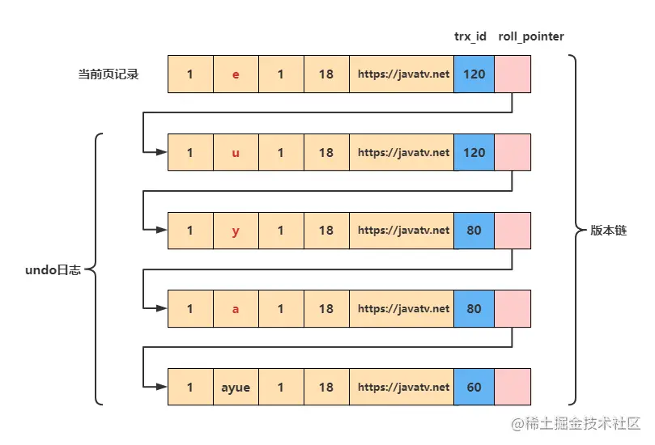
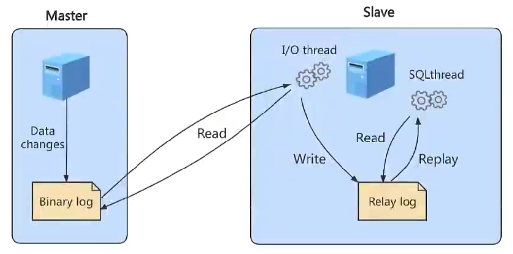
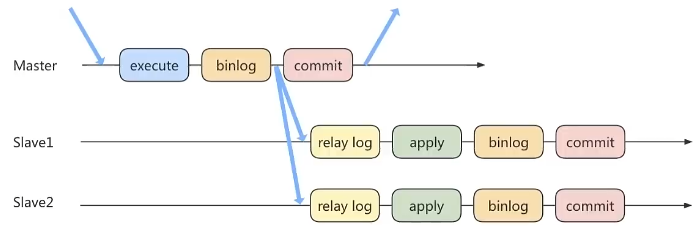
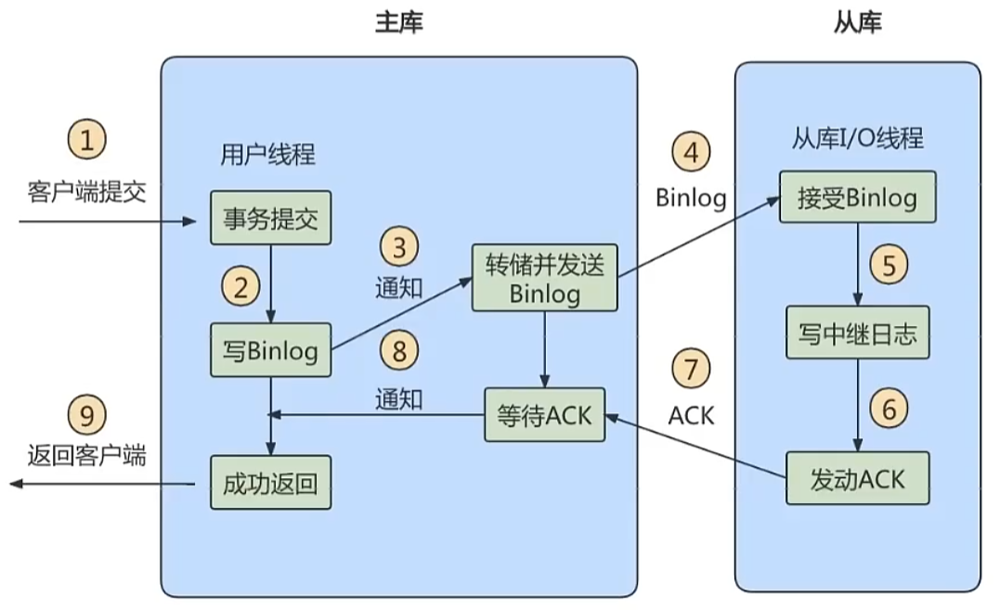
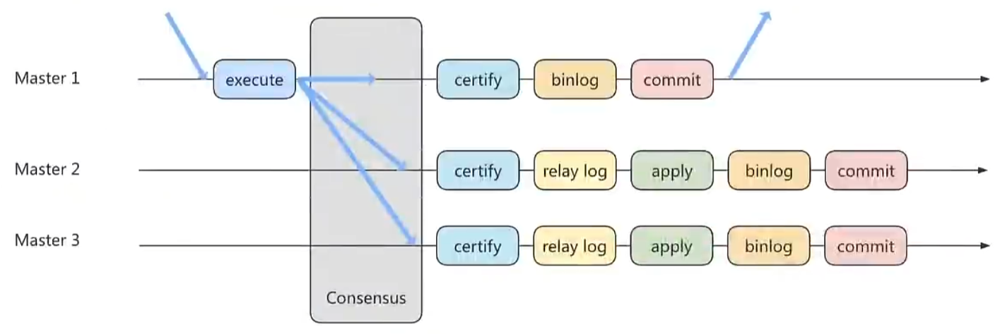

## 多版本并发控制（MVCC）

> 参考:[MySQL 如何解决幻读（MVCC 原理分析） - 掘金 (juejin.cn)](https://juejin.cn/post/7056583607929798692)

### 概述

MVCC（Multiversion Concurrency Control），多版本并发控制。通过数据行的多个版本管理来实现数据库的并发控制。相比于用锁来实现并发控制，MVCC的并发能力更高（只有写-写之间相互阻塞），但是无法保证读出的数据是最新版本。

**快照读和当前读**

- 快照读

  又叫一致性读，读取的是快照数据而不是实时的最新数据。不会与写操作冲突。**不加锁的简单的SELECT都是快照读**。快照读的幻读由MVCC解决。

- 当前读

  读取的是最新版本，与写操作冲突，要保证读取过程中其他并发事务不能修改当前记录。**加锁的SELECT或增删改操作都会执行当前读**。当前读的幻读由临键锁解决。

### MVCC实现原理

MVCC实现依赖于:版本链（trx_id和roll_pointer）、Undo日志、ReadView

#### 版本链

之前讲过在InnoDB行格式中，每个聚簇索引都包含三个隐藏列

| 列名             | 是否必须 | 说明                                                         |
| ---------------- | -------- | ------------------------------------------------------------ |
| row_id           | 否       | 创建的表中有主键或者非 NULL的 UNIQUE 键时都不会包含 row_id 列 |
| **trx_id**       | 是       | 事务ID，每次一个事务对某条聚簇索引记录进行改动时，都会把该事务的事务 id 赋值给 trx_id 隐藏列 |
| **roll_pointer** | 是       | 回滚指针，每次对某条聚簇索引记录进行改动时，都会把旧的版本写入到 undo 日志中，然后用 roll_pointer 指向这个旧的版本。同时，旧的版本也会有一个自己的 roll_pointer 指向更旧的一个版本。 |

每次对记录进行改动，都会生成一条 undo 日志，每条 undo 日志也都有一个 roll_pointer 属性（INSERT 操作对应的 undo 日志没有该属性，因为该记录并没有更早的版本），可以将这些 undo 日志都连起来，串成一个链表，就是版本链。



#### Undo日志

Undo日志除了可以保证事务在`rollback`时的原子性和一致性，还可以用于存放MVCC的快照读的数据。

#### ReadView

上面说到，改动的记录都在undo日志中，那如何选择到底读取哪个版本的记录呢？

- 对于使用 `READ UNCOMMITTED` 隔离级别的事务来说，由于**可以读到未提交事务修改过的记录**，所以直接读取记录的最新版本就好了。
- 对于使用 `SERIALIZABLE` 隔离级别的事务来说，InnoDB 使用**加锁的方式来访问记录**，不存在并发问题。
- 对于使用 `READ COMMITTED` 和 `REPEATABLE READ` 隔离级别的事务来说，都**必须保证读到**已经**提交**了的事务修改过的记录，也就是说**假如另一个事务已经修改了记录但是尚未提交，是不能直接读取最新版本的记录的**。

核心问题就是:`READ COMMITTED` 和 `REPEATABLE READ` 隔离级别在不可重复读和幻读上的区别在哪里？这两种隔离级别对应的**不可重复读**与**幻读**都是指**同一个事务**在两次读取记录时出现**不一致**的情况，**这两种隔离级别关键是需要判断版本链中的哪个版本是当前事务可见的**。

ReadView 就可以用来帮助我们解决可见性问题。事务进行**快照读**操作的时候就会产生 ReadView，它保存了**当前事务开启时所有活跃的事务列表**（活跃指的是未提交的事务）。

ReadView中主要保存了以下几个比较重要的内容:

1. `creator_trx_id`，创建这个 ReadView 的事务 ID。

> 说明:只有在对表中的记录做改动时（执行INSERT、DELETE、UPDATE这些语句时）才会为事务分配事务id，否则在一个只读事务中的事务id值都默认为0。 

2. `m_ids`，生成 ReadView 时当前系统中活跃的读写事务的事务 id 列表。 

3. `min_trx_id`，生成 ReadView 时当前系统中活跃的读写事务中最小的事务 id 也就是 m_ids 中的最小值。 

4. `max_trx_id`，表示生成ReadView时系统中应该分配给下一个事务的id值。

> 注意:`max_trx_id` 并不是 `m_ids` 中的最大值，事务id是递增分配的。比如，现在有id为1，2，3这三个事务，之后id为3的事务提交了。那么一个新的读事务在生成ReadView时，m_ids就包括1和2，min_trx_id的值就是1，max_trx_id的值就是4。

在有了 ReadView 之后，在访问某条记录时，只需要按照下边的步骤判断记录的某个版本是否可见:

1. `trx_id = creator_trx_id` ，**可访问**

   如果被访问版本的 trx_id 属性值与 ReadView 中的 creator_trx_id 值相同，意味着当前事务在访问它自己修改过的记录，所以该版本可以被当前事务访问。

2. `trx_id < min_trx_id` ，**可访问**

   如果被访问版本的 trx_id 属性值小于 ReadView 中的 min_trx_id 值，表明生成该版本的事务在当前事务生成 ReadView 前已经提交，所以该版本可以被当前事务访问。

3. `trx_id >= max_trx_id` ，**不可访问**

   如果被访问版本的 trx_id 属性值大于或等于 ReadView 中的 max_trx_id 值，表明生成该版本的事务在当前事务生成 ReadView 后才开启，所以该版本不可以被当前事务访问。

4. `min_trx_id <= trx_id < max_trx_id`，并且存在 `m_ids` 列表中，**不可访问**

   如果被访问版本的 trx_id 属性值在 ReadView 的 min_trx_id 和 max_trx_id 之间，那就需要判断一下 trx_id 属性值是不是在 m_ids 列表中，如果在，说明创建 ReadView 时生成该版本的事务还是活跃的，该版本不可以被访问；如果不在，说明创建 ReadView 时生成该版本的事务已经被提交，该版本可以被访问。

5. 某个版本的数据对当前事务不可见

   如果某个版本的数据对当前事务不可见的话，那就顺着版本链找到下一个版本的数据，继续按照上边的步骤判断可见性，依此类推，直到版本链中的最后一个版本。如果最后一个版本也不可见的话，那么就意味着该条记录对该事务完全不可见，查询结果就不包含该记录。

在 MySQL 中，READ COMMITTED 和 REPEATABLE READ 隔离级别的的一个非常大的区别就是它们**生成 ReadView 的时机不同**。

当事务处在READ COMMITTED中，**事务中的每条读语句都会重新生成一个ReadView**，这意味着历史版本对于这个事务的读操作是会不断变化的，因此有可能导致连续的两次读取内容不同，也就是不可重复读。

当事务处在REPEATABLE READ中，**事务中只有第一条读语句会生成一个ReadView**，后面的所有读操作都会沿用第一次的ReadView，从而保证每次读取的内容都一致。这样也就一次性解决了不可重复读和幻读的问题。

>需要注意的一点:因为ReadView是只对快照读生效的，所以MVCC并不能完全解决幻读问题。当前读的幻读问题需要`Next-key Locks`解决。

### 总结

MVCC在可重复读的隔离级别下解决了以下问题:

1. 通过历史版本，让读-写操作可以并发执行，提高了并发效率。
2. 解决了脏读、不可重复读、（快照读情况下）幻读。

## 其他数据库日志

> 参考:[[玩转MySQL之八\]MySQL日志分类及简介 - 知乎 (zhihu.com)](https://zhuanlan.zhihu.com/p/58011817)

在MySQL中，除了之前提到的Redo日志和Undo日志外，还有一些其他不同功能的日志。

- **慢查询日志**:记录所有执行时间超过`long_query_time`的查询。
- **通用查询日志**:记录所有链接的起始时间和终止时间，以及连接发送给数据库服务器的所有指令。
- **错误日志**:记录MySQL服务的启动、运行、停止时遇到的各种错误。
- **二进制日志**:记录所有更改数据的语句，用于主从服务器之间的数据同步，以及服务器遇到故障后的恢复。
- **中继日志**:用于主从服务器架构中，从服务器用来存放主服务器二进制日志内容的一个中间文件（MySQL8.0以后新增）。
- **数据定义语言日志**:记录数据定义语句执行的元数据操作（MySQL8.0以后新增）。

除了二进制日志，其他日志都是文本文件。默认情况下，所有日志都创建在MySQL数据目录中。

### 慢查询日志

前面性能分析工具写过了，不再赘述。

### 通用查询日志

通用查询日志用来记录用户的所有操作，包括启动和关闭MySQL服务、所有用户的连接开始时间和截止时间、发给 MySQL 数据库服务器的所有 SQL 指令等。

由于通用查询日志记录的数据非常多，因此只建议在测试环境下开启。

**查看当前通用查询日志的状态**

```mysql
mysql> show variables like '%general_log%';
+------------------+------------------------------+
| Variable_name    | Value                        |
+------------------+------------------------------+
| general_log      | OFF                          |
| general_log_file | /var/lib/mysql/DB-Server.log |
+------------------+------------------------------+
```

- 参数`general_log`用来控制开启、关闭MySQL查询日志
- 参数`general_log_file`用来控制查询日志的位置

**设置通用查询日志的存储方式**

可以通过`log_output`设置通用查询日志的存储方式:

- `FILE`:表示日志存储在文件中。
- `TABLE`:表示日志存储在mysql库中的`general_log表`中。
- `FILE, TABLE`:表示将日志同时存储在文件和`general_log表`中，会徒增很多IO压力，一般不会这样设置。
- `NONE`:表示不记录日志，即使`general_log`设置为ON，如果`log_output`设置为NONE，也不会记录查询日志。

```mysql
mysql> show variables like 'log_output';
+---------------+-------+
| Variable_name | Value |
+---------------+-------+
| log_output    | FILE  |
+---------------+-------+
```

> 注意:`log_output`参数不止用于设置通用查询日志的存储方式，也同样会影响慢查询日志。

**开启/关闭通用查询日志**

- 方法一:修改`my.cnf`配置文件，需要重启MySQL服务，修改后永久生效。

  ```ini
  [mysqld]
  general_log = 1/0
  ```

- 方法二:命令行设置，重启后会失效。

  ```
  set global general_log = 1/0
  ```

### 错误日志

错误日志默认开启，并且无法被关闭。默认情况下，错误日志存储在数据库的数据文件目录中，名称为`hostname.err`，其中，hostname为服务器主机名。

**查看错误日志配置**

```mysql
mysql> show variables like 'log_err%';
+----------------------------+----------------------------------------+
| Variable_name              | Value                                  |
+----------------------------+----------------------------------------+
| log_error                  | ./fengye.err                           |
| log_error_services         | log_filter_internal; log_sink_internal |
| log_error_suppression_list |                                        |
| log_error_verbosity        | 2                                      |
+----------------------------+----------------------------------------+
```

**删除错误日志**

MySQL5.5.7之前，可以用`mysqladmin –u root –pflush-logs`命令，直接将旧文件重命名为`filename.err._old`，并创建新文件；从MySQL5.5.7开始，只能手动重命名后，开启一个新的错误日志文件:

```
[root@fengye data]# mv fengye404.err  fengye404.err._old
[root@fengye data]# mysqladmin flush-logs
```

### 二进制日志

> 参考:[mysql binlog详解 - Presley - 博客园 (cnblogs.com)](https://www.cnblogs.com/Presley-lpc/p/9619571.html)

MySQL的二进制日志（binary log）是一个二进制文件，主要记录所有数据库表结构变更（例如CREATE、ALTER TABLE…）以及表数据修改（INSERT、UPDATE、DELETE…）的所有操作，并且记录了语句发生时间、执行时长、操作数据等其它额外信息。

**binlog的应用场景**

- 数据恢复:如果MySQL服务意外停止，可以通过binlog来恢复。
- 数据复制:主数据库向从数据库复制数据。

**binlog和redolog的区别**

1. redolog由InnoDB产生；binlog由MySQL数据库产生。
2. redolog是物理日志，记录了”某个页上做了什么修改“；biglog是逻辑日志，存储对应的SQL语句。
3. redolog的空间是固定的，循环写入；binlog空间没有限制，追加写入。
4. redolog一般对于用户不可见，由存储引擎维护并保证数据库崩溃时事务的持久性；binlog用于人工恢复数据。

**查看binlog配置**

```mysql
mysql> show variables like '%log_bin%';
+---------------------------------+----------------------------------+
| Variable_name                   | Value                            |
+---------------------------------+----------------------------------+
| log_bin                         | ON                               |
| log_bin_basename                | /www/server/data/mysql-bin       |
| log_bin_index                   | /www/server/data/mysql-bin.index |
| log_bin_trust_function_creators | OFF                              |
| log_bin_use_v1_row_events       | OFF                              |
| sql_log_bin                     | ON                               |
+---------------------------------+----------------------------------+
```

- log_bin:是否开启binlog，MySQL8默认开启
- log_bin_basename:binlog日志不止一个文件，由多个文件组成（每次MySQL重启都会创建一个新的binlog）。这个参数表示binlog的基本文件名，每个文件后面都会追加标识来表示每个文件。
- log_bin_index:binlog文件的索引文件。由于binlog可能包含很多文件，因此需要一个索引来管理。
- log_bin_trust_function_creators:是否可以创建存储过程。（具体参考:[MySQL参数log_bin_trust_function_creators介绍 - 潇湘隐者 - 博客园 (cnblogs.com)](https://www.cnblogs.com/kerrycode/p/7641835.html)）

**修改binlog配置**

- 方法一:修改`my.cnf`配置文件，需要重启MySQL服务，修改后永久生效。

  ```ini
  [mysqld]
  log-bin=fengye404-bin
  # binlog的基础文件名，当带上路径时，也会同时指定文件存放的路径
  binlog_expire_logs_seconds=3600
  # binlog文件的过期时间，单位是秒，超过时间后会删除，不设置默认30天
  max_binlog_size=100M
  # 单个binlog文件的大小，超过大小时会自动创建新的文件，不设置默认1GB
  ```

- 方法二:命令行设置，重启后会失效（不支持global，只支持session）。

  ```mysql
  mysql> SET sql_log_bin=0; 
  ```

**查看binlog列表**

```mysql
mysql> show binary logs;
+------------------+-----------+-----------+
| Log_name         | File_size | Encrypted |
+------------------+-----------+-----------+
| mysql-bin.000014 |  21784592 | No        |
| mysql-bin.000015 |  11311449 | No        |
+------------------+-----------+-----------+
```

**查看binlog内容**

由于binlog是二进制文件，无法直接查看，需要借助`mysqlbinlog`命令工具

```shell
mysqlbinlog "/www/server/data/mysql/mysql-bin.000015"
```

除了使用mysqlbinlog工具，还可以使用下面这种更加方便的查询命令:

```mysql
mysql> show binlog events [IN 'log_name'] [FROM pos] [LIMIT [offset,] row_count];
```

- `IN 'log_name'`:指定要查询的binlog文件名（不指定就是第一个binlog文件）　
- `FROM pos`:指定从哪个pos起始点开始查起（不指定就是从整个文件首个pos点开始算）
- `LIMIT [offset]`:偏移量(不指定就是0) 
- `row_count`:查询总条数（不指定就是所有行）

例子:`show binlog events in "/www/server/data/mysql/mysql-bin.000015";`

**查看binlog格式**

```mysql
mysql> show variables like 'binlog_format';
+---------------+-------+
| Variable_name | Value |
+---------------+-------+
| binlog_format | MIXED |
+---------------+-------+
```

- STATEMENT:记录每一条修改数据的SQL语句。

  优点:不需要记录每一行的变化，减少了binlog的日志量，节约IO，提高性能。

- ROW:不记录SQL语句，而是记录那些行被修改。

  优点:清楚地记录每一行数据修改地细节，不会出现某些特定情况下存储过程、函数、trigger的调用导致的无法正确复制的问题。

- MIXED:Statement和Row的结合

**使用binlog恢复数据**

```shell
mysqlbinlog [option] <filename> | mysql –u [username] -p [password] -v [database];
```

- filename:文件完整路径
- option:可选参数。比较重要的两对option参数是--start-date、--stop-date 和 --start-position、-- stop-position。 
  - `--start-date` 和 `--stop-date`:可以指定恢复数据库的起始时间点和结束时间点。
  - `--start-position` 和 `--stop-position`:可以指定恢复数据的开始位置和结束位置。
- username、password、database:用户名、密码、指定的数据库

> 注意:使用binlog恢复数据的同时，也相当于对数据库中的数据进行改动。因此恢复数据的操作也会被同时写入binlog。因此在恢复之前最好使用`flush logs`重新开启一个新的binlog文件。

**删除binlog文件**

```mysql
mysql>PURGE {MASTER | BINARY} LOGS TO '指定日志文件名';
# 删除指定文件之前的（不包括指定文件）文件
mysql>PURGE {MASTER | BINARY} LOGS BEFORE '指定日期';
```

### 中继日志

**中继日志只在主从服务器架构的从服务器上存在**。从服务器为了与主服务器保持一致，要从主服务器读取binlog的内容，并且把读取到的信息写入本地的日志文件中，这个从服务器本地的日志文件就叫**中继日志**。然后，从服务器读取中继日志，并根据中继日志的内容对从服务器的数据进行更新，完成主从服务器的数据同步。

文件名格式:`从服务器名 -relay-bin.序号`。中继日志也有一个索引文件`从服务器名 -relay-bin.index`

中继日志的格式与二进制日志相同，也需要用`mysqlbinlog`查看

## 主从复制

> 参考:[小白都能懂的Mysql主从复制原理（原理+实操） - 知乎 (zhihu.com)](https://zhuanlan.zhihu.com/p/164518315)

在实际的生产环境中，一般都是读多写少，为了提高性能，会采用主从复制的方式进行**读写分离**。即在主数据库（master）中写入数据，从数据库（slave）中读取数据。

### 原理

主从复制的过程主要由三个线程参与:



- master（binlog dump thread）:主库线程，主库数据更新时，将更新事件写入主库的binlog，并且通知从库数据有更新。
- slave（I/O thread）:从库线程，读取主库的binlog并写入从库的relay log。
- slave（SQL thread）:从库线程，读取从库的relay log并执行SQL语句，将数据更新到从库的表中。

> 注意:要实现主从复制，必须要求主库开启binlog

### 搭建主从复制

#### 主机配置文件

my.cnf

```ini
[mysqld]
# [必选] 主服务器唯一ID
server-id=1

# [必选] 启用binlog，并指定基础文件名，当带上路径时，也会同时指定文件存放的路径
log-bin=fengye404

# [可选] 0（默认）表示读写（主机），1表示只读（从机）
read-only=0

# [可选] binlog保留时长，单位为秒，不填默认30天
binlog_expire_logs_seconds=6000

# [可选] 单个binlog文件最大大小，默认1GB
max_binlog_siez=200M

# [可选] 忽略的数据库，一般忽略mysql自带的数据库
binlog-ignore-db=mysql
binlog-ignore-db=information_schema
binlog-ignore-db=performance_schema
binlog-ignore-db=sys

# [可选] 记录binlog的数据库，默认全部
binlog-do-db=test

# [可选] 设置binlog格式
binlog_format=MIXED
```

#### 从机配置文件

```ini
[mysqld]
# [必选] 从服务器唯一ID
server-id=2

# [必选] 启用relaylog，并指定基础文件名，当带上路径时，也会同时指定文件存放的路径
relay-log=fengye404

# [可选] 0（默认）表示读写（主机），1表示只读（从机）
read-only=0
```

~~由于每台服务器的情况不同，剩下的部分自己实操吧，懒得写了~~

### 主从复制的一致性问题

根据上面讲的主从复制的原理，很容易想象到，其实主库和从库的内容不是实时同步的，其中可能会由于一些网络传输问题而存在一定的延迟。这样就会造成读写分离时读库的数据不是最新数据，也就是会发生主从同步中的数据不一致问题。按照数据一致性从弱到强，有三种数据同步策略。

#### 异步复制

主库开启事务，更新完数据后可以直接提交，不需要等从库返回任何结果。

优点是不会影响主库写的效率，缺点是数据一致性弱。



#### 半同步复制

主库开启事务，更新完数据后可以必须等待至少一个从库接收到了binlog并写入到中继日志中后，才能提交。可以通过`rpl_semi_sync_master_wait_for_slave_count`参数设置需要多少个从库响应。

优点是数据一致性相比于异步复制提高了很多，缺点是主库的写入性能收到影响



#### 组复制

半同步复制虽然一定程度上提高了数据的一致性，但是由于其需要从库响应来判断是否提交，所以无法满足对数据一致性要求很高的场景。

组复制技术，简称MGR（MySQL Group Replication），是MySQL5.7.17以后推出的新的数据复制技术，是基于Paxos协议的状态机复制。

首先我们将多个节点共同组成一个复制组，在执行读写事务的时候，需要通过一致性协议层（Consensus 层）的同意，也就是读写事务想要进行提交，必须要经过组里“大多数人”（对应 Node 节点）的同意，大多数指的是同意的节点数量需要大于 （N/2+1），这样才可以进行提交，而不是原发起方一个说了算。而针对只读事务则不需要经过组内同意，直接 COMMIT 即可。




> 全文大致参考:[MySQL数据库教程_bilibili](https://www.bilibili.com/video/BV1iq4y1u7vj)
