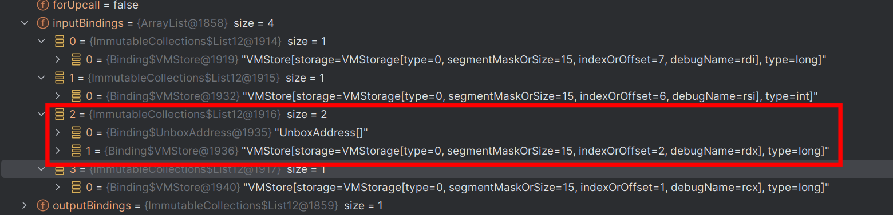

# Panama实现原理浅析

本文基于JDk21的api，参考JEP为https://openjdk.org/jeps/454 

由于FFI与架构息息相关且本人水平一般，所以这里只考虑Linux x86_64架构的FFI，即参考System V ABI AMD64

JDK源码参考https://github.com/openjdk/jdk21

笔者内核配置

Linux dreamlike-MS-7E01 6.2.0-33-generic #33-Ubuntu SMP PREEMPT_DYNAMIC Tue Sep  5 14:49:19 UTC 2023 x86_64 x86_64 x86_64 GNU/Linux

### System V ABI

手册参考https://refspecs.linuxbase.org/elf/x86_64-abi-0.99.pdf

#### 参数分配

对于Linux or unix like的系统系统往往都采用这种ABI形式，这里只贴出我们涉及到的部分

这就决定了入参如何传递和返回值如何获取

ABI 定义的感兴趣的数据类别：

- INTEGER 

  _Bool、char、short、int、long、long long 和指针属于 INTEGER 

- SSE

  float、double、_Decimal32、_Decimal64 和 __m64 属于 SSE 类，SSE低几位为AVX寄存器的别名，若作为AVX指令使用时会将SSE寄存器称之为向量寄存器（Vector register）

- MEMORY  

  如果对象的大小大于两个八字节或包含未对齐的字段，则它属于MEMORY 

否则，递归地对字段进行分类，并使用其组件的类别来确定这两个八字节的类别。如果有任何一个是 INTEGER，则结果是 INTEGER，否则结果是 SSE。

#### 传参规则

INTEGER 参数按顺序使用 `%rdi` `%rsi` `%rdx` `%rcx` `%r8` `%r9` 这几个寄存器，若入参类型长度小于8字节则提升为8字节

SSE 参数按 `%xmm0` - `%xmm7` 的顺序使用寄存器

MEMORY从右到左依次压栈，保证首个参数在栈顶

剩余情况则是寄存器不足时则直接按右到左压栈

#### 返回规则

使用 `%rax` 和 `%rdx` 以获得 INTEGER 返回值。

使用 `%xmm0` 和 `%xmm1` 来获取 SSE 返回值。

如果返回值的类是 MEMORY，则调用者为返回提供空间并把指向这块空间的指针值放在`%rdi`中传递，即作为第一个隐藏的参数，返回时 `%rax` 的值为在 `%rdi` 中传入的指针值


补充个MEMORY传参的例子,这里的structParam会从下到上，从右向左依次压栈，c会放在第一个寄存器里面

```c++
typedef struct {
    int a, b;
    double d;
    long e;
} structParam;

void func(structParam s, int c) {
    std::cout << c;
}

```

### Panama FFI API

#### 代码示例

这里不展开怎么用的只给出java代码和等价的C++代码

使用最简单的syscall展示

```c++
#include <sys/syscall.h>
decltype(auto) myopen(const char *path_name, int flags) {
    return static_cast<int>(syscall(SYS_open, path_name, flags));
}

decltype(auto) mywrite(int fd, const void *buf, size_t n) {
    return static_cast<ssize_t>(syscall(SYS_write, fd, buf, n));
}

auto main(int argc, const char **argv) -> int {

    auto fd = myopen("temp.txt", O_APPEND | O_CREAT | O_RDWR);
    std::cout << fd << "\n";
    if (fd < 0) {
        std::exit(errno);
    }
    std::string s = "myopen hello cpp\n";
    auto writeRes = mywrite(fd, static_cast<void *>(&*s.begin()), s.length());
    std::cout << writeRes<< "\n" << sizeof(writeRes);
}
```

对应到java,则是把链接，构造调用过程放在了运行时且延迟到了初始化时实现

```java
public class Main {
    public static long SYS_OPEN = 2;
    public static long SYS_WRITE = 1;
    public static int O_APPEND = 02000;
    public static int O_CREATE = 0100;
    public static int O_RDWR = 02;

    public static final MethodHandle openSyscall$MH = openSyscall();

    public static final MethodHandle writeSyscall$MH = writeSyscall();


    public static void main(String[] args) {
        try (Arena memorySession = Arena.ofConfined()) {
            MemorySegment pathName = memorySession.allocateUtf8String("temp.txt");
            MemorySegment content = memorySession.allocateUtf8String("write string java syscall \n");
            var fd = ((int) openSyscall$MH.invoke(SYS_OPEN, pathName, O_APPEND | O_CREATE | O_RDWR));
            if (fd > 0) {
                var writeRes = ((long) writeSyscall$MH.invoke(SYS_WRITE, fd, content, content.byteSize() - 1));
                System.out.println("Fd : " + fd + "writeRes : " + writeRes);
            }
        } catch (Throwable throwable) {
            throwable.printStackTrace();
        }
    }

    public static MethodHandle openSyscall() {
        Linker linker = Linker.nativeLinker();
        SymbolLookup lookup = linker.defaultLookup();
        Optional<MemorySegment> memorySegment = lookup.find("syscall");
        MemorySegment syscallAddress = memorySegment.get();
        return linker.downcallHandle(
                syscallAddress,
                FunctionDescriptor.of(ValueLayout.JAVA_INT, ValueLayout.JAVA_LONG, ValueLayout.ADDRESS, ValueLayout.JAVA_INT), Linker.Option.isTrivial()
        );
    }

    public static MethodHandle writeSyscall() {
        Linker linker = Linker.nativeLinker();
        SymbolLookup lookup = linker.defaultLookup();
        Optional<MemorySegment> memorySegment = lookup.find("syscall");
        MemorySegment syscallAddress = memorySegment.get();
        return linker.downcallHandle(
                syscallAddress,
                FunctionDescriptor.of(ValueLayout.JAVA_LONG, ValueLayout.JAVA_LONG, ValueLayout.JAVA_INT, ValueLayout.ADDRESS, ValueLayout.JAVA_LONG), Linker.Option.isTrivial()
        );
    }
}
```

#### 寻找符号地址

冯诺依曼架构的机器要调用函数首先要找到函数地址，然后按照调用约定传递参数才能正常执行目标代码和获取到返回值。

所以FFI第一步就是从动态库中解析出来函数名对应的符号，具体涉及到的函数可以参考https://man7.org/linux/man-pages/man3/dlopen.3.html

对应到的Java代码就是，也就是要探索SymbolLookup::find函数的实现,这里用SYSTEM_LOOKUP举例子说明原理

```java
        Linker linker = Linker.nativeLinker();
        SymbolLookup lookup = linker.defaultLookup();
        Optional<MemorySegment> memorySegment = lookup.find("syscall");
        MemorySegment syscallAddress = memorySegment.get();
```

首先寻找系统函数符号是os提供的能力所以会去走jni把写好实现搜索函数的动态库拿进来，这个动态库的位置在

${JAVA_HOME}/lib/libsyslookup.so

对应的java实现为 其核心就在于long addr = lib.lookup(name); 这一句的具体实现

```java
    private static SymbolLookup libLookup(Function<RawNativeLibraries, NativeLibrary> loader) {
        NativeLibrary lib = loader.apply(RawNativeLibraries.newInstance(MethodHandles.lookup()));
        return name -> {
            Objects.requireNonNull(name);
            if (Utils.containsNullChars(name)) return Optional.empty();
            try {
                long addr = lib.lookup(name);
                return addr == 0 ?
                        Optional.empty() :
                        Optional.of(MemorySegment.ofAddress(addr));
            } catch (NoSuchMethodException e) {
                return Optional.empty();
            }
        };
    }
```

调用链为SystemLookup::find -> NativeLibrary::lookup -> NativeLibrary::find -> RawNativeLibraries::find -> RawNativeLibraries::findEntry0 -> JVM_FindLibraryEntry -> os::dll_lookup -> dlsym

这样就获取到了我需要查找的符号对应的函数地址，然后将其封装进`Optional<MemorySegment>`

上面这些就是 这一句的具体做了什么事情

```java
 Optional<MemorySegment> memorySegment = lookup.find("syscall");
```

#### 调用native的实现

这里其实可以类比为jit之后的结果如何正确和原来的函数入口连接起来（参考MethodStub），嗯。。。更现像是libffi,实际上有些未做特化的平台上linker的实现就是libffi，接下来我们就需要对着ABI手册来看了。

对应的java api为

```java
linker.downcallHandle(
                syscallAddress,
                FunctionDescriptor.of(ValueLayout.JAVA_LONG, ValueLayout.JAVA_LONG, ValueLayout.JAVA_INT, ValueLayout.ADDRESS, ValueLayout.JAVA_LONG), Linker.Option.isTrivial()
        );
```

省略各种对齐校验直接看downcall的实现，这里会产生一个methodhandle，代表了传参方式和bindto的函数地址,调用链为AbstractLinker::downcallHandle -> AbstractLinker::downcallHandle0 ->  SysVx64Linker::arrangeDowncall ->  CallArranger::arrangeDowncall

到arrangeDowncall就到最复杂的一块了，分为这么几步

1. 根据传入的FunctionDescriptor和其绑定的MethodType以及ABI传参约定来生成函入口的桥接（涉及到jvm提供的native函数处理），这里生成的MethodHandle的参数和返回值并不完全和我们传入的FunctionDescriptor一致
2. 对于上一步生成MethodHandle的最后一个参数做去除，默认给FFI生成的MethodHandle的最后一个参数传递nVectorArgs的个数（MethodHandles.insertArguments实现的）
3. 如果对应的native函数返回的类型为MEMORY类型则会做进一步的适配处理
4. 最后则是进一步将前几步生成的MethodHandle进一步做加工，比如说给出默认值 or filter插入参数校验等使其类型与FunctionDescriptor描述的一致

##### 记录调用方案的元数据

这里用一个之前的writeSyscall的例子来说明，首先它声明的函数签名是这样的`long (long,int, memorySegment, long)`,分别对应系统调用号，fd,buffer地址，预期写入的长度

在看之前可以发现一个很有意思的静态字段 这里的的描述跟我们之前记录的System V ABI完全一致


具体代码请看CallArranger::getBindings，首先我们肯定是downcall,就是单纯的调用native层，其也不会反向来调用java层，进一步getBindings的作用是什么？其实就是按照FunctionDescriptor的描述来生成传参的约定比如说第一个参数用什么寄存器，以及取出返回值的约束。

传参第一步是考虑第一个寄存器`%rdi`该放什么，所以要判断返回值类型是不是MEMORY类型，之后就开始根据FunctionDescriptor描述来依次生成了,所以先看返回值是咋处理的。

生成binding代码一览，这里只需要了解，生成返回值和调用序列的`计算器`不是同一个，且计算寄存器使用的状态机维护在`计算器`内部即可。

还有一点对于csb.addArgumentBindings会将当前的参数的类型追加在预期要生成的签名后面，举个例子，当前为() long，这时开始处理第一个参数类型为int, add后就变成了（int）long


- 返回值生成

  若当前的返回值不为void则直接根据返回值对应的ABI类型选择使用哪些寄存器。

  经典场景下（非MEMORY返回值）俩64位寄存器就够用了,合起来可以存放一个包含俩long的struct及其等价的struct，计算返回值存放逻辑（可能需要一个寄存器or两个寄存器）后直接放置在retCalc中，所以writeSyscall生成出来的返回值bindings[VmLoad(VMStorage(debugName=rax),type=long]

  

  MEMORY场则是需要把第一个寄存器设置为对应的空间地址来容纳返回值，因此需要argCalc来记录这个特殊的入参逻辑，把第一个寄存器设置为用于指向返回值的指针。

- 传参序列生成

  这里不再赘述跟着之前的ABI实例生成即可，writeSyscall生成出来的为,这里红色框框标出来一个特殊的玩意，这个是Address类型特有的unBoxAdrress用于在生成桥接代码时指示从操作数堆栈中弹出一个“内存地址”，将其转换为具有给定大小的“long”，并将其推送到操作数堆栈

  

  这里还有一点没有提到，在argCalc计算下一个用什么寄存器过程中，实际上是调用了StorageCalculator::nextStorage方法，若全部的寄存器用完了，就会走压栈的逻辑，因为入参限定死了最长只有8字节，而且ABI限定要8字节对齐所以会直接使用下面的代码获取到一个VMStorage声明这个参数放在栈上

  ```java
              VMStorage storage = X86_64Architecture.stackStorage((short) STACK_SLOT_SIZE, (int)stackOffset);
              stackOffset += STACK_SLOT_SIZE;
  ```

然后就添加最后一个参数用来描述用了多少个向量（Vector）寄存器的

```java
        if (!forUpcall) {
            //add extra binding for number of used vector registers (used for variadic calls)
            csb.addArgumentBindings(long.class, C_LONG,
                    List.of(vmStore(rax, long.class)));
        }
```

最后我们将元数据通过这样一句代码记录下来，最后一个参数为向量寄存器的使用个数，因为在System V ABI x86_64上%ymm0 - %ymm15 的低 128 位是相应 128b 位 SSE 寄存器 (%xmm0 - %xmm15) 的别名，所以这边就是在统计入参有多少float占用了这几个寄存器，这个值实际上就是在argCalc计算下一个用啥寄存器时更新的

```java
return new Bindings(csb.build(), returnInMemory, argCalc.storageCalculator.nVectorReg);
```

然后呢，这里csb.build()值得一看

1. 需要计算需要额外分配的空间（因为其他架构存在需要copy的内容比如说aarch64的STRUCT_REFERENCE， 或者System V x86_64的MEMORY类型的返回值），这里writeSysCall不需要额外分配只需要走默认的俩返回值寄存器就要了
2. 此时csb对应的MethodHandle为(long,int,MemorySegment,long)long，分别对应系统调用号，fd，写入的buffer,预期写入的长度，向量寄存器使用的个数
3. 在上一步获取到的MethodHandle和InputBindings之前追加一个MemorySegment参数变成(MemorySegment,long,int,MemorySegment,long,long)long和下图所示，以代表当前是针对于哪个符号的调用
4. 生成callerMethodType为上一步得到的Methodhandle, calleeMethodType为上一步MethodHandle去java化的结果，比如说MemorySegment为long，在这里是(long,long,int,long,long,long)long

##### 生成桥接

这里主要看DownCallLinker::getBoundMethodHandle代码

1. 使用静态方法NativeEntryPoint::make生成NativeEntryPoint，即函数入口

这里最后调用到NativeEntryPoint::makeDowncallStub的native实现并返回Stub的地址，直接用NativeEntryPoint一包这个参数就进入下一步了，所以我们直接来看看makeDowncallStub的native实现

1. 使用MethodHandle handle = JLIA.nativeMethodHandle(nep); 转换为MethodHandle
2. 特化调用
3. 添加SegmentAllocator之类的检测

