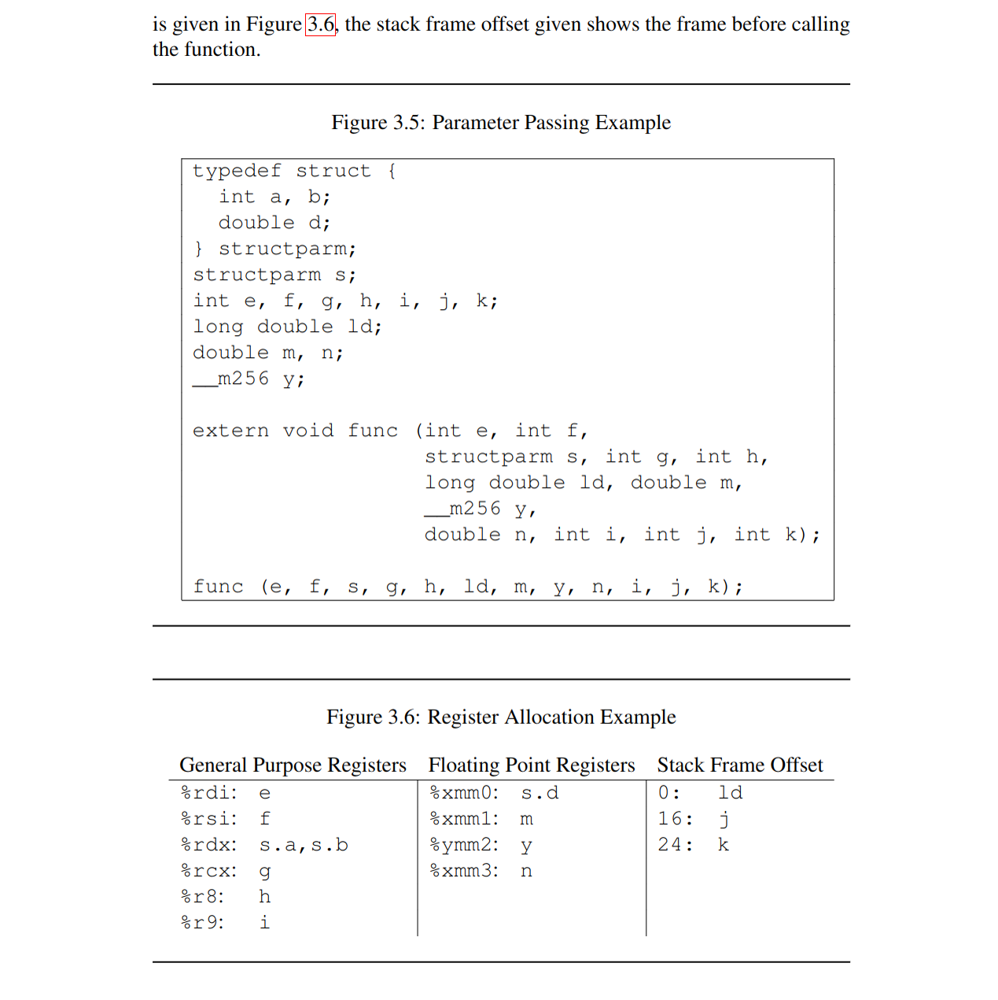
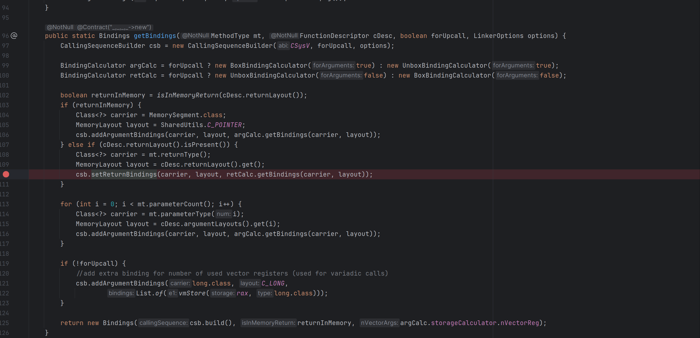
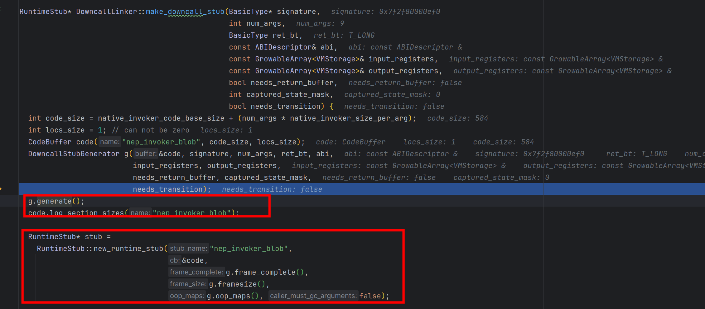
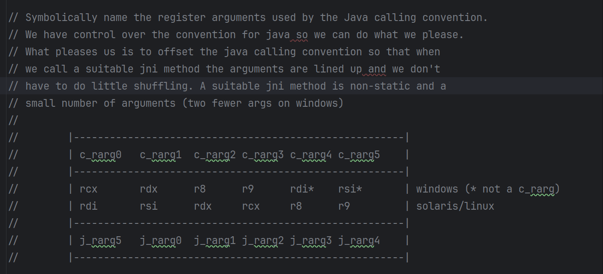
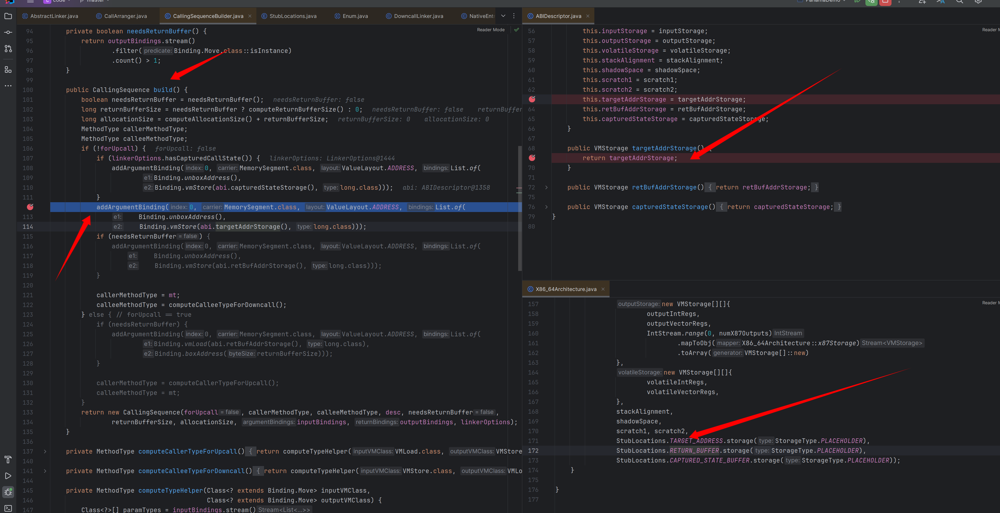
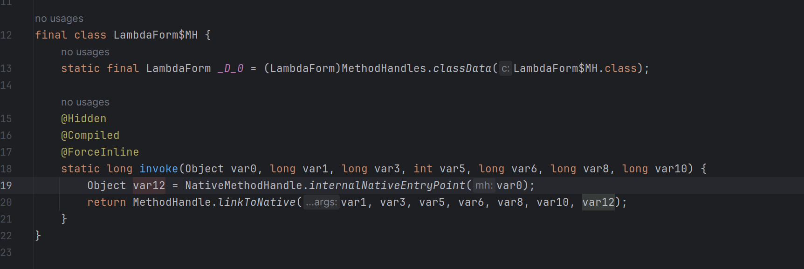

# Panama实现原理浅析

本文基于JDk21的api，参考JEP为https://openjdk.org/jeps/454 

由于FFI与架构息息相关且本人水平一般，所以这里只考虑Linux x86_64架构的FFI，即参考System V ABI AMD64

JDK源码参考https://github.com/openjdk/jdk21

笔者OS

Linux dreamlike-MS-7E01 6.2.0-33-generic #33-Ubuntu SMP PREEMPT_DYNAMIC Tue Sep  5 14:49:19 UTC 2023 x86_64 x86_64 x86_64 GNU/Linux

### System V ABI

手册参考https://refspecs.linuxbase.org/elf/x86_64-abi-0.99.pdf

#### 参数分配

对于Linux or unix like的系统系统往往都采用这种ABI形式，这里只贴出我们涉及到的部分

这就决定了入参如何传递和返回值如何获取

ABI 定义的感兴趣的数据类别：

- INTEGER 

  _Bool、char、short、int、long、long long 和指针属于 INTEGER 

- SSE

  float、double、_Decimal32、_Decimal64 和 __m64 属于 SSE 类，SSE低几位为AVX寄存器的别名，若作为AVX指令使用时会将SSE寄存器称之为向量寄存器（Vector register）

- MEMORY  

  如果对象的大小大于两个八字节或包含未对齐的字段，则它属于MEMORY 

否则，递归地对字段进行分类，并使用其组件的类别来确定这两个八字节的类别。如果有任何一个是 INTEGER，则结果是 INTEGER，否则结果是 SSE。

#### 传参规则

INTEGER 参数按顺序使用 `%rdi` `%rsi` `%rdx` `%rcx` `%r8` `%r9` 这几个寄存器，若入参类型长度小于8字节则提升为8字节

SSE 参数按 `%xmm0` - `%xmm7` 的顺序使用寄存器

MEMORY从右到左依次压栈，保证首个参数在栈顶

剩余情况则是寄存器不足时则直接按右到左压栈

#### 返回规则

使用 `%rax` 和 `%rdx` 以获得 INTEGER 返回值。

使用 `%xmm0` 和 `%xmm1` 来获取 SSE 返回值。

如果返回值的类是 MEMORY，则调用者为返回提供空间并把指向这块空间的指针值放在`%rdi`中传递，即作为第一个隐藏的参数，返回时 `%rax` 的值为在 `%rdi` 中传入的指针值



补充个MEMORY传参的例子,这里的structParam会从下到上，从右向左依次压栈，c会放在第一个寄存器里面

```c++
typedef struct {
    int a, b;
    double d;
    long e;
} structParam;

void func(structParam s, int c) {
    std::cout << c;
}

```

### Panama FFI API

#### 代码示例

这里不展开怎么用的只给出java代码和等价的C++代码

使用最简单的syscall展示

```c++
#include <sys/syscall.h>
decltype(auto) myopen(const char *path_name, int flags) {
    return static_cast<int>(syscall(SYS_open, path_name, flags));
}

decltype(auto) mywrite(int fd, const void *buf, size_t n) {
    return static_cast<ssize_t>(syscall(SYS_write, fd, buf, n));
}

auto main(int argc, const char **argv) -> int {

    auto fd = myopen("temp.txt", O_APPEND | O_CREAT | O_RDWR);
    std::cout << fd << "\n";
    if (fd < 0) {
        std::exit(errno);
    }
    std::string s = "myopen hello cpp\n";
    auto writeRes = mywrite(fd, static_cast<void *>(&*s.begin()), s.length());
    std::cout << writeRes<< "\n" << sizeof(writeRes);
}
```

对应到java,则是把链接，构造调用过程放在了运行时且延迟到了初始化时实现

```java
public class Main {
    public static long SYS_OPEN = 2;
    public static long SYS_WRITE = 1;
    public static int O_APPEND = 02000;
    public static int O_CREATE = 0100;
    public static int O_RDWR = 02;

    public static final MethodHandle openSyscall$MH = openSyscall();

    public static final MethodHandle writeSyscall$MH = writeSyscall();


    public static void main(String[] args) {
        try (Arena memorySession = Arena.ofConfined()) {
            MemorySegment pathName = memorySession.allocateUtf8String("temp.txt");
            MemorySegment content = memorySession.allocateUtf8String("write string java syscall \n");
            var fd = ((int) openSyscall$MH.invoke(SYS_OPEN, pathName, O_APPEND | O_CREATE | O_RDWR));
            if (fd > 0) {
                var writeRes = ((long) writeSyscall$MH.invoke(SYS_WRITE, fd, content, content.byteSize() - 1));
                System.out.println("Fd : " + fd + "writeRes : " + writeRes);
            }
        } catch (Throwable throwable) {
            throwable.printStackTrace();
        }
    }

    public static MethodHandle openSyscall() {
        Linker linker = Linker.nativeLinker();
        SymbolLookup lookup = linker.defaultLookup();
        Optional<MemorySegment> memorySegment = lookup.find("syscall");
        MemorySegment syscallAddress = memorySegment.get();
        return linker.downcallHandle(
                syscallAddress,
                FunctionDescriptor.of(ValueLayout.JAVA_INT, ValueLayout.JAVA_LONG, ValueLayout.ADDRESS, ValueLayout.JAVA_INT), Linker.Option.isTrivial()
        );
    }

    public static MethodHandle writeSyscall() {
        Linker linker = Linker.nativeLinker();
        SymbolLookup lookup = linker.defaultLookup();
        Optional<MemorySegment> memorySegment = lookup.find("syscall");
        MemorySegment syscallAddress = memorySegment.get();
        return linker.downcallHandle(
                syscallAddress,
                FunctionDescriptor.of(ValueLayout.JAVA_LONG, ValueLayout.JAVA_LONG, ValueLayout.JAVA_INT, ValueLayout.ADDRESS, ValueLayout.JAVA_LONG), Linker.Option.isTrivial()
        );
    }
}
```

#### 寻找符号地址

冯诺依曼架构的机器要调用函数首先要找到函数地址，然后按照调用约定传递参数才能正常执行目标代码和获取到返回值。

所以FFI第一步就是从动态库中解析出来函数名对应的符号，具体涉及到的函数可以参考https://man7.org/linux/man-pages/man3/dlopen.3.html

对应到的Java代码就是，也就是要探索SymbolLookup::find函数的实现,这里用SYSTEM_LOOKUP举例子说明原理

```java
        Linker linker = Linker.nativeLinker();
        SymbolLookup lookup = linker.defaultLookup();
        Optional<MemorySegment> memorySegment = lookup.find("syscall");
        MemorySegment syscallAddress = memorySegment.get();
```

首先寻找系统函数符号是os提供的能力所以会去走jni把写好实现搜索函数的动态库拿进来，这个动态库的位置在

${JAVA_HOME}/lib/libsyslookup.so

对应的java实现为 其核心就在于long addr = lib.lookup(name); 这一句的具体实现

```java
    private static SymbolLookup libLookup(Function<RawNativeLibraries, NativeLibrary> loader) {
        NativeLibrary lib = loader.apply(RawNativeLibraries.newInstance(MethodHandles.lookup()));
        return name -> {
            Objects.requireNonNull(name);
            if (Utils.containsNullChars(name)) return Optional.empty();
            try {
                long addr = lib.lookup(name);
                return addr == 0 ?
                        Optional.empty() :
                        Optional.of(MemorySegment.ofAddress(addr));
            } catch (NoSuchMethodException e) {
                return Optional.empty();
            }
        };
    }
```

调用链为SystemLookup::find -> NativeLibrary::lookup -> NativeLibrary::find -> RawNativeLibraries::find -> RawNativeLibraries::findEntry0 -> JVM_FindLibraryEntry -> os::dll_lookup -> dlsym

这样就获取到了我需要查找的符号对应的函数地址，然后将其封装进`Optional<MemorySegment>`

上面这些就是 这一句的具体做了什么事情

```java
 Optional<MemorySegment> memorySegment = lookup.find("syscall");
```

#### 调用native的实现

这里其实可以类比为jit之后的结果如何正确和原来的函数入口连接起来（参考MethodStub），嗯。。。更现像是libffi,实际上有些未做特化的平台上linker的实现就是libffi，接下来我们就需要对着ABI手册来看了。

对应的java api为

```java
linker.downcallHandle(
                syscallAddress,
                FunctionDescriptor.of(ValueLayout.JAVA_LONG, ValueLayout.JAVA_LONG, ValueLayout.JAVA_INT, ValueLayout.ADDRESS, ValueLayout.JAVA_LONG), Linker.Option.isTrivial()
        );
```

省略各种对齐校验直接看downcall的实现，这里会产生一个methodhandle，代表了传参方式和bindto的函数地址,调用链为AbstractLinker::downcallHandle -> AbstractLinker::downcallHandle0 ->  SysVx64Linker::arrangeDowncall ->  CallArranger::arrangeDowncall

到arrangeDowncall就到最复杂的一块了，分为这么几步

1. 根据传入的FunctionDescriptor和其绑定的MethodType以及ABI传参约定来生成函入口的桥接（涉及到jvm提供的native函数处理），这里生成的MethodHandle的参数和返回值并不完全和我们传入的FunctionDescriptor一致
2. 对于上一步生成MethodHandle的最后一个参数做去除，默认给FFI生成的MethodHandle的最后一个参数传递nVectorArgs的个数（MethodHandles.insertArguments实现的）
3. 如果对应的native函数返回的类型为MEMORY类型则会做进一步的适配处理
4. 最后则是进一步将前几步生成的MethodHandle进一步做加工，比如说给出默认值 or filter插入参数校验等使其类型与FunctionDescriptor描述的一致

##### 记录调用方案的元数据

这里用一个之前的writeSyscall的例子来说明，首先它声明的函数签名是这样的`long (long,int, memorySegment, long)`,分别对应系统调用号，fd,buffer地址，预期写入的长度

在看之前可以发现一个很有意思的静态字段 这里的的描述跟我们之前记录的System V ABI完全一致


具体代码请看CallArranger::getBindings，首先我们肯定是downcall,就是单纯的调用native层，其也不会反向来调用java层，进一步getBindings的作用是什么？其实就是按照FunctionDescriptor的描述来生成传参的约定比如说第一个参数用什么寄存器，以及取出返回值的约束。

传参第一步是考虑第一个寄存器`%rdi`该放什么，所以要判断返回值类型是不是MEMORY类型，之后就开始根据FunctionDescriptor描述来依次生成了,所以先看返回值是咋处理的。

生成binding代码一览，这里只需要了解，生成返回值和调用序列的`计算器`不是同一个，且计算寄存器使用的状态机维护在`计算器`内部即可。

还有一点对于csb.addArgumentBindings会将当前的参数的类型追加在预期要生成的签名后面，举个例子，当前为() long，这时开始处理第一个参数类型为int, add后就变成了（int）long



- 返回值生成

  若当前的返回值不为void则直接根据返回值对应的ABI类型选择使用哪些寄存器。

  经典场景下（非MEMORY返回值）俩64位寄存器就够用了,合起来可以存放一个包含俩long的struct及其等价的struct，计算返回值存放逻辑（可能需要一个寄存器or两个寄存器）后直接放置在retCalc中，所以writeSyscall生成出来的返回值bindings[VmLoad(VMStorage(debugName=rax),type=long]

  

  MEMORY场则是需要把第一个寄存器设置为对应的空间地址来容纳返回值，因此需要argCalc来记录这个特殊的入参逻辑，把第一个寄存器设置为用于指向返回值的指针。

- 传参序列生成

  这里不再赘述跟着之前的ABI实例生成即可，writeSyscall生成出来的为,这里红色框框标出来一个特殊的玩意，这个是Address类型特有的unBoxAdrress用于在生成桥接代码时指示从操作数堆栈中弹出一个“内存地址”，将其转换为具有给定大小的“long”，并将其推送到操作数堆栈

  

  这里还有一点没有提到，在argCalc计算下一个用什么寄存器过程中，实际上是调用了StorageCalculator::nextStorage方法，若全部的寄存器用完了，就会走压栈的逻辑，因为入参限定死了最长只有8字节，而且ABI限定要8字节对齐所以会直接使用下面的代码获取到一个VMStorage声明这个参数放在栈上

  ```java
              VMStorage storage = X86_64Architecture.stackStorage((short) STACK_SLOT_SIZE, (int)stackOffset);
              stackOffset += STACK_SLOT_SIZE;
  ```

然后就添加最后一个参数用来描述用了多少个向量（Vector）寄存器的

```java
        if (!forUpcall) {
            //add extra binding for number of used vector registers (used for variadic calls)
            csb.addArgumentBindings(long.class, C_LONG,
                    List.of(vmStore(rax, long.class)));
        }
```

最后我们将元数据通过这样一句代码记录下来，最后一个参数为向量寄存器的使用个数，因为在System V ABI x86_64上%ymm0 - %ymm15 的低 128 位是相应 128b 位 SSE 寄存器 (%xmm0 - %xmm15) 的别名，所以这边就是在统计入参有多少float占用了这几个寄存器，这个值实际上就是在argCalc计算下一个用啥寄存器时更新的

```java
return new Bindings(csb.build(), returnInMemory, argCalc.storageCalculator.nVectorReg);
```

然后呢，这里csb.build()值得一看

1. 需要计算需要额外分配的空间（因为其他架构存在需要copy的内容比如说aarch64的STRUCT_REFERENCE， 或者System V x86_64的MEMORY类型的返回值），这里writeSysCall不需要额外分配只需要走默认的俩返回值寄存器就要了
2. 此时csb对应的MethodHandle为(long,int,MemorySegment,long)long，分别对应系统调用号，fd，写入的buffer,预期写入的长度，向量寄存器使用的个数
3. 在上一步获取到的MethodHandle和InputBindings之前追加一个MemorySegment参数变成(MemorySegment,long,int,MemorySegment,long,long)long和下图所示，以代表当前是针对于哪个符号的调用
4. 生成callerMethodType为上一步得到的Methodhandle, calleeMethodType为上一步MethodHandle去java化的结果，比如说MemorySegment为long，在这里是(long,long,int,long,long,long)long

##### 生成桥接

这里主要看DownCallLinker::getBoundMethodHandle代码

首先使用静态方法NativeEntryPoint::make生成NativeEntryPoint，即函数入口

这里最后调用到NativeEntryPoint::makeDowncallStub的native实现并返回Stub的地址，直接用NativeEntryPoint一包这个参数就进入下一步了，所以我们直接来看看makeDowncallStub的native实现

这里跳过一些java层的元数据描述转换为native层的元数据描述，转到实际生成桥接的代码可以看到就是两步生成和连接



generate 没什么好讲的就是又做了一边调用约定的解析并生成对应的汇编代码（参考assembler_x86.cpp）并且计算了需要多大的stack size，并申请对应的栈帧空间,具体可以参看SharedRuntime::java_calling_convention的实现，本质上就在生成java调用约定到当前ABI的转换，即代码里面提到ArgumentShuffle arg_shuffle(_signature, _num_args, _signature, _num_args, &in_conv, &out_conv, shuffle_reg); 这一句就是在将java侧的方法调用的传参方式重排成对应平台ABI的调用约定，由于编译后的高效代码非常接近于本机约定，所以无需过多重排



将核心代码摘出来就是这么几句 先生成初始化寄存器语句再生成call指令语句 最后就是清理

```cpp
 __ block_comment("{ argument shuffle");
//将java传参重排为当前平台的ABI传参约定
  arg_shuffle.generate(_masm, shuffle_reg, 0, _abi._shadow_space_bytes, locs);

  __ block_comment("} argument shuffle");

  __ call(as_Register(locs.get(StubLocations::TARGET_ADDRESS))); //这里就获取对应的函数地址call
// 省略调用后处理操作 非linkerOptions.isTrivial()的一些操作比如说安全点轮询
    __ leave(); // 恢复栈帧
  __ ret(0);
```

这里call可以简单讲讲，locs.get(StubLocations::TARGET_ADDRESS))是一个native和java约定的寄存器，具体是什么不重要，具体的这里只需要知道这个地址是符号对应的地址且为我们搓出来的methodhandle的第一个参数即可

具体请看在构造调用约定的时候的传参，将第一个参数的调用约定声明为放在这个特殊的寄存器上，即在搓出来的这一堆用于调用native函数的的汇编里面重排调用参数时会把第一个java层的参数放在这个约定的targetAddress寄存器上



这里后面代码还有个小彩蛋 关于linkerOptions.isTrivial()的，如果不加的话在native函数执行完毕后会多一些操作，比如说safepoint_poll，change thread state，栈溢出安全水位检测（类似于金丝雀），这就是为什么说接近于空函数的native调用用这个参数性能会更好的原因

我把代码贴在这里有兴趣可以看看

```cpp
if (_needs_transition) {
    __ block_comment("{ thread native2java");
    __ restore_cpu_control_state_after_jni(rscratch1);

    __ movl(Address(r15_thread, JavaThread::thread_state_offset()), _thread_in_native_trans);

    // Force this write out before the read below
    if (!UseSystemMemoryBarrier) {
      __ membar(Assembler::Membar_mask_bits(
              Assembler::LoadLoad | Assembler::LoadStore |
              Assembler::StoreLoad | Assembler::StoreStore));
    }

    __ safepoint_poll(L_safepoint_poll_slow_path, r15_thread, true /* at_return */, false /* in_nmethod */);
    __ cmpl(Address(r15_thread, JavaThread::suspend_flags_offset()), 0);
    __ jcc(Assembler::notEqual, L_safepoint_poll_slow_path);

    __ bind(L_after_safepoint_poll);

    // change thread state
    __ movl(Address(r15_thread, JavaThread::thread_state_offset()), _thread_in_Java);

    __ block_comment("reguard stack check");
    __ cmpl(Address(r15_thread, JavaThread::stack_guard_state_offset()), StackOverflow::stack_guard_yellow_reserved_disabled);
    __ jcc(Assembler::equal, L_reguard);
    __ bind(L_after_reguard);

    __ reset_last_Java_frame(r15_thread, true);
    __ block_comment("} thread native2java");
  }
```

然后还有个有点重要的玩意值得一提errno的获取, 可以参考Linker.Option.captureCallState("error")的注释来看java侧如何使用的，对于这边的汇编生成则是，通过在call 目标native函数后插入一个DowncallLinker::capture_state的调用来保存errorno的值到一个位置。

接下来就是把生成出来的这些汇编(CodeBuffer)，生成RuntimeStub来正式跟jvm的函数调用体系打通这里不再赘述，可以对比理解为你的C1 jit优化了一个函数然后替换原来的java函数入口到新的代码上。


好了现在就是使用MethodHandle handle = JLIA.nativeMethodHandle(nep)转换为MethodHandle，首先先利用LambdaForm这个基础设施API生成对应的java层入口，再将这个入口和刚才生成的RuntimeStub连接起来，这样就完成了从java到native的桥接。

这个LambdaForm生成的胶水代码如下：第一个var0实际的类型为NativeMethodHandle，本质上就是MethodHandle各种套娃



这里涉及到MethodHandle::linkToNative的实现是个Intrinsic实现，就需要去找下具体实现，这里不再展开。


然后就是开始调用BindingSpecializer.specializeDowncall来进行特化操作，说是特化其实就是把上面生成出来的NativeMethodhandle微调成常规的MethodHandle，这里可以添加`-Djdk.internal.foreign.abi.Specializer.DUMP_CLASSES_DIR=generaterHelper`这样一个参数dump出来它生成了什么样子的类，这里主要的操作就生成了一个包含签名为`public static long invoke(SegmentAllocator var0, MemorySegment var1, long var2, int var4, MemorySegment var5, long var6, long var8) `的类，以包装下原来的NativeMethodHandle对应的参数。这里时候拿到的Methodhandle就是代表当前这个生成出来类的invoke函数


这个生成出来的可读性很差，我总结了这个wrapper其主要作用是两点

1. 保证当前MemorySegment对应的Session是有效的，以ConfinedSession为例子会增加一个引用计数，防止在调用native函数时因为Session失效导致MemorySegment被释放从而产生UB
2.  SharedUtils.unboxSegment(var1)这个则是帮助检测对应MemorySegment是否为Heap地址，为了native调用的正确性是不允许MemorySegment为HeapMemorySegment的，然后再将其转换为long,即对MemorySegment拆包为指针类型

接下来则又是一堆封装检测，利用foldArguments 拦截下第二个入参（就是MemorySegement对应的函数地址），对其进行校验后再执行上面的封装。

```java
 handle = foldArguments(handle, 1, SharedUtils.MH_CHECK_SYMBOL);

//等价于
public static long invoke(SegmentAllocator var0, MemorySegment var1, long var2, int var4, MemorySegment var5, long var6, long var8) {
    checkSymbol(var1);
    downcallStub.invoke(SegmentAllocator var0, MemorySegment var1, long var2, int var4, MemorySegment var5, long var6, long var8);
}


//MH_CHECK_SYMBOL对应为
   public static void checkSymbol(MemorySegment symbol) {
        Objects.requireNonNull(symbol);
        if (symbol.equals(MemorySegment.NULL))
            throw new IllegalArgumentException("Symbol is NULL: " + symbol);
    }
```

添加检测之后会再次将第一个参数和第二个参数交换位置（注意这里不影响上一步fold的检测效果）

以上完成之后就开始初步裁剪得到的MethodHandle(MemorySegment,SegmentAllocator,long,int,MemorySegment,long,long)long

第一步裁剪最后一个参数，这个参数代表了用来多少向量寄存器由于此时以及分析完毕，直接绑定一个常量即可

```java
 handle = MethodHandles.insertArguments(handle, handle.type().parameterCount() - 1, bindings.nVectorArgs);

```

如果返回值类型是MEMORY则还要摘除第一个参数等操作，由于我们的例子返回值不是MEMORY类型这里就不再展具体参考SharedUtils.adaptDowncallForIMR

到此CallArranger::arrangeDowncall的整体流程完成，生成出来的MethodHandle(MemorySegment,SegmentAllocator,long,int,MemorySegment,long)long

下一步则是开始让他和我们目标的native函数的签名一致，首先是SharedUtils::maybeInsertAllocator,很显然我们的返回值不是一个StructLayout或者 UnionLayout因此不需要额外这个参数传入，直接用MethodHandles::insertArguments把SegmentAllocator抹掉，这样得到的MethodHandle就为MethodHandle(MemorySegment,long,int,MemorySegment,long,long)long

```java
    public static MethodHandle maybeInsertAllocator(FunctionDescriptor descriptor, MethodHandle handle) {
        if (descriptor.returnLayout().isEmpty() || !(descriptor.returnLayout().get() instanceof GroupLayout)) {
            // not returning segment, just insert a throwing allocator
            handle = insertArguments(handle, 1, THROWING_ALLOCATOR);
        }
        return handle;
    }

```

最后一步则是 把函数地址bind进去，这样得到的MethodHandle就为MethodHandle(long,int,MemorySegment,long,long)long了 完美符合我们的syscall的方法签名了

```java
public final MethodHandle downcallHandle(MemorySegment symbol, FunctionDescriptor function, Option... options) {
        Reflection.ensureNativeAccess(Reflection.getCallerClass(), Linker.class, "downcallHandle");
        SharedUtils.checkSymbol(symbol);
        return downcallHandle0(function, options).bindTo(symbol);
    }
```

感谢阅读 这里终于把一些简单的场景的向下调用梳理完毕了


MethodHandle::linkToNative的实现

这里参考MethodHandles::generate_method_handle_dispatch

这里的意思是生成具体的桥接方式即linkToNative的行为，由于是static方法所以需要泛用型强且只需要初始化一次

生成出来的代码实际上核心就两步

- 将最后一个参数（NativeEntryPoint）放置在寄存器里面，access_load_at这个很有趣，temp_target是rscratch1 在x86上就是r10寄存器,address(nep_reg, NONZERO(jdk_internal_foreign_abi_NativeEntryPoint::downcall_stub_address_offset_in_bytes()),这个呢就是找出来当前的NativeMethodHandle实例中NativeEntryPoint的地址，这样就在调用前把要之前生成的那一堆玩意的首地址找到了
- 跳转到这个寄存器所在地址就是跳转到NativeEntryPoint开头

```c++
void MethodHandles::jump_to_native_invoker(MacroAssembler* _masm, Register nep_reg, Register temp_target) {
  BLOCK_COMMENT("jump_to_native_invoker {");
  assert_different_registers(nep_reg, temp_target);
  assert(nep_reg != noreg, "required register");

  // Load the invoker, as NEP -> .invoker
  __ verify_oop(nep_reg);
  __ access_load_at(T_ADDRESS, IN_HEAP, temp_target, /*这是target*/
             /*这是src*/    Address(nep_reg, NONZERO(jdk_internal_foreign_abi_NativeEntryPoint::downcall_stub_address_offset_in_bytes())),
                    noreg, noreg);

  __ jmp(temp_target);
  BLOCK_COMMENT("} jump_to_native_invoker");
}

```

NativeEntryPoint所对应的位置即为之前手搓的那堆参数重排，对准ABI，调用对应函数以及各种清理工作的那个codebuffer