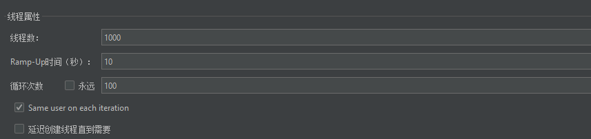
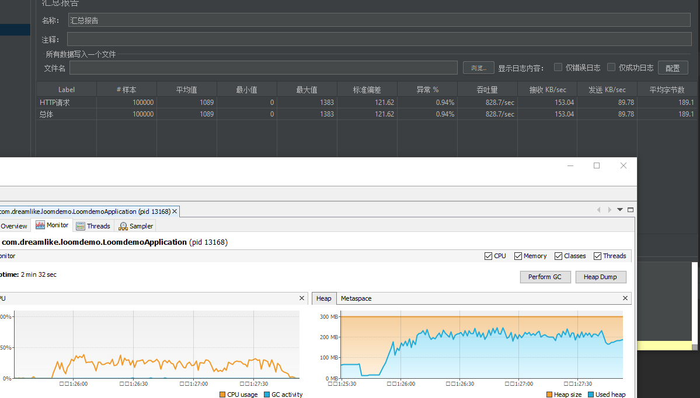
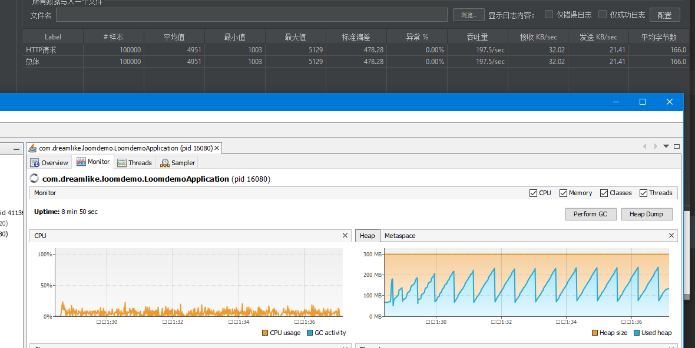
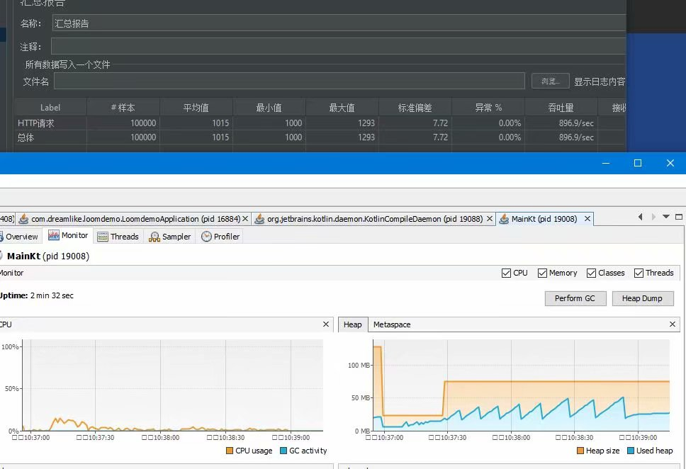
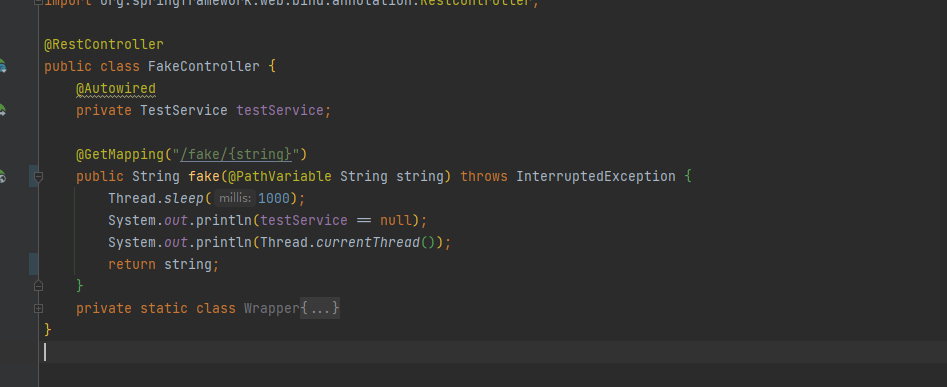
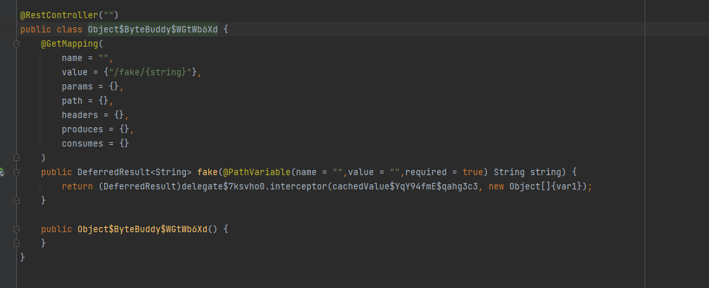

# Project Loom与SpringBoot

## 简单的压测

#### 测试参数



jvm参数

-Xmx300m -Xms300m

jdk 为[Build 17-loom+7-342 (2021/5/11)](http://jdk.java.net/loom/)

#### 睡眠1s

##### loom



```java
@RequestMapping("/hello")
    public DeferredResult<String> hello(){
        DeferredResult<String> res = new DeferredResult<>();
        Thread.startVirtualThread(() -> {
            try {
                Thread.sleep(1000);
            } catch (InterruptedException e) {
                e.printStackTrace();
            }
            res.setResult("hello");
        });
        return res;
    }
```


##### 非loom



```java
@RequestMapping("/word")
    public String word() throws InterruptedException {
        Thread.sleep(1000);
        return "hello";
    }
```

##### 单线程vertx+kt协程



```kotlin
class ClientVerticle :  CoroutineVerticle(){
  override suspend fun start() {
    var router = Router.router(vertx)
    router.get("/word")
      .handler { rc->
        rc.vertx().setTimer(1000){
          rc.end("word")
        }
      }
    val httpserver = vertx.createHttpServer()
      .requestHandler(router)
      .listen(8080)
      .await()
    println("http server run on ${httpserver.actualPort()}")
  }
}

```

##### 结论

从不太严谨的Windows平台自己压自己来看
loom可以给予spring免费的性能提升
从睡眠一秒来说 loom改造后的性能大概是三四倍 持平Vertx 的 eventloop
差不多能持平Vertx 但是还是Vertx内存占用的4-6倍

全部都是默认jdk17 loom ea版本 堆开300mb 未发生full gc
目前来看loom并不会导致gc或者内存分配压力过大，反而可以更好的以简单的同步代码写法发挥cpu性能 
属于是稍微一包装controller就可以得到性能提升，直接兼容旧有的BIO体系
目前我使用的是默认的协程实现即和go一致 无脑启动虚拟协程且开启工作窃取

**注意**：

旧有的BIO体系指的是基于jdk中原生socket api的阻塞体系 本质上仍然是阻塞api 只不过阻塞的线程由原来的平台线程（Platform Thread）改为了虚拟线程（Virtual Thread）

默认调度器采用ForkJoin线程池 开启工作窃取

## 改造SpringBoot

### 前言

对于Spring Boot的改造着眼于改造Servlet容器 把executor改 Executors.newVirtualThreadExecutor()

以内嵌的Tomcat为例子 其执行逻辑是在不开启异步支持的情况下 会等待controller结束才返回

即使你这样配置也会导致Tomcat内部线程阻塞的

```java
@Configuration
public class TomcatConfiguration extends TomcatWebServerFactoryCustomizer {


    public TomcatConfiguration(Environment environment, ServerProperties serverProperties) {
        super(environment, serverProperties);
    }

    @Override
    public void customize(ConfigurableTomcatWebServerFactory factory) {
 factory.addProtocolHandlerCustomizers(protocolHandler -> protocolHandler.setExecutor(Executors.newVirtualThreadExecutor()));
    }
}

```

所以只能去开启异步servlet支持 让对应的线程及时“离开”，controller对应方法完成时再把他写出

查阅SpringMVC文档可以得知

```java
 @RequestMapping("/word")
    public DeferredResult<String> word() throws InterruptedException {
        final DeferredResult<String> result = new DeferredResult<>();
        Thread.startVirtualThread(()->{
            try {
                Thread.sleep(1000);
            } catch (InterruptedException e) {
                e.printStackTrace();
            }
            result.setResult("string");
        });
        return result;
    }
```

通过DeferredResult就开启了异步响应

也就说我们可以把接口改造为用DeferredResult包裹就可以了 对于旧有代码我们肯定是不能够动的

只能通过委托的形式偷梁换柱替换掉 比如字节码工程

由于java agent需要一定门槛 而且会大幅度更改原有代码

所以我使用了ByteBuddy去运行时做委托转发+BeanPostProcessor替换注入的controller对象

### 为什么不通过继承去做增强？

我们经常使用的AOP是通过CGLIB等工具以字节码去继承原有类的基础上做的

但是在这个包裹返回值的场景下，由于继承重写的限制导致我们不能更改返回值类型

所以我的思路是做一个委托类似于这样：

下面的才是真正注册到路由上面的方法

```java
public String wor1d() throws InterruptedException {
        System.out.println(Thread.currentThread());
        return "ADw";
    }
public DeferredResult<String> worldProxy(){
     final DeferredResult<String> result = new DeferredResult<>();
        Thread.startVirtualThread(()->{
            result.setResult(world());
        });
        return result;
}
```

这样在虚拟线程中可以通过同步写法随便阻塞 堆栈也是完整且连续的

### 获取包装好的类

**注意**

由于本人字节码学的稀烂 ByteBuddy也不太熟练 故只提供思路和示例代码

#### 包裹方法生成

由于代码排版问题和个人水平问题 代码仅供参考

实际的思路是

1，把原有类上面的注解全部放到这个运行时生产的类上面（@RestController之类的）

2，返回值如果不是DeferredResult类型 则进行包裹

3，方法名照抄

4，对每一个方法都执行这些操作

1. ​     迁移所有的方法注解
2. 参数照抄  参数注解照抄 参数名也要照抄

5，方法体就是使用一个ControllerInterceptor（下面会讲）将实际调用转发到真正做处理的方法里面

总结一下做一个就是除了返回值不一样 其他都一样的方法出来

```java
public static DynamicType.Builder.MethodDefinition copyMethod(Class target, ControllerInterceptor interceptor){
        DynamicType.Builder.MethodDefinition now = null;
        DynamicType.Builder<Object> builder = new ByteBuddy()
                .subclass(Object.class)
                .annotateType(target.getAnnotations());
        final List<Method> methodList = Arrays.stream(target.getDeclaredMethods()).filter(m -> Modifier.isPublic(m.getModifiers())).collect(Collectors.toList());
        for (Method method : methodList) {
            TypeDescription.Generic returnType;
            if (method.getReturnType() == DeferredResult.class){
                returnType = TypeDefinition.Sort.describe(method.getGenericReturnType());
            }else {
               returnType = TypeDescription.Generic.Builder.parameterizedType(DeferredResult.class, method.getGenericReturnType()).build();
            }
            if (now == null) {
                now = copyParameters(builder.defineMethod(method.getName(), returnType, Modifier.PUBLIC), method)
                        .intercept(MethodDelegation.to(interceptor))
                        .annotateMethod(method.getAnnotations());
            }else {
                now = copyParameters(now.defineMethod(method.getName(), returnType, Modifier.PUBLIC), method)
                        .intercept(MethodDelegation.to(interceptor))
                        .annotateMethod(method.getAnnotations());
            }

        }
        return now;
    }
```

#### 转发代理

```java
@RuntimeType
    public Object interceptor(@Origin Method method, @AllArguments Object[] args) throws InvocationTargetException, IllegalAccessException {
        DeferredResult<Object> result = new DeferredResult<Object>();
        Thread.startVirtualThread(()->{
            try {
         //注意这个method实际上是我运行时生成的类的方法
         //getTargetMethod是通过方法名+参数列表寻找缓存中的对应的真正需要调用的方法
                Object res = getTargetMethod(method).invoke(target, args);
                result.setResult(res);
            } catch (Throwable e) {
                result.setErrorResult(e);
            }
        });
        return result;
    }
```

#### 实际生成对象

原本方法



生成的方法（图为字节码反编译结果）



#### 偷梁换柱

```java
public class LoomControllerRegister implements BeanPostProcessor {

    @Override
    public Object postProcessBeforeInitialization(Object bean, String beanName) throws BeansException {
        if (isRestController(bean)){
            //wrapLoom就是用动态生成的类去替换
            return wrapLoom(bean);
        }
        return BeanPostProcessor.super.postProcessBeforeInitialization(bean, beanName);
    }
    //...篇幅限制不展示
}

```

最后在你的入口加上

```java
@Import(LoomControllerRegister.class)
```

把这个类导入就可以了

这样都不用更改原有代码了 同时SpringBoot 自己也有一套针对DeferredResult的处理机制

完美嵌入 而且你换个servlet容器都可以兼容 

详细代码见

[loomdemo: 采用bytebuddy字节码生成 非入侵式为spring boot添加loom 虚拟线程支持 servlet容器无关性 (gitee.com)](https://gitee.com/dreamlikeocean/loomdemo)