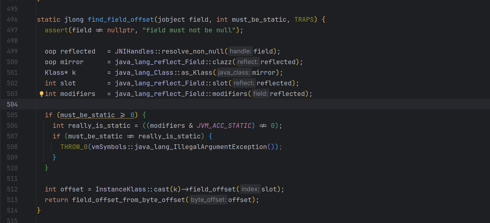

# Unsafe中内存操作移除后的替代物

>当前我们仍可以使用Unsafe做各种各样内存操作，但是在可预见的未来，这种内存操作会被[openjdk组移除](https://openjdk.org/jeps/8323072)

这份JEP认为当前这些**Unsafe**的操作已经有**Safe**的API作为替代，同时在safe的前提下可以依赖于jit的魔力将其追平Unsafe的性能

但是笔者认为这份JEP是openjdk组那种狂热的追求"安全"，"可维护"的思想的又一次体现。总的来说这份JEP的含义是：

- 堆内的部分不要瞎搞，只允许在有权限的范围内执行内存操作。数组给你划界，对象给你卡权限，通过模块化，数组边界检查控制能get和能set的部分
- 堆外的部分可以搞，但是也得是在监管范围内的，生命周期约束，GC追踪，线程本地握手这些都是保证不会释放后使用的手段
- 另外则是继续坚持反对hack标准库

这里openjdk组玩了一个文字游戏，jdk存在两个Unsafe,一个是本次会被阉割的`sun.misc.Unsafe`,属于jdk.unsupported模块是给开发者用的，其全部操作都会转发到另外一个Unsafe上——`jdk.internal.misc.Unsafe`,其在java.base模块下，被严密保护起来了。 所以本次看起来是大削弱，但是其实一方面没有砍掉jdk内部Unsafe的能力，一方面又有替代品，实际上是小削弱。但是某些没有替代品的api的去除则实实在在给尝试手动接管jvm这台纯自动驾驶的开发者一记重拳。

## 手操内存
 这里不展开直接贴JEP截图

除了invokeCleaner之外均可以直接替换，invokeCleaner目前没有等价替换物（在AutoScope下）

## 无条件"反射"和内存效应

很多"高性能"代码中可能会出现这样的代码

```java
Field implLookupField = lookupClass.getDeclaredField("IMPL_LOOKUP");
long offset = UNSAFE.staticFieldOffset(implLookupField);
return (MethodHandles.Lookup) UNSAFE.getObject(UNSAFE.staticFieldBase(implLookupField), offset);
```

来获取某些对象中的某些字段，甚至是用来hack标准库获取特权操作，这里涉及到的`staticFieldOffset`和`getObject`的两个方法未来均会移除。从jdk源码中可以看到



这里获取offset和从offset获取某个值是完全的内存偏移量操作，并不包含任何权限判断，所以这正是openjdk组认为这东西不安全不稳定的原因。他们给出的替代品是`Varhandle`;

```java
        MethodHandles.Lookup lookup = MethodHandles.lookup();
        VarHandle varHandle = lookup.findStaticVarHandle(Main.class, "a", MethodHandles.Lookup.class);
        varHandle.set(lookup);
        MethodHandles.Lookup staticValue = (MethodHandles.Lookup) varHandle.get();
```

通过这个神秘的LookUp来决定当前获取到的Varhandle是否具有操作对应字段的权限，这里往往会跟模块，可见性等相绑定，再加之JDK17带来的强模块化封死了通过Unsafe破坏模块化封装的"漏洞"。

对于内存效应的部分，比如说CAS,Memory Order,也是直接使用Varhandle进行解决，原来的`Unsafe::compareAndSwapInt`转为了`VarHandle::compareAndSet`。

对于手操内存屏障的部分则是全部从Unsafe直接迁移到Varhandle下

```java
        VarHandle.fullFence();
        VarHandle.acquireFence();
        VarHandle.releaseFence();
```

这里在替换时就会有一个隐藏的坑，原有的Unsafe操作原理是直接操作对应内存所以不是const也是有很好的效果的，但是Varhandle比较复杂涉及到多重编译，内联优化所以必须是const的，否则性能下降的很客观，你需要声明成如下代码才能获取更好的性能。

```java
private static VarHandle VH = ...
```

如果你的模式比较固定，只需要一种形式的操作又想延迟操作不妨试试invokeDynamic+ConstantCallSite,将对应的`MethodHandle methodHandle = varHandle.toMethodHandle(VarHandle.AccessMode.GET);` 转换为Methodhandle后塞入callsite.

## 类初始化

之前的类加载器机制其实并没有对外开放一些诸如字节码数组转Class,强制初始化等API,往往很依赖于Unsafe的某些api,比如`Unsafe::defindClass`, `Unsafe::ensureClass`.
目前这些都全量移动到了上面提到的Methodhandle$Lookup类下。
在实战中我们往往会手搓一些字节码然后加载，同时在`<cinit>`中写一些逻辑，这时候就需要`ensureInitialized`出马保证返回的Class一定是初始化完毕的

```java
            Class<?> aClass = null;
            try {
                aClass = lookup.findClass(className);
            } catch (ClassNotFoundException ignore) {
            }
            //证明没有生成过
            if (aClass == null) {
                //其中使用lookup.defineClass加载生成出来的类
                aClass = generateRuntimeProxyClass(lookup, nativeInterface);
            }
            //强制初始化执行cInit
            lookup.ensureInitialized(aClass);            
```

## 杂项

### 获取页面大小

`Unsafe::pageSize` 用于获取当前系统页面大小，这个api也会被移除。由于其是libc的一部分，所以可以很轻松地使用Panama FFI获取到


对应的调用代码也很简单

```java
        Linker nativeLinker = Linker.nativeLinker();
        //方便展示直接get了
        MemorySegment functionAddress = nativeLinker.defaultLookup().find("getpagesize").get();
        MethodHandle getPageSizeHandle = nativeLinker.downcallHandle(
                functionAddress,
                FunctionDescriptor.of(ValueLayout.JAVA_INT),
                Linker.Option.isTrivial()
        );

        int pageSize = (int) getPageSizeHandle.invokeExact();
```

当然使用[Panama-generator](https://central.sonatype.com/artifact/io.github.dreamlike-ocean/panama-generator)更简单！
```java
        interface unistd {
            @NativeFunction(value = "getpagesize", fast = true)
            int getPageSize();
        }

        NativeCallGenerator generator = new NativeCallGenerator();
        int size = generator.generate(unistd.class).getPageSize();
        System.out.println(size);

```

## 私货
前面说了这么多其实都是为了私货部分，我之前写了个库——[手操VirtualThread](https://github.com/dreamlike-ocean/UnsafeVirtualThread)，就是把一些jdk内部的基建拿出来用，其中核心就是MethodHandle.Lookup中的那个静态字段`IMPL_LOOKUP`，其拥有无限的权限，不受任何限制调用任意的方法，哪怕是jdk内部的。但是由于Unsafe中offset相关方法的移除，我也不得不一边骂openjdk组一边寻找别的解决方案，让这个库继续跑下去。
封锁到最后发现只有jni这一条路了。

```c
JNIEXPORT jobject JNICALL Java_top_dreamlike_VirtualThreadUnsafe_getTrustedLookUp
        (JNIEnv *env, jclass jclazz) {
  auto lookupClass = env->FindClass("java/lang/invoke/MethodHandles$Lookup");
  auto fieldId = env->GetStaticFieldID(lookupClass, "IMPL_LOOKUP", "Ljava/lang/invoke/MethodHandles$Lookup;");
  auto TRUST_LOOKUP = env->GetStaticObjectField(lookupClass, fieldId);
  return TRUST_LOOKUP;

}
```

但是这里还有个高悬的已经提交的[JEP草案](https://openjdk.org/jeps/8307341),准备默认关闭jni的加载，或许某一天我的`提供无需添加额外启动参数就可以使用VirtualThread带来的各种内部api的解决方案`这句话也会被我自己删掉。

我很乐意见到jdk变得更安全，但是至少给我们这些有能力手操的人一点活路，如果官方举棋不定不知道该不该放出来API,也至少留个后门给社区发挥创造力。
