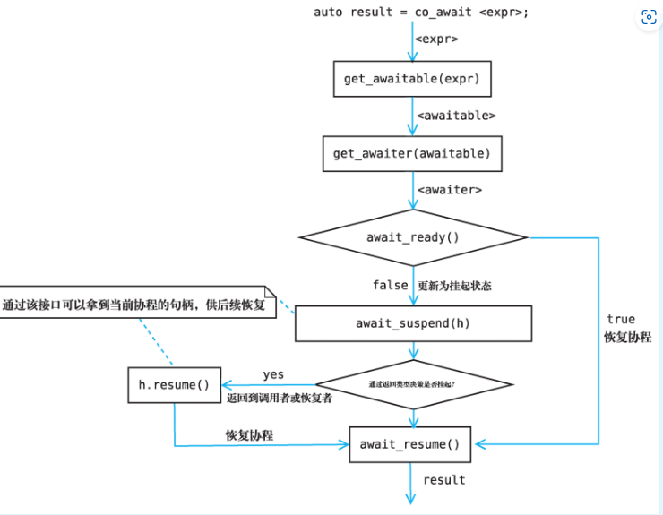

# C++20的协程

> 本文非科普文章 而是学习记录
>
> 参考《C++20高级编程》和[1. C++ 协程概览 | Benny Huo 的专栏](https://www.bennyhuo.com/book/cpp-coroutines/01-intro.html)
>
> 以Kotlin的协程的概念来讲解

类似于Rust的协程实现，C++也是需要添加自定义的`Future`实现的，但C++并非通过实现trait而是通过鸭子类型。

与Kt不同的是，C++的协程只需返回一个Future即可，无特殊函数符号，类似于Rust的async实际上返回的是future一样

大概需要定义两个东西，一个是promise，一个是future，promise是future的factory，当返回一个future实现时整个函数就成为了一个协程（这也是协程的一个最准确的概念，是一个子例程），其中发生的各种行为比如说await，yield，return的行为都被promise的实现来约束


这里给出C++20高级编程中的约束示意 来判定一个类型是否符合Promise的标准

先假设它返回的是int

``` cpp
template<typename P>
concept Promise = requires(P p) { 
    {p.get_return_object()} -> Future; //支持返回一个Future
    {p.initial_suspend()}  -> Awaitable;
    {p.final_suspend()} noexcept = Awaitable;
    p.unhandled_exception; //处理异常的函数
    requires (requires (int v) {p.return_value(v);} || requires {p.return_void();} )  //必须包含其中一个函数
}

template<typename T, typename... Ts> concept one_of = (std::same_as<T, Ts> || ...);
template <typename A>
concept Awaitable = requires(A a) {
  { a.await_ready() } -> std::convertible_to<bool>; // 判断是否需要挂起
  { a.await_suspend(std::coroutine_handle<>()) } -> one_of<void,bool, std::coroutine_handle<>>;   // 挂起时执行的逻辑
  { a.await_resume() };                             // 恢复时执行的逻辑
};

template <typename F>
concept Future = requires(F f) {
  F::promise_type;
  requires Promise<F::promise_type>;
};

```

从整体来说应该是这样的

```cpp
struct Future{
    //这个struct promise_type不能变 
    struct promise_type{
       
        std::suspend_always initial_suspend() { return {}; };
        std::suspend_always final_suspend() noexcept { return {}; }
        void unhandled_exception() {}；
        Future get_return_object() {return Future(...)};
    }
    
}
```

在构造promise_type之后可以通过std::coroutine_handle<promise_type>::from_promise(*this)直接获取到std::coroutine_handle<promise_type>

## Awaitable

这个来描述当前异步任务的状态



其中可以很明显看出来如果我们这样实现，那么其实跟Rust Future会差不多

```cpp
 struct suspend_always
  {
    auto res;
    constexpr bool await_ready() const noexcept { return false; }

    constexpr void await_suspend(coroutine_handle<> h) const noexcept {
        async_op([=](auto _res){
            res = _res;
            h.resume()
        });
    }

    constexpr auto await_resume() const noexcept {
        return res;
    }
  };
```

**下面提到的挂起讲的是协程挂起的含义，其暗含调用await_suspend的含义**

对于await_ready来说其返回的是 当前是否需要挂起 ，若没有准备好则是直接挂起，反之继续执行


对于await_suspend而言，这个则是代表了当前的调度逻辑，这里我使用kotlin的一些协程元素来描述

* 返回类型为void，跳出当前suspend函数，类似于java的 continuation.yield 回到continuation::run被调用的地方，将控制流返回

* 返回类型为bool，如果返回true，则跳出当前suspend函数（同上），否则直接恢复当前continuation，直接向下执行

* 返回类型为coroutine_handle，指定恢复哪个continuation，思考一个exchange的场景，第一个协程对应的coroutine_handle为h1,其先进行take发现没有，则把自己挂起把h1找地方存一下，然后后面一个协程来push元素，其对应的coroutine_handle为h2，此时就可以返回h1让其恢复


对于await_resume则是代表了 恢复后返回的值类似于Future<T>.await的返回值

所以这个描述了一个异步任务的整体的生命周期。

## Promise

这个是Future工厂，先每次构建Future再直接构建Promise

Promise包含了当前协程生命周期中的各种行为，各种操作符（co_await,co_return）的行为


这里给出一个co_wait实现的生成器代码

原理是promise_type来驱动一次自增 然后把结果通过await_transform这个函数来交给promise

最后future从绑定的promise中获取到自增后的数据

```cpp
struct Generator {
  // promise就是awaitable的factory
  struct promise_type {
    int next_value;

    // 开始执行时直接挂起等待外部调用 resume 获取下一个值
    // 必须加的函数
    std::suspend_always initial_suspend() { return {}; };
    /**
      /// [coroutine.trivial.awaitables]
  struct suspend_always
  { 返回当前是否可以恢复
    constexpr bool await_ready() const noexcept { return false; }

    返回类型为void，跳出当前suspend函数。
    ②返回类型为bool，如果返回true，则跳出当前suspend函数，否则直接恢复当前continuation。
    ③返回类型为coroutine_handle，指定恢复哪个continuation。
    constexpr void await_suspend(coroutine_handle<>) const noexcept {}

    类似于Future<T>.await的返回值
  以上说明中包含恢复continuation最后都会调用到这里来返回一个值 constexpr void
  await_resume() const noexcept {}
  };
    */

    // 执行结束后需要挂起 最后来销毁
    // 必须加的函数
    std::suspend_always final_suspend() noexcept { return {}; }

    // 为了简单，我们认为序列生成器当中不会抛出异常，这里不做任何处理
    void unhandled_exception() {}

    // Promise对象构造完成后，通过用户提供的Promise::get_return_object接口来构造Future对象，
    // 也就是协程的返回对象，该对象将在第一次挂起后返回给协程的调用者
    Generator get_return_object() {
      return Generator(
          std::coroutine_handle<promise_type>::from_promise(*this));
    }

    std::suspend_always await_transform(int value) {
      this->next_value = value;
      return {};
    }
    // 没有返回值
    void return_void() {}
  };
  std::coroutine_handle<promise_type> handle;

  Generator(std::coroutine_handle<promise_type> h) { handle = h; };

  Generator(Generator &&rhs) : handle(std::exchange(rhs.handle, {})) {}
  ~Generator() {
    // 销毁协程
    if (handle) {
      handle.destroy();
    }
  }
  int next() {
    handle.resume();
    return handle.promise().next_value;
  }
};

Generator sequence() {
  int i = 0;
  while (true) {
    co_await i++;
  }
}
```

### initial_suspend

这个函数在协程体执行之前就会被调用，可以在其中插入调度的逻辑

### final_suspend

当协程执行完成或者抛出异常之后会先清理局部变量，接着调用 final_suspend 来方便开发者自行处理其他资源的销毁逻辑。

final_suspend 也可以返回一个等待体使得当前协程挂起，但之后当前协程应当通过 coroutine_handle 的 destroy 函数来直接销毁，而不是 resume。


### await_transform

这个用于当前协程体内部出现co_await操作符的时候的转换函数

```cpp
 /**
    首先是检查协程用户定义的Promise对象是否存在成员函数await_transform，如果存在，
    则令Awaitable对象为await_transform(expr)；
    如果不存在，则令Awaitable对象为expr，这一步让协程拥有控制co_await表达式行为的能力，
    。*/
    /**
    首先是检查协程用户定义的Promise对象是否存在成员函数await_transform，如果存在，
    则令Awaitable对象为await_transform(expr)；如果不存在，则令Awaitable对象为expr，

    */
    std::suspend_always await_transform(int value) {
      this->next_value = value;
      return {};
    }
```
