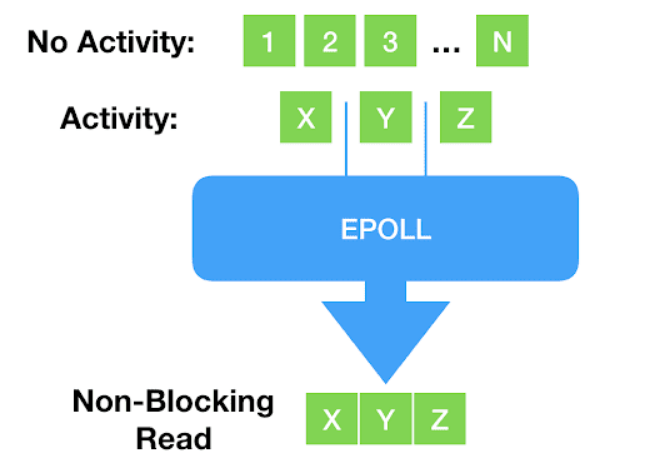
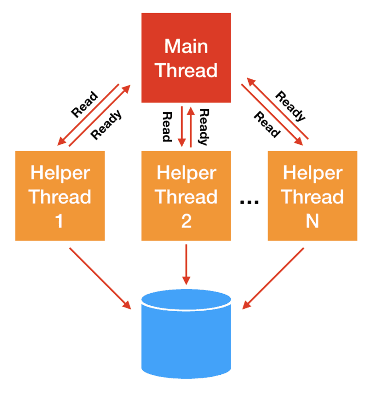
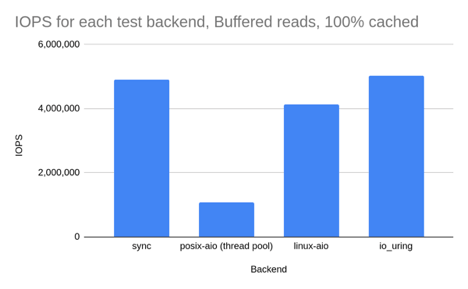

# IO_Uring 漫谈

本文大部分内容来自[How io_uring and eBPF Will Revolutionize Programming in Linux - The New Stack](https://thenewstack.io/how-io_uring-and-ebpf-will-revolutionize-programming-in-linux/)

eBPF并不是本次的重点，但是这个技术也是非常有趣的，同学们可以自行了解

## 从WAL开始

先从一个我在毕设中遇到的实际场景出发——raft协议中的[wal](https://github.com/dreamlike-ocean/raft-kt/blob/fcf3c1cf03da4c3fbe7ceae64af8c06b64d6e132/raft-server/src/main/kotlin/top/dreamlike/KV/KVStateMachine.kt#L191)

> 什么是WAL？
>
> 一种数据日志，通过将每个状态更改作为命令持久化到仅附加日志来提供持久性保证，而无需将存储数据结构刷新到磁盘，遇到故障重启时使用其重放恢复整个应用状态，一般是先append再执行应用服务状态的修改
>
> 请参考：[Write-Ahead Log (martinfowler.com)](https://martinfowler.com/articles/patterns-of-distributed-systems/wal.html?ref=vertexclique.com)

简单来说，当用户发送"set a=1"时 我需要把这条消息先持久化到**磁盘**上再走raft协议完成共识，最后应用这个记录才全局可见

这里讲的持久化到磁盘，并非是调用write原语后返回就认为是持久化了，而是需要打开文件时设定O_DIRECT这个flag，此时write会直接提交到磁盘任务队列中而不是写入到page cache就认为写入完毕了 即需要以下面代码的形式写入才可以

```java
var walFile = FileChannel.open(Path.of("temp.txt"), StandardOpenOption.APPEND, ExtendedOpenOption.DIRECT);
walFile.write(ByteBuffer.allocate(12))
```

考虑两者情况：

- 磁盘性能差 由于阻塞式的IO你就需要开更多线程满足写入的需求，更多的线程带来的更多的调度成本
- 磁盘性能强，现在市场上的一些设备，例如 [Intel Optane](https://pcper.com/2018/12/intels-optane-dc-persistent-memory-dimms-push-latency-closer-to-dram) ，**延迟已经低到和上下文切换一个量级**（微秒 `us`）。换个方式描述， 更能让我们感受到这种开销： **上下文每切换一次，我们就少一次 dispatch I/O 的机会**，延时就会偏高，如果要降低延时就要走轮询，此时的syscall的次数就会一路飞升

对于

综上 我们的诉求可以简单归纳为:

- 支持轮询IO以降低IO延时
- 系统调用尽可能少
- 性能好，最好是异步的IO，不要让应用层付出太大的成本

## api的演进

### 基于 fd 的阻塞式 I/O：`read()/write()`

作为大家最熟悉的读写方式，Linux 内核提供了**基于文件描述符的系统调用**， 这些描述符指向的可能是**存储文件**（storage file），也可能是 **network sockets**：

```
ssize_t read(int fd, void *buf, size_t count);
ssize_t write(int fd, const void *buf, size_t count);
```

二者称为**阻塞式系统调用**（blocking system calls），因为程序调用 这些函数时会进入 sleep 状态，然后被调度出去（让出处理器），直到 I/O 操作完成：

- 如果数据在文件中，并且文件内容**已经缓存在 page cache 中**，调用会**立即返回**；
- 如果数据在另一台机器上，就需要通过网络（例如 TCP）获取，会阻塞一段时间；
- 如果数据在硬盘上，也会阻塞一段时间。

但很容易想到，随着存储**设备越来越快，程序越来越复杂**， 阻塞式（blocking）已经这种最简单的方式已经不适用了。

### 非阻塞式 I/O：`select()/poll()/epoll()`

阻塞式之后，出现了一些新的、非阻塞的系统调用体系，例如 `select()`、`poll()` 以及更新的 `epoll()`体系。 这些体系通过将文件描述符设置为非阻塞模式，再阻塞等待有可读可写事件发生，这样我们只需要单个线程就可以监控大量fd的状态，这就是多路复用。



但这种方式存在一个致命缺点：**只支持 network sockets 和 pipes等少数fd** —— `epoll()` 甚至连 storage files 都不支持。

当然这也跟这些fd的特性有关系，因为这些fd是存在“未就绪状态的”

### 线程池方式

对于 storage I/O，经典的解决思路是 [阻塞线程池l](https://en.wikipedia.org/wiki/Thread_pool)： 主线程将 I/O 分发给 worker 线程，后者代替主线程进行阻塞式读写，主线程不会阻塞。



这种方式的问题是**线程上下文切换开销可能非常大**

### Direct I/O（数据库软件）：绕过 page cache

随后出现了更加灵活和强大的方式：**数据库软件**（database software） 有时 [并不想使用操作系统的 page cache](https://www.scylladb.com/2018/07/26/how-scylla-data-cache-works)， 而是希望打开一个文件后，**直接从设备读写这个文件**（direct access to the device）。 这种方式称为**直接访问**（direct access）或**直接 I/O**（direct I/O）

[4.9. Direct I/O Red Hat Enterprise Linux 5 | Red Hat Customer Portal](https://access.redhat.com/documentation/en-us/red_hat_enterprise_linux/5/html/global_file_system/s1-manage-direct-io)

它有以下特征

- 需要指定 **`O_DIRECT`** flag；
- 需要**应用自己管理自己的缓存** —— 这正是数据库软件所希望的；
- 是 **‘zero-copy I/O’**，因为应用的缓冲数据直接发送到设备，或者直接从设备读取。

###  异步 IO（AIO）

前面提到，随着存储设备越来越快，主线程和 worker 线性之间的上下文切换开销占比越来越高。 现在市场上的一些设备，例如 [Intel Optane](https://pcper.com/2018/12/intels-optane-dc-persistent-memory-dimms-push-latency-closer-to-dram) ，**延迟已经低到和上下文切换一个量级**（微秒 `us`）。换个方式描述， 更能让我们感受到这种开销： **上下文每切换一次，我们就少一次 dispatch I/O 的机会**。

因此，Linux **2.6** 内核引入了异步 I/O（asynchronous I/O）接口， 方便起见，本文简写为 `linux-aio`。AIO **原理**是很简单的：

- 用户通过 `io_submit()` 提交 I/O 请求，
- 过一会再调用 `io_getevents()` 来检查哪些 events 已经 ready 了。
- 使程序员**能编写完全异步的代码**。

看起来似乎已经解决了？

但是很明显Linus并不这样想

Reply to: [to support opening files asynchronously](https://lwn.net/Articles/671657/)

*So I think this is ridiculously ugly.*

*AIO is a horrible ad-hoc design, with the main excuse being “other, less gifted people, made that design, and we are implementing it for compatibility because database people — who seldom have any shred of taste — actually use it”.*

— Linus Torvalds (on lwn.net)

那么问题在哪？

1. **只支持 `O_DIRECT` 文件**，因此**对常规的非数据库应用** （normal, non-database applications）**几乎是无用的**，我们并没有这么多的Direct IO的需求，大部分需求来自于buffered IO（即需要走page cache）
2. 接口在**设计时并未考虑扩展性**。虽然可以扩展 —— 我们也确实这么做了 —— 但每加一个东西都相当复杂；
3. 虽然从**技术上说接口是非阻塞的**，但实际上有 [很多可能的原因都会导致它阻塞](https://lwn.net/Articles/724198)，而且引发的方式难以预料。
4. 文件IO和网络IO的接口被完全分开了，破坏了一切皆文件的哲学

## io_uring

### 设计概论

io_uring是Jens Axboe的创意，这项工作始于一个简单的[动机](https://lwn.net/ml/linux-fsdevel/20181221192236.12866-9-axboe@kernel.dk/)：随着设备变得非常快，中断驱动的工作不再像轮询那样高效——这是面向性能的I/O系统架构的一个核心观点。但是随着工作的推进，它变成了一个完全不同的东西，从头开始构思，允许整体异步操作。它的基本操作理论接近linux-aio的接口：有一个接口将工作推送到内核，另一个接口检索已经完成的工作。

它远比老的Linux aio走的远，简单来说它是一个大一统的IO视图

1. **在设计上是真正异步的**（truly asynchronous）。只要 设置了合适的 flag，它在**系统调用上下文中就只是将请求放入队列**， 不会做其他任何额外的事情，**保证了应用永远不会阻塞**。
2. **支持任何类型的 I/O**：cached files、direct-access files 甚至 blocking sockets，没错：由于其设计的异步性质，不需要轮询+读/写来处理socket。甚至你无需将其设定为非阻塞模式，直接提交任务即可，一旦数据到达好，它就会显示在completion ring中。
3. **灵活、可扩展**：基于 `io_uring` 甚至能重写Linux 的每个系统调用，你甚至用完全异步的方式对接所有驱动
4. 可以做到完全的零系统调用开销，提交任务完成任务无需任何拷贝，与epoll这种需要从内核拷贝完成事件数据返回给用户态的完全不一样

提交任务部分的零拷贝的实现非常直观——内核态和用户态共享同一块物理内存即可，你可以简单理解为[memfd和mmap的组合]([memfd_create(2) — Arch manual pages (archlinux.org)](https://man.archlinux.org/man/core/man-pages/memfd_create.2.en)) ，然后利用这块空间做了两个环状队列

- **提交队列**：submission queue (SQ)
- **完成队列**：completion queue (CQ)


开发者要做的事情就是

应用程序将大量填充好的提交队列的元素（sqes）添加到队列中，然后告诉内核有工作要做。内核做它的事情，当工作准备好时，它会将结果放到到cq中。这里还有一个与老aio api一样额外的好处，即系统调用现在是批处理的，我们添加元素到用户态空间中根本不需要任何系统调用，只有通知内核处理任务才需要发起系统调用

还记得[Meltdown](https://www.scylladb.com/2018/01/07/cost-of-avoiding-a-meltdown/)吗？我们可以很轻松避免这些影响，因为我们将通过aio批处理我们的I/O系统调用。

现在`io_uring` 也**将这种批处理能力带给了** storage I/O 系统调用之外的 **其他一些系统调用**，包括：read, write, send, recv, accept, openat, stat, 还有这种fallocate特殊的系统调用

其实你会发现虽然io_uring和aio看起来差不多，但是它的可扩展性和架构是颠覆性的：它为任何人带来异步操作的力量，而不是局限于专门的数据库应用程序才会去使用它。

Avi Kivity 在 the Core C++ 2019 event 上 [有一次关于 async 的分享](https://www.scylladb.com/2020/03/26/avi-kivity-at-core-c-2019)。 其核心思想在于在现代多核、多CPU设备中，CPU本身现在基本上是一个网络，所有CPU之间的互通是另一个网络，对磁盘I/O的调用实际上是另一个网络。因为不可知延迟的前提下，网络编程采用异步是明智的，而现在开发自己的应用也应该考虑异步。 这**从根本上改变了 Linux 上应用的设计方式**：

- 之前都是一段顺序代码流，需要系统调用时才执行系统调用，
- 现在需要思考一个事件是否 ready，因而自然地引入 event-loop，不断通过共享 buffer 提交请求和接收结果。

这里的核心思想很简单——Don’t call us, we’ll call you.

### API设计

手册参考[liburing/man at master · axboe/liburing · GitHub](https://github.com/axboe/liburing/tree/master/man)

以下代码来自于[liburing/io_uring-test.c at liburing-2.0 · axboe/liburing · GitHub](https://github.com/axboe/liburing/blob/liburing-2.0/examples/io_uring-test.c)

不做任何错误处理方便理解

首先是核心获取到这俩环

```c
struct io_uring ring;
io_uring_queue_init(QD, &ring, 0);
```

其次你需要获取到你需要操作的文件描述符和要写入的缓冲区

```c
int fd = open(argv[1], O_RDONLY | O_DIRECT);
struct iovec *iovecs = calloc(4, sizeof(struct iovec));
void *buf;
for (i = 0; i < QD; i++) {
		if (posix_memalign(&buf, 4096, 4096))
			return 1;
		iovecs[i].iov_base = buf;
		iovecs[i].iov_len = 4096;
		fsize += 4096;
}

```

然后提交请求

```c
do {
		sqe = io_uring_get_sqe(&ring);
		if (!sqe)
			break;
		io_uring_prep_readv(sqe, fd, &iovecs[i], 1, offset);
		offset += iovecs[i].iov_len;
		i++;
		if (offset > sb.st_size)
			break;
	} while (1);
```

最后等待完成

```c
for (i = 0; i < pending; i++) {
		ret = io_uring_wait_cqe(&ring, &cqe);
		if (ret < 0) {
			fprintf(stderr, "io_uring_wait_cqe: %s\n", strerror(-ret));
			return 1;
		}

		done++;
		ret = 0;
		if (cqe->res != 4096 && cqe->res + fsize != sb.st_size) {
			fprintf(stderr, "ret=%d, wanted 4096\n", cqe->res);
			ret = 1;
		}
		fsize += cqe->res;
		io_uring_cqe_seen(&ring, cqe);
		if (ret)
			break;
	}

```

很简单 只需要填充 批量提交 等待完成就好了

ok 我们现在搞好了1+1，让我们看看积分是怎么做的

### 设计一个可用的async runtime

这里我借用了一个rust上的概念**async runtime**，简单来说就是提供一组对用户屏蔽掉具体实现的异步接口

代码来自于[dreamlike-ocean/PanamaUring: 使用panama api为java提供io_uring的绑定而无需使用native语言，统一文件IO和网络IO的模型，提供一套易用的异步IO API (github.com)](https://github.com/dreamlike-ocean/PanamaUring)

类似于这样的一个接口

```java
  IOUringEventLoop ioUringEventLoop = new IOUringEventLoop(32, 16, 100);
  AsyncFile appendFile = ioUringEventLoop.openFile("demo.txt", O_APPEND() | O_WRONLY() | O_CREAT());

  ioUringEventLoop.start();

  byte[] bytes = "追加写东西".getBytes();
  CompletableFuture<Integer> write = appendFile.write(-1, bytes, 0, bytes.length);

```

先观察下我们需要什么

- eventloop，一个线程来轮询cqe同时触发各种回调
- 由于io_uring的双环特性，其实推荐单线程获取sqe，然后同一线程再submit。
- 光让线程阻塞在这边等事件未免有些低效，要是还能执行点小任务就最好了，所以需要一个唤醒阻塞在io_uring_wait_cqe的机制

所以我们很快就可以写出这样的代码

这个在我们的代码里面称之为BaseEventLoop 用来实现不同的eventloop的

```java
 @Override
    public void run() {
        while (!close.get()) {
            long duration = -1;
            TimerTask peek = timerTasks.peek();
            if (peek != null) {
                //过期任务
                if (peek.deadline <= System.currentTimeMillis()) {
                    runAllTimerTask();
                }
                //最近的一个定时任务
                if (timerTasks.peek() != null) {
                    duration = timerTasks.peek().deadline - System.currentTimeMillis();
                }
            }
            while (!tasks.isEmpty()) {
                tasks.poll().run();
            }
            wakeUpFlag.set(false);
            selectAndWait(duration);
            wakeUpFlag.set(true);
            //到期的任务
            afterSelect();
        }
        try {
            close0();
        } catch (Exception e) {
            throw new RuntimeException(e);
        } finally {
            afterClose();
        }
    }
```

那么`selectAndWait`就可以实现为`io_uring_wait_cqe`,`afterSelect`自然就是`io_uring_peek_cqe`和`io_uring_peek_ceen` 了

好我们来写代码

#### 线程模型

由于io_uring的双环特性，其实推荐单线程获取sqe，然后同一线程再submit。

目前获取io_uring实例直接使用默认参数获取，所以使用的是`io_uring_get_sqe`这个函数获取sqe，这个方法会导致从环上摘下一个sqe，而且封装的EventLoop带有一个定期submit的功能，所以要求`io_uring_get_sqe`和sqe参数填充这多个操作必须是原子的

进而需要把这几个操作打包为一个操作切换到EventLoop上面执行

举个例子

```java
public CompletableFuture<byte[]> readSelected(int offset, int length) {
    CompletableFuture<byte[]> future = new CompletableFuture<>();
    eventLoop.runOnEventLoop(() -> {
        if (!uring.prep_selected_read(fd, offset, length, future)) {
            future.completeExceptionally(new Exception("没有空闲的sqe"));
        }
    });
    return future;
}
```

#### wakeup

当EventLoop阻塞在wait cqe时，我们想要在任意线程里面唤醒它，最容易想到的就是使用 `IORING_OP_NOP`这个OP， 但是这个也存在我们之前说的并发问题。

所以抄了一把jdk的selector实现，我会让io_uring监听一个eventfd，需要唤醒时我们只要增加一个eventfd的计数即可

> 注意这里的eventfd只是一个普通的fd，并非使用`io_uring_register_eventfd`这个方法来监听cqe完成事件的

wakeup的实现核心就这些。

然后我们来谈谈细节：

由于只支持one shot模式的监听，即submit一次sqe只会产生一次可读事件

所以需要读取到事件之后 再注册一次监听

```java
private void multiShotReadEventfd() {
    prep_read(wakeUpFd.getFd(), 0, wakeUpReadBuffer, (__) -> {
        // 轮询到了直接再注册一个可读事件
        wakeUpFd.read(wakeUpReadBuffer);
        multiShotReadEventfd();
    });
    submit();
}
```

#### IOSQE_IO_LINK

这里要保证两点

- 原子化——EventLoop机制保证
- 保证范围内的fd都属于同一个io_uring实现

比如说 asyncFile1和asyncFile2都必须是同一个io_uring

```java
eventLoop.submitLinkedOpSafe(() -> {
            asyncFile1.read();
            asyncFile2.write();
        });
```

还要支持捕获任意数量的`AsyncFile`/`AsyncSocket`/`AsyncServerSocket`

这里使用了一个针对于lambda实现的小技巧

```
private boolean checkCaptureContainAsyncFd(Object ops) {
    try {
        for (Field field : ops.getClass().getDeclaredFields()) {
            if (!AsyncFd.class.isAssignableFrom(field.getType())) {
                continue;
            }
            field.setAccessible(true);
            IOUringEventLoop eventLoop = ((AsyncFd) field.get(ops)).fetchEventLoop();
            if (eventLoop != this) {
                return false;
            }
        }
    } catch (Throwable t) {
        throw new AssertionError("should not reach here", t);
    }
        return true;
}
```

## 开发体验

你会发现 好多异步代码，回调套回调，感觉性能上去了但是好像更难写了这该如何是好？

其实有很多解决方案这里不再展开 请参考[为什么jvm需要有栈协程](为什么jvm需要有栈协程.md)

## 性能参考

#  `io_uring` 性能压测（基于 `fio`）

**对于已经在使用 linux-aio 的应用**，例如 ScyllaDB， **不要期望换成 io_uring 之后能获得大幅的性能提升**，这是因为： `io_uring` 性能相关的底层机制与 `linux-aio` 并无本质不同（都是异步提交，轮询结果）。

在此，本文也希望使读者明白：`io_uring` **首先和最重要的贡献**在于： **将 linux-aio 的所有优良特性带给了普罗大众**（而非局限于数据库这样的细分领域）。

## 测试环境

本节使用 `fio` 测试 4 种模式：

1. synchronous reads
2. `posix-aio` (implemented as a thread pool)
3. `linux-aio`
4. `io_uring`

硬件：

- NVMe 存储设备，物理极限能打到 **3.5M IOPS**。
- 8 核处理器

## 场景一：direct I/O `1KB` 随机读（绕过 page cache）

第一组测试中，我们希望所有的读请求都能**命中存储设备**（all reads to hit the storage），**完全绕开操作系统的页缓存**（page cache）。

测试配置：

- 8 个 CPU 执行 72 `fio` job，
- 每个 job 随机读取 4 个文件，
- `iodepth=8`（number of I/O units to keep in flight against the file.）。

这种配置**保证了 CPU 处于饱和状态**，便于观察 I/O 性能。 如果 CPU 数量足够多，那每组测试都可能会打满设备带宽，结果对 I/O 压测就没意义了。

表 1. Direct I/O（绕过系统页缓存）：1KB 随机读，CPU 100% 下的 I/O 性能

| **backend**             | **IOPS**  | **context switches** | **IOPS ±% vs io_uring** |
| ----------------------- | --------- | -------------------- | ----------------------- |
| sync                    | 814,000   | 27,625,004           | **-42.6%**              |
| posix-aio (thread pool) | 433,000   | 64,112,335           | **-69.4%**              |
| linux-aio               | 1,322,000 | 10,114,149           | **-6.7%**               |
| io_uring (basic)        | 1,417,000 | 11,309,574           | **—**                   |
| io_uring (enhanced)     | 1,486,000 | 11,483,468           | **4.9%**                |


几点分析：

1. `io_uring` 相比 `linux-aio` 确实有一定提升，但并非革命性的。
2. 开启高级特性，例如 buffer & file registration 之后性能有进一步提升 —— 但也还 没有到为了这些性能而重写整个应用的地步，除非你是搞数据库研发，想榨取硬件的最后一分性能。
3. `io_uring` and `linux-aio` **都比同步 read 接口快 2 倍，而后者又比 posix-aio 快 2 倍** —— 初看有点差异。但看看**上下文切换次数**，就不难理解为什么 posix-aio 这么慢了。
   - 同步 read 性能差是因为：在这种没有 page cache 的情况下， **每次 read 系统调用都会阻塞，因此就会涉及一次上下文切换**。
   - `posix-aio` 性能更差是因为：不仅内核和应用程序之间要频繁上下文切换，线程池的**多个线程之间也在频繁切换**。

##  场景二：buffered I/O `1KB` 随机读（数据提前加载到内存，100% hot cache）

第二组测试 buffered I/O：

1. 将文件数据提前加载到内存，然后再测随机读。
   - 由于**数据全部在 page cache**，因此**同步 read 永远不会阻塞**。
   - 这种场景下，我们预期**同步读和 io_uring 的性能差距不大（都是最好的）**。
2. 其他测试条件不变。

表 2. Buffered I/O（数据全部来自 page cache，100% hot cache）：1KB 随机读，100% CPU 下的 I/O 性能

| **Backend**             | **IOPS**  | **context switches** | **IOPS ±% vs io_uring** |
| ----------------------- | --------- | -------------------- | ----------------------- |
| sync                    | 4,906,000 | 105,797              | **-2.3%**               |
| posix-aio (thread pool) | 1,070,000 | 114,791,187          | **-78.7%**              |
| linux-aio               | 4,127,000 | 105,052              | **-17.9%**              |
| io_uring                | 5,024,000 | 106,683              | **—**                   |



结果分析：

1. 同步读和 `io_uring` 性能差距确实很小，二者都是最好的。

   但注意，**实际的应用**不可能一直 100% 时间执行 IO 操作，因此 基于同步读的真实应用性能**还是要比基于 io_uring 要差的**，因为 io_uring 会将多个系统调用批处理化。

2. `posix-aio` 性能最差，直接原因是**上下文切换次数太多**，这也和场景相关： 在这种 **CPU 饱和的情况下**，它的线程池反而是累赘，会完全拖慢性能。

3. `linux-aio` 并**不是针对 buffered I/O 设计的**，在这种 page cache 直接返回的场景， 它的**异步接口反而会造成性能损失** —— 将操作分 为 dispatch 和 consume 两步不但没有性能收益，反而有额外开销。