# 为什么现代的JVM分析器仍然偏爱安全点？

>本文翻译自[Why JVM modern profilers are still safepoint biased? | It’s All Relative (jpbempel.github.io)](https://jpbempel.github.io/2022/06/22/debug-non-safepoints.html)
>
>欢迎斧正

## 简介

我在[之前的博客文章](https://jpbempel.github.io/2022/03/22/jvm-debug-symbols.html)中介绍了如何生成调试符号并用于解析异常堆栈跟踪中的帧。除了异常，堆栈跟踪还广泛用于分析器中。旧的分析器的生成是基于 JVMTI `GetAllStackTraces`API（或其他等价的形式），但是这种技术存在一些问题（[安全点偏差](http://psy-lob-saw.blogspot.com/2016/02/why-most-sampling-java-profilers-are.html)）。新的分析器则是基于`AsyncGetCallTrace`，一个没有文档记录的的 API，它不需要所有线程都处于安全点就可以收集堆栈跟踪。Nitsan Wakart 在[这篇文章](http://psy-lob-saw.blogspot.com/2016/06/the-pros-and-cons-of-agct.html)中描述了它的原理。在本文中，我们将探讨那些依赖于前面描述的调试符号解析的分析器的现状。

## Async-Profiler / Honest profiler

最受欢迎的基于`AsyncGetCallTrace`的分析器之一是[Andrei Pangin](https://twitter.com/AndreiPangin)的[Async-Profiler](https://github.com/jvm-profiling-tools/async-profiler)。即使线程不处于安全点，Async-Profiler 也会调用[`AsyncGetCallTrace`](https://github.com/openjdk/jdk/blob/5cdb4b196047d4f2d69df0fc73102c102bf042f7/src/hotspot/share/prims/forte.cpp#L509-L660)以收集堆栈跟踪。

[Richard Warburton](https://twitter.com/RichardWarburto)的[Honest Profiler](https://github.com/jvm-profiling-tools/honest-profiler)也是使用相同的api来实现的

## **JFR**

JDK Flight Recorder 用于采样方法执行情况，使用一个计时器并在每个固定时间间隔选择最多 5 个 Java 线程，验证这些线程是否正在执行 Java 代码（由 JVM 维护的内部状态）并且 尽管它们没有共享相同的代码，但是他确实是以和`AsyncGetCallTrace`相似的方式来收集堆栈追踪。JFR 能够在代码的任何点收集，因为不需要等待安全点。

## 解析最后一个栈帧

收集堆栈跟踪后，它们将针对 JVM（解释器或 JIT）给出的调试符号进行解析，如我上一篇文章中所述。如果您查看堆栈跟踪，堆栈的底部只是一系列栈帧。有些是真实的栈帧（对方法的真实调用），而另一些是虚拟的栈帧，而代码实际上是内联到调用者中的（真实的栈帧）。正如我们之前所了解的，调用者正在处于安全点，其中包含将它们解析为一对方法名称和行号所需的所有调试信息。安全点是代码中的一个点，其中 栈 可以被安全地遍历（译者：原文是walk，可以参考j9引入的StackWalking API），并且所有调试信息都可用并且对象也是可达的。请注意，需要停止所有线程的 VM 操作（如 GC）和安全点是两件不同的事情。暂停的线程都处于安全点以安全地执行 VM 操作。

只有代码当前正在执行的最后一帧可以在方法内的任何位置，包括处于安全点之外。如果我们在安全点之外，我们没有调试信息，因此我们无法正确解析最后一帧。此外，由于优化/内联代码会模糊行号，因此很难映射回实际的行号信息（另请参见[这篇文章](http://psy-lob-saw.blogspot.com/2018/07/how-inlined-code-confusing-profiles.html)）。

JFR 和`AsyncGetCallTrace`是如何设法获得最后一帧的？信息准确吗？我们有精确的行号吗？

### Async-Profiler

Async-Profiler 提供了几种输出格式：

- 火焰图 (svg/html)
- text (flat/traces/collapsed)
- JFR

对于`AsyncGetCallTrace`使用的前 2 个格式，您将永远不会看到行号，因为作者选择不处理/不显示它们。


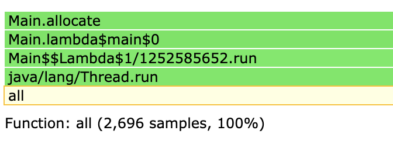

对于以JFR格式的输出，行号从`AsyncGetCallTrace` 以JFR 文件格式传输/保留。这样，我们可以使用 JDK Mission Control (JMC) 打开文件，以查看最后一帧哪些行号被解析了

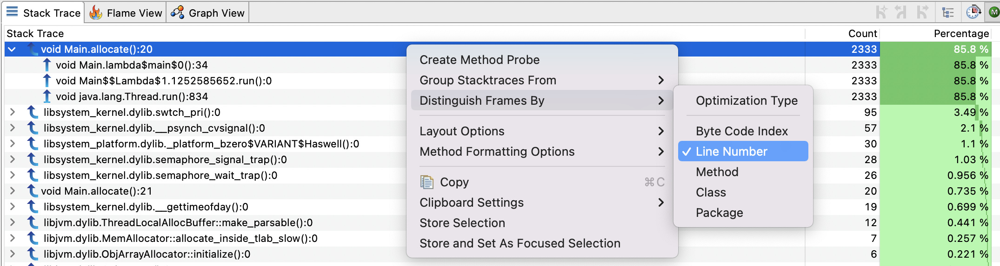

### Honest Profiler

Honest Profiler 可以使用 flat profiles 输出行号：

```
Flat Profile (by line):
	(t  2.6,s  2.6) Profile::noLoopBench @ (bci=291,line=140)
	(t  2.6,s  2.6) Profile::noLoopBench @ (bci=607,line=164)
	(t  2.5,s  2.5) Profile::noLoopBench @ (bci=212,line=134)
	(t  2.5,s  2.5) Profile::noLoopBench @ (bci=370,line=146)
	(t  2.5,s  2.5) Profile::noLoopBench @ (bci=449,line=152)
	(t  2.5,s  2.5) Profile::noLoopBench @ (bci=537,line=159)
	(t  2.5,s  2.5) Profile::noLoopBench @ (bci=181,line=132)
	(t  2.5,s  2.5) Profile::noLoopBench @ (bci=142,line=129)
	(t  2.4,s  2.4) Profile::noLoopBench @ (bci=339,line=144)
	(t  2.4,s  2.4) Profile::noLoopBench @ (bci=528,line=158)
	(t  2.4,s  2.4) Profile::noLoopBench @ (bci=133,line=128)
	(t  2.3,s  2.3) Profile::noLoopBench @ (bci=300,line=141)
	(t  2.3,s  2.3) Profile::noLoopBench @ (bci=616,line=165)
	(t  2.3,s  2.3) Profile::noLoopBench @ (bci=102,line=126)
	(t  2.3,s  2.3) Profile::noLoopBench @ (bci=497,line=156)
	(t  2.3,s  2.3) Profile::noLoopBench @ (bci=260,line=138)
	(t  2.2,s  2.2) Profile::noLoopBench @ (bci=221,line=135)
	(t  2.2,s  2.2) Profile::noLoopBench @ (bci=458,line=153)
	(t  2.2,s  2.2) Profile::noLoopBench @ (bci=576,line=162)
	(t  2.2,s  2.2) Profile::noLoopBench @ (bci=379,line=147)
```

### JFR

所记录的格式允许为每一帧存储行号信息或字节码索引，在 JMC 中您可以通过行号进行区分。如果您有一个对同一方法有多次调用的方法，这很有用。如果没有行号信息，则更难以关联到代码

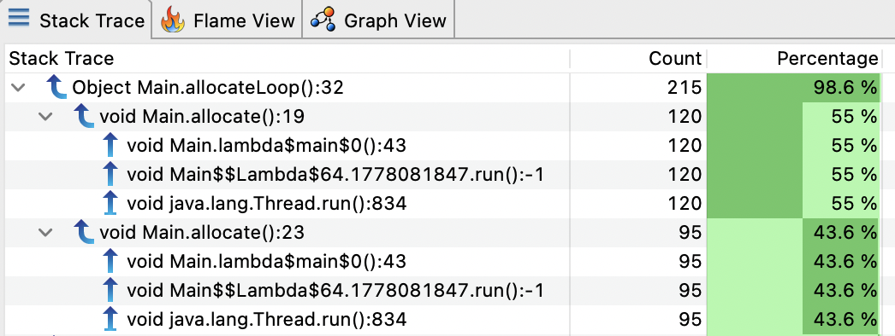

### 调试信息和安全点

默认情况下，调试信息由发出安全点的 JIT 记录，例如在调用方法时，这便于为异常构建堆栈跟踪。但是，在使用`AsyncGetCallTrace`的采样分析手段时，如果我们想用调试信息解析最后一帧，我们需要寻找附近的安全点。当 JVM 发现当前 PC 处于 Java 栈帧中时，它会尝试通过`CompiledMethod::pc_desc_at()`方法获取到真正的调试信息（调用PCDesc），这些方法是从[这里](https://github.com/openjdk/jdk/blob/affbd72aa3dce80e2ad54ff775c6f7469f38b05b/src/hotspot/share/prims/forte.cpp#L157)

被调用以帮助`AsyncGetCallTrace`执行的。如果找不到`PCDesc`，然后，它将尝试通过搜索方法的末尾来找到最近的“below”，并使用`CompiledMethod::pc_desc_near()`,它是从[这里]([jdk/forte.cpp at affbd72aa3dce80e2ad54ff775c6f7469f38b05b · openjdk/jdk (github.com)](https://github.com/openjdk/jdk/blob/affbd72aa3dce80e2ad54ff775c6f7469f38b05b/src/hotspot/share/prims/forte.cpp#L171))调用被调用以帮助`AsyncGetCallTrace`执行和 [这里](https://jpbempel.github.io/2022/06/22/[https://github.com/openjdk/jdk/blob/master/src/hotspot/share/jfr/periodic/sampling/jfrCallTrace.cpp#L74](https://github.com/openjdk/jdk/blob/affbd72aa3dce80e2ad54ff775c6f7469f38b05b/src/hotspot/share/jfr/periodic/sampling/jfrCallTrace.cpp#L74))被调用以帮助执行JFR

为了演示这种行为，让我们举一个构造出来的例子：

```
L117 public static int noLoopBench(int idx) {
L118     int res = idx * idx;
         res += (idx % 7) + idx * 31;
	 res -= (idx * 53) % 13 - idx;
	 res += idx * 1003 - (idx * 13 % 7);
	 res += (idx % 19) + idx * 37;
	 res -= (idx * 71) % 7 - idx;
	 res += idx * 97 - (idx * 53 % 29);
	 res += (idx % 7) + idx * 31;
	 res -= (idx * 53) % 13 - idx;
	 // ... skip for brevity ...
	 res += idx * 1003 - (idx * 13 % 7);
	 res += (idx % 19) + idx * 37;
	 res -= (idx * 71) % 7 - idx;
	 res += idx * 97 - (idx * 53 % 29);
L167	 return res;
    }
```

完整代码在 [这里](https://gist.github.com/jpbempel/b40e5081b98d9021116f845d8adf0be1)

我们通过将分析器attach到正在运行的程序上，使用带有 JFR 输出的 Async-Profiler 分析此方法：

```
java Profile &
./profiler.sh -d 30 -e itimer -o jfr -f profile_noLoop.jfr <pid>
```

这是它在 JMC 中的显示：

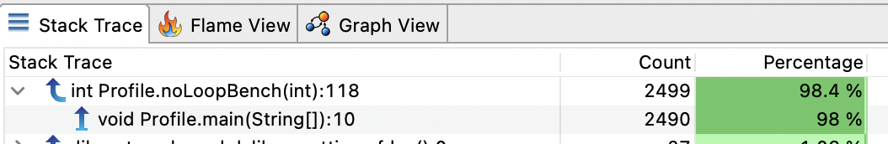

该方法几乎有 50 行长，但在几乎所有采样中我们只有第一行的信息。整个方法没有生成调试信息（没有安全点），除了在入口处。在这种情况下，我们所期望的是采样在方法的所有行中的均匀分布。但取而代之的是，当采样时，会找到最近的安全点，并使用与之关联的调试信息解析符号。

现在让我们尝试另一个带有循环的示例：

```
L72 public static int loopsBench(int idx) {
L73     int res = 0;
	for (int i = 0; i < 5; i++) {
	    dst[i] = buffer[i];
	}
	res += dst[buffer.length-1] == 1 ? buffer[0] : buffer[1];
	for (int i = 0; i < 5; i++) {
	    dst[i] = buffer[i];
	}
	res += dst[buffer.length-1] == 1 ? buffer[0] : buffer[1];
	for (int i = 0; i < 5; i++) {
	    dst[i] = buffer[i];
	}
	// ... skip for brevity ...
	res += dst[buffer.length-1] == 1 ? buffer[0] : buffer[1];
L114	return res;
    }
```

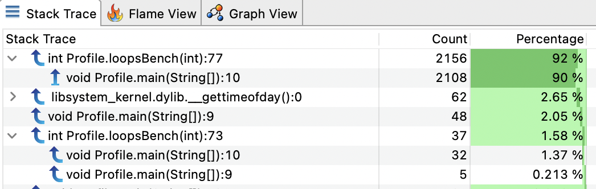

仅报告了 2 行（73 和 77）。但在我们的示例中，循环实际上是由 JIT 专门处理的[有限循环优化](http://psy-lob-saw.blogspot.com/2015/12/safepoints.html)，即不会发出安全点。让我们尝试使用`long`循环：

```
L72 public static int loopsBench(int idx) {
L73     int res = 0;
	for (long i = 0; i < 5; i++) {
	    dst[(int)i] = buffer[(int)i];
	}
	res += dst[buffer.length-1] == 1 ? buffer[0] : buffer[1];
	for (long i = 0; i < 5; i++) {
	    dst[(int)i] = buffer[(int)i];
	}
	res += dst[buffer.length-1] == 1 ? buffer[0] : buffer[1];
	for (long i = 0; i < 5; i++) {
	    dst[(int)i] = buffer[(int)i];
	}
	// ... skip for brevity ...
	res += dst[buffer.length-1] == 1 ? buffer[0] : buffer[1];
L114	return res;
    }
```

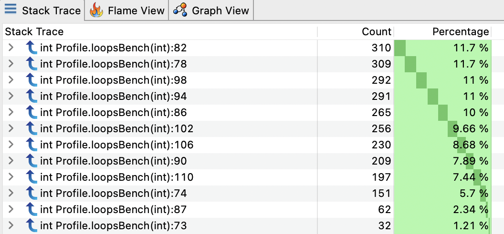

现在我们有了整个方法的分布良好的采样！但是内联呢？

我还制作了一个示例，其中包含 3 种不同的内联小方法：

```
  public static int inlinedBench(int idx) {
L28     int res = 0;
        res += compute1(idx);
        res += compute1(res);
        res += compute1(res);
        res += compute1(res);
        res += compute1(res);
        res += compute1(res);
        res += compute1(res);
        res += compute1(res);
        res += compute1(res);
        res += compute1(res);
        res += compute1(res);
        res += compute1(res);
        res += compute1(res);
        res += compute1(res);
        res += compute1(res);
        res += compute1(res);
        res += compute1(res);
        res += compute1(res);
        res += compute1(res);
        res += compute1(res);
        res += compute1(res);
        res += compute1(res);
        res += compute1(res);
        res += compute1(res);
        res += compute1(res);
        res += compute1(res);
        res += compute1(res);
        res += compute1(res);
        return res;
    }

    private static int compute1(int value) {
L61     return (value % 7) + value * 31 + compute2(value);
    }

    private static int compute2(int value) {
L65     return (value * 53) % 13 - value + compute3(value);
    }

    private static int compute3(int value) {
L69     return value * 1003 - (value * 13 % 7);
    }

```

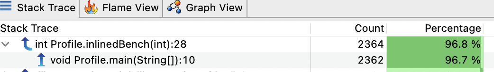

仅报告一行，因此内联方法时不会发出安全点。

如果我们禁用内联：

```
java -XX:-Inline Profile
```

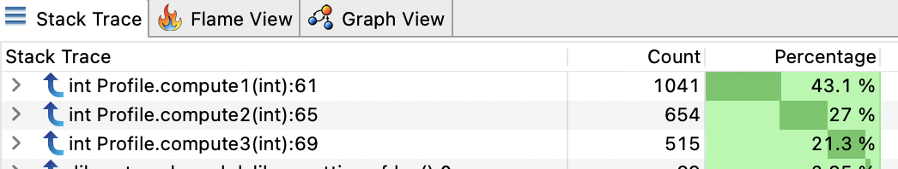

我们找到了我们的`computeX`方法，如果我们展开一个节点：

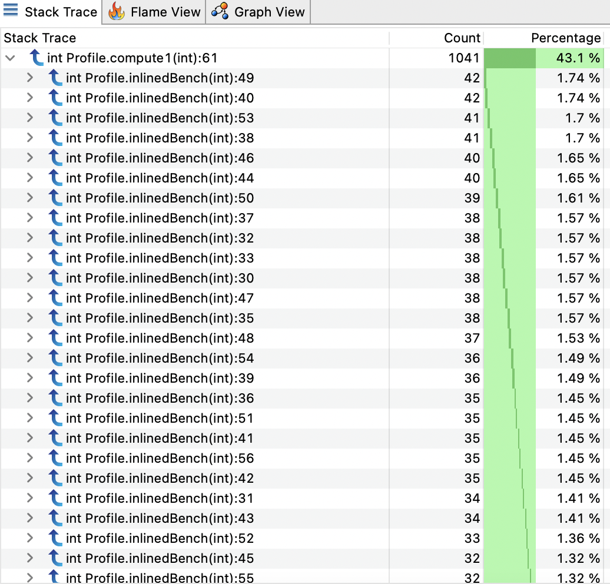

样本现在分布在整个`inlinedBench`方法中。

## 调试非安全点

有一个有趣的标志可以稍微修改上述行为：`-XX:+UnlockDiagnosticVMOptions -XX:+DebugNonSafepoints`. 即使 PC 不在安全点，此标志也会激活有关 PC 的更多调试信息的记录。这意味着我们可以为堆栈跟踪提供更精确的位置。调试信息越多，行号分辨率的样本就越精确。

让我们用我们的第一个例子来试试这个标志：

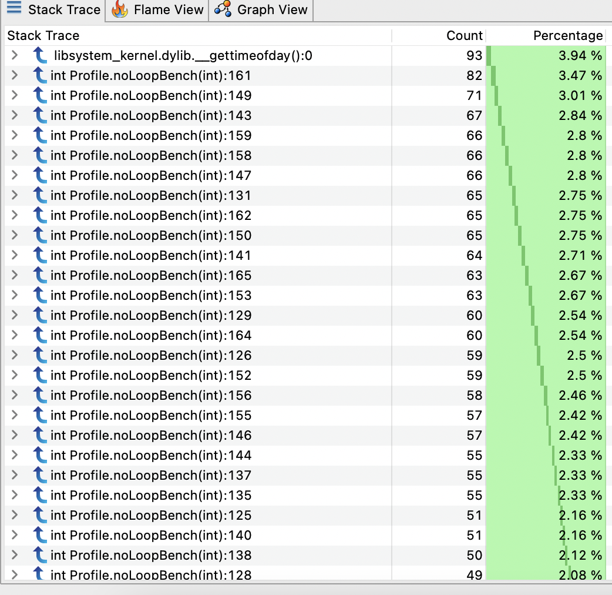

现在我们有更多的样本分布在`noLoopBench`方法中。

内联呢？

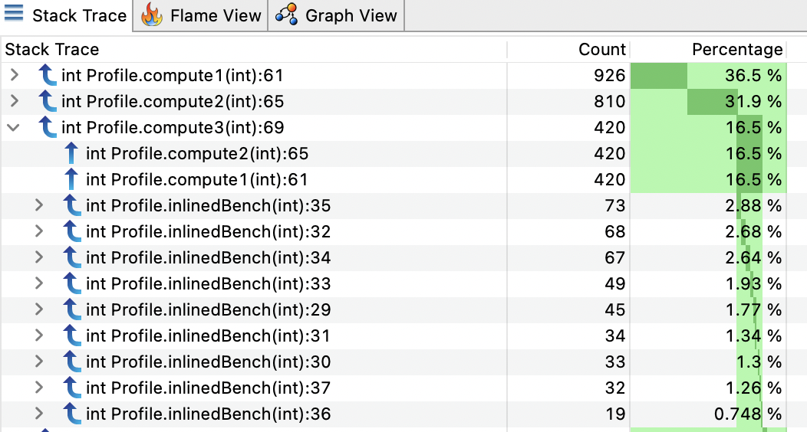

现在我们有了关于内联方法的所有信息以及调用它们的行号。

## 自动激活 DebugNonSafepoint

我们看到有一个 JVM 标志可以在没有安全点的情况下启用调试信息，但也有 2 种情况下`DebugNonSafepoint`会被自动激活：

- [JVMTI](https://github.com/openjdk/jdk/blob/a113e166e91b9b3d3f74a284888a5135b48dad44/src/hotspot/share/code/debugInfoRec.cpp#L107-L113)
- [PrintAssembly](https://github.com/openjdk/jdk/blob/a113e166e91b9b3d3f74a284888a5135b48dad44/src/hotspot/share/runtime/arguments.cpp#L4157-L4160) or [CompileCommand](https://github.com/openjdk/jdk/blob/a113e166e91b9b3d3f74a284888a5135b48dad44/src/hotspot/share/compiler/compilerDirectives.cpp#L109-L112)

### JVMTI

如果 JVMTI   agent 注册了回调`CompiledMethodLoad`，则该标志将被激活。Async-Profiler 在[这里](https://github.com/jvm-profiling-tools/async-profiler/blob/master/src/profiler.h#L222-L228)注册的回调。Honest Profiler 也在[这里](https://github.com/jvm-profiling-tools/honest-profiler/blob/8a3a2ef206968476b89ac0b9184f0bbd0c6bd2e3/src/main/cpp/agent.cpp#L31-L36)做了相似的事情

如果您在命令行上使用这些 JVMTI agent启动 JVM （`-agentpath:profiler.so`），这个标志将从一开始就被激活，并且所有编译的方法将在安全点之外生成调试信息。但是，如果您将agent附加到正在运行的实例上，则标志将仅在附加时开启。然后，只有新编译的方法才会适配该标志，并且已经编译的方法仍然只有安全点的调试信息。

### PrintAssembly/CompileCommand

如果要打印方法的汇编代码，它还将激活标志以获得更多有用的汇编信息以匹配字节码/行号。

### JFR

JFR 默认不激活`DebugNonSafepoint`。您必须手动启用它。这是[JFR doc](https://docs.oracle.com/javacomponents/jmc-5-5/jfr-runtime-guide/about.htm#JFRRT112)在某个时候推荐的。

## 性能影响

我已将`noLoopBench`方法代码放入带有和不带有`DebugNonSafepoint`标志的 JMH 基准测试中，发现没有显着差异。

```
Benchmark                          Mode  Cnt    Score   Error  Units
MyBenchmark.testDebugNonSafepoint  avgt   25  156.209 ± 1.711  ns/op
MyBenchmark.testDefault            avgt   25  159.069 ± 2.260  ns/op
```

标志只会在 JIT 编译时生成更多调试信息（映射 PC -> BCI -> 行号）是有意义的。它只会消耗更多的本机内存用于存储，但不会影响应用程序的运行时性能。

关于使用`DebugNonSafepoint`有一些注意事项。我们可能有关于在安全点之外的堆栈跟踪的信息。但是，这并不意味着在分析工具报告出来的方法执行时间会更精确。请参阅[JDK-8201516](https://bugs.openjdk.java.net/browse/JDK-8201516)和[JDK-8281677](https://bugs.openjdk.java.net/browse/JDK-8281677)。

## 结论

即使使用`AsyncGetCallTrace`或类似技术的新分析器不偏向于收集堆栈跟踪的安全点，但最后一帧的解析仍然偏向于记录的调试信息。默认情况下，它们处于安全点！这就是为什么那些分析器试图尽快激活标志`DebugNonSafepoint`以获得更精确的解析结果。我认为即使在生产中也始终激活标志没有问题，但需要注意本机内存消耗。它将帮助您在生产中持续进行分析。

## 参考

- [The Pros and Cons of AsyncGetCallTrace Profilers](http://psy-lob-saw.blogspot.com/2016/06/the-pros-and-cons-of-agct.html) by [Nitsan Wakart](https://twitter.com/nitsanw)
- [Safepoints: Meaning, Side Effects and Overheads](http://psy-lob-saw.blogspot.com/2015/12/safepoints.html) by [Nitsan Wakart](https://twitter.com/nitsanw)
- [Why (Most) Sampling Java Profilers Are Fucking Terrible](http://psy-lob-saw.blogspot.com/2016/02/why-most-sampling-java-profilers-are.html) by [Nitsan Wakart](https://twitter.com/nitsanw)
- [How Inlined Code Makes For Confusing Profiles](http://psy-lob-saw.blogspot.com/2018/07/how-inlined-code-confusing-profiles.html) by [Nitsan Wakart](https://twitter.com/nitsanw)
- [Honest profiler](https://github.com/jvm-profiling-tools/honest-profiler)
- [Async-Profiler](https://github.com/jvm-profiling-tools/async-profiler)
- [JDK-8201516](https://bugs.openjdk.java.net/browse/JDK-8201516)
- [JDK-8281677](https://bugs.openjdk.java.net/browse/JDK-8281677)

多谢 [Christophe Nasarre](https://twitter.com/chnasarre), [Marucs Hirt](https://twitter.com/hirt) & [Nitsan Wakart](https://twitter.com/nitsanw)的review