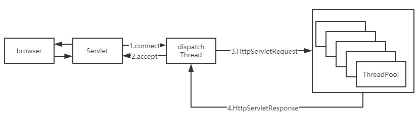
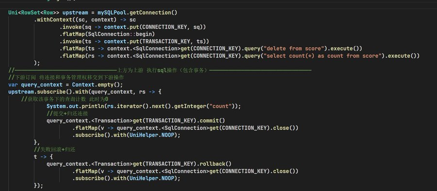
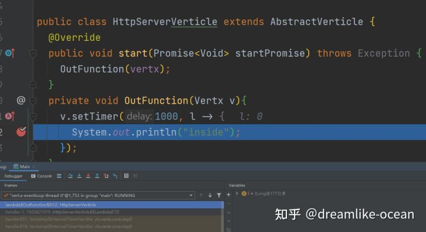
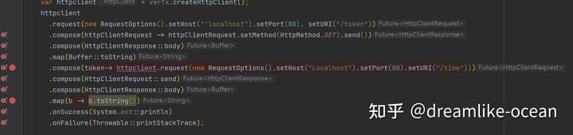
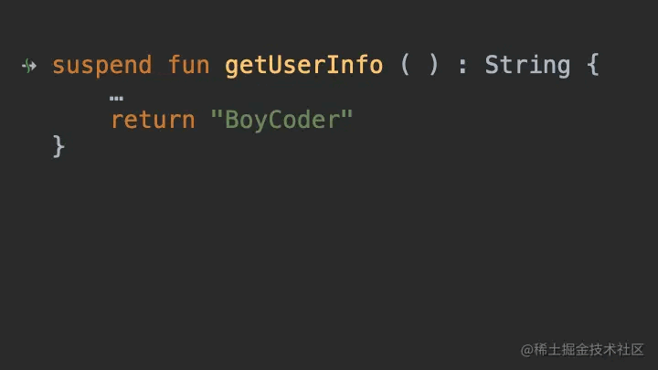
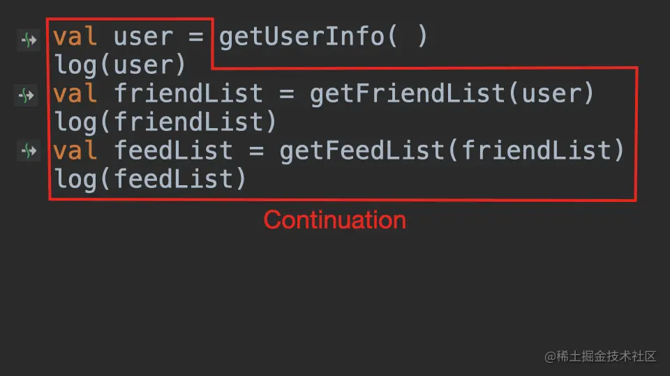
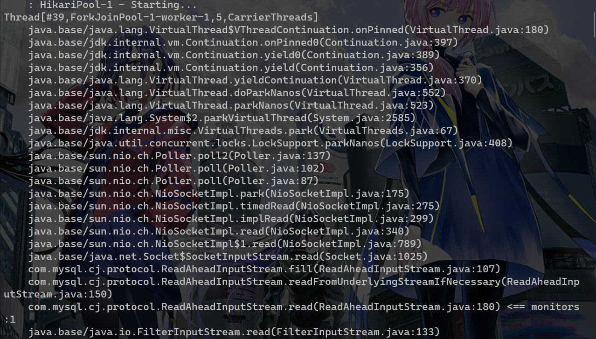

## 旧有的servlet生态的线程模型

首先我们先要聊一聊现在我们用的最多的servlet的执行模型是什么：

这个dispatch其实就是一个EventLoop或者说是一个selector来检测注册到其上的链接状态发生的变化

以Tomcat为例子，当这个selector发现存在一个链接可读时，就会封装一个读取和后续处理的操作丢到worker线程中执行，在大部分情况下请求的读取和写出都是绑定到一个线程的，这里我们不讨论很细节的实现，只需要稍微理解一下线程模型即可。



即我们可以发现HttpRequest的生命周期可以用ThreadLocal来代表，不会存在同一个线程交错处理多个请求的情况（排除servlet3.1引入的async-request api情况，这个我想大部分人也不太会使用）

再结合我们经常使用的client的实现来思考，比如基于socket api的bio实现的jdbc，哪怕是本质是非阻塞也要封装出同步接口的lettuce或者okhttp3，这些client我们在使用时会阻塞住当前的线程。此时为了继续对外提供服务就需要继续加线程，就导致了一个普通的springboot服务有时候甚至会使用数百个内核线程在不停的切换，大量的内核线程带来了什么结果？内存占用高，大量的上下文切换导致的性能下降（cache miss之类的），高昂的锁代价，浪费的CPU时钟资源。

我们只能这样做吗？显然不是，我们来看看其他的语言是怎么做的。Go,node.js之类的的兴起，让更多的开发者发现我们其实只需要少量的内核线程就可以支撑起原来上百线程的并发能力。事实证明，在web这种无状态的，IO用时较多的程序类型只要用少量的（n个cup核心数的线程数目）就可以达成我们的全部需要。

## 如何在jdk8的情况下弥补这一切？

总结一下需求，我们需要一个框架可以当io未完毕时线程可以切换走执行其他的任务，等完毕后再执行后续的事情

其实用少量线程支持大量并发的技术栈早已出现，甚至我们在自己部门的仓库里面也能看到这个技术——响应式技术栈，比如说Spring WebFlux，Vert.x，Quarkus

从下图看vertx的综合benchmark非常的强


[后端框架benchmark](https://www.techempower.com/benchmarks/#section=data-r21&test=composite)

以Vert.x为例子，他的代码风格是这样的 本质上就Future套Future，将异步操作串联在一起

```Java
private void addOrder(Router router){
        router.post(prefix)
                .handler(AccessBaseSessionHandler.createLeastMode(Roles.USER))
                .handler(BodyHandler.create())
                .handler(ValidationJsonHandler.create(OrderVO.class))
                .handler(rc -> {
                    LoginUserPO loginUserPO = rc.session().get(UserController.userKeyInSession);
                    OrderVO orderVO = rc.get(ValidationJsonHandler.VALUE_KEY);
                    orderService.addNewOrder(orderVO,loginUserPO.getUserId())
                            .map(v -> ResponseEntity.success(orderVO.getOrderId(),200).toJson())
                            .onSuccess(rs -> rc.response().end(rs))
                            .onFailure(rc::fail);
                });
    }
public Future<OrderPO> getOrderByOrderId(Long orderId){
    return mySQLPool.getConnection()
      .compose(sc -> SqlTemplate.forQuery(sc,"SELECT * FROM `order` WHERE order_id=#{id}").mapTo(OrderPORowMapper.INSTANCE).execute(Map.of("id",orderId)).onComplete(ar -> sc.close()))
      .flatMap(rs -> rs.size() == 0 ? Future.failedFuture("无此单号"):Future.succeededFuture(rs.iterator().next()));
    }
```

在这份代码里面数据库操作的返回值是Future，这难道是我们通过把jdbc操作丢到线程池中跑吗？仔细思考一下 如果是这样那么显然我们既没有减少阻塞时间，也没有降低线程开销。这个地方实际上是利用netty按照对应数据库的协议写出了一个新的响应式的数据库访问client。因此这里没有任何的线程在阻塞，即DB处理时间长的瓶颈并不会阻碍我们处理新的请求。相关的可以看看这两个https://r2dbc.io/ https://vertx.io/docs/#databases

思考这样一个情况，我们的httpclient，db client，redis client全是异步实现而且他们公用同一组线程作为Eventloop，那么这一套异步工具集下来是不是可以有效地提高我们的吞吐量？事实上，golang的协程网络库就是类似于这样。

## 性能好就代表一切吗？或者响应式存在什么问题

从C10K角度来看，nio确实是一个很好的解决方案，Tomcat底层也是基于nio，但是为什么到业务处理层我们还是同步的呢？或者说为什么业务层不也使用异步响应式思想呢？

我这里给出一个比较常见的响应式操作，开启事务然后查询最后回滚



### 堆栈

首先响应式是基于事件的，在api的表现上就是write(buffer,callbcak)，一旦业务复杂起来回调地狱势必会出现，哪怕我们将其用promise/future改造也只是将回调打平了而已其实没有解决实际问题，同时回调还存在一个问题——会丢失大量堆栈信息，仅仅保留那些被捕获进来的状态。

这一点很好理解，当你给这个一时半会没法完成的IO事件挂一个回调后，程序此时就执行完了OutFunction函数，因此退栈了，等他的IO完成后发现有个事件该执行了（runnable.run）就去执行，此时原来的栈已经推掉了，你没法在回调的堆栈里面看到原来的stack trace了



我们丢失了堆栈即意味着丢失了函数的嵌套关系，就很难找到到底是谁调用了这个函数，是哪一个放置了回调，这一点在出问题要排查时是非常致命的

ps：你仔细观察栈顶的函数名，实际上我们可以通过生成的lambda名来找一找，不过这是特殊情况了

再比如说思考这样一个代码

当第二行出现问题时，我没法从堆栈的信息里面获取到前后的操作详情

```Java
future.map(l -> {})
      .flatmap(l -> {})
```

### 调试

请看如下的代码



一旦回调嵌套回调出现问题你很难去了解函数之间的调用关系，这一点对debug是致命的缺陷，因此你在idea里面debug的时候不得不把有先后关系的回调里面打满断点然后利用执行到断点的方式去debug，而不能打一个断点向下执行

### 生态兼容性

这里直接给一个结论，完全无法无缝兼容。

首先是线程模型完全不一致


请求A到达服务器，解析后开始处理业务逻辑，该查数据库了，此时向数据库发送请求，由于数据库 client是非阻塞异步的，此时请求A对应的数据库响应还未返回没有触发后续事件，相当于请求A被“挂 起”了，此时[eventloop](https://www.zhihu.com/search?q=eventloop&search_source=Entity&hybrid_search_source=Entity&hybrid_search_extra={"sourceType"%3A"answer"%2C"sourceId"%3A2284269112})就可以接收请求B，一直执行到请求数据库，若此时请求A的数据库响应已经到达 则触发了后续事件，eventloop再“恢复”请求A的处理直到写出请求A的响应 类似于一种交错处理，在每一个异步点挂起当前的请求（异步点就是那些需要发起异步方法的，比如请 求一个远端数据，或者线程池跑一个长时间任务，差不多就是一个方法返回future就是[异步方法](https://www.zhihu.com/search?q=异步方法&search_source=Entity&hybrid_search_source=Entity&hybrid_search_extra={"sourceType"%3A"answer"%2C"sourceId"%3A2284269112})） 此时不同的任务交替跑在java线程上面，此时ThreadLocal就失效了，MDC这种依赖于ThreadLocal的就完全没办法使用了。

即我们建立在单线程处理情况假设上的一些无侵入传参生态就完全失败了

而为他带来性能提升的核心准则——不要阻塞事件循环——同时也使其与原有的同步生态隔离开来，这是两套完全不同的代码风格，这是很难以共存的，我们只能去复用很少一部分java的第三方包生态 很多中间件的SDK需要重写。这就是java后端性能提升的面对的问题，或许你用netty再加上graalvm aot支持可以建立一个性能很不错的网关，但是你用那些去写业务，很多东西都需要从0开始做起，这一点就是很多人提到的维护性问题。我已经不止一次看到有些同学在回调中直接去调用一个阻塞api了。

### 概念众多且不便于书写

基于回调进行处理，其实类似于人肉进行cps变换，开发的便利性就会急剧下降。而从控制流角度来看，你想象一下，你调用多个异步操作，是不是从你的主控制流fork出来多个并发控制流？这些多出来的控制流是不太可控的，如果这些fork出来的控制流也会fork出新的控制流呢？如果此时还涉及到资源的释放呢？（请参考结构化并发）

比如说onSuccess，OnFailure这种函数就是在模拟if..else,recoverWith模拟try..catch，在命令式代码中都很好书写，但是一旦开始用函数来模拟就非常难以理解和掌控了。本来若我们自己掌控不住代码还可以通过静态分析工具来帮助我们，但是切换到响应式模式，主流的静态分析工具也没法发挥作用。

有一些库不只是简单的的回调便利化，还引入了一堆比较学院派的概念来模拟更多的结构，比如说project reactor，reactiveX，Mutiny！等，你需要理解各种稀奇古怪的操作符，上下游等概念才能比较有把握的去写出正确代码。我并不否认这些库在被压，容错中的优雅实现，但是我们的原则应该是用20%的理解就可以应对80%的代码，实际上这些库带来了很大的理解成本。

## kotlin是不是可以来拯救世界呢？

众所周知，kotlin号称better java，同样也是我最喜欢的jvm语言，它有个重量级特性——coroutine，我们都知道go的goroutine实际上是一种runtime提供的功能，jvm显然没有对应的功能，kotlin-coroutine实际上是一种语法糖——CPS变化的语法糖，即一种无栈协程的实现

看这个代码，全程都是同步的 甚至可以try..catch..

```Kotlin
  suspend fun selectMessageRecordBySender(senderId:Int):List<MessageRecord>{
    try{
      val connection = pool.connection.await()
      
      val res = SqlTemplate.forQuery(connection,"SELECT * FROM message_record WHERE sender = #{sender}")
        .collecting(MessageRecord.collector)
        .execute(mapOf("sender" to senderId))
        .await()
       return res.value()
    }catch(t : Throwable){
        throw wrap(t)
    }
  }
```

甚至在idea里面可以串行的形式断点调试 https://kotlinlang.org/docs/debug-coroutines-with-idea.html#debug-coroutines

是不是感觉 这就是最终结果了？响应式框架+kt coroutine就可以完全胜任任务了？

错了！我们先来看看他的原理

### 堆栈？

首先`suspend` 的本质，就是 `CallBack`。



等等continuation 又是什么？它就是代表程序剩下的部分



实际上来讲它等价于

```Kotlin
getUserInfo(new CallBack() {
    @Overridepublic void onSuccess(String user) {
        if (user != null) {
            System.out.println(user);
            getFriendList(user, new CallBack() {
                @Overridepublic void onSuccess(String friendList) {
                    if (friendList != null) {
                        System.out.println(friendList);
                        getFeedList(friendList, new CallBack() {
                            @Overridepublic void onSuccess(String feed) {
                                if (feed != null) {
                                    System.out.println(feed);
                                }
                            }
                        });
                    }
                }
            });
        }
    }
});
```

这些是编译器帮我们做的脏活而已，其本质还是回调，因此我们之前的问题还是没有解决——堆栈还是会丢失

### 染色？

接着就是另外的问题了，suspend函数只能被suspend函数调用，也就是说它具有传染性，一直到顶层都需要是suspend的函数，然后相当于污染了整条调用链路，如果一门新语言，从标准库到上层，都是全 suspend 的还好一点，但是对于有些历史包袱的语言，有些库已经是非 suspend 的，这个染色的处理就很难受。

同时Future也是这个问题，所有返回的值不再是一个普通的值了，而是一个 Future，需要用 map 函数解出来。一层一层往上染色，整个调用链路都变成 Future 的。

简单来说kt只是解决了表面的异步转同步的问题，而非解决核心问题

## 触手可及但是不够好的未来——loom

这些响应式api被创造出来不是因为它们更容易编写和理解，甚至它们实际上更难以弄明白;不是因为它们更容易调试或分析——甚至会更困难(它们甚至不会产生有意义的堆栈跟踪);并不是因为他们的代码结合比同步的api好——他们的结合不那么优雅;不是因为它们更适合语言中的其他部分，或者与现有代码集成得很好，而是因为并行性的软件单元——线程——的实现从内存和性能的角度来看是不够的。由于抽象的运行时性能问题，一个好的、自然的抽象被抛弃，而倾向于一个不那么自然的抽象，这是一个可悲的现状。

为了改变这一切，Project loom——即将在jdk19 preview的特性（2022年7月24日）——为jvm提供以少数内核线程支持海量用户态线程的有栈协程实现。

### 它解决了什么问题？

通过引入runtime支持的Continuation结构，重写网络库并且提供java.lang.Thread的子类VitrualThread，做到了只要简单替换线程池实现就可以获得类似于go但是是协作式的用户态线程的能力，没有函数染色的副作用，从而直接解决了生态不兼容的问题，同时也给予了旧有代码升级最小化改动的帮助。

从前我们需要自己手写EventLoop，费劲地重新实现一遍协议解析只是为了提供更好的性能条件来做迁移，现在 只要开启一个虚拟线程 就像是goalng写一个go关键字一样简单（甚至于你可以用kotlin模拟出一个go关键字[goroutine.kt](https://github.com/dreamlike-ocean/codepieces/blob/main/goroutine.kt)），旧有生态的bio原地从阻塞内核线程升级到阻塞用户态线程，再也不需要开那么多内核线程来处理并发了。

```Java
Thread.startVirtualThread(() -> {
    System.out.println("Hello, Loom!");
});
```

Thread::currentThread，LockSupport::park,LockSupport::unpark，Thread::sleep，也对此做了适配,这意味着我们那些基于J.U.C包的并发工具仍旧可以使用。

羡慕go的channel？J.U.C的BlockingQueue作为对标完全没有问题

关键要点：

- 虚拟线程就是`Thread`——无论是在代码中，runtime中，调试器中还是在profiler中

- 虚拟线程不是对内核线程的包装，而是一个Java实例

- 创建一个虚拟线程是非常廉价的，——您可以拥有数百万个并且无需池化它

- 阻塞一个虚拟线程是非常廉价的，——您可以随意使用同步代码

- 无需在编程语言层面做任何更改

- 可插拔的调度器可以为异步编程提供更好的灵活性

等等？为异步编程提供更好的灵活性？loom能为异步编程做什么？

只要简单为它写个封装器就可以方便地在同步生态里面使用异步代码，轻松异步转同步而无需引入其他的库，甚至相对于原有的异步操作开火车，这种性能损耗非常少——而且堆栈连续。

```Java
public Future<String> asyncFunction(){...}
public String asyncFunctionWrapper(){
    var t = Thread.currentThead();
    var f = asyncFunction.onComplete(v -> LockSupport.unpark(t));
    LockSupport.park(t);
    if(f.success()) return f.get();
    throw f.cause();
}
//运行在虚拟线程中
public void fun(){
   var s = asyncFunctionWrapper();
   var s1 = asyncFunctionWrapper();
}
```

### 不够好是什么意思？

先引入一个loom中的概念。pin

如果虚拟线程被挂载到载体线程上，且处于无法卸载的状态，我们就说它被“pin”到它的载体线程上。如果一个虚拟线程在pin时阻塞了，它就阻塞了它的载体。这种行为仍然是正确的，但是在虚拟线程阻塞期间，它会持有工作线程，使得其他虚拟线程无法使用它。

在当前的Loom实现中，虚拟线程可以被固定在两种情况下:当堆栈上有一个本机帧时——当Java代码调用本机代码(JNI)，然后调用回Java时——以及在一个`sychronized`块或方法中。在这些情况下，阻塞虚拟线程将阻塞承载它的物理线程。一旦本机调用完成或监视器释放(`synchronized`块/方法退出)，线程就被解除锁定。

那我不用不就好了？而且原来的网络IO中的`sychronized`也被重写了，这有什么问题？

来看一个我们经常使用的jdbc的实现——MySQL-connectorJ的堆栈检测。

com.mysql.cj开头的堆栈的栈底有一个sychronized关键字加持的方法以防止多个线程读取同一个socket，因此在这里我们的线程就pin住了需要等待IO结束，这样又退回到原来的内核线程实现了



除了jdbc，spring内嵌的Tomcat也有这个问题 

```Java
Thread[#44,ForkJoinPool-1-worker-1,5,CarrierThreads]
   ....
    com.example.demo.DemoApplication.hello(DemoApplication.java:37)
    java.base/jdk.internal.reflect.DirectMethodHandleAccessor.invoke(DirectMethodHandleAccessor.java:104)
    java.base/java.lang.reflect.Method.invoke(Method.java:578)
    org.apache.tomcat.util.net.SocketProcessorBase.run(SocketProcessorBase.java:49) <== monitors:1
   .....
```

java的有栈协程非常美好 很可惜当前的应用无法无缝迁移，这一点就是为什么我说loom是触手可及但是不够好

加点私货：Tomcat这个确实有解决方法 参考[Project Loom与SpringBoot - 掘金](https://juejin.cn/post/6985495980560875528)我的这篇文章

## 总结

我现在可以回答题目的问题了 我借用官方文档的一句话来说——

[Project Loom](https://wiki.openjdk.java.net/display/loom/Main) aims to drastically reduce the effort of writing, maintaining, and observing high-throughput concurrent applications that make the best use of available hardware.

Project Loom旨在大幅减少编写、维护和观察高吞吐量并发应用程序的工作量，以便于充分利用可用硬件

## 相关资料阅读

[JEP 425: Virtual Threads (Preview)](https://openjdk.org/jeps/425)

[Project Loom: Java虚拟机的纤程和计算续体](https://zhuanlan.zhihu.com/p/390988145)

[loom的java层面的实现_哔哩哔哩_bilibili](https://www.bilibili.com/video/BV1M34y157Qu?spm_id_from=333.999.0.0)

[What Color is Your Function?](https://journal.stuffwithstuff.com/2015/02/01/what-color-is-your-function/)