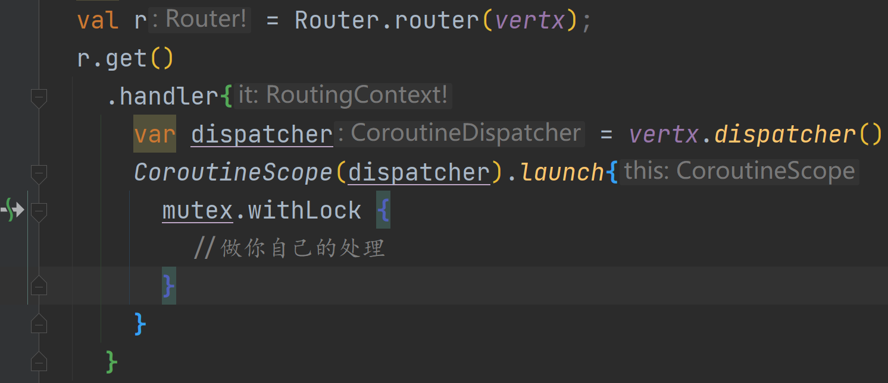
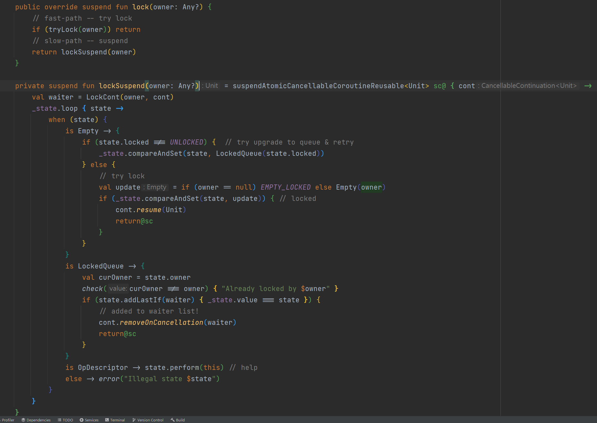
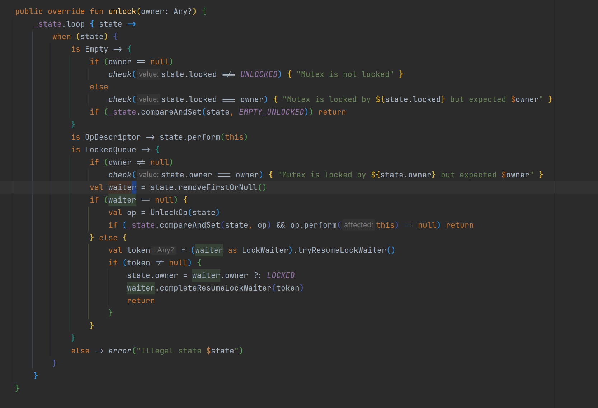
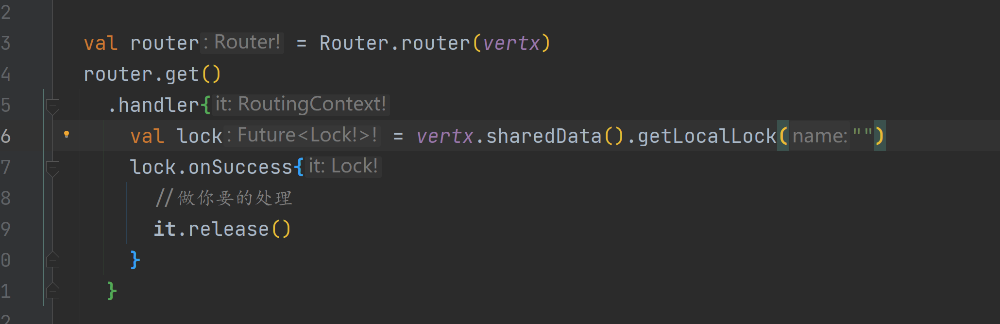
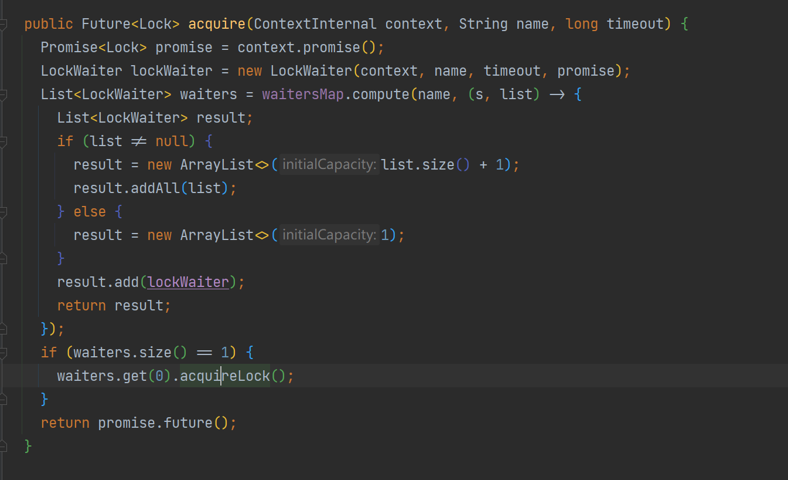
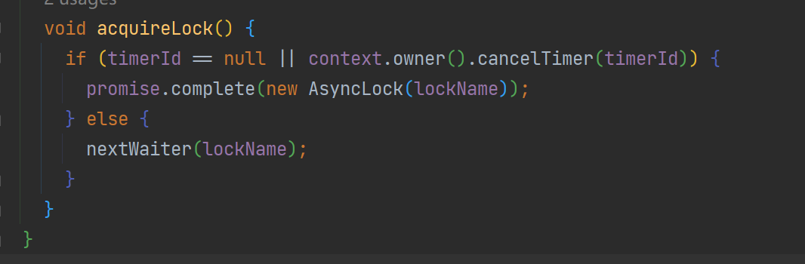

# 响应式的锁

由于响应式技术栈基本都是基于eventloop的，而对于当前（2022年5月18日）java的并发模型都是基于内核线程进行建模的，多个请求并发跑在同一个线程上导致了synchronized 和J.U.C包的锁不再适用

而并发中锁又是必须的，那么我们该怎么办？

#### kotlin 协程锁

以当前eventloop作为调度器驱动多个无栈协程，为每一个请求分配一个协程即可

本质上这种并不会阻塞住当前的内核线程，而是”阻塞“当前协程，实际上就是当前协程通过cas抢到锁之后来处理自己的业务，此时其他抢不到的阻塞等待调度，锁持有者协程放锁时恢复等待的协程执行



实际原理很简单：

cas看看能不能拿到 不能拿到把当前的continuation封装到waiter里面 等待resume



而unlock方法则是取出第一个等待的waiter节点，然后恢复其中的continuation执行就行了



#### vertx的异步锁



实际上就是通过 ConcurrentMap#compute的原子特性直接加入等待队列





若发现当前队列没有竞争者则直接获取到锁，触发future回调

而释放锁的release则是这样的

```java
    @Override
    public void release() {
      if (invoked.compareAndSet(false, true)) {
        nextWaiter(lockName);
      }
    }
private void nextWaiter(String lockName) {
    List<LockWaiter> waiters = waitersMap.compute(lockName, (s, list) -> {
      return list == null || list.size() == 1 ? null : new ArrayList<>(list.subList(1, list.size()));
    });
    if (waiters != null) {
      waiters.get(0).acquireLock();
    }
  }
```

直接让下一个等待者获取到锁即可

#### java的loom

如果我还是想用juc这种lock怎么办？

那么我们就可以使用project loom（jdk19将preview），将当前的eventloop或者其他的线程池作为有栈协程的调度器，由于loom带来的virtualthread（协程）是Thread的子类，且LockSupport类也对其有适配，阻塞虚拟线程而不是内核线程

```kotlin
val router = Router.router(vertx)
val lock = ReentrantLock()
  router.get()
    .handler{
      Thread.startVirtualThread {
        lock.lock()
        try {
          //做你要的处理
        }finally {
            lock.unlock()
        }
      }
    }
```

然后我们来看看LockSupport#park方法 相当于从当前的内核线程上卸载这个协程 然后换一个协程来执行

```java
 public static void park(Object blocker) {
        Thread t = Thread.currentThread();
        setBlocker(t, blocker);
        try {
            if (t.isVirtual()) {
                VirtualThreads.park();
            } else {
                U.park(false, 0L);
            }
        } finally {
            setBlocker(t, null);
        }
    }
private void doPark() {
        // complete immediately if parking permit available or interrupted
        if (getAndSetParkPermit(false) || interrupted)
            return;

        // park the thread
        setState(PARKING);
        try {
            if (!yieldContinuation()) {
                // park on the carrier thread when pinned
                parkOnCarrierThread(false, 0);
            }
        } finally {
            assert (Thread.currentThread() == this) && (state() == RUNNING);
        }
    }
private boolean yieldContinuation() {
        boolean notifyJvmti = notifyJvmtiEvents;

        // unmount
        if (notifyJvmti) notifyJvmtiUnmountBegin(false);
        unmount();
        try {
            return Continuation.yield(VTHREAD_SCOPE);
        } finally {
            // re-mount
            mount();
            if (notifyJvmti) notifyJvmtiMountEnd(false);
        }
    }
```

