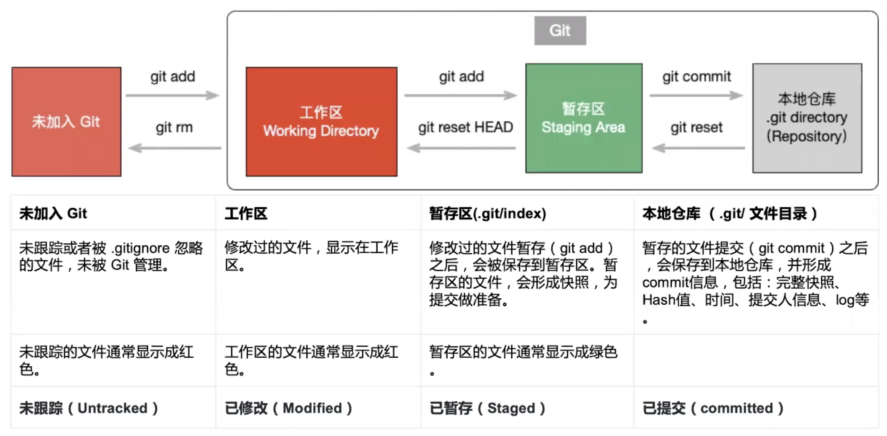
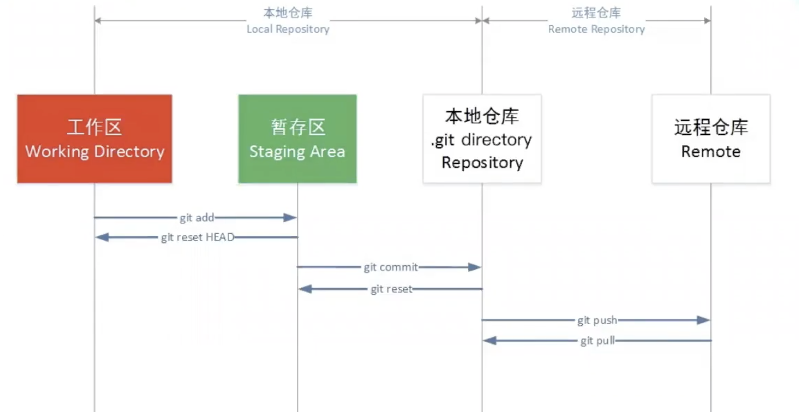
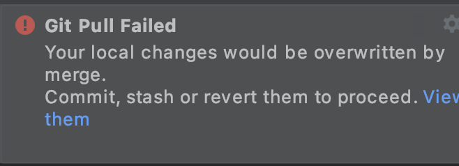

Git使用教程

强烈建议走一遍

[git入门小游戏](https://learngitbranching.js.org/?locale=zh_CN)

# 前言

实际上你需要粗略阅读一下就可以了 大部分情况下我的IDE可以帮助你轻松管理

**不存在CMD和GUI哪个高贵的问题，解决问题最重要**

# Git安装和配置

自己搜吧。。。。Windows的同学建议使用wsl1+git

# Git本地仓库

Git本地仓库包括 Git 工作区、暂存区和版本库：

下面这个图展示了工作区、版本库中的暂存区和库之间的关系：

- **工作区：**就是你在电脑里能看到的目录。（我们平时写代码空间就是工作区）
- **暂存区：**英文叫 stage 或 index。一般存放在 **.git** 目录下的 index 文件（.git/index）中，所以我们把暂存区有时也叫作索引（index）。（当我们写完一部分代码可以使用**git add**将文件提交到暂存区，暂存区起到一个**快照**的作用，当出现重大错误操作时，可以通过回退**git reset**回退到错误发生之前的版本）

Git简单的回退操作：https://blog.csdn.net/kikajack/article/details/79846098

- **版本库：**工作区有一个隐藏目录 **.git**，这个不算工作区，而是 Git 的版本库。（版本库是代码的本地仓库，保存代码的所有信息，其实本地仓库和远程仓库一样，只是一个在本地，一个在服务器上）

**注意Git工作区、暂存区和版本库之间的Git指令，先看一下，下面会详细讲解，2-3节建议看完下面git操作指令再回来消化一遍**

# Git远程仓库

远程仓库相当于本地仓库的克隆库

**注意Git本地仓库和远程仓库之间的Git指令，先看一下，下面会详细讲解，2-3节建议看完下面git操作指令再回来消化一边**

# Git基本操作

**常用指令：git add、git commit、git pull、git push，git reset。**其他的稍微记一下就行，不懂的随用随查，GUI也可以

| **Git****仓库创建**             | git init                                                     | 在当前目录创建一个Git仓库                                    |
| ------------------------------- | ------------------------------------------------------------ | ------------------------------------------------------------ |
| git init <projectName>          | 新建一个目录，在目录下创建Git代码库                          |                                                              |
| **克隆已有仓库**                | git clone <url>                                              | 拷贝一份远程仓库，也就是下载一个项目。                       |
| **添加修改文件**                | git add <file1]> <file2> ...                                 | 添加指定文件到**暂存区**                                     |
| git add <dir>                   | 添加指定目录的所有文件到**暂存区**                           |                                                              |
| git  add -A 或git add -all      | 添加所有文件到**暂存区**                                     |                                                              |
| git add .                       | 添加当前目录的所有文件到**暂存区**                           |                                                              |
| **删除文件**                    | git rm <file>                                                | 删除工作区文件。                                             |
| **比较文件**                    | git diff                                                     | 比较文件的不同，即暂存区和工作区的差异。（主要用于解决冲突） |
| **提交文件**                    | git  commit                                                  | 提交暂存区到本地仓库。相当于git commit -a，提交所有更改      |
| git commit -m "msg"             | 提交暂存区所有文件到本地仓库,并添加本次提交的备注信息。      |                                                              |
| git commit <file1> ... -m <msg> | 提交指定文件到本地仓库,并添加本次提交的备注信息。            |                                                              |
| git commit --amend -m <msg>     | 如果代码没有任何新变化，则用来改写上一次commit的备注信息     |                                                              |
| **回退版本（撤销）**            | git reset                                                    | 回退版本。只回退暂存区,工作区保持不变                        |
| git reset <file>                | 重置暂存区的指定文件，git d与上一次commit保持一致，但工作区不变 |                                                              |
| git reset --hard                | 重置暂存区与工作区，与上一次commit保持一致                   |                                                              |
| **移动/重命名文件**             | git mv                                                       | 移动或重命名工作区文件。                                     |
| **查看历史**                    | git log                                                      | 查看历史提交记录（即当前分支的版本历史）                     |
| **远程仓库操作**                | git remote                                                   | 远程仓库操作（不详述，我没用过）                             |
| **拉取远程代码库**              | git fetch                                                    | 从远程获取代码库                                             |
| git pull                        | 从远程获取代码库并合并（相当于git fetch+git merge）          |                                                              |
| **提交代码**                    | git push                                                     | 上传本地代码库至远程并合并                                   |

1. # 分支管理

| **创建分支**     | git branch <branchname>         | 创建分支branchname                     |
| ---------------- | ------------------------------- | -------------------------------------- |
| **查看分支**     | git branch                      | 查看本地分支                           |
| git branch -a    | 查看所有分支（本地+远程）       |                                        |
| git branch -r    | 查看远程分支                    |                                        |
| **删除分支**     | git branch -d <branchname>      | 删除分支branchname                     |
|                  | git checkout <branchname>       | 切换分支branchname                     |
| **切换分支**     | git checkout -b <branchname>    | 创建并切换分支branchname               |
| **合并分支**     | git merge <branchname>          | 将分支branchname合并到当前分支         |
| **查看分支状态** | git status                      | 查看分支当前的状态，显示有变更的文件。 |
| **删除远程分支** | git push origin -d <branchname> | 删除远程分支                           |

# 常见Git场景

### 拉取远程代码

日常开发过程中，由于并行开发，我们可能要用到别人的最新代码，所以经常要拉取代码

- **操作：git mmit +git pull**

如果你 有代码修改，在执行**git** **pull**之前一定要先执行**git commit**，否则可能会出错。 

建议在每一个**git** **pull**操作之前都执行**git commit**，不要硬拉代码，除非你没有对代码进行任何的修改。如果你**git** **pull**一个全新的代码仓库就不需要**git commit** （没有修改，不需要合并）

或者参考[git stash解决git pull和本地文件的冲突_danxibaoxxx的博客-CSDN博客_git pull stash](https://blog.csdn.net/danxibaoxxx/article/details/81280499) 使用git stash暂存一下commit

### 提交本地代码

**操作：git commit + git pull + git push**

**git** **commit** 将新的代码提交到本地仓库 （提交代码之前一定将代码先**git commit**到本地仓库，否则代码提交不到远程仓库）

**git** **pull** 拉取远程代码，并将远程代码与本地代码合并（每次push代码之前都要进行**git pull，**防止**git push**时代码冲突

**git** **push** 提交本地仓库到远程仓库

在**git** **push**之前一定要，一定要先**git** **pull**最新代码到本地仓库，防止代码冲突。远程仓库没有处理代码冲突的功能，将代码拉取到本地仓库，处理完代码冲突再**git push**代码到远程仓库。

### **合并本地分支**

**操作：git checkout + git merge**

**git** **checkout  <branch1>**  切换到branch1分支

**git** **merge  <branch2>** 将<branchname2>合并到<branch1>

### 创建分支并推送到远程

**git** **checkout -b branch1**  //在当前分支下创建branch1的本地分支

**git** **push origin branch1** //将branch1分支推送到远程

**git** **branch --set-upstream-to=origin/branch1** //将本地分支branch1关联到远程分支branch1上   

### 回退公共远程分支

使用**git** **reset**回退远程分支需要两个人分别操作，比较麻烦，可以使用**git revert**撤销自己的一次commit。参照[Git恢复之前版本的两种方法reset、revert（图文详解）](https://blog.csdn.net/yxlshk/article/details/79944535)

### Pull Request和Merge Request

[Pull Request 与 Merge Request 的区别](https://github.com/brickspert/blog/issues/37)

[Git开发--git merge request 步骤](https://blog.csdn.net/qq_33829154/article/details/81364047?utm_medium=distribute.pc_relevant_t0.none-task-blog-2~default~BlogCommendFromMachineLearnPai2~default-1.base&depth_1-utm_source=distribute.pc_relevant_t0.none-task-blog-2~default~BlogCommendFromMachineLearnPai2~default-1.base)

个人理解：Merge Request主要用于远程分支的合并，而**git** **merge**用于本地分支的合并

### git merge和git rebase合并分支的区别

注意：git merge 之前最好把目标分支和自己的分支git pull一下

### 代码回滚（回退工作区、暂存区、本地分支、远程分支）

[git撤销和回操作](https://blog.csdn.net/jaryle/article/details/109643356?utm_medium=distribute.pc_relevant.none-task-blog-2~default~baidujs_title~default-0.essearch_pc_relevant&spm=1001.2101.3001.4242)

### 合并某次commit到指定分支

[git cherry-pick](https://www.ruanyifeng.com/blog/2020/04/git-cherry-pick.html)

使用场景：当别人的代码出现bug时，他的bugfix代码合并到develop需要很长的时间，这时可以向他要一个bugfix的commit，把这个commit合并到自己的分支就可以啦。

