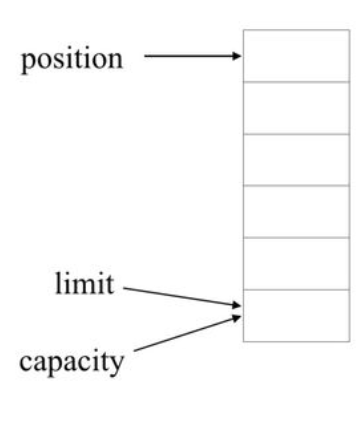
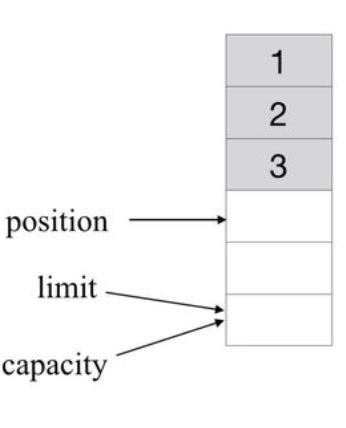
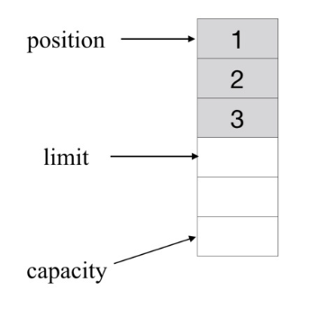
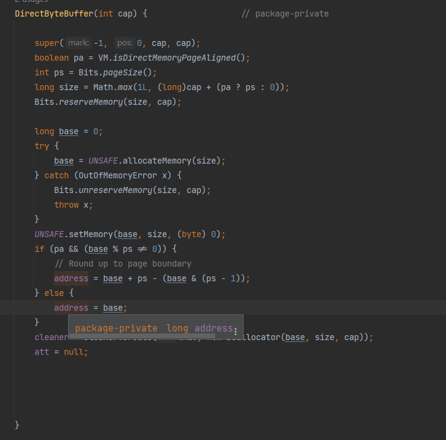
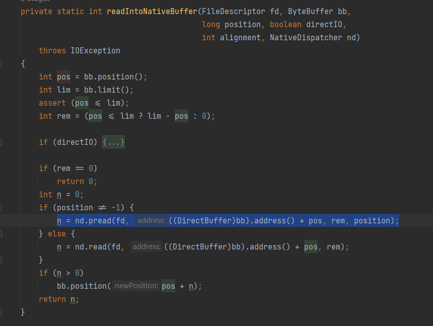
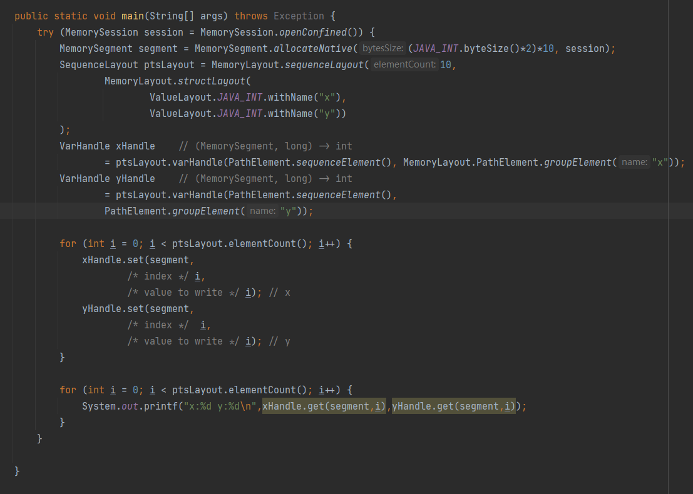

# ByteBuffer和native内存

> 若没有提及则默认给出的代码来自于[AdoptOpenJDK/openjdk-jdk11(github.com)](https://github.com/AdoptOpenJDK/openjdk-jdk11)

正如我在[其他小册](FileChannel.md)中提到的一样,为了减少不必要的内存拷贝，比如说我需要从磁盘读取一个文件然后输送到socket中，就没必要经过堆内，而是共享同一份堆外内存即可，这样减少了不必要的内存拷贝，同时为了方便*channel这些类的api并且屏蔽堆内堆外操作api的不同，就封装出来了一套ByteBuffer的api。


### java层

#### api总介绍

首先介绍一下它的主要api：

- 读取和写入单个byte的绝对位置和相对位置get和put方法；以get举例子其方法签名为`byte get()`,`byte get(int index)`

- 将连续字节序列批量从此ByteBuffer传输到数组中的相对位置的get方法 其方法签名为 `ByteBuffer get(byte[] dst, int offset, int length)`

- 将字节数组或其ByteBuffer中的连续字节序列批量传输到此缓冲区的相对位置put方法；其方法签名为`ByteBuffer put(ByteBuffer src)`

- 读取和写入其他原始类型值到绝对位置和相对位置get和put方法，以特定字节顺序（byte order 就是大小端）将它们转换为字节序列或从字节序列转换到对应值；以long举例子的签名为`long getLong()`,`ByteBuffer putLong(long value)`

- 创建视图的方法，允许将ByteBuffer视为包含其他原始类型值的ByteBuffer;`IntBuffer asIntBuffer()`

- 压缩ByteBuffer的方法`ByteBuffer compact()` 这个压缩不是指使用压缩算法对其进行压缩以减小体积，而是，比如说buffer以及读取了了4个字节，调用compact就是将[4,length)范围的数据拷贝到开头

  zsd

#### 代码实例

  实际上来讲，它提供的api无论是申请堆外还是堆内，你只会得到一个ByteBuffer类型的引用，所以这两种类型的使用方式是通用的

  ```java
  ByteBuffer buffer = ByteBuffer.allocate(1024); //堆内
  ByteBuffer direct = ByteBuffer.allocateDirect(1024); //堆外
  // 注意allocateDirect返回的是DirectByteBuffer实例，为了兼容性请不要做类型转换获取
  //DirectByteBuffer的引用类型
   public static ByteBuffer allocateDirect(int capacity) {
          return new DirectByteBuffer(capacity);
  }
  ```

**接下来的代码api可能会非常复杂，但是别担心，不是你的问题**。

我们先来认识一下它的五个属性：

- mark：记录了当前所标记的索引下标；
- position：对于写入模式，表示当前可写入数据的下标，对于读取模式，表示接下来可以读取的数据的下标；
- limit：对于写入模式，表示当前可以写入的数组大小，默认为数组的最大长度，对于读取模式，表示当前最多可以读取的数据的位置下标；
- capacity：表示当前数组的容量大小；
- array：保存了当前写入的数据。（只有使用ByteBuffer.allocate获取的才支持这个）

然后你可以通过调用flip方法来切换模式

##### flip limit position capacity

参考代码如下

```java
 ByteBuffer buffer = ByteBuffer.allocate(6);
    print(buffer);  // 初始状态：position: 0, limit: 6, capacity: 6

    // 往buffer中写入3个字节的数据
    buffer.put((byte) 1);
    buffer.put((byte) 2);
    buffer.put((byte) 3);
    print(buffer);  // 写入之后的状态：position: 3, limit: 6, capacity: 6

    System.out.println("************** after flip **************");
    buffer.flip();
    print(buffer);  // 切换为读取模式之后的状态：position: 0, limit: 3, capacity: 6

    buffer.get();
    buffer.get();
    print(buffer);
```

这里最终的主要是position，limit和capacity三个属性，因为对于写入和读取模式，这三个属性的表示的含义大不一样。讲述比较复杂，我们直接看图



然后写入三个字节之后



从图中可以看出，在写入模式下，limit指向的始终是当前可最多写入的数组索引下标，position指向的则是下一个可以写入的数据的索引位置，而capacity则始终不会变化，即为数组大小。

flip一下的则变成



可以看到，当切换为读取模式之后，limit则指向了最后一个可读取数据的下一个位置，表示最多可读取的数据；position则指向了数组的初始位置，表示下一个可读取的数据的位置；capacity还是表示数组的最大容量

##### mark

等等 是不是还有一个属性没讲？mark是做什么的

这个属性是一个标识的作用，即记录当前position的位置，在后续如果调用reset()或者flip()方法时，ByteBuffer的position就会被重置到mark所记录的位置。因而对于写入模式，在mark()并reset()后，将会回到mark记录的可以写入数据的位置；对于读取模式，在mark()并reset()后，将会回到mark记录的可以读取的数据的位置。

```java
ByteBuffer buffer = ByteBuffer.allocate(6);
    // position: 0, limit: 6, capacity: 6

    buffer.put((byte) 1);
    buffer.put((byte) 2);
    buffer.put((byte) 3);
    // position: 3, limit: 6, capacity: 6

    buffer.mark();  // 写入三个字节数据后进行标记
    // position: 3, limit: 6, capacity: 6

    buffer.put((byte) 4); // 再次写入一个字节数据
    // position: 4, limit: 6, capacity: 6

    buffer.reset(); // 对buffer进行重置，此时将恢复到Mark时的状态
    // position: 3, limit: 6, capacity: 6

    buffer.flip();  // 切换为读取模式，此时有三个数据可供读取
    // position: 0, limit: 3, capacity: 6

    buffer.get(); // 读取一个字节数据之后进行标记
    buffer.mark();
    // position: 1, limit: 3, capacity: 6

    buffer.get(); // 继续读取一个字节数据
    // position: 2, limit: 3, capacity: 6

    buffer.reset(); // 进行重置之后，将会恢复到mark的状态
    // position: 1, limit: 3, capacity: 6
```

##### rewind

对于rewind()方法，它的主要作用在于将当前的position重置为0，并且mark重置为-1，而且无论mark是否进行过标记。

##### compact

对于compact()方法，其主要作用在于在读取模式下进行数据压缩，并且方便下一步继续写入数据。比如在一个长度为6的ByteBuffer中写满了数据，然后在读取模式下读取了三个数据之后，我们想继续往buffer中写入数据，此时由于只有前三个字节是可用的，而后三个字节是有效的数据，此时如果写入的话是会把后面三个有效字节给覆盖掉的。因而需要将后面三个有效字节往前移动，以空出三个字节，并且将position指向下一个可供写入的位置，而不是迁移之后的索引0处。

```java
ByteBuffer buffer = ByteBuffer.allocate(6);
    buffer.put((byte) 1);
    buffer.put((byte) 2);
    buffer.put((byte) 3);
    buffer.put((byte) 4);
    buffer.put((byte) 5);
    buffer.put((byte) 6); // 初始化一个写满的buffer

    buffer.flip();
    // position: 0, limit: 6, capacity: 6  -- 切换为读取模式

    buffer.get();
    buffer.get();
    // position: 2, limit: 6, capacity: 6  -- 读取两个字节后，还剩余四个字节

    buffer.compact();
    // position: 4, limit: 6, capacity: 6  -- 进行压缩之后将从第五个字节开始

    buffer.put((byte) 7);
    // position: 5, limit: 6, capacity: 6  -- 写入一个字节数据的状态
```

#### allocate和allocateDirect区别

很简单 前者在分配到堆上 后者分配到堆外，前者实际上就是byte[] 后者则是一个表现为一个long类型字段的堆外指针

由于我们之前提到的GC等问题，实际上前者分配出来ByteBuffer在与IO交互的时候还是需要进行拷贝的，以FileChannel::read方法的实现来说明


#### 回收问题

DirectByteBuffer我分配了堆外内存，这块内存又不归GC管，也没有暴露出release或者free方法，如果需要释放该怎么办？

不用管，它注册了一个Cleaner，在这个堆内实例不可达的时候自然会触发对应的逻辑来回收

我给出一个精简后的构造器方法，省去对理解无关紧要的部分来看核心代码

```java
DirectByteBuffer(int cap) {                   // package-private
      base = UNSAFE.allocateMemory(size);
      UNSAFE.setMemory(base, size, (byte) 0);
      cleaner = Cleaner.create(this, new Deallocator(base, size, cap));
}
 private static class Deallocator
        implements Runnable
    {

        private long address;

        public void run() {
            if (address == 0) {
                // Paranoia
                return;
            }
            UNSAFE.freeMemory(address);
            address = 0;
            Bits.unreserveMemory(size, capacity);
        }

    }
```

实际上被回收时就会回调到这个run方法上面去释放。

有兴趣的同学建议自己看看源码，我这里直接给出实现的核心逻辑

利用PhantomReference内部再做一个链表，gc的时候把对应引用挂到链表上，有一个线程在处理挂在链表上面的回调

#### 总结

是不是很复杂 乱七八糟的一堆api？我们抛开这些api，思考一下我们在c语言中是怎么操作内存的？

```c
char * c = malloc(sizeof(char)*10)
c[1] = 1;
free(c);
```

很简单的写法，实际上我们的DirectByteBuffer各种api就是在模拟这种写法，但是封装的过于奇怪，非常难用。而且依赖于GC做出清理，没有办法手动释放（实际上可以通过类型转换或者反射直接free但是因为jdk不断增强内部封装所以不推荐这么做），导致了内存的延迟释放。

要不为什么会有[JEP 424: Foreign Function & Memory API (Preview) (java.net)](https://openjdk.java.net/jeps/424)这个jep。

实际上我们如果不去造网络库，实际上是不用与这个api打交道的，如果需要去使用网络库我推荐使用netty，它的bytebuf的设计比jdk原生的好太多。

如果你想进行封装 可以参考我的一个简单的封装[ByteMsg](https://github.com/dreamlike-ocean/oceanet/tree/master/src/main/java/com/dreamlike/ocean/ByteMsg/Msg)

### C层

#### DirectByteBuffer

我们来看看DirectByteBuffer和FileChannel是怎么交互的

先来看看DirectByteBuffer实现 实际上就是利用Unsafe这个类申请了一块堆外内存，并且做了内存对齐操作且全部填充0，将返回的指针以long类型保存下来



实际上会调用到Unsafe::allocateMemory0,我们来看看对应的linux实现

```c
UNSAFE_ENTRY(jlong, Unsafe_AllocateMemory0(JNIEnv *env, jobject unsafe, jlong size)) {
  size_t sz = (size_t)size;

  sz = align_up(sz, HeapWordSize);
  void* x = os::malloc(sz, mtOther);

  return addr_to_java(x);
} UNSAFE_END
// os::malloc代码过长截取一部分
void* os::malloc(size_t size, MEMFLAGS memflags, const NativeCallStack& stack) {
 
  if (size == 0) {
    // return a valid pointer if size is zero
    // if NULL is returned the calling functions assume out of memory.
    size = 1;
  }

  // NMT support 本地内存追踪
  NMT_TrackingLevel level = MemTracker::tracking_level();
  size_t  nmt_header_size = MemTracker::malloc_header_size(level);
  u_char* ptr;
  //看这里
  ptr = (u_char*)::malloc(alloc_size);

  if ((intptr_t)ptr == (intptr_t)MallocCatchPtr) {
    log_warning(malloc, free)("os::malloc caught, " SIZE_FORMAT " bytes --> " PTR_FORMAT, size, p2i(ptr));
    breakpoint();
  }
  debug_only(if (paranoid) verify_memory(ptr));
  // we do not track guard memory
  return MemTracker::record_malloc((address)ptr, size, memflags, stack, level);
}
```

实际上就是malloc这个我们不能再熟悉的方法分配出来的，顺便还记录了一下这个分配事件 NMT是什么东西请看这个[Native Memory Tracking (oracle.com)](https://docs.oracle.com/javase/8/docs/technotes/guides/vm/nmt-8.html)，这里不做展开了。

这样位于Java层的DirectByteBuffer就获取到了一个代表堆外某一块内存指针的long值了

#### Filchannel

我们再来看看它与FileChannel read的交互，实际上这个read方法的实现会转发到IOUtil对应方法上面

我们直接看`IOUtil::readIntoNativeBuffer`就行了。以读取指定位置的api为例子

就是直接把DirectByteBuffer内部那个address拿出来给native层去调用 



好 我们现在看看c这边是怎么实现的

```c
#define pread64 pread
// 其对应java侧声明为static native int pread0(FileDescriptor fd, long address, int len,
//                             long position)
JNIEXPORT jint JNICALL
Java_sun_nio_ch_FileDispatcherImpl_pread0(JNIEnv *env, jclass clazz, jobject fdo,
                            jlong address, jint len, jlong offset)
{
    jint fd = fdval(env, fdo);
    void *buf = (void *)jlong_to_ptr(address);

    return convertReturnVal(env, pread64(fd, buf, len, offset), JNI_TRUE);
}

```

实际上就是[pread(2) ](https://man7.org/linux/man-pages/man2/pread.2.html)这个linux的api 就是通过申请的这段内存进行访问的

#### 总结

看完源码的核心部分，你会发现java封装了一些方法，用起来感觉奇奇怪怪的，没那没直观。而对应的C实现其实再模型上非常的流畅自然，就是指针，fd，偏移量而已。做这些封装只是为了帮助开发者远离危险的指针，避免出现指针的误操作，~~虽然确实java的api非常难用~~

### Project Panama的Memory segments *

[JEP 424: Foreign Function & Memory API (Preview) (java.net)](https://openjdk.java.net/jeps/424)

其实这个从第二次孵化器我就在用了 ，现在终于接近稳定了。这个Memory segments提供了更好用，更接近于指针的api。要想体验请先确保你有一个[JDK 19](https://jdk.java.net/19/)

#### 基础api

实际上他的实现还是unsafe.allocateMemory()  只不过封装的更好了

```java
try (MemorySession session = MemorySession.openConfined()) {
            MemorySegment segment = MemorySegment.allocateNative(1024, session);
            for (int i = 0; i < 10; i++) {
                segment.setAtIndex(ValueLayout.JAVA_INT,i,i);
            }
            for (int i = 0; i < 10; i++) {
                System.out.println(segment.getAtIndex(ValueLayout.JAVA_INT, i));
            }
 }
```

emmm，似乎看起来和ByteBuffer也差不多吧？别急 有意思的还在后面，我们先看一下这个MemorySession是什么，实际上就是对应这个资源（MemorySegment）的作用域，超过对应作用域就释放对应的堆外资源。有多种，比如说global，不允许跨线程共享的confined，允许共享的shared等。当我们调用session::close时对应绑定到这个session的native资源也会随之释放。

正如上面给出的实例，由于MemorySession实现了AutoClose接口我们就可以利用twr语法糖很轻松限制资源的生命周期(就是RAII机制了)

#### 结构体

这一个就很好用了，尤其时和native库打交道的时候，对于一块内存按某一个结构体的模式来操作，这一点是ByteBuffer很难做到的。

思考这样一个结构体 

```c
struct Point {
   int x;
   int y;
} pts[10]
```

如果按照上面的写法应该是这样写java的交互 非常的丑

```java
try (MemorySession session = MemorySession.openConfined()) {
            MemorySegment segment = MemorySegment.allocateNative((JAVA_INT.byteSize()*2)*10, session);
            for (int i = 0; i < 10; i++) {
                segment.setAtIndex(JAVA_INT,
                        /* index */ (i * 2),
                        /* value to write */ i); // x
                
                segment.setAtIndex(JAVA_INT,
                        /* index */ (i * 2) + 1,
                        /* value to write */ i); // y
            }
        }
```

但是Panama可以这样写：

~~markdown好难排版 这里给个图片吧~~



似乎代码更长了？其实不然，实际上我们只暴露出去这两个VarHandler，使用起来只需要关注两个参数pts数组下标和对应x，y的值而已，访问起来更方便了，这样就不要手动算偏移量了

同理mmap这种也是使用指针来读写文件的也得到了支持 还有和ByteBuffer的转换

```java
MemorySegment map = fileChannel.map(FileChannel.MapMode.READ_WRITE, 0, 1024, session);
segment.asByteBuffer() //注意得到的DirectByteBuffer实际上共享一个堆外指针，pos=0 lim=cap=segemnt的length
```

从我们使用的api角度大概就是这些东西

但是实际上为了确保资源的有效性围绕MemorySession做了很多工作，比如说多线程close会怎么样？

这里就需要查看ScopedMemoryAccess源码了

从单个线程访问和释放内存没有问题 - 毕竟，给定线程不能同时访问内存区域并释放它。但是在涉及多个线程时确保内存访问的正确性要棘手得多，因为可能存在一个线程正在访问内存区域而另一个线程正在释放它的情况。
当多个线程同时访问和/或释放同一内存区域时，此类提供了管理竞争的工具。更具体地说，当一个线程想要释放一个内存区域时，它应该调用MemorySessionImpl.close()方法。此方法启动与所有其他 VM 线程的线程本地握手，然后一一停止。如果发现任何线程访问与正在关闭的内存会话关联的资源，则握手失败，并且无法关闭会话。

panama做了很多工作，不只是修改了库还有jvm。

其实panama更多的工作还有摆脱jni这种难用的调用native方式，提供了完全的java层面去调用native方法，其运行效率持平jni而使用效率却比jni高很多

参考信息：

[OpenJDK: Panama (java.net)](https://openjdk.java.net/projects/panama/)

[Project Panama: Say Goodbye to JNI ](https://www.youtube.com/watch?v=4xFV-A7JToY)
