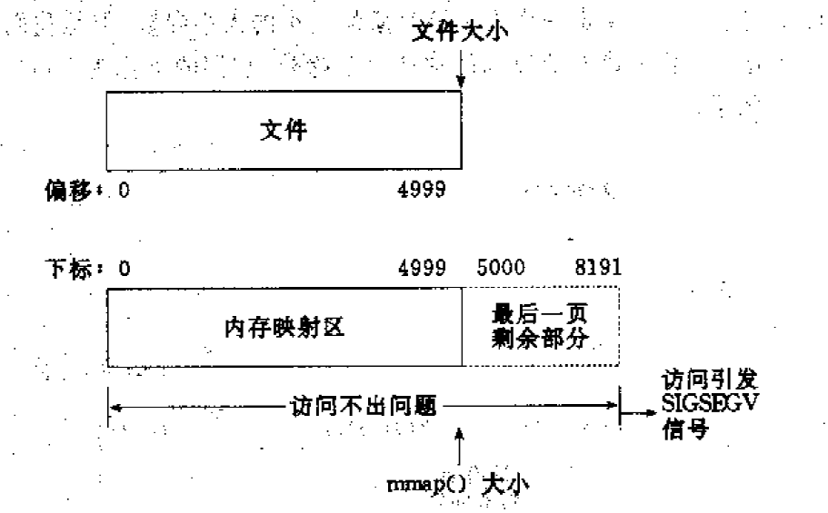
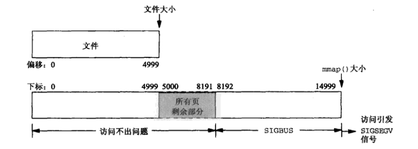

# mmap

以linux实现出发

### 名词解释

- 物理内存：即内存条的内存空间。
- 虚拟内存：计算机系统内存管理的一种技术。它使得应用程序认为它拥有连续的可用的内存（一个连续完整的地址空间），而实际上，它通常是被分隔成多个物理内存碎片，还有部分暂时存储在外部磁盘存储器上，在需要时进行数据交换。 举个例子，你获取某一个对象的地址，这个地址其实反应的就是它的虚拟内存地址，我们使用这个地址时会由操作系统帮助我们正确地转换为物理地址，它帮助我们实际上扩大了内存容量且给进程一个自己占用全部内存的”假象“
- 内存映射：即建立虚拟内存到物理内存的映射，默认情况下不同进程的内存映射表是不一样的
- 内存页：对于文件系统的交互，内存访问等均基于某一个大小，比如说linux默认一口气从磁盘读4K作为一页，即操作必须基于整数页数，你使用read原语读取一个字节也会导致直接读取一页到内存
- 页面文件：操作系统反映构建并使用虚拟内存的硬盘空间大小而创建的文件，在windows下，即pagefile.sys文件，其存在意味着物理内存被占满后，将暂时不用的数据移动到硬盘上。
- MMC：CPU的内存管理单元。
- 缺页中断：当程序试图访问已映射在虚拟地址空间中但未被加载至物理内存的一个分页时，由MMC发出的中断。如果操作系统判断此次访问是有效的，则尝试将相关的页从虚拟内存文件中载入物理内存。
- COW：~~操作系统提供一头奶牛~~ 其实COW是“copy on write”的缩写，指的是一种惰性拷贝的手段，写入时复制（英语：Copy-on-write，简称COW）是一种计算机程序设计领域的优化策略。其核心思想是，如果有多个调用者（callers）同时请求相同资源（如内存或磁盘上的数据存储），他们会共同获取相同的指针指向相同的资源，直到某个调用者试图修改资源的内容时，系统才会真正复制一份专用副本（private copy）给该调用者，而其他调用者所见到的最初的资源仍然保持不变。 
- mmap：Memory Mapped 内存映射，这个系统调用适用于把linux文件（linux文件不只是文件）和设备映射到内存中。
- SIGSECV：是当一个进程执行了一个无效的内存引用，或发生[段错误](https://baike.baidu.com/item/段错误/7896410)时发送给它的信号。简单来说就是访问了无效的内存

我们试想一个常见的场景 你使用了malloc申请了一块内存，返回一个指针值为0x12345678 这个值其实就是代表一个虚拟内存的地址，此时还未建立到物理内存的映射，当我们开始 *p = 13时才正式分配物理内存，为了映射内存此时就会发生一个缺页中断，这个时候才是真正建立了物理内存的映射。

### mmap

太长不看版：**你可以利用mmap函数返回值获取的指针，像操作一个byte[]一样自由读写这一段映射出来的文件（在合法范围内，后面讲）**


mmap是一种内存映射文件的方法，即将一个文件或者其它对象映射到进程的地址空间，实现文件磁盘地址和进程虚拟地址空间中一段虚拟地址的一一对映关系。实现这样的映射关系后，进程就可以采用**指针**的方式读写操作这一段内存，而系统会自动回写脏页面到对应的文件磁盘上，即完成了对文件的操作而不必再调用read,write等系统调用函数。相反，内核空间对这段区域的修改也直接反映用户空间，从而可以实现不同进程间的文件共享。如下图所示：


请注意mmap是惰性的，在没有访问对应页的情况下其实并没有触发从磁盘读取的操作

### 使用

#### MappedByteBuffer

这个其实和ByteBuffer都一样，操作起来是一样的

本质上就是DirectByteBuffer，想起来也很正常吧 DirectByteBuffer简化一下就是某个区域的指针+长度

mmap也是利用指针如同访问内存一样访问文件

#### READ_ONLY

见名知意 只读模式

```java
public static void read_mmap(){
        File file = new File("temp.txt");
        try(FileChannel read_channel = FileChannel.open(file.toPath(), StandardOpenOption.READ))
        {
            MappedByteBuffer buffer = read_channel.map(FileChannel.MapMode.READ_ONLY, 0, file.length());
            byte[] bytes = new byte[(int) file.length()];
            buffer.get(bytes);
            //读取
            System.out.println(new String(bytes));

        } catch (IOException e){
            e.printStackTrace();
        }
    }
```

### READ_WRITE

```java
public static void write_mmap(){
        File file = new File("temp.txt");
        try(FileChannel write_channel = FileChannel.open(file.toPath(), StandardOpenOption.READ,StandardOpenOption.WRITE))
        {
            long length = file.length();
            var append = "\n 追加啊".getBytes(StandardCharsets.UTF_8);
            System.out.println(file.length());

            MappedByteBuffer buffer = read_channel.map(FileChannel.MapMode.READ_WRITE, 0, length +append.length);
            //注意mmap之后file的length会发生改变
            System.out.println(file.length());
            buffer.put((int) length, append);
            System.out.println(file.length());
            //对应filechannel的概念差不多 刷盘
            buffer.force();
        } catch (IOException e){
            e.printStackTrace();
        }
    }
```

### PRIVATE

前两种模式的mmap实际上是跨进程共享的 

比如说进程A,B都映射了同一个文件，A追加了一个字节，B就能立刻看到这个字节的追加

而PRIVATE则见名知意 当前进程映射的mmap是私有的，他的修改并不会反映到对应文件中也不会被其他进程发现

简单来说：建立一个写入时拷贝的私有映射。内存区域的写入不会影响到原文件。这个标志和以上标志是互斥的，只能使用其中一个

```java
File file = new File("temp.txt");
        try(FileChannel read_channel = FileChannel.open(file.toPath(), StandardOpenOption.READ,StandardOpenOption.WRITE))
        {
            long length = file.length();
            var append = "\n 追加啊".getBytes(StandardCharsets.UTF_8);
            System.out.println(file.length());

            MappedByteBuffer buffer = read_channel.map(FileChannel.MapMode.PRIVATE, 0, length);
            //注意mmap之后file的length会发生改变
            System.out.println(file.length());
            buffer.put((int) length, append);
            System.out.println(file.length());
            buffer.force();
        } catch (IOException e){
            e.printStackTrace();
        }
```

### 优点：

先来看下用户进程调用read()在Linux中是怎样实现的。比如要读取磁盘上某个文件的8192个字节数据，那么这8192个字节会首先拷贝到内存中作为[page cache](https://zhuanlan.zhihu.com/p/68071761)（方便以后快速读取），然后再从page cache拷贝到用户指定的buffer中，也就是说，在数据已经加载到page cache后，还需要一次内存拷贝操作和一次系统调用

如果使用mmap()，则在磁盘数据加载到内存后，用户进程可以通过指针操作直接读写内存，不再需要系统调用和内存拷贝，实际上还是走的pagecache

其实，mmap()在数据加载到内存的过程中，会触发大量的page fault和建立页表映射的操作，开销并不小。另一方面，随着硬件性能的发展，内存拷贝消耗的时间已经大大降低了。所以啊，很多情况下，mmap()的性能反倒是比不过read()和write()的、其本质就是page fault回调+将page cache映射到进程中

### 限制：

Linux中的文件是一个抽象的概念，并不是所有类型的文件都可以被mmap映射，比如目录和管道就不可以。一个文件可能被多个进程通过mmap映射后访问并修改，根据所做的修改是否对其他进程可见，mmap可分为共享映射和私有映射两种。

对于共享映射，修改对所有进程可见，也就是说，如果进程A修改了其中某个page上的数据，进程B之后读取这个page得到的就是修改后的内容。有共享就有竞态（race condition），mmap本身并没有提供互斥机制，需要调用者在使用的过程中自己加锁。注意手册中写mmap是线程安全的 其指的是调用这个api是线程安全的，不代表对其返回的指针进行操作是线程安全的

java这边限制int大小的mmap，如果你需要更大的请映射多次

### 细节*

以下细节都是c去直接调用mmap 需要注意的，java这边做了封装 其实不会遇到这种问题（比如说对齐和自动扩展文件大小）

1、使用mmap需要注意的一个关键点是，mmap映射区域大小必须是物理页大小(page_size)的整倍数（32位系统中通常是4k字节）。原因是，内存的最小粒度是页，而进程虚拟地址空间和内存的映射也是以页为单位。为了匹配内存的操作，mmap从磁盘到虚拟地址空间的映射也必须是页。

2、内核可以跟踪被内存映射的底层对象（文件）的大小，进程可以合法的访问在当前文件大小以内又在内存映射区以内的那些字节。也就是说，如果文件的大小一直在扩张，只要在映射区域范围内的数据，进程都可以合法得到，这和映射建立时文件的大小无关。具体情形参见“情形三”。

3、映射建立之后，即使文件关闭，映射依然存在。因为映射的是磁盘的地址，不是文件本身，和文件句柄无关。同时可用于进程间通信的有效地址空间不完全受限于被映射文件的大小，因为是按页映射。

在上面的知识前提下，我们下面看看如果大小不是页的整倍数的具体情况：

**情形一：一个文件的大小是5000字节，mmap函数从一个文件的起始位置开始，映射5000字节到虚拟内存中。**

分析：因为单位物理页面的大小是4096字节，虽然被映射的文件只有5000字节，但是对应到进程虚拟地址区域的大小需要满足整页大小，因此mmap函数执行后，实际映射到虚拟内存区域8192个 字节，5000~8191的字节部分用零填充。映射后的对应关系如下图所示：



**情形二：一个文件的大小是5000字节，mmap函数从一个文件的起始位置开始，映射15000字节到虚拟内存中，即映射大小超过了原始文件的大小。**

分析：由于文件的大小是5000字节，和情形一一样，其对应的两个物理页。那么这两个物理页都是合法可以读写的，只是超出5000的部分不会体现在原文件中。由于程序要求映射15000字节，而文件只占两个物理页，因此8192字节~15000字节都不能读写，操作时会返回异常。如下图所示：



此时：

（1）进程可以正常读/写被映射的前5000字节(0~4999)，写操作的改动会在一定时间后反映在原文件中。

（2）对于5000~8191字节，进程可以进行读写过程，不会报错。但是内容在写入前均为0，另外，写入后不会反映在文件中。

（3）对于8192~14999字节，进程不能对其进行读写，会报SIGBUS错误。表明你访问的这段内存区域，没有对应的文件

（4）对于15000以外的字节，进程不能对其读写，会引发SIGSEGV错误。

**情形三：一个文件初始大小为0，使用mmap操作映射了1000\*4K的大小，即1000个物理页大约4M字节空间，mmap返回指针ptr。**

分析：如果在映射建立之初，就对文件进行读写操作，由于文件大小为0，并没有合法的物理页对应，如同情形二一样，会返回SIGBUS错误。 这里java会检测后扩展文件

但是如果，每次操作ptr读写前，先增加文件的大小，那么ptr在文件大小内部的操作就是合法的。例如，文件扩充4096字节，ptr就能操作ptr ~ [ (char)ptr + 4095]的空间。只要文件扩充的范围在1000个物理页（映射范围）内，ptr都可以对应操作相同的大小。

这样，方便随时扩充文件空间，随时写入文件，不造成空间浪费。