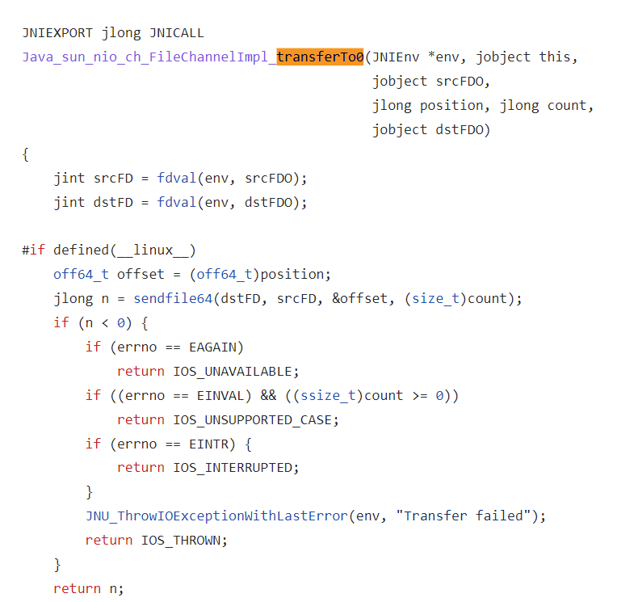
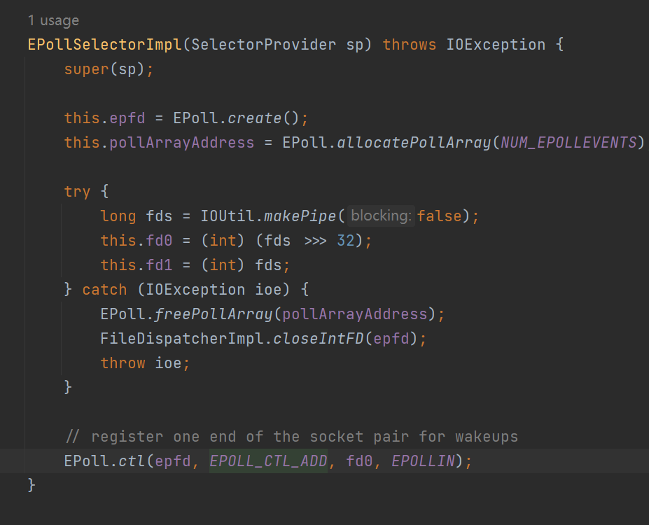
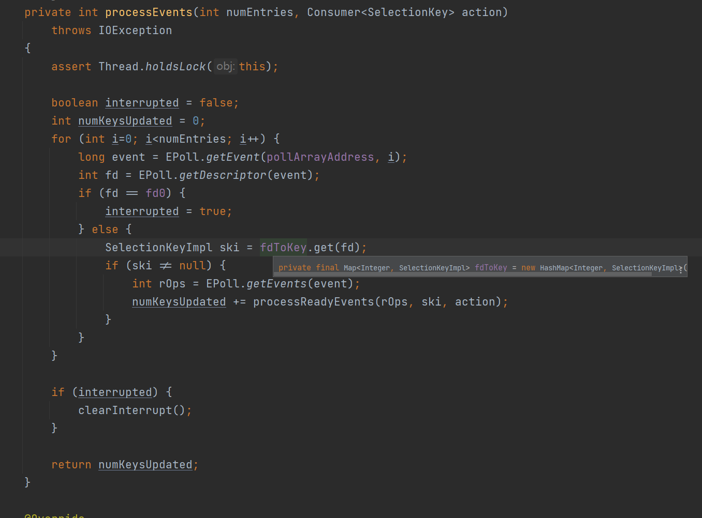
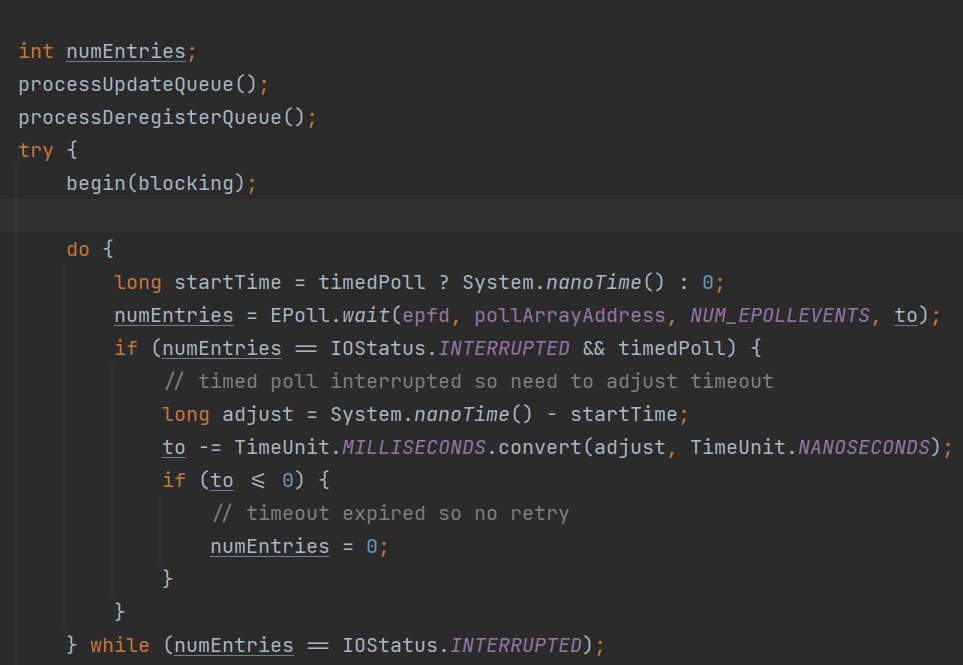

# selector

> 注意：由于jdk对于底层实现的迭代，为了方便描述，本文源码会参考
>
> [AdoptOpenJDK/openjdk-jdk11: Mirror of the jdk/jdk11 Mercurial forest at OpenJDK (github.com)](https://github.com/AdoptOpenJDK/openjdk-jdk11)
>
> 若无特殊说明均默认使用上面这个

在我们之前的socket一节讲到了我们去read一个inputstream是阻塞的，那么有没有办法变成非阻塞的而且还最好能直接告诉我那些可读呢？

是可以的，这就是我们本文的重点——java.nio的非阻塞IO

非阻塞 IO 的核心在于使用一个 Selector 来管理多个通道，可以是 SocketChannel，也可以是 ServerSocketChannel，将各个通道注册到 Selector 上，指定监听的事件。

之后可以只用一个线程来轮询这个 Selector，看看上面是否有通道是准备好的，当通道准备好可读或可写，然后才去开始真正的读写，这样速度就很快了。我们就完全没有必要给每个通道都起一个线程。

### java层

#### 实例

还是老样子 写一个echo服务器的demo

```java
Selector selector = Selector.open();
        ServerSocketChannel serverSocketChannel = ServerSocketChannel.open();
        serverSocketChannel.configureBlocking(false);
        //让selector监听它的连接到来的事件
        serverSocketChannel.register(selector, SelectionKey.OP_ACCEPT);
        serverSocketChannel.bind(new InetSocketAddress(4399));
        while (true){
            selector.select();
            Iterator<SelectionKey> iterator = selector.selectedKeys().iterator();
            while (iterator.hasNext()){
                SelectionKey selectionKey = iterator.next();
                if (selectionKey.isConnectable()){
                    ((SocketChannel) selectionKey.channel()).finishConnect();
                    //留空 这里的意义后面讲
                    continue;
                }
                if (selectionKey.isWritable()) {
                   //留空 这里的意义后面讲
                    continue;
                }
                if (selectionKey.isReadable()) {
                
                    SocketChannel channel = (SocketChannel) selectionKey.channel();
                    ByteBuffer buffer = ByteBuffer.allocateDirect(1024);
                    int c = channel.read(buffer);
                    //若读到-1就是连接断开，这里就不做这么仔细了
                    if (c != -1){
                        buffer.flip();
                        channel.write(buffer);
                    }else {
                        //会取消与其关联的全部selector监听事件
                        channel.close();
                    }
                    continue;
                }
                if (selectionKey.isAcceptable()){
                    SocketChannel accept = ((ServerSocketChannel) selectionKey.channel()).accept();
                    //很重要
                    accept.configureBlocking(false);
                    //让selector监听它的数据到来的事件
                    accept.register(selector, SelectionKey.OP_READ);
                }
                iterator.remove();
            }
        }
```

你看完这些代码就可以弄明白到底怎么用了，好，让我们看点细节上面的东西

#### 事件

##### OP_READ

这个就很好理解了，让selector监听这个socket，若其可以被读取，或者读到末尾（read返回0），或者连接断开（read返回-1），或者读取出现了错误都会触发这个事件，实际上我们大部分情况下只关心可被读取和断开两个情况，其他都是很少发生的边缘条件

##### OP_ACCEPT

若对应的ServerSocket的完成握手队列不为空就会触发这个事件

##### OP_WRITE

在之前的socket章节 我们提到了socket buffer若写满了，就会阻塞当前的线程直到可写为止，既然我们现在已经设置为非阻塞了，那我们直接写会阻塞吗？

不会，注意write的返回值，其代表了当前写入了多少数据，若为0则意味着socket buffer满了，这个时候再写实际上不会阻塞但也写不进去，这种时候就需要我们挂载这个事件监听了，等他来通知我们可写，而无需空转不停重试

实际上还有一种情况需要，[shutdown(3) - Linux man page (die.net)](https://linux.die.net/man/3/shutdown)

##### OP_CONNECT

实际上这个用于客户端多，首先，在`non-blocking`模式下调用`socketChannel.connect(new InetSocketAddress("127.0.0.1",8080));`连接远程主机，如果连接能立即建立就像本地连接一样，该方法会立即返回`true`，否则该方法会立即返回`false`,然后系统底层进行三次握手建立连接。连接有两种结果，一种是成功连接，第二种是异常，但是`connect`方法已经返回，无法通过该方法的返回值或者是异常来通知用户程序建立连接的情况，所以由`OP_CONNECT`事件和`finishConnect`方法来通知用户程序。不管系统底层三次连接是否成功，`selector`都会被唤醒继而触发`OP_CONNECT`事件，如果握手成功，并且该连接未被其他线程关闭，`finishConnect`会返回`true`，然后就可以顺利的进行`channle`读写。如果网络故障，或者远程主机故障，握手不成功，用户程序可以通过`finishConnect`方法获得底层的异常通知，进而处理异常。

#### 一些小细节

##### 传输文件

在[FileChannel](FileChannel.md)提到了一个transferTo方法 给两个channel之间拷贝数据，实际上它也可以用于在网络中传输大块的数据，比如说传输文件

```java
public void sendfile(FileChannel fileChannel,SocketChannel socketChannel) throws IOException {
        fileChannel.transferTo(0, fileChannel.size(), socketChannel);
}
```

当我们需要在网络中传输一个文件时，为了避免CPU拷贝就可以使用这个方法

其内部实现依赖于操作系统对zero copy技术的支持。在unix操作系统和各种linux的版本中，这种功能最终是通过sendfile()系统调用实现。

我来给大家证明一下，通过代码追踪可得到最后会触发到FileChannelImpl的transferTo0方法上面，直接去看对应的c实现：



其实就是调用[sendfile64](https://linux.die.net/man/2/sendfile64) 

在内核为2.4或者以上版本的linux系统上，socket缓冲区描述符将被用来满足这个需求。这个方式不仅减少了内核用户态间的切换，而且也省去了那次需要cpu参与的复制过程。 从用户角度来看依旧是调用transferTo()方法，但是其本质发生了变化：

1. 调用transferTo方法后数据被DMA从文件复制到了内核的一个缓冲区中。
2. 数据不再被复制到socket关联的缓冲区中了，仅仅是将一个描述符（包含了数据的位置和长度等信息）追加到socket关联的缓冲区中。DMA直接将内核中的缓冲区中的数据传输给协议引擎，消除了仅剩的一次需要cpu周期的数据复制。
3. 


##### wakeup

实际上你会发现`selector::select`会导致线程阻塞起来，若想立刻唤醒对应线程该怎么办？

很简单调用`selector.wakeup`即可，或者直接中断对应阻塞的线程即可。

前者原理非常简单，其实你实例化一个selector这个上面实际上预先注册了一个pipe的读端的读事件，wakeup只是向写端写了一个数据，这样就selector就捕获到了读端可读这个事件，自然也就停止阻塞返回了，每次select都会过滤掉这个读端事件，所以我们看不到

后者原理就是调用select时给Thread里面blocker赋值，相当于注册了一个调用interrupt()方法时的回调，这个回调就是调用wakeup



然后我们看一下精简版本的wakeup

```java
public Selector wakeup() {
    //省去不必要用于同步的代码
    IOUtil.write1(fd1, (byte)0);      
    return this;
}
```


##### socket attachment

如果我们想给socket绑定一个对象的话，比如说绑定一个上次没写完的ByteBuffer，类似于epoll api中的epoll_data中的void *ptr

```java
selectionKey.attach(new Object());
Object o = selectionKey.attachment();
```

看起来和epoll_data用法差不多，但是并不是通过这个实现的，思考一下就知道了由于GC挪动对象，所以肯定不能用堆外指针指向一个对象。

这个attach实际上具有volatile语义，所以跨线程的情况下能保证attachment()调用的可见性和因果性，这个attachment是和selectionkey绑定的，也就是说找到了key就可以找到这个attachment

我们来看看linux下面是怎么实现的这个功能



就是建立了一个fd->selectionKey的映射，epoll会告知我们触发的是哪个fd，然我们就可以找到对应的selectionKey，进而找到对应的attachment了，很巧妙。

##### 线程安全

Selector 对于多个并发线程来说是安全的，听起来很不错对吧？

实际上不注意很容易导致死锁,比如说一个线程无限期等待select返回，另外一个线程去register，这就会导致死锁。因为它们会争抢同一个publishkey对象作为monitor（这个结论实际上来自于jdk8的源码）[JDK-6446653 ](https://bugs.openjdk.java.net/browse/JDK-6446653)

从jdk11来看，不存在这个问题，但是我们不能保证运行我们代码的环境不是8，虽然现在有向更高迁移的趋势。

正确的思路应该是：

用个生产者消费者模型，把要 register 的 channel 放到队列中，selector线程在每次 select 前先 register 队列中的 channel 即可，若selector线程在阻塞就再加一步wakeup即可，实际上netty和jdk11也是这样实现的。

##### 最佳实践

一个线程一个selector用于轮询fd，而且多个selector没有共享的监听fd。

对于selector的register和select操作必须在同一个线程中，以上的目的在于避免竞态

#### 各个平台的selector实现

受限于我看的源码水平，我只了解linux和Windows的实现

Linux：

Epoll，而且是水平触发模式——即若socket接收缓冲区（RCVBUF）不为空那么就会一直触发，这个没法更改是写死在c代码里面的，而且由于还是写死的问题，一次select出来的**就绪**事件最多是1024个。其效率是O(m) m为就绪的fd数目。

讲到这里，我们再来提一提epoll另一个模式——边缘触发，即缓冲区满才触发，若我们一次性没读完，那么下次事件就得等到缓冲区满才触发了。

Windows：

17之前是基于[select](https://docs.microsoft.com/en-us/windows/win32/api/winsock2/nf-winsock2-select)的，一次性只能监听1024个fd，而且其效率是O(n)，n为监听的fd数量，因为上限只有1024个，所以超过的部分会多开线程来监听，每1024fd开一个线程监听，每次的select方法调用都是统计一下各个线程汇报上来的消息。

17开始是基于[wepoll](https://github.com/piscisaureus/wepoll)的，其底层是IOCP——一种AIO实现，具体讨论请看[JDK-8266369](https://bugs.openjdk.java.net/browse/JDK-8266369),这种实现性能相较于过去好很多

### Linux的C实现

现在我们已经知道了Linux上的实现是基于Epoll的。

让我们先来看看Epoll的手册
 The following system calls are provided to create and manage an **epoll** instance:

* epoll_create(2) creates a new epoll instance and returns a file descriptor referring to that instance. 
*  Interest in particular file descriptors is then registered via epoll_ctl(2), which adds items to the interest list of the epoll instance.
*  epoll_wait(2)  waits  for I/O events, blocking the calling thread if no events are currently available.  (This system call can be thought of as fetching items from the ready list of the epoll instance.)

简单来说就是epoll_create创造一个epoll实例，epoll_ctl将fd纳入其管理（比如说挂载事件），epoll_wait等待触发一个事件。我们经常说java只是一层很薄的系统调用封装，从这里就可以窥见端倪。

我们先不看实现，思考一下这三个api可能是在哪调用的？epoll_ctl->selector::new ，epoll_ctl->socketChannel::register,epoll_wait->select::select

然后再看看代码验证一下

#### EpollSelectorImpl::new

```java
EPollSelectorImpl(SelectorProvider sp) throws IOException {
        super(sp);
    //获取epoll实例
        this.epfd = EPoll.create();
        this.pollArrayAddress = EPoll.allocatePollArray(NUM_EPOLLEVENTS);

        try {
            //上文已经解释了 这个用于wakeup操作 并且给pipe设定为非阻塞
            long fds = IOUtil.makePipe(false);
            this.fd0 = (int) (fds >>> 32);
            this.fd1 = (int) fds;
        } catch (IOException ioe) {
            EPoll.freePollArray(pollArrayAddress);
            FileDispatcherImpl.closeIntFD(epfd);
            throw ioe;
        }

        // 将pipe的读端挂载读事件
        EPoll.ctl(epfd, EPOLL_CTL_ADD, fd0, EPOLLIN);
    }

//Epoll.c
JNIEXPORT jint JNICALL
Java_sun_nio_ch_EPoll_create(JNIEnv *env, jclass clazz) {
    /* size hint not used in modern kernels */
    int epfd = epoll_create(256);
    if (epfd < 0) {
        JNU_ThrowIOExceptionWithLastError(env, "epoll_create failed");
    }
    return epfd;
}
```

必要的地方已经做了标识，我们讲一讲一些小细节

`EPoll.allocatePollArray(NUM_EPOLLEVENTS)`这个实际上就是申请了堆外的一段内存用于存放epoll_event的，我们最关心的NUM_EPOLLEVENTS这个参数决定了一次select最多可以获取到多少就绪事件

```java
private static final int NUM_EPOLLEVENTS = Math.min(IOUtil.fdLimit(), 1024);
//IOUtil.c
JNIEXPORT jint JNICALL
Java_sun_nio_ch_IOUtil_fdLimit(JNIEnv *env, jclass this)
{
    struct rlimit rlp;
    //关注这个调用
    if (getrlimit(RLIMIT_NOFILE, &rlp) < 0) {
        JNU_ThrowIOExceptionWithLastError(env, "getrlimit failed");
        return -1;
    }
    if (rlp.rlim_max == RLIM_INFINITY ||
        rlp.rlim_max > (rlim_t)java_lang_Integer_MAX_VALUE) {
        return java_lang_Integer_MAX_VALUE;
    } else {
        return (jint)rlp.rlim_max;
    }
}
```

即当前进程允许打开的最大fd和1024中的最小值，即最大我们一口气可以select出1024个事件。

#### EpollSelectorImpl::processUpdateQueue

这个方法并不会直接被我们调用，在jdk11中对于register操作实际上投递到一个`updateKeys`队列中就返回了，epoll_ctl并不是在这里调用的。而是在真正select操作前会排空这个队列（调用processUpdateQueue方法）里面的SelectionKey，看看注册的事件是不是有更改，有更改就会调用Epoll::ctl来注册信息。

在此之前我们先认识一下SelectionKeyImpl中的两个字段

```java
private volatile int interestOps;
private int registeredEvents;
```

当我们修改一个SelectionKey的注册事件时实际上是修改的interestOps

而registeredEvents你可以理解为上一次感兴趣的事件(初始为0)

然后我们将这些概念连接在一起，直接来看一段核心代码。

~~代码排版炸了，换个图片吧~~


若**新**感兴趣事件对应code为0那就是不关注它，即对应epoll_ctl文档的EPOLL_CTL_DEL参数

若**新**感兴趣事件对应code**不**为0且**上一次**感兴趣事件对应code为0，即意味着没有被epoll管理（可能是因为获取到这个fd，也可能是上一个那个情况，被移除监听了），这个时候就加入到epoll内

若**新**感兴趣事件对应code**不**为0,且**上一次**感兴趣事件对应code也**不**为0，说明在池内需要修改监听的事件，比如说我之前注册了读事件和写事件，写事件触发，我全写完了需要写的数据，需要取消挂载写事件，这种情况就走这个分支。

#### EpollSelectorImpl::doSelect

我们调用selector::select最终就会走到这个方法里面

还是老样子直接看核心代码



很简单嘛和epoll_wait签名一致

```c
int epoll_wait(int epfd, struct epoll_event *events,
                      int maxevents, int timeout)
```

pollArrayAddress就是我们在构造器里面申请的那一段堆外内存

#### EpollSelectorImpl::processEvents

这个方法呢就是epoll_wait之后调用的方法用于将epoll_event转换为SelectionKey的状态。我们直接来看核心代码

```java
long event = EPoll.getEvent(pollArrayAddress, i);
//根据偏移量算触发事件的fd的值
int fd = EPoll.getDescriptor(event);
//fd就是pipe读端和实际需要监听的无关 过滤掉
if (fd == fd0) {
    interrupted = true;
} else {
    SelectionKeyImpl ski = fdToKey.get(fd);
    //就是建立了一个fd->selectionKey的映射，epoll会告知我们触发的是哪个fd，然我们就可以找到对应的selectionKey
    if (ski != null) {
        //获取实际上注册到epoll的事件 值
        int rOps = EPoll.getEvents(event);
        //这个就是将epoll对应的事件值转换为SelectionKey对应的值
        //这两者是有区别的，后面会讲
        numKeysUpdated += processReadyEvents(rOps, ski, action);
    }
}
// 对应event结构体
typedef union epoll_data { 
     void    *ptr;          
     int      fd;           
     uint32_t u32;          
     uint64_t u64;          
 } epoll_data_t;            
                            
 struct epoll_event {       
     uint32_t     events;   
     epoll_data_t data;     
 };                         
```

#### SelectionKey和Epoll的interestOps差异是怎么解决的?

最常见的给Epoll注册的事件是POLLIN，其中有连接可以接收和socket可以读都是触发这个事件，那么java是怎么处理，将其分开来的？

核心就是上面提到的processReadyEvents方法，其会转发到对应fd关联的SelectionKey，由这个SelectKey来**翻译**epoll的事件到SelectionKey中

而SelectKey又关联了其对应的channel，真正的翻译就会委托到`channel::translateAndUpdateReadyOps`中，由不同的channel实现来选择如何更新SelectKey的值。很明显ServerSocketChannel和SocketChannel不是一个类，它们的实现也不同。下面给出两者关于EPOLLIN的不同翻译的核心代码

```java
//ServerSocketChannelImpl::translateReadyOps(int ops, int initialOps, SelectionKeyImpl ski)
if (((ops & Net.POLLIN) != 0) &&
    ((intOps & SelectionKey.OP_ACCEPT) != 0))
        newOps |= SelectionKey.OP_ACCEPT;
ski.nioReadyOps(newOps);

//SocketChannelImpl::translateReadyOps(int ops, int initialOps, SelectionKeyImpl ski)
if (((ops & Net.POLLIN) != 0) &&
    ((intOps & SelectionKey.OP_READ) != 0) && connected)
    newOps |= SelectionKey.OP_READ;
```

一目了然就是这样分开的——利用类的重写机制

你会发现SocketChannelImpl对应的实现里面翻译POLLIN内有个很有趣的判断

`connected`,为什么会有这个？

实际上由于Net.POLLCONN和Net.POLLOUT在实现上面其实是一个值都是POLLOUT（来自于poll.h）,为了判别Connect事件和Write事件才做的，我们来看一段代码

```java
////SocketChannelImpl::translateReadyOps(int ops, int initialOps, SelectionKeyImpl ski)
if (((ops & Net.POLLCONN) != 0) &&
    ((intOps & SelectionKey.OP_CONNECT) != 0) && isConnectionPending())
    newOps |= SelectionKey.OP_CONNECT;
if (((ops & Net.POLLOUT) != 0) &&
    ((intOps & SelectionKey.OP_WRITE) != 0) && connected)
    newOps |= SelectionKey.OP_WRITE;
```

### 私货时间——loom是怎么利用Selector的？

以ServerSocket::accept为例子：

最后会转发到NioSocketImpl::accept(SocketImpl si)上面

```java
try {
    int n = 0;
    //这个fd实际上指的就是监听到端口的服务器fd
    FileDescriptor fd = beginAccept();
    try {
        //类似于serversocketChannel.confgureBlocking(false)
        configureNonBlockingIfNeeded(fd, remainingNanos > 0);
        if (remainingNanos > 0) {
            // accept with timeout
            n = timedAccept(fd, newfd, isaa, remainingNanos);
        } else {
            // accept, no timeout
            n = Net.accept(fd, newfd, isaa);
            while (IOStatus.okayToRetry(n) && isOpen()) {
                //核心在这里：若此时并没有立刻取到连接 就挂起当前线程
                park(fd, Net.POLLIN);
                n = Net.accept(fd, newfd, isaa);
            }
        }
    } finally {
        endAccept(n > 0);
        assert IOStatus.check(n);
    }
} finally {
    acceptLock.unlock();
}

private void park(FileDescriptor fd, int event, long nanos) throws IOException {
    Thread t = Thread.currentThread();
    if (t.isVirtual()) {
        Poller.poll(fdVal(fd), event, nanos, this::isOpen);
        if (t.isInterrupted()) {
            throw new InterruptedIOException();
        }
    } //省略
}
public static void poll(int fdVal, int event, long nanos, BooleanSupplier supplier)
    throws IOException
{
    assert nanos >= 0L;
    if (event == Net.POLLIN) {
        readPoller(fdVal).poll(fdVal, nanos, supplier);
    } //省略
}
```

简单来说 就是将当前的fd与线程用一个Map关联起来，然后在交由一个特殊的读轮询器线程，在其selector上面注册。当这个线程select到对应的fd时再通过Lockpark.unpark对应的虚拟线程让其重新加入调度。

也就是说实际上我们原来需要写的selector交由jdk实现了，这样阻塞式的socket api也可以获得到非阻塞的性能了

解析视频在这里：

[loom的java层面的实现](https://www.bilibili.com/video/BV1M34y157Qu)