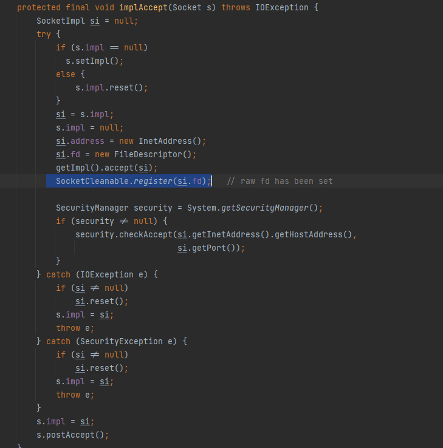
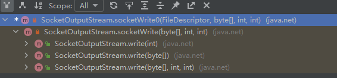
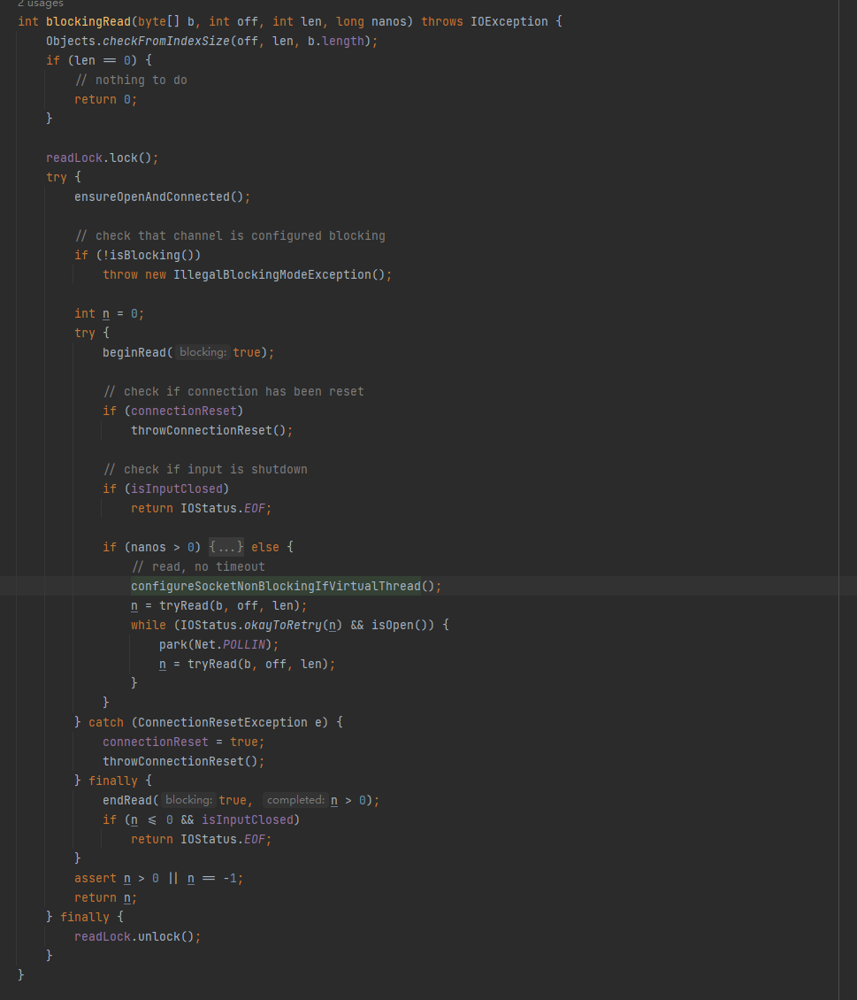

# socket

> 本文代码均来自于AdoptOpenJDK/openjdk-jdk11

## java部分

#### api demo

首先socket api是非常简单的

我们直接来看代码就行了，下面是一个echo服务器的代码，即你发什么我返回什么

```java
public void echo() throws Throwable{
    //监听本地8080端口 backlog为60然后一个连接开一个线程处理 
    ServerSocket serverSocket = new ServerSocket(8080, 60);
    //循环获取客户端连接
    while(true){
        Socket socket = serverSocket.accept();
        //开启一个线程处理客户端请求
        new Thread(new SocketThread(socket)).start();
    }
}
class SocketThread implements Runnable{
    private Socket socket;
    public SocketThread(Socket socket){
        this.socket = socket;
    }
    public void run(){
        try{
            //获取输入流
            InputStream is = socket.getInputStream();
            //获取输出流
            OutputStream os = socket.getOutputStream();
            //获取输入流的字节数组
            byte[] b = new byte[1024];
            int len = 0;
            while((len = is.read(b)) != -1){
                os.write(b, 0, len);
            }
            //关闭资源
            is.close();
            os.close();
            socket.close();
        }catch(Exception e){
            e.printStackTrace();
        }
    }
}
```

然后我们再来看看如果是作为客户端去连接服务器该怎么写

```java
public void echo(String host,int port){
    //读取数据 和 写入数据
    try{
        //创建一个Socket对象
        Socket socket = new Socket(host,port);
        //创建一个输入流
        InputStream inputStream = socket.getInputStream();
        //创建一个输出流
        OutputStream outputStream = socket.getOutputStream();
        //创建一个缓冲区
        byte[] bytes = new byte[1024];
        //读取数据
        int len = inputStream.read(bytes);
        //写入数据
        outputStream.write(bytes,0,len);
        //关闭资源
        inputStream.close();
        outputStream.close();
        socket.close();
    }catch (Exception e){
        e.printStackTrace();
    }
   
}

```

### FAQ

#### 为什么是流？

综上之，实际上我们读取数据和写入数据都是通过`流`来做的。

很简单，因为tcp是一种流式协议，它保证应用层获取的数据是按照发送顺序来的。

#### read和write次数不匹配（所谓的“粘包”）

如果对端调用它自己的`write`方法两次，每次写出150字节，我这边`read`一次有没有可能全部读出来？

是有可能的，用户数据被tcp发出去的时候，存在多个小尺寸数据被封装在一个tcp报文中发出去的可能性。这种“粘”不是接收侧的效果，而是由于Nagle算法（或者TCP_CORK）的存在，在发送的时候，就把应用开发者多次send的数据，“粘”在一个tcp报文里面发出去了，于是，先被send的数据可能需要等待一段时间，才能跟后面被send的数据一起组成报文发出去。所以需要接收方和发送方**约定一个明确数据边界**，比如说http中的\r\n，content-length这种手段。
多个小尺寸数据被封装在一个tcp报中文是为了解决大量小报文场景下包头比负载大，导致传输性价比太低的问题，专门设计的，即Nagle算法。你可以通过`socket.setTcpNoDelay(true);`设置TCP_NODELAY，这样就可以write调用一次就真正发送一次了。请注意，禁止Nagle算法**不一定可以**让发送更快。其实99%的情况下禁不禁止都一样，延迟根本不是Nagle算法导致的；就算真有问题，最优解决方案也不是屏蔽Nagle算法。

#### 阻塞

那么我们来思考一个问题，`accept`方法调用时此时还没有连接接入,`read`调用时没有数据到达,`write`调用时socket buffer满了写入不了。此时这几个方法的表现是什么？

**会阻塞当前的线程**，这就是为什么实例代码里面开了一个线程来处理一个连接的原因。思考一个问题，如果我有很多连接比如说10k个连接，我还能采用这个模式吗？显然不行，因为java的Thread对应的是一个内核线程，我们的操作系统没法调度这么多线程，所以需要一些非阻塞的库来支持。有兴趣的同学可以来阅读这一篇文章[The C10K problem (kegel.com)](http://www.kegel.com/c10k.html)

#### socket会泄露吗？

如果我们无意中把对应的socket引用置空了，那么这个socket对应的fd等其他资源会不会泄露？

不会，因为在accept方法里面对应这一段，这里实际上就是在gc时发现它不可达 回收后的回调，在这里面进行释放资源



## native部分

代码来自于[AdoptOpenJDK/openjdk-jdk11: Mirror of the jdk/jdk11 Mercurial forest at OpenJDK (github.com)](https://github.com/AdoptOpenJDK/openjdk-jdk11)

### read

这边给出read的实现（SocketInputStream::read）


然后我们直接去看看对应的jni实现就行了`Java_java_net_SocketInputStream_socketRead0`

然后摘出一段核心代码

```c
if (timeout) {
        nread = NET_ReadWithTimeout(env, fd, bufP, len, timeout);
        if ((*env)->ExceptionCheck(env)) {
            if (bufP != BUF) {
                free(bufP);
            }
            return nread;
        }
    } else {
        nread = NET_Read(fd, bufP, len);
}
//这一段来自于src/java.base/linux/native/libnet/linux_close.c
int NET_Read(int s, void* buf, size_t len) {
    BLOCKING_IO_RETURN_INT( s, recv(s, buf, len, 0) );
}
```

BLOCKING_IO_RETURN_INT这个不重要，这个实际上是一个宏定义，真正重点在于`recv`方法，这个来自于哪里呢？就是我们在linux上面网络编程中最常见的一个头文件 <sys/socket.h>

具体可以看这个手册[socket::recv](https://pubs.opengroup.org/onlinepubs/9699919799/)，从手册中得知，默认情况下这个函数会阻塞当前线程直到socket有信息可以读取

### write

这边给出write的实现（SocketOutputStream::write）



然后我们直接去看看对应的jni实现就行了`Java_java_net_SocketOutputStream_socketWrite0`

然后摘出一段核心代码

```c
 while(llen > 0) {
                int n = NET_Send(fd, bufP + loff, llen, 0);
                if (n > 0) {
                    llen -= n;
                    loff += n;
                    continue;
                }
                JNU_ThrowByNameWithMessageAndLastError
                    (env, "java/net/SocketException", "Write failed");
                if (bufP != BUF) {
                    free(bufP);
                }
                return;
}
//这一段来自于src/java.base/linux/native/libnet/linux_close.c
int NET_Send(int s, void *msg, int len, unsigned int flags) {
    BLOCKING_IO_RETURN_INT( s, send(s, msg, len, flags) );
}
```

BLOCKING_IO_RETURN_INT这个不重要，这个实际上是一个宏定义，真正重点在于`send`方法，这个来自于哪里呢？就是我们在linux上面网络编程中最常见的一个头文件 <sys/socket.h>

具体来看这个手册[socket::send](https://pubs.opengroup.org/onlinepubs/9699919799/),从手册中得知,默认情况下若socket buffer没有空余，则会阻塞到其有空余为止

### 内存拷贝

在我们之前的文章 [filechannel](FileChannel.md)提到了一个事情——读取和写出都会多一个堆外到堆内（堆内到堆外）的内存拷贝，我们直接来看看对应代码是怎么实现的，来证明一下我的结论。

以`Java_java_net_SocketInputStream_socketRead0`为例子

```c
if (len > MAX_BUFFER_LEN) {
        if (len > MAX_HEAP_BUFFER_LEN) {
            len = MAX_HEAP_BUFFER_LEN;
        }
        bufP = (char *)malloc((size_t)len);
        if (bufP == NULL) {
            bufP = BUF;
            len = MAX_BUFFER_LEN;
        }
    } else {
        bufP = BUF;
    }
    if (timeout) {
        nread = NET_ReadWithTimeout(env, fd, bufP, len, timeout);
        if ((*env)->ExceptionCheck(env)) {
            if (bufP != BUF) {
                free(bufP);
            }
            return nread;
        }
    } else {
        nread = NET_Read(fd, bufP, len);
    }
// 省略其他代码
 (*env)->SetByteArrayRegion(env, data, off, nread, (jbyte *)bufP);
```

你可以看到实际上传入`NET_READ`的bufP实际上就是malloc获取一个`堆外`buffer去读取socket buffer

`SetByteArrayRegion`这个就是用来拷贝到堆内的

## socket的更新

事实上我们在使用高版本的socket api（比如说jdk13之后的jdk），你会发现他的调用栈中包含了一部分nio包的堆栈，这是因为[JEP 353: Reimplement the Legacy Socket API (java.net)](http://openjdk.java.net/jeps/353)重写了旧有的socket实现，有兴趣的同学可以阅读文档，我下面给出我认为比较重要部分的翻译

其底层实现最早可以追溯到jdk1.0，该实现是遗留Java和C代码的混合，维护和调试起来很痛苦。该实现使用线程堆栈作为I/O缓冲区，这种方法需要多次增加默认线程堆栈大小。该实现还有几个并发问题，需要彻底检查才能正确解决。在未来的协程实现中，native方法应该暂时阻塞当前的协程而不是阻塞当前的载体线程，当前的实现并不适合这种情况。（这里就是讲的是loom，相关的文章请看这个文件夹 [dreamlike的私货](../dreamlike的私货)中的loom文章），而被重写过的代码在微基准测试中比旧有代码性能高1-3%。其中的重构一方面是基于nio的api重构一方面是将sychronized改为ReentrantLock以防止pin住协程

比如说原来的从socketinputstream中read，多了一个判断虚拟线程的条件,若不满足就挂到poll上，当前虚拟线程阻塞等待poll唤醒

