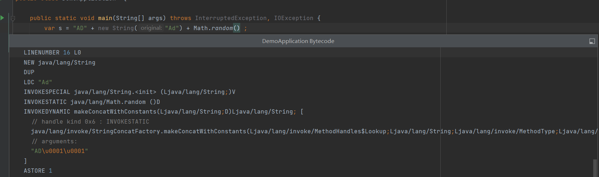
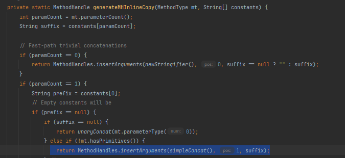
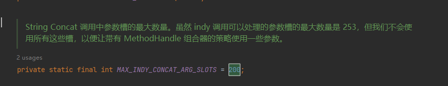

## java9之后的字符串拼接原理

> 这里是j19的字节码

不想写前情提要了 看图：



j9之后字符串拼接会编译为一个invokedynamic调用

tldr:

这里的原理就是运行时根据拼接的参数 产生了一组新的方法来执行字符串链接

## 前置资料

[JEP 280: Indify String Concatenation (openjdk.org)](https://openjdk.org/jeps/280)

https://openjdk.org/jeps/210

https://openjdk.org/jeps/303

## 翻译策略

tldr: 核心思想就是精确计算拼接后的长度，直接生成对应长度的未初始化的byte[]直接拷贝填充后直接传递给String的一个私有构造器（如下）

```java
 String(byte[] value, byte coder) {
        this.value = value;
        this.coder = coder;
}
```

具体代码不贴了 解释起来比较复杂 直接贴个网址吧https://cr.openjdk.java.net/~shade/8085796/notes.txt

- *BC_SB*或称之为“bytecode StringBuilder”的策略在运行时生成相同的*StringBuilder*字节码。然后它通过*Unsafe.defineAnonymousClass*方法加载生成的字节码，这种方式只是将翻译旧有的翻译策略从编译期移动到了运行时
- *BC_SB_SIZED* 或称之为”bytecode StringBuilder, but sized“的策略将尝试猜测*StringBuilder* 所需的容量。除此之外，它与以前的方法相同。猜测容量可能有助于*StringBuilder*在不调整底层字节数组长度的情况下执行拼接操作
- *BC_SB_SIZED_EXACT* 或称之为"bytecode StringBuilder, but sized exactly" 是基于*StringBuilder*的策略，可以精确计算所需的存储。要计算确切的大小，首先，它将所有参数转换为*字符串*
- *MH_SB_SIZED*或称之为 "MethodHandles StringBuilder, sized" 是基于*MethodHandle*s的策略，并最终调用*StringBuilder*API 进行串联。此策略还可以对所需容量进行有根据的猜测
- *MH_SB_SIZED_EXACT*与前一个类似，只是它完全准确地计算了必要的容量
- *MH_INLINE_SIZE_EXACT*预先计算所需的存储，并直接维护其*byte[]* 来存储串联结果*。*此策略会直接生成内联的字节码，通过调用各种私有的api，相当于将StringBuilder的拼接逻辑内联到字符串拼接处

### 来看个实例？

```java
public static String call(Object foo, int bar) {
    return "arg0: " + foo + ",arg1:" + bar;
}
```

字节码

```
public static call(Ljava/lang/Object;I)Ljava/lang/String;
    // parameter  foo
    // parameter  bar
   L0
    LINENUMBER 20 L0
    ALOAD 0
    INVOKESTATIC java/lang/String.valueOf (Ljava/lang/Object;)Ljava/lang/String;
    ILOAD 1
    INVOKEDYNAMIC makeConcatWithConstants(Ljava/lang/String;I)Ljava/lang/String; [
      // handle kind 0x6 : INVOKESTATIC
      java/lang/invoke/StringConcatFactory.makeConcatWithConstants(Ljava/lang/invoke/MethodHandles$Lookup;Ljava/lang/String;Ljava/lang/invoke/MethodType;Ljava/lang/String;[Ljava/lang/Object;)Ljava/lang/invoke/CallSite;
      // arguments:
      "arg0: \u0001, arg1: \u0001"
    ]
    ARETURN
   L1
    LOCALVARIABLE foo Ljava/lang/Object; L0 L1 0
    LOCALVARIABLE bar I L0 L1 1
    MAXSTACK = 2
    MAXLOCALS = 2
```

看起来调用了java/lang/invoke/StringConcatFactory.makeConcatWithConstants这个方法

那我们再来看看这个方法签名吧

```java
public static CallSite makeConcatWithConstants(MethodHandles.Lookup lookup,
                                                   String name,
                                                   MethodType concatType,
                                                   String recipe,
                                                   Object... constants)
```

- concatType 包含要创建的匿名方法的方法签名信息其中的参数信息包含要联接的变量的类型信息  即需要涉及到哪几个变量的捕获，以需要捕获的变量作为入参，string作为返回值描述需要生成的函数,在这个例子里面最后生成的是[String,int]String  (注意看上面的字节码Object这里被desugar为String.value(foo) 已经变成String类型了)

- recipe则是一个类似于模板的字符串 这里是"arg0: \u0001, arg1: \u0001" （\u0001类似于占位符，用来表示这里该插入一个变量）

- name就是makeConcatWithConstants

- Lookup则是caller的名字

剩下的部分就是生成字节码了 这里复用了lambda表达式的生成逻辑，有兴趣看看LambdaForm::compileToBytecode的代码，或者带这个参数java.lang.invoke.MethodHandle.TRACE_RESOLVE=true 看一下控制台输出，也可以通过java.lang.invoke.MethodHandle.DUMP_CLASS_FILES=true看一下生成的代码

  

注意这里生成的方法实际上会归于一个隐藏类（hidden class） 下一步就是加载这个字节码了，通过InvokerBytecodeGenerator::loadMethod方法实现可得 就是走的ClassLoad的native方法——ClassLoader.defineClass0(loader, lookup, name, b, 0, b.length, pd, initialize, flags, classData);

  

现在 我们直接看生成之后的代码吧

  

  ```java
  String anonymous(Object foo, int bar) {
      String os = StringConcatHelper.stringOf(foo);
      //计算确切byte长度[]
      long t1 = StringConcatHelper.mix(0, "arg0:"); //t1=5
      long t2 = StringConcatHelper.mix(t1, ",arg1:");//t2=11
      
      //这个是StringConcatHelper::mix(long lengthCoder, String value)
      long t3 =  StringConcatHelper.mix(t2, bar) //t3 = 12
      long t4 = StringConcatHelper.mix(t4, os) //t4 = 37
  
     //获取一个未初始化的byte[]
      byte[] buf = StringConcatHelper.newArray(t4);
  
  //StringConcatHelper::prepend(long indexCoder, byte[] buf, int value, String prefix) 将int转为char 然后插入,arg1:
      //为了防止多余拷贝这走了一个私有api 直接获取",arg1:"内部的byte数组拷贝到buf里面
      long t5 = StringConcatHelper.prepend(t4, buf, bar, ",arg1:"); //t5=30
      //
      long t6 = StringConcatHelper.prepend(t5, buf, os, "arg0:"); //t6=0
  
      return StringConcatHelper.newString(buf, t6);
  }
  ```

### 看起来还有点遗漏？

#### StringConcatHelper.stringOf(foo) 

如果为foo空怎么办？ 看代码：

```java
static String stringOf(Object value) {
    String s;
    return (value == null || (s = value.toString()) == null) ? "null" : s;
}
```

#### 特别简单的场景也要走这个流程是不是有点重？

其实你在代码里面能看到几个fast path，这里讲几个

##### 将字符串与一个变量连接，或将两个变量连接

```java
public static String call(Object bar){
    return "arg0:" + bar;
}
```



会走到StringConcatHelper::simpleConcat方法里面

其等价于

```java
String anonymous(Object foo, Object bar){
    String s1 = StringConcatHelper.stringof(foo); // 这里的foo是 arg0:
    String s2 = StringConcatHelper.stringof(bar); // bar java.lang.Object@1d81eb93
    long t1 = StringConcatHelper.mix(0,s1); // t1 = 5
    long t2 = StringConcatHelper.mix(t1,s2); //t2=30
    byte[] buf =  StringConcatHelper.newArray(t2);
    
    long t3 = StringConcatHelper.prepend(t2,buf,s2); //t3 = 5
    long t4 = StringConcatHelper.prepend(t3,buf,s1); //t4 =0
 
     return StringConcatHelper.newString(buf, t4);
    
}
```

#### 如果字符串里面本来就有\u0001怎么办

```java
"Hello\u0001 " + foo + "!";
```

还记得有个 makeConcatWithConstants入参 Object... constants 吗？

这个时候这里面就有值了`constants`: `[ "Hello\u0001 " ]`

#### 我们最多可以连接几个变量？

200个



```java
   if (concatType.parameterSlotCount() > MAX_INDY_CONCAT_ARG_SLOTS) {
            throw new StringConcatException("Too many concat argument slots: " +
                    concatType.parameterSlotCount() +
                    ", can only accept " +
                    MAX_INDY_CONCAT_ARG_SLOTS);
        }
```

#### 如何回退javac生成策略？

在编译时，可以使用选项编译为使用旧字符串生成器的实现。`-XDstringConcat=inline`

顺便说一下，此选项可以具有以下值：

| 值                          | 操作                                             |
| :-------------------------- | :----------------------------------------------- |
| inline                      | StringBuilder实现                                |
| indy                        | 使用`StringConcatHelper#makeConcat`              |
| indyWithConstants（默认值） | 使用`StringConcatHelper#makeConcatWithConstants` |