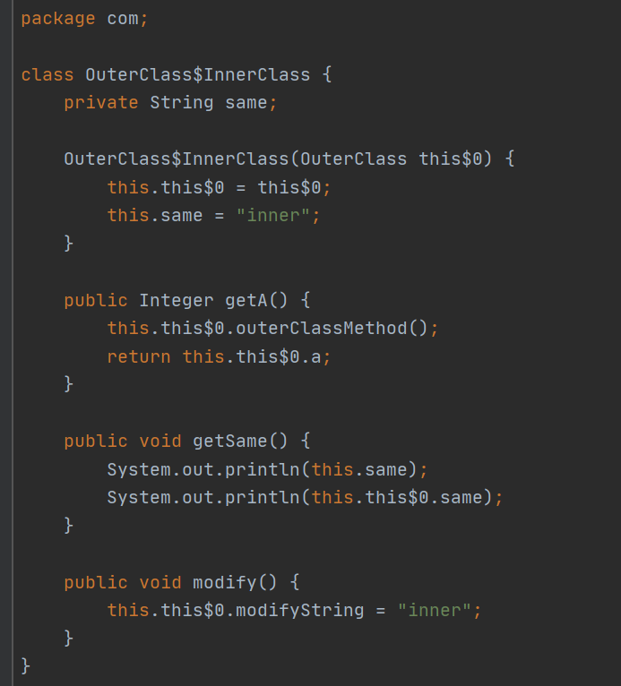
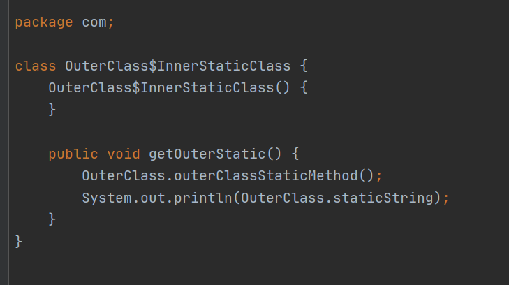
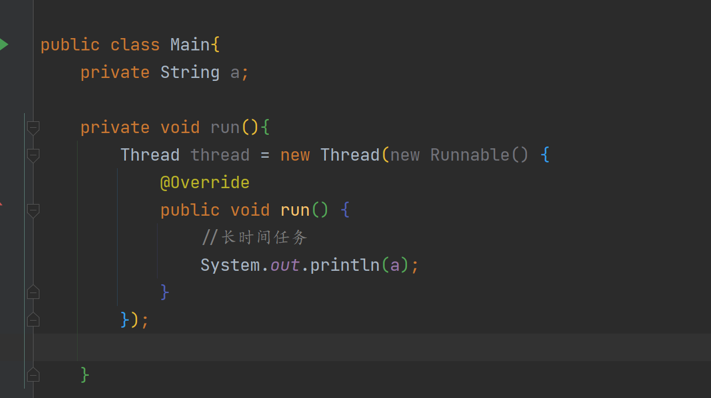
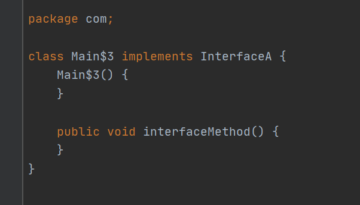
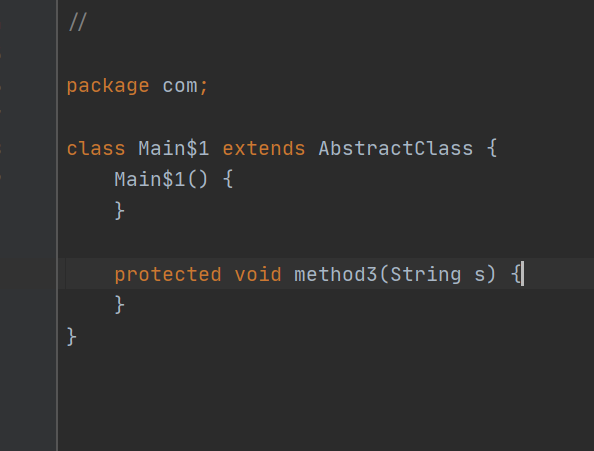
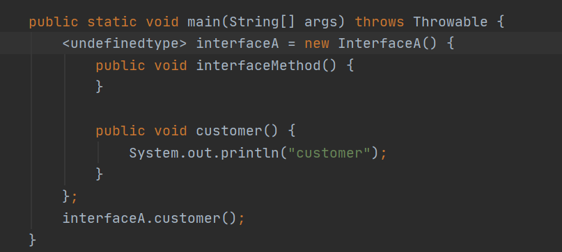

## 内部类，匿名类，匿名内部类

### 内部类

什么是内部类？简单来说就是定义在别的类内部的类

下面就是一个简单的内部类

```java
class outer{
    class inner{
        
    }
}
```

定义内部类的哲学意义是什么？

某些外部类和内部类具有包含关系，是强关联的而且内部类离开外部类不再具有存在的意义，举个例子，比如汽车底盘之于汽车的关系。

从代码使用的角度来讲

它可以直接访问修改外部类的值

#### 内部类

```java
public class OuterClass {
    private Integer a;
    private static String staticString= "outer static";
    private String modifyString = "outer";

    private String same = "outer";
    public OuterClass(Integer a) {
        this.a = a;
    }

    private void outerClassMethod(){
        System.out.println("outClassMethod is called");
    }
    private static void outerClassStaticMethod(){
        System.out.println("outClassStaticMethod is called");
    }

    public String getModifyString() {
        return modifyString;
    }

    class InnerClass{
        private String same = "inner";

        //可以直接通过方法名调用到外部类私有方法和私有对象
        public Integer getA(){
            outerClassMethod();
            return a;
        }

        //这是重名情况，最小作用域原则
        public void getSame(){
            //调用自己的变量
            System.out.println(same);
            //调用外部类的变量
            System.out.println(OuterClass.this.same);
        }

        public void modify(){
            modifyString = "inner";
        }
    }}
```

当我们调用时，要记住这个内部类要和外部类紧密结合，即这个内部类无法脱离外部类使用

所以要这么写

```java
       //等价写法
//        OuterClass outerClass = new OuterClass(10);
//        OuterClass.InnerClass innerClass1 = outerClass.new InnerClass();
        OuterClass.InnerClass innerClass = new OuterClass(10).new InnerClass();
        System.out.println(innerClass.getA());
        innerClass.getSame();
```

控制台输出

```java
outClassMethod is called
10
inner
outer
```

对于修改变量的操作

```java
        OuterClass outerClass = new OuterClass(10);
        OuterClass.InnerClass innerClass1 = outerClass.new InnerClass();
        System.out.println(outerClass.getModifyString());
        innerClass1.modify();
        System.out.println(outerClass.getModifyString());
```

控制台输出

```java
outer
inner
```

#### 静态内部类

```java
public class OuterClass {
    private Integer a;
    private static String staticString= "outer static";
    private String modifyString = "outer";

    private String same = "outer";
    public OuterClass(Integer a) {
        this.a = a;
    }

    private void outerClassMethod(){
        System.out.println("outClassMethod is called");
    }
    private static void outerClassStaticMethod(){
        System.out.println("outClassStaticMethod is called");
    }

    public String getModifyString() {
        return modifyString;
    }
    static class InnerStaticClass{
        //只能调用外部类的静态方法和字段
        public void getOuterStatic(){
            outerClassStaticMethod();
            System.out.println(staticString);
        }
    }
   
}

```

静态内部类与内部类不同的一点在于它不需要依赖外部类实例化

```java
 OuterClass.InnerStaticClass staticClass = new OuterClass.InnerStaticClass();
        staticClass.getOuterStatic();
```

#### 总结

| 内部类，静态内部类比较 |              |              |                      |
| ---------------------- | ------------ | ------------ | -------------------- |
|                        | 字段访问权限 | 函数访问权限 | 实例化是否依赖外部类 |
| 内部类                 | 全部         | 全部         | 是                   |
| 静态内部类             | 静态         | 静态         | 否                   |

#### 探秘实现原理*

点开out文件夹


再通过反编译可得





即无论是内部类还是静态内部类都是一个独立的类

所以说内部类存在一个对外部类的引用，而静态内部类没有，所以这就是是否需要外部类的区别的根源

考虑一个情况，外部类是个短生命周期的情况下，其内部类被另外的类所引用，即外部类本该被回收但是由于被内部类强引用，导致无法回收，进而内存泄漏。

这种情况就是短生命被长生命周期引用导致的内存泄漏

举个例子 这种情况在回调中比较常见，此时runnable被gc root持有，runnable这个匿名内部类持有Main的引用 ，故Main还在gc root链上，无法被回收

明明Main生命周期已经结束但由于这个内部类生命周期还没结束导致了”内存泄露“




### 匿名类

#### 使用

匿名类就是你无法显式看到类名的类

使用方法，使用这种方法就可以达成“new 一个抽象类或者接口的效果”

```java
public static void main(String[] args){
    //通过匿名类获取 
      AbstractClass abstractClass = new AbstractClass() {
            @Override
            protected void method3(String s) {

            }
        };
///通过普通类获取
        NormalClass normalClass = new NormalClass() {
            @Override
            public void method2(String s) {
                super.method2(s);
            }
        };
//通过接口获取
        InterfaceA interfaceA = new InterfaceA() {
            @Override
            public void interfaceMethod() {

            }
        };
       
}
```

#### 原理探秘

这也是一种内部类

反编译一下







所以说通俗的说法就是原地实现一个接口或者匿名类

#### 获取实际类名*

通过反射获取

```java
System.out.println(abstractClass.getClass());
        System.out.println(normalClass.getClass());
        System.out.println(interfaceA.getClass());
```

输出

```java
class com.Main$1
class com.Main$2
class com.Main$3
```

#### 调用其中被我们额外添加的函数*

因为他们的引用类型被限制为他们的父类或者父接口，所以无法通过引用.方法()调用我们额外添加的函数

```java
InterfaceA interfaceA = new InterfaceA() {
            @Override
            public void interfaceMethod() {

            }
            public void customer(){
                System.out.println("customer");
            }
        };
//interfaceA.customer(); 无法调用
```

##### 反射方法

```java
Method method = interfaceA.getClass().getDeclaredMethod("customer");
        method.invoke(interfaceA);

```

##### 方法句柄

```java
MethodHandle methodHandle = MethodHandles.lookup().findVirtual(interfaceA.getClass(), "customer", MethodType.methodType(void.class));
        methodHandle.invoke(interfaceA);
```

##### 自动类型推导

var关键字可以编译期智能推导类型，注意这里的var并不是动态类型的var，其仍是强类型和静态类型的

```java
var interfaceA = new InterfaceA() {
            @Override
            public void interfaceMethod() {

            }
            public void customer(){
                System.out.println("customer");
            }
        };
interfaceA.customer();
```

这就是你不知道类型，但是编译器知道


反编译下




### 匿名内部类

就是匿名类和内部类结合，例如上面写的那个例子

### 用lambda表达式简化匿名内部类书写*

#### 如何从签名的角度将一个方法与其他方法分离

方法有三个特性表现自己和其余方法的不同

1，调用者，从OOP的角度来看就是这个方法归属于哪个类

2，方法的返回值，即预期返回类型

3，方法形参，即预期的输入类型

另外在java中声明的异常也算是方法签名的一部分，这个不在讨论范围内

```java
Method method = HttpVerticle.class.getMethod("start", Promise.class);
System.out.println(method);
//public void verxtx.HttpVerticle.start(io.vertx.core.Promise) throws java.lang.Exception
```

从数学的角度来说函数就是值对值的映射关系，再从OOP的角度来说，如果我声明一个int到Srting的函数，即

int -> String的映射，这只是一种关系，即声明签名。其余符合这个映射关系的函数就可以视为这个声明的实现

即如下伪代码也是成立的

```Java
void invoke((int-> String)  function){
   String s = function(1);
//.......
}

String transfer(int a){
//....
return a.toString;
}

invoke(transfer);
```

这个就是函数可以如同对象一样传递

#### java如何书写lambda表达式

首先java lambda表达式比较受限，只支持sam（Single Abstract Method）接口，而且是以对象的形式支持的

其核心就在于形参，方法体和返回值

即（）->{ }形式

观察这个接口

```java
public interface Handler<String> {
  int handle(String s);
}
```

首先确定形参 String s，其次确定返回值int

即

```java
Handler lambda  = (String s) -> {
//do something
return 1；
}
```

若方法体只有单行且返回值为int，简化版本 （s） ->  s.length

#### lambda实质

通过字节码可以看出，调用lambda方法时使用了`invokedynamic`，该字节码命令是为了支持动态语言特性而在Java7中新增的。Java的lambda表达式实现上也就借助于`invokedynamic`命令。

字节码中每一处含有invokeDynamic指令的位置都称为**动态调用点**，这条指令的第一个参数不再是代表方法调用符号引用的CONSTANT_Methodref_info常量，而是变成为JDK7新加入的CONSTANT_InvokeDynamic_info常量，从这个新常量中可得到3项信息：引导方法（Bootstrap Method，此方法存放在新增的BootstrapMethods属性中）、方法类型和名称。引导方法是有固定的参数，并且返回值是java.lang.invoke.CallSite对象，这个代表真正要执行的目标方法调用。根据CONSTANT_InvokeDynamic_info常量中提供的信息，虚拟机可以找到并执行引导方法，从而获得一个CallSite对象，最终调用要执行的目标方法。

实际上翻译策略就是翻译到一个新的类，需要外部捕获的变量则是通过构造器传入保存在字段中

此时由于不是内部类的那种需要捕获外部类指针故不太可能存在内存泄露问题


以上看不懂？没关系

我们看反射结果

以我的项目中一个例子，所以实际上就是生成了一个函数而已

```java
for (Method method : HttpVerticle.class.getDeclaredMethods()) {
      System.out.println(method);
    }
//private static void verxtx.HttpVerticle.lambda$start$3(io.vertx.ext.web.RoutingContext)
```

#### 扩展内容

以上只包含了简单的()->{}形式，其实还有类名::方法名这种方法引用的形式，自行学习

[java 8 lambda](https://juejin.im/post/6844903957601452039)

[Java中普通lambda表达式和方法引用本质上有什么区别](https://www.zhihu.com/question/51491241/answer/126232275)

[JVM笔记（四）基本原理（4） - 掘金 (juejin.cn)](https://juejin.cn/post/6858896828810428430#heading-5)