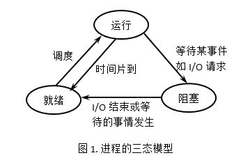

# 导论

### 线程

#### 什么是线程

线程是什么？

线程指的是一个进程开辟多条路径，充分利用我们的CPU。

首先操作系统提供了一套api和struct来对硬件资源进行抽象，那么线程是对什么的抽象？

很简单它是对于CPU计算资源的抽象，具体来说:线程的生命周期就是代表一个CPU任务的生命周期。

> 在Linux系统中，对于用户创建的进程(线程)来说，CPU分配时间片的单位是线程还是进程?

是线程。线程是实际工作的单元，进程只是一个容器，用来管理一个或多个线程。

在一些CPU参数里面我们往往能看到诸如4核心8线程这种参数，就是指CPU可以同时执行8个线程，即可以同时做8个任务

但是我们，在任务管理器中看到的线程却远远大于8个，这些线程都是同时执行的吗？


从宏观感觉来看是的，但是从微观来看，不是。

我们现在大部分系统的线程都是抢占式线程，即它只有抢到`时间片`才能运行，如果一个进程创建了很多线程的话，最多也只有8个能够处于执行的状态，其余的线程必须等待调度。线程被调度的时候需要进行上下文切换，这个操作是一种额外的开销。线程数量过多的时候，上下文切换产生的额外开销会对系统的效率造成负面影响。

由于切换的非常快所以你在宏观上感受到的是所有线程都在并行，但是实际上我们称之为并发

**时间片**（timeslice）又称为“量子（quantum）”或“处理器片（processor slice）”是分时操作系统分配给每个正在运行的[进程](https://baike.baidu.com/item/进程)微观上的一段CPU时间

实际上linux上的线程就是轻量级进程，有些书你会看到都是说调度进程，实际上是一回事

#### 并发？并行？这都什么鬼？

并发就是在**一段**微小的时间内，有多个任务在交叉执行

并行就是在某一**时刻**，有多个任务在同时执行

简单来说，4核心8线程，意味着同一时刻有8个任务在同时执行，但是如果我们看5ms的情况就可能有50个任务在交错执行

思考一个简单的情况：整个系统只有我们的程序在跑，此时系统是两核心两线程，那么当我们开启一个线程A和线程B时，操作系统帮我们调度到core 0和core 1来执行，此时A B就是并行了。然后我们再开启一个线程C，A,B谁先用完时间片谁被操作系统暂停（抢断），切换到C来执行，此时三个线程关系就变成并发了

如果你还是理解不了，那么你就理解成多线程就是并发就行了

#### 线程生命周期

为了方便理解，我们假设一个线程要做的事情是这样的，先创建出来，做几个算术题，读一段文件，然后再做一段长时间的运算题，最后结束

1，首先os肯定要记录需要执行的线程对吧，那么就需要一个待调度到CPU上的队列存这些线程

2，读文件，这种IO非常慢，CPU肯定是不愿意等待完成的，一般是给DMA发消息，DMA完成后再通知的，既然不愿意等待，那么应该是暂停执行这个任务，切到调度其他任务对吧，而IO结束我们又需要继续执行之前的任务，那么就需要一个标记位来指示状态，等完成任务的中断一来我们再丢到1中提到的队列中就行了

3，一个线程运行了很长是不是会影响其他线程的执行，比如说你也不想打开了网站看视频的同时不能用QQ吧，所以这个时候就需要操作系统抢断当前线程把它丢到1的队列中，切到另外一个线程来利用CPU资源

综上 线程启动时是就绪，操作系统调度给他时间片开始运行此时就变成运行态了，遇到IO这种阻塞api变成阻塞态，等待完成后再变成就绪态，然后再等调度，这样就完成了闭环

运行太长也会变成就绪态等待就绪  



### java的线程

不同语言对线程库的实现并不一致

 在操作系统中，有两种不同的方法提供线程支持：用户态的用户线程，或内核态的内核线程。

1：N模型：实际上只有一个线程在运行，其中用户线程在内核之上支持，并在用户层通过线程库来实现。不需要用户态/核心态切换，速度快。操作系统内核不知道多线程的存在，因此一个线程阻塞将使得整个进程（包括它的所有线程）阻塞。由于这里的处理器时间片分配是以进程为基本单位，所以每个线程执行的时间相对减少。

N:M模型：有N个内核线程驱动M个用户态线程，N**远大于**M，比如说go的goroutine支持个位数的内核线程驱动上万的用户态线程（java也会有的，project loom）

内核线程由操作系统直接支持。由操作系统内核创建、调度和管理。内核维护进程及线程的上下文信息以及线程切换。一个内核线程由于I/O操作而阻塞，不会影响其它线程的运行。

  而目前Java对线程的实现则是与内核线程1：1的实现，即你可以理解为它每创建一个Java线程都对应了一个实际的内核线程（2022年4月24日）

#### 创建线程

创建线程一共有三种方式，我们这里只讲两种，剩下一种后面讲

*使用`Thread.currentThread()`获取当前运行线程

##### 继承Thread类

```java
public static class CustomerThread extends Thread{
        @Override
        public void run() {
            System.out.println("启动一个线程:"+Thread.currentThread().getName());
        }
    }
```

##### 实现Runnable接口

```java
public static class CustomerRunnable implements Runnable{
        @Override
        public void run() {
            System.out.println("启动一个线程:"+Thread.currentThread().getName());
        }
    }
```

#### 启动线程

请切记：启动线程的方法是**start()**而不是run()

```java
//Thread 子类就直接start()就启动了
        new LearnThread.CustomerThread().start();
        //Runnable 子类需要一个Thread实例
        new Thread(new LearnThread.CustomerRunnable()).start();
        System.out.println("我是主线程"+Thread.currentThread());
```

输出

```
启动一个线程:Thread-1
启动一个线程:Thread-0
我是主线程Thread[main,5,main]
```

请同学们自行尝试如果使用run()方法会发生什么：

实际上就是在当前线程上运行run()的方法，就是调用了一个普通的方法

#### start()后发生了什么

其中的native方法就是会调用系统底层的接口启动线程。在新开的线程中执行run()

```java
 public synchronized void start() {
        /**
         * This method is not invoked for the main method thread or "system"
         * group threads created/set up by the VM. Any new functionality added
         * to this method in the future may have to also be added to the VM.
         *
         * A zero status value corresponds to state "NEW".
         */
        if (threadStatus != 0)
            throw new IllegalThreadStateException();

        /* Notify the group that this thread is about to be started
         * so that it can be added to the group's list of threads
         * and the group's unstarted count can be decremented. */
        group.add(this);

        boolean started = false;
        try {
            start0();
            started = true;
        } finally {
            try {
                if (!started) {
                    group.threadStartFailed(this);
                }
            } catch (Throwable ignore) {
                /* do nothing. If start0 threw a Throwable then
                  it will be passed up the call stack */
            }
        }
    }

    private native void start0();
```

而run()方法，就是在其调用线程中直接调用内部那个Runnable实现类的run罢了，

```java
@Override
    public void run() {
        if (target != null) {
            target.run();
        }
    }
```

*在start()中的

```java
if (threadStatus != 0)
            throw new IllegalThreadStateException();
```

确保了不会启动两次同一个线程


