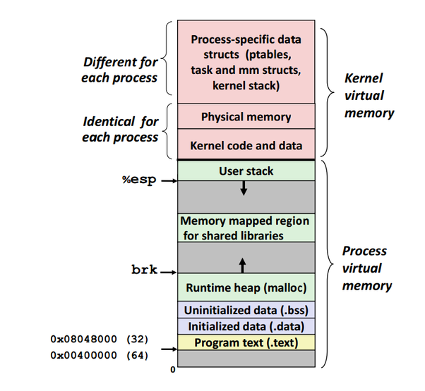
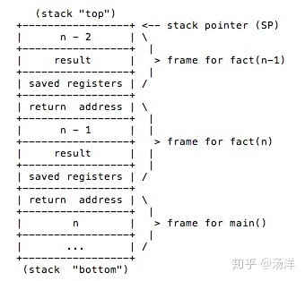

# 导论

### 线程

#### 什么是线程

线程是什么？

线程指的是一个进程开辟多条路径，充分利用我们的CPU。

首先操作系统提供了一套api和struct来对硬件资源进行抽象，那么线程是对什么的抽象？

很简单它是对于CPU计算资源的抽象，具体来说:线程的生命周期就是代表一个CPU任务的生命周期。

> 在Linux系统中，对于用户创建的进程(线程)来说，CPU分配时间片的单位是线程还是进程?

是线程。线程是实际工作的单元，进程只是一个容器，用来管理一个或多个线程。

在一些CPU参数里面我们往往能看到诸如4核心8线程这种参数，就是指CPU可以同时执行8个线程，即可以同时做8个任务

但是我们，在任务管理器中看到的线程却远远大于8个，这些线程都是同时执行的吗？


从宏观感觉来看是的，但是从微观来看，不是。

我们现在大部分系统的线程都是抢占式线程，即它只有抢到`时间片`才能运行，如果一个进程创建了很多线程的话，最多也只有8个能够处于执行的状态，其余的线程必须等待调度。线程被调度的时候需要进行上下文切换，这个操作是一种额外的开销。线程数量过多的时候，上下文切换产生的额外开销会对系统的效率造成负面影响。

由于切换的非常快所以你在宏观上感受到的是所有线程都在并行，但是实际上我们称之为并发

**时间片**（timeslice）又称为“量子（quantum）”或“处理器片（processor slice）”是分时操作系统分配给每个正在运行的[进程](https://baike.baidu.com/item/进程)微观上的一段CPU时间

实际上linux上的线程就是轻量级进程，有些书你会看到都是说调度进程，实际上是一回事

#### 并发？并行？这都什么鬼？

并发就是在**一段**微小的时间内，有多个任务在交叉执行

并行就是在某一**时刻**，有多个任务在同时执行

简单来说，4核心8线程，意味着同一时刻有8个任务在同时执行，但是如果我们看5ms的情况就可能有50个任务在交错执行

思考一个简单的情况：整个系统只有我们的程序在跑，此时系统是两核心两线程，那么当我们开启一个线程A和线程B时，操作系统帮我们调度到core 0和core 1来执行，此时A B就是并行了。然后我们再开启一个线程C，A,B谁先用完时间片谁被操作系统暂停（抢断），切换到C来执行，此时三个线程关系就变成并发了

如果你还是理解不了，那么你就理解成多线程就是并发就行了

#### 线程生命周期

为了方便理解，我们假设一个线程要做的事情是这样的，先创建出来，做几个算术题，读一段文件，然后再做一段长时间的运算题，最后结束

1，首先os肯定要记录需要执行的线程对吧，那么就需要一个待调度到CPU上的队列存这些线程

2，读文件，这种IO非常慢，CPU肯定是不愿意等待完成的，一般是给DMA发消息，DMA完成后再通知的，既然不愿意等待，那么应该是暂停执行这个任务，切到调度其他任务对吧，而IO结束我们又需要继续执行之前的任务，那么就需要一个标记位来指示状态，等完成任务的中断一来我们再丢到1中提到的队列中就行了

3，一个线程运行了很长是不是会影响其他线程的执行，比如说你也不想打开了网站看视频的同时不能用QQ吧，所以这个时候就需要操作系统抢断当前线程把它丢到1的队列中，切到另外一个线程来利用CPU资源

综上 线程启动时是就绪，操作系统调度给他时间片开始运行此时就变成运行态了，遇到IO这种阻塞api变成阻塞态，等待完成后再变成就绪态，然后再等调度，这样就完成了闭环

运行太长也会变成就绪态等待就绪  


### java的线程

不同语言对线程库的实现并不一致

 在操作系统中，有两种不同的方法提供线程支持：用户态的用户线程，或内核态的内核线程。

1：N模型：实际上只有一个线程在运行，其中用户线程在内核之上支持，并在用户层通过线程库来实现。不需要用户态/核心态切换，速度快。操作系统内核不知道多线程的存在，因此一个线程阻塞将使得整个进程（包括它的所有线程）阻塞。由于这里的处理器时间片分配是以进程为基本单位，所以每个线程执行的时间相对减少。

N:M模型：有N个内核线程驱动M个用户态线程，N**远大于**M，比如说go的goroutine支持个位数的内核线程驱动上万的用户态线程（java也会有的，project loom）

内核线程由操作系统直接支持。由操作系统内核创建、调度和管理。内核维护进程及线程的上下文信息以及线程切换。一个内核线程由于I/O操作而阻塞，不会影响其它线程的运行。

  而目前Java对线程的实现则是与内核线程1：1的实现，即你可以理解为它每创建一个Java线程都对应了一个实际的内核线程（2022年4月24日）

#### 创建线程

创建线程一共有三种方式，我们这里只讲两种，剩下一种后面讲

*使用`Thread.currentThread()`获取当前运行线程

##### 继承Thread类

```java
public static class CustomerThread extends Thread{
        @Override
        public void run() {
            System.out.println("启动一个线程:"+Thread.currentThread().getName());
        }
    }
```

##### 实现Runnable接口

```java
public static class CustomerRunnable implements Runnable{
        @Override
        public void run() {
            System.out.println("启动一个线程:"+Thread.currentThread().getName());
        }
    }
```

#### 启动线程

请切记：启动线程的方法是**start()**而不是run()

```java
//Thread 子类就直接start()就启动了
        new LearnThread.CustomerThread().start();
        //Runnable 子类需要一个Thread实例
        new Thread(new LearnThread.CustomerRunnable()).start();
        System.out.println("我是主线程"+Thread.currentThread());
```

输出

```
启动一个线程:Thread-1
启动一个线程:Thread-0
我是主线程Thread[main,5,main]
```

请同学们自行尝试如果使用run()方法会发生什么：

实际上就是在当前线程上运行run()的方法，就是调用了一个普通的方法

#### start()后发生了什么

其中的native方法就是会调用系统底层的接口启动线程。在新开的线程中执行run()

```java
 public synchronized void start() {
        /**
         * This method is not invoked for the main method thread or "system"
         * group threads created/set up by the VM. Any new functionality added
         * to this method in the future may have to also be added to the VM.
         *
         * A zero status value corresponds to state "NEW".
         */
        if (threadStatus != 0)
            throw new IllegalThreadStateException();

        /* Notify the group that this thread is about to be started
         * so that it can be added to the group's list of threads
         * and the group's unstarted count can be decremented. */
        group.add(this);

        boolean started = false;
        try {
            start0();
            started = true;
        } finally {
            try {
                if (!started) {
                    group.threadStartFailed(this);
                }
            } catch (Throwable ignore) {
                /* do nothing. If start0 threw a Throwable then
                  it will be passed up the call stack */
            }
        }
    }

    private native void start0();
```

而run()方法，就是在其调用线程中直接调用内部那个Runnable实现类的run罢了，

```java
@Override
    public void run() {
        if (target != null) {
            target.run();
        }
    }
```

*在start()中的

```java
if (threadStatus != 0)
            throw new IllegalThreadStateException();
```

确保了不会启动两次同一个线程

具体native发生了什么请参考这个[深入虚拟机探索Thread start_源码_4ye_InfoQ写作社区](https://xie.infoq.cn/article/656bc0720fdc0072acf1eb81b)

### 线程是怎么调度切换的？*

#### CPU是怎么执行程序的？

> 注意：下面的说明只是一种简化的情况，具体情况你需要去看对应CPU的手册
>
> 我们只谈论那些常见的指令和寄存器，也不细节讨论os的实现，大体是会以linux的实现为例子
>
> 不讨论具体是怎么实现的 有兴趣的可以去学习[CS:APP3e, Bryant and O'Hallaron (cmu.edu)](http://csapp.cs.cmu.edu/)
>
> 有时候为了方便描述 我会以代码行数作为PC（程序计数器）的值 而不是对应的指令地址

##### 指令

首先CPU得知道要执行那个指令对吧，这里就需要一个寄存器 PC，程序计数器用来指定下一条指令位置

而运算也需要数据从内存加载到CPU内部，此时就需要其他寄存器储存变量/参数

而我们的控制流语句实际上就是通过改变PC的值来控制跳转的，通过不同的计算的结果来反映到PC上面 再指示CPU该向哪里走

##### 数据

现在我们弄明白了指令，那么作为图灵机的另外一半——数据又是怎么来的呢？

1，数据在哪？

我们简单地把内存分成堆，栈。

堆用于存放各种共享的变量，这是同一进程下面各个线程共享的内存区域 下文的p对应的4个字节空间就在这里

栈用于存放”线程私有“的变量，比如说下面的a就是分配到各个线程私有的栈上面的

```c
int fun(){
    int a = 10;
    int* p = (int*)mallock(sizeof(int));
}
```




这两种分类只是方便理解操作而已，CPU对这些一无所知，它只知道去哪个地址拿n个长度的数据，CPU不在乎在哪取。因为堆地址和栈地址都在同一个内存空间内，所以只要你在保证地址有效的情况下，另外一个线程甚至可以修改别的线程栈空间。

我们有这样一段求阶乘的代码：

```c
00  int fact(int n) {
01    int result;
02    if (n <= 1)
03      result = 1;
04    else
05      result = n * fact(n - 1);
06    return result;
07  }
```



当我们执行完毕顶层的函数时，会让SP（栈顶指针）下移，若此时我们再去访问n-2栈的result对应空间，这个值是是否还保持原样？这个不好说，这是个未定义行为，此时这个变量地址不再具有意义。但是如果我们此时这个线程停下不执行了，而把这个变量地址传递给另外一个线程，后者是可以修改的（只是说明可行，但是不代表推荐你这么做，这样把栈变量泄露出去的行为很危险）

##### 总结

总结一下就是，内存状态+寄存器状态代表了当前的程序运行状态，这个可以称之为上下文 context

#### 程序快照

如果我们可以给内存和CPU拍一个照片，记录下当前的状态，是不是就可以根据这个状态，随时随地恢复当前的程序执行状态？

堆内存 其实不需要管，毕竟是大家线程共享的，我们恢复线程执行只要恢复它私有的部分就行了

也就是说内存这边需要恢复栈内存，因为栈的实现要求私有，故不存在栈和栈堆叠的问题，又因为栈要求是连续的空间只要记录一下栈顶指针和栈底指针就好了，这两个分别是ESP和EBP寄存器的任务

综上 我们要记录当前的快照只需要把全部的寄存器拷贝一下，丢到堆上面 然后恢复的时候再读取到寄存器里面就行了。

可以了解一下glibc提供的ucontext函数簇

```c
#include <stdio.h>
#include <ucontext.h>
#include <unistd.h>

int main(int argc, const char *argv[]){
0	ucontext_t context;
1	
2	getcontext(&context); //
3	puts("Hello world");
4	sleep(1);
5	setcontext(&context);
	return 0;
}
```

这会产生无限循环，因为上下文包含程序计数器。这个context实际上是PC=3的快照 因此每次调用到5的时候就会跳转到3再向下执行

> 实际上很多协程库也是这样实现的，不过是模拟线程调度，不主动让线程阻塞而是利用当前的计算资源驱动不同的协程

简单来说 线程切换的核心操作就是这些——切换上下文

#### 为什么不能开启大量的线程？

因为实时操作系统要尽可能应对不同的任务，它的调度策略是趋向于公平的，所以它会尽可能调度所有的就绪线程。大量的线程就需要更多的调度操作，若大量的线程都是短期任务，那么保存上下文，恢复上下文的代价相比之下就会变得难以接受

线程同时也有一些自己私有的数据，比如说栈，这些都会消耗我们的内存，大量的线程也会对线程带来压力

#### 进程/线程上下文切换做了什么

那么上下文切换的时候，CPU的开销都具体有哪些呢？开销分成两种，一种是直接开销、一种是间接开销。

直接开销就是在切换时，cpu必须做的事情，包括：

- 1、切换页表全局目录

- 2、切换内核态堆栈

- 3、切换硬件上下文（进程恢复前，必须装入寄存器的数据统称为硬件上下文）

- - ip(instruction pointer)：指向当前执行指令的下一条指令
  - bp(base pointer): 用于存放执行中的函数对应的栈帧的栈底地址
  - sp(stack poinger): 用于存放执行中的函数对应的栈帧的栈顶地址
  - cr3:页目录基址寄存器，保存页目录表的物理地址
  - ......

- 4、刷新TLB
- 5、系统调度器的代码执行

间接开销主要指的是虽然切换到一个新进程后，由于各种缓存并不热，速度运行会慢一些。如果进程始终都在一个CPU上调度还好一些，如果跨CPU的话，之前热起来的TLB、L1、L2、L3因为运行的进程已经变了，所以以局部性原理cache起来的代码、数据也都没有用了，导致新进程穿透到内存的IO会变多。

想了解更详细操作过程的同学请参考《深入理解Linux内核》中的第三章和第九章。

在Linux下其实本并没有线程，只是为了迎合开发者口味，搞了个轻量级进程出来就叫做了线程。轻量级进程和进程一样，都有自己独立的task_struct进程描述符，也都有自己独立的pid。从操作系统视角看，调度上和进程没有什么区别，都是在等待队列的双向链表里选择一个task_struct切到运行态而已。只不过轻量级进程和普通进程的区别是可以共享同一内存地址空间、代码段、全局变量、同一打开文件集合而已。

#### 我们该阻塞线程吗？

上面提到了阻塞会导致线程的切换，而切换又代价较高，那么是不是不让线程阻塞最好呢？

其实不是，我们要避免的是阻塞后恢复没多久又需要阻塞了 如下图情况 这种情况下面属于是花费了很大代价

对于CPU来说很多算力就浪费在切换上面了（这种情况非常常见，web服务就是这种情况）

```c
void block(){
    read(fd,buffer);
    int a = 1+1;
    read(fd,buffer);
}
```

但是如果我们等待一个很长时间的IO时，这个时候就可以放心去阻塞了

#### 操作系统是怎么实现抢占的？

我们以及讲清楚了如何切换上下文，每一个线程的切换就是把旧有的上下文保存，新的上下文恢复

那么它是怎么知道线程该切换的，阻塞的情况是主动让出，那么若我的程序一直不阻塞呢？它是怎么知道我的时间片用完的？

> 都是简化模型 
>
> 因为我确实能力有限

很简单 CPU会有个管脚用于接收信号。学过微机和数电的同学应该知道边缘触发和中断，外界的一个信号源每个周期会将信号从0变成1，或者反过来（矩形波）。那么这个信号源就会输入到CPU的管脚里面，执行对应的中断程序。

举个例子，就像是你在做作业，你同学给你了一巴掌，你就开始处理这个“巴掌事件”，这个巴掌就是中断

那么计时就是通过这种周期性的时钟中断实现的。它作为OS的心跳，它可以驱动调度器运转，并且统计相关的运行信息（比如"utime"和"stime"的计算）。

**这个中断的优先级非常非常高**，因此操作系统必须立刻去处理，此时就会去执行中断处理程序的代码，来计算各类指标，调度器就可以知道哪个线程到时间了该进行调度了

