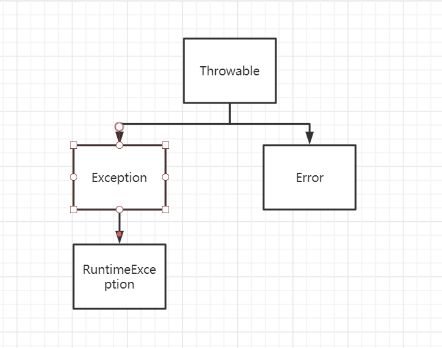
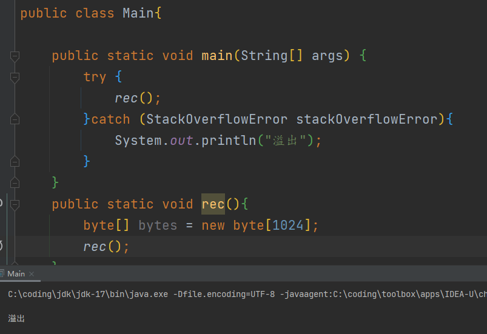
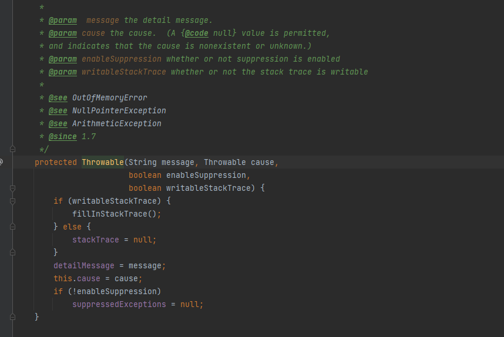

## 异常

### 异常简介

何为异常？就是程序因为某些非语法错误原因导致的意外情况，可能是没有控制变量范围，可能是没有权限读取等

举个例子

```java
public void fun(int a,int b){
    int c = a/b
}
```

这个例子我没有控制b的范围，也没有任何语法错误，试想如果b == 0 时，除数为0是不是就是一种异常情况？

（实际上运行时会抛出一个异常）

### 异常分类

只展示实际用途中最广泛使用的几种



#### Throwable

所有异常的顶级接口

其接口描述为

```txt
The Throwable class is the superclass of all errors and
exceptions in the Java language. Only objects that are instances of this
class (or one of its subclasses) are thrown by the Java Virtual Machine or
can be thrown by the Java throw statement. Similarly, only
this class or one of its subclasses can be the argument type in a
catch clause.
```

翻译一下

```
Throwable类是所有错误和错误的超类。只有这个类(或它的一个子类)的实例的对象可以由Java虚拟机抛出，或者可以由Java的throw语句抛出。同样的,只这个类或它的一个子类可以是catch子句中的参数类型。
```

这就是规范了java的异常机制，如果是异常就必须是这个类的子类

#### Exception

程序员自定义异常的父类

```java
The class {@code Exception} and its subclasses are a form of{@code Throwable} that indicates conditions that a reasonablea pplication might want to catch.
```

简单来说就是这个异常是明确知道原因且希望被捕获

这个类本身和其大部分子类抛出时要在方法签名上注明，方法签名上有这个异常声明的一定要捕获或者向上抛出，专有名词被称为 `checked exception`（受检异常）

#### Error

```
An {@code Error} is a subclass of {@code Throwable}
that indicates serious problems that a reasonable application
should not try to catch. Most such errors are abnormal conditions.
The {@code ThreadDeath} error, though a "normal" condition,
is also a subclass of {@code Error} because most applications
should not try to catch it.
```

简单来说就是一个不希望被捕获的异常，一般是触发了重大异常程序无法正常继续运行

let it crash 但你说能不能catch呢？其实是可以的 但是不推荐



#### RuntimeException

这个是Exception子类

```
<p>{@code RuntimeException} and its subclasses are <em>uncheckedexceptions</em>.  Unchecked exceptions do <em>not</em> need to bedeclared in a method or constructor's {@code throws} clause if theycan be thrown by the execution of the method or constructor andpropagate outside the method or constructor boundary.
```

简单来说这个类及其子类抛出时不需要标识在方法签名中

专有名词为`unchecked exception`

### 异常处理和抛出

#### 处理

在开发中我们调用第三方类库或者jdk类库往往能看到形如这样的方法

```java
public void run() throws Exception{
//todo
}
```

当我们调用时一般有两者方法处理

1，向上抛出 2，自行捕获处理

##### 向上抛出

**请注意这个方法治标不治本**，本质不处理,处理交给方法调用者处理，如果一直不处理传递到main就会终止程序

```java
public static void exceptionMethod() throws Exception {

    }
public static void handleException1()throws Exception{
        exceptionMethod();
    }
```

##### 自行捕获处理

注意这里我们会提到一个新的语法try..catch

checked exception必须捕获，unchecked exception 可以捕获也可以不捕获

这样异常就不会继续传播了

```java
public static void handlerException2(){
        try {
            exceptionMethod();
        } catch (Exception e) {
            e.printStackTrace();
        }
    }
```

#### 抛出

对于异常我们通过一个关键字throw抛出

请记住throw一个checked exception需要在方法签名上标识

```java
public static void throwException() throws Exception {
        throw new Exception("发生异常");
    }
```

而对于一个unchecked exception则不需要

```java
 public static void throwRuntimeException(){
        throw new RuntimeException();
    }
```

### try..catch..finally

对于try语句块后面可以跟随catch块或者finally块，或者一起 

对于finally块的意义在于无论是否发生异常这个块必定的会执行

#### try..catch

```java try {
public static void tryCatch1(){
        try {
            int i = 1 / 0;
        }catch (ArithmeticException e){
            System.out.println("arithmetic");
        }catch (RuntimeException e){
            System.out.println("runtime");
        }
    }
    public static void tryCatch2(){
        try {
            int i = 1 / 0;
        }catch (RuntimeException e){
            System.out.println("arithmetic");
        }catch (ArithmeticException e){
            System.out.println("runtime");
        }
        //正确写法
        //        try {
//            int i = 1 / 0;
//        }catch (ArithmeticException e){
//            System.out.println("arithmetic");
//        }catch (RuntimeException e){
//            System.out.println("runtime");
//        }
        
    }
```

对比这两个以及观察ide的提示

Error:(39, 10) java: 已捕获到异常错误java.lang.ArithmeticException

也就是说catch的上下顺序即子类到父类的顺序，必须先捕获子类，如果catch语句中无对应子类则取寻找其catch的父类异常，而且符合短路原则，优先被先声明catch的捕获，捕获后不再执行下面的catch

#### try..finally

```java
public static void tryFinally(){
        try {
            System.out.println("抛出前");
            if (1 == 1){
                throw new RuntimeException();
            }
            System.out.println("我不会执行");
        }finally {
            System.out.println("我一定执行");
        }
    }
```

控制台输出

```console
抛出前
我一定执行
```

#### 涉及到返回值的复合try…catch..finally语句*

**这一块更是重量级 没兴趣就别看了 没什么意义**

1，如果三个块均有return则返回finally里面的

2，如果finally没有return而在try return 前捕获了异常，则返回catch的return 

```java
 public static String complexTryCatchFinally(boolean hasException){
        try {
            System.out.println("执行try");
            throwExceptionByParam(hasException);
            return "try";
        }catch (Exception e){
            System.out.println("执行catch");
            return "catch";
        }finally {
            System.out.println("执行finally");
            return "finally";
        }
    }
    private static void throwExceptionByParam(boolean hasException) throws Exception{
        if (hasException){
            throw new Exception();
        }
    }
```

关于执行

```java
    System.out.println(LearnException.complexTryCatchFinally(false));
        System.out.println("---------------------");
        System.out.println(LearnException.complexTryCatchFinally(true));
    
```

控制台

```
执行try
执行finally
finally
---------------------
执行try
执行catch
执行finally
finally
```

当注释掉finally块时

控制台输出

```
执行try
try
---------------------
执行try
执行catch
catch
```

总结一下return实际看优先级顺序，其不代表着对应优先级低的块不执行

详见 [finally和return的执行顺序](https://blog.csdn.net/jdfk423/article/details/80406297)

#### try-with-resource*(建议学完之后的流再看)

```java
// try-with-resources - the the best way to close resources!
static String firstLineOfFile(String path) throws IOException {
    try (BufferedReader br = new BufferedReader(
           new FileReader(path))) {
       return br.readLine();
    }
}

```

即try允许传入一个资源（实际上就是实现autoclose接口），会最后自动关闭

详见：

[try-with-resources优先于try-finally](https://juejin.im/post/6844904021971435534)

[Try-With-Resources](https://juejin.im/post/6844903703619567624)

[try-with-resource使用，这个听说比传统资源关闭更好](https://juejin.im/post/6844904069572591630)

##### 利用twr块级作用域RAII的技巧*

有一些资源允许你手动释放 比如说连接池的链接，native内存的释放，文件描述符等

虽然jdk内部利用finalize（jdk18确定移除这个api了）或` java.lang.ref.Cleaner`等可以让gc帮我们辅助清除这些资源，但是存在资源释放不及时影响吞吐或者存在一定的资源泄露风险，所以有时候我们需要确定性析构，控制资源超过他的逻辑生命周期的时候释放掉

以java的project Panama引入的更友好的native memory api举例子：

s1,s2都会在twr块结束后直接释放掉，这样看起来更加直观且放心

```java
try (MemorySession session = MemorySession.openConfined()) {
    MemorySegment s1 = MemorySegment.map(Path.of("someFile"),
                                         0, 100000,
                                         MapMode.READ_WRITE, session);
    
    MemorySegment s2 = MemorySegment.allocateNative(100, session);
    ...
}
```

##### 利用twr块级作用域进行结构化并发的技巧*

**注意**：截止到本文commit（2022年4月22日）时，这个仍没有合并到主线中，使用的jdk为19-loom+5-429

其中每一次fork都会启动一个java虚拟线程（有栈协程）

你可以通过join等待全部的控制流分支完成 通过scope的close来确保结束后不再有控制流分叉

这种就可以帮助你写出明确控制流的并发程序且便利地统一控制资源的释放

```java
try (StructuredTaskScope<String> scope = new StructuredTaskScope<String>()) {
            Future<String> f1= scope.<String>fork(() -> {
                Thread.sleep(100);
                return "fork2";
            });
            Future<String> f2 = scope.<String>fork(() -> {
                Thread.sleep(200);
                return "fork2";
            });
            scope.join();
            System.out.println(f1.get()+" "+f2.get());
        }catch (Exception e){
            e.printStackTrace();
        }
```


### 自定义异常

直接继承对应父类即可，这样就可以在throw中抛出

#### checked exception

```java
public class CustomerCheckException extends Exception{}
```

#### unchecked exception

```java
public class CustomerUncheckedException extends RuntimeException{

}
```

### 异常的性能开销

太长不看版：只是个跳转 想用就用，性能开销不在抛出异常catch异常上面

写个伪代码来讲解catch原理，本质上就是一个跳转表 

```c
if error occur goto catch_method
else next    
    
```

 问题性能的关键在于填充堆栈，就是你的`Throwable::printStackTrace`的打印数据

我们先来看看如何不进行堆栈填充



找到Throwable源码查看javadoc可知 只需要writeStckTrace为false即可

即这样就行了 这样就可以把它作为低开销的控制流方法了

```java
public class NoStackTraceThrowable extends Throwable {

  public NoStackTraceThrowable(String message) {
    super(message, null, false, false);
  }
}
```

那么代价是什么？

代价就是你不再有**任何的堆栈信息**，比如说调用栈情况，代码行数等信息

但是有时候确实是有利的

**微服务中线程堆栈会很深（150左右）**，主要是因为 servlet 与 filter 的设计是责任链模式，各个 filter 会不断加入堆栈，如果是还存在反射，代理等会导致有大量的堆栈噪音，其实有效信息很少了。

对于填充堆栈需要访问StringTable和SymbolTable这两个的访问都需要`String::intern`方法，因为我们要看到的是具体的类名方法名，而不是类的地址以及方法的地址，更不是类名的地址以及方法名的地址

需要有大量的字符串拼接操作，而有效信息只有栈顶一点点，实际上有很多算力就这么浪费掉了。即有些时候我们只是单纯记录异常发生原因或者为了逻辑清晰的跳转 就可以不填充堆栈，只要传入的Message足够清晰即可

而且

HotSpot VM有个许多人觉得“匪夷所思”的优化，叫做fast throw：有些特定的隐式异常类型（NullPointerException、ArithmeticException（ / 0）之类）如果在代码里某个特定位置被抛出过多次的话，HotSpot Server Compiler（C2）会透明的决定用fast throw来优化这个抛出异常的地方——直接抛出一个事先分配好的、类型匹配的异常对象。这个对象的message和stack trace都被清空。抛出这个异常的速度是非常快，不但不用额外分配内存，而且也不用爬栈；但反面就是可能正好是需要知道哪里出问题的时候看不到stack trace了。


### 拓展资料

[从JVM视角分析try...catch...性能](https://juejin.im/post/6844903651413065741)

[OutOfMemoryError 可以被 try catch 吗](https://juejin.im/post/6874916707543187463)

[Java设计出checked exception有必要吗](https://www.zhihu.com/question/30428214/answer/528317237)

[传统的try-catch异常处理是否是编程语言发展中的弯路](https://www.zhihu.com/question/425726667/answer/1526948336)

[为什么我建议线上高并发量的日志输出的时候不能带有代码位置 - 知乎 (zhihu.com)](https://zhuanlan.zhihu.com/p/487807896)

#### 奇技淫巧*

如何既抛出一个checked异常又不需要调用者注明在方法上

```java
public class TricksOnException {

   
    //调用这个方法就行
    public static<E extends Throwable> void throwUncheckByGeneric(Throwable e) throws E{
        throw (E)e;
    }

    //调用这个方法就行
    public static void throwUncheckedByUnsafe(Throwable throwable){
        try {
            Field field = Unsafe.class.getField("theUnsafe");
            field.setAccessible(true);
            Unsafe unsafe = (Unsafe) field.get(null);
            unsafe.throwException(throwable);
        } catch (NoSuchFieldException | IllegalAccessException e) {
            e.printStackTrace();
        }
    }

    
    
}

```

