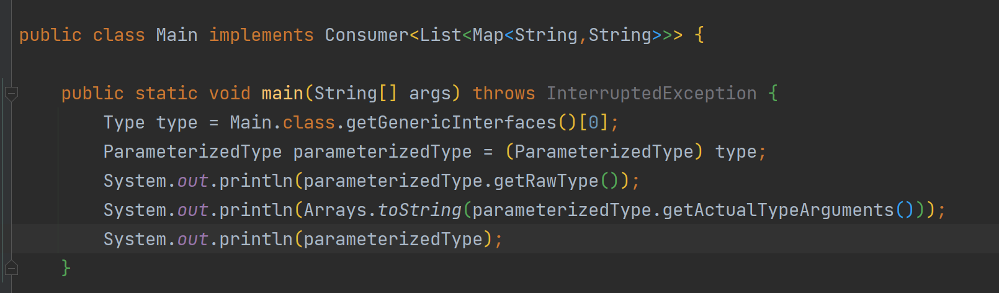

## 泛型与集合类

### 集合类

#### Collection接口

其上的描述

```
The root interface in the <i>collection hierarchy</i>.  A collection* represents a group of objects, known as its <i>elements</i>.  Some* collections allow duplicate elements and others do not.  Some are ordered* and others unordered.  The JDK does not provide any <i>direct</i>* implementations of this interface: it provides implementations of more* specific subinterfaces like {@code Set} and {@code List}.  This interface* is typically used to pass collections around and manipulate them where* maximum generality is desired.
```

简单来说就是用于储存元素的集合 

提供获取，移除，遍历，判断是否存在等功能

##### List接口

继承于Collection接口

其上的javadoc描述

```
An ordered collection (also known as a <i>sequence</i>).  The user of this
interface has precise control over where in the list each element is
inserted.  The user can access elements by their integer index (position in
the list), and search for elements in the list.<p>
```

简单来说就是一个有序集合

其最常用的实现类为`ArrayList`和`LinkedList`

以`ArrayList`为例

其中我们引入了一个新符号<>,这个指示其中应该存入什么类型的数据，被称为泛型，后面再讲

```java
List<Integer> list = new ArrayList<>();
list.add(1000);
System.out.println(list.get(0));
```

这个就是向第一个位置插入1000这个值，再获取

ArrayList你可以简单理解为可以自动伸缩的”数组“

| ArrayList和LinkedList对比 |          |                  |                  |
| ------------------------- | -------- | ---------------- | ---------------- |
|                           | 实现原理 | 是否支持随机读取 | 是否支持自动扩展 |
| ArrayList                 | 数组     | 是               | 是（数组扩容）   |
| LinkedList                | 双向链表 | 否               | 是(链表天然支持) |

##### Set接口

继承于Collection接口

其上javadoc描述

```
A collection that contains no duplicate elements.  More formally, sets
contain no pair of elements {@code e1} and {@code e2} such that
{@code e1.equals(e2)}, and at most one null element.  As implied by
its name, this interface models the mathematical <i>set</i> abstraction.
```

简单来说就是无论如何插入都会保证无重复数据

常用实现类为`HashSet`

```java
HashSet<Integer> set = new HashSet<>();
        set.add(100);
        set.add(100);
        set.add(2);
        System.out.println(set.size());
```

其大小为2

##### 如何遍历一个Collection

通用：

```java
        Collection<Integer> list = new ArrayList<>();
        Iterator<Integer> iterator = list.iterator();
        while (iterator.hasNext()) {
            System.out.println(iterator.next());
        }
        //是个语法糖，本质上就是上面那个
        for (Integer integer : list) {
            System.out.println(integer);
        }
        //下面这三种写法等价
        list.forEach(new Consumer<Integer>() {
            @Override
            public void accept(Integer integer) {
                System.out.println(integer);
            }
        });
        list.forEach((i)-> System.out.println(i));
        list.forEach(System.out::println);
```

前两个称为外部遍历，后面称为内部遍历

其区别就是遍历是由哪里遍历的

List:

```java
for (int i = 0; i < list.size(); i++) {
            System.out.println(list.get(i));
        }
```

留一个小问题：

相同的数据（插入顺序，值）list和set遍历结果一样吗

#### Map接口

其上的描述

```
An object that maps keys to values.  A map cannot contain duplicate keys;each key can map to at most one value.
```

简单来说就是建立键到值的映射,一个键对于一个值，就是数学函数中的单射

提供获取，插入，是否存在等功能

##### HashMap

`HashMap`是最常用的实现类

```java
        Map<String, Integer> map = new HashMap<>();
        map.put("s", 100);
        System.out.println(map.get("s"));
```

获取不到就会返回null

##### 遍历

```java
Map<String, Integer> map = new HashMap<>();
        map.put("s", 100);
        //键的遍历
        Set<String> set = map.keySet();
        for (String s : set) {
            System.out.println(map.get(s));
        }
        //值的遍历
        Collection<Integer> values = map.values();
        for (Integer integer : values) {
            System.out.println(integer);
        }
        //键值
        Set<Map.Entry<String, Integer>> entrySet = map.entrySet();
        for (Map.Entry<String, Integer> entry : entrySet) {
            System.out.println(entry.getKey()+":"+entry.getValue());
        }
        //下面两个等价
        map.forEach(new BiConsumer<String, Integer>() {
            @Override
            /**
             * @param s:键
             * @param integer:值
             */
            public void accept(String s, Integer integer) {
                System.out.println(s+" "+integer);
            }
        });
        map.forEach((key,value) -> System.out.println(key+" "+value));
```

#### hashset和hashmap是怎么判断两个对象相同的？

1，hashcode()   2，equals()方法

##### hashcode()

hashcode就是我们经常说的哈希值，简单来说就是把一个”对象“映射为一个固定长度的串，这里是把一个java实例映射到一个long值

一个默认的hashcode实现应该满足这些点：1，计算迅速 2，无论计算多少次哈希值都不能发生改变 3，允许不同的对象算出的哈希值相同，但是尽可能减少这种情况的出现 4，计算出的哈希值不同那么一定意味着对象不同

##### equals()方法

这个才是用于比较两个对象是否真正”逻辑“上相等的，即你通过重写这个方法和hashcode可以做到两个地址不同的对象 但是可以”相等“

综上，先比较hashcode是否相同，相同之后再调用equals判断是否相同


### 泛型

什么是泛型？

就是一种约束，类似于C++的模板

#### 为什么要用泛型

如果list不带<>则默认其中为object

```java
        ArrayList list = new ArrayList();
        list.add("adawd");
        list.add(100);
        String o = (String)list.get(0);
```

此时我们就无法知道其真实类型，此时类型转化是无法判断是否合法的

为了解决问题所以我们提供了泛型进行约束

不止如此，从方法泛用的角度来说，如果我们可以使用一个类型占位符代替这样我们就可以一套代码通用了，伪代码如下

```
public void  fun(T t){
        ////.......
    }
```

#### 类，接口泛型

先准备接口和类

```java
public class GenericClass<T>{
    private T t;

    public GenericClass(T t) {
        this.t = t;
    }
    public T method(){
        return t;
    }
}
public interface GenericInterface<T> {
    T method1();
    void method2(T t);
}
```

对于这个类

就是在调用构造函数的时候确定的，其泛型方法返回值就是它确定的泛型

```java
        GenericClass<String> stringGenericClass = new GenericClass<>("generic");
        String s = stringGenericClass.method();

        GenericClass<Integer> integerGenericClass = new GenericClass<>(100);
        Integer integer = integerGenericClass.method();
```

对于接口

既可以继承时指定亦可以用泛型占位符替代

```java
public class GenericInterfaceImp<T> extends GenericClass<T> implements GenericInterface<String>{

    public GenericInterfaceImp(T t) {
        super(t);
    }

    @Override
    public String method1() {
        return null;
    }

    @Override
    public void method2(String s) {

    }
}

```

对于匿名内部类

```java
GenericInterface<String> genericInterface = new GenericInterface<>(){
            @Override
            public String method1() {
                return null;
            }

            @Override
            public void method2(String s) {

            }
        };
```

ps：右侧的<>可以填入泛型，也可以不填，因为可以智能从左边推导出来

#### 方法泛型

方法也可以提供泛型，此时类是不是泛型类都没有关系

简单来说格式就是

<泛型占位符声明> 返回值(可以为占位符) 方法名（参数列表(可以包含泛型)）

```java
    public <T> T generic(HashMap map){
        return (T) map;
    }
    public static  <T> T staticGeneric(ArrayList<T> t){
        return t.get(0);
    }
```

调用如下

即若无法从参数或返回值推导出来类型就必须使用

method.<具体类型>fun()，调用

```java
        GenericMethod method = new GenericMethod();
        Object o = method.generic(new HashMap());
        Map map = method.<Map>generic(new HashMap());
        Map map1 = method.generic(new HashMap());

        String s = GenericMethod.staticGeneric(new ArrayList<String>());
        String s1 = GenericMethod.staticGeneric(new ArrayList<>());
```

#### 泛型实现原理

本质上还是object只不过获取的时候类型强制转化了

```java
Map map = (Map)method.generic(new HashMap());
```

所以对于下面这个方法的形参只可以调用Object的方法，而且无法new T()

```java
public <T> void fun(T t){
        
    }
```

有兴趣的同学可以参考类型擦除有关知识

#### 获取泛型信息*

注意，这个方法只适用于获取方法和类，字段上面的泛型，对于本地变量则不行



有什么用呢？这个一般在json这种反序列的情况下有用，比如说你需要反序列化一个List<Entity>这种嵌套泛型

你在Jackson，Gson可能见过一个类就是做这个用的

```java
public static void main(String[] args) throws InterruptedException {
        new ParameterHold<List<String>>(){}.getActualType();
   //其输出为 com.company.Main$ParameterHold<java.util.List<java.lang.String>>
    }


    abstract static class ParameterHold<T>{
        public void getActualType(){
            //这个方法返回一个type类型 这样就获取到了
           Type type = ((ParameterizedType)this.getClass().getGenericSuperclass()).getActualTypeArguments()[0];
            System.out.println(type);
        }
    }
```


#### 进阶泛型

解决对于只能调用Object的情况有以下方法

使用extends指示这个参数必须是那些的子类，即其类型上界

```java
   public <T extends List<String>> void fun(T t){
        t.add("ad");
    }
    public <T extends Number> T fun(T t){
        Integer i = t.intValue();
        return t;
    }
```

使用&标识这个实际类型必须是哪些的子类

```java
public class ComplexGenericClass<T extends List&Runnable> {
    public void fun(T t){
        t.run();
        t.add("d");
    }
}

```

请看这一篇文档[泛型的逆变与协变 - 知乎 (zhihu.com)](https://zhuanlan.zhihu.com/p/131602691)

#### java泛型痛点

1，无法通过new操作符获取泛型实例

2，无法获取形如T[]的数组

3，无法形如数组一样直接将子类集合引用赋值给父类引用（协变）

```java
Object[] objects;
        Integer[] integers = new Integer[10];
        //可以
        objects = integers;
        
        List<Object> list;
        List<Integer> list1 = new ArrayList<>();
        //不可以
        list = list1;
        //可以
        List list2 = list1;
```

4，虽然说泛型是为了类型安全，但是由于其使用的类型擦除机制实现，我们其实可以很简单地绕开

编译器不报错，但是一运行就出错

```java
public static void main(String[] args) throws Throwable {
        ArrayList<String> list = new ArrayList<>();
        addElement(list);
        String s = list.get(0);
    }
    public static void addElement(List strings){
        strings.add(100);
    }
```

报错信息

```java
Exception in thread "main" java.lang.ClassCastException: class java.lang.Integer cannot be cast to class java.lang.String (java.lang.Integer and java.lang.String are in module java.base of loader 'bootstrap')
	at com.Main.main(Main.java:19)
```

5，导致泛型相关的反射api极其复杂

#### 泛型tips*:

1,请注意java目前泛型是使用泛型擦除实现的，这种实现并不是所谓的”假泛型“

泛型的翻译有两种策略：同构翻译（homogeneous translation）和异构翻译（heterogeneous translation）。C++ 和（目前的）Java 的策略分别处于异构翻译和同构翻译的极端，一个为每种类型组合都创建一份特化，一个所有类型共享一种实现。而 C#/CLR 处于两者中间，为共享布局的引用类型同构翻译，为值类型异构翻译。

2，说是泛型擦除其实在字节码中还留有泛型信息作为参考

3，但是这并不意味着java泛型不再进步，请参考[Project Valhalla (java.net)](http://openjdk.java.net/projects/valhalla/)，做类似于CLR的那种泛型

#### 参考资料

[Java容器](https://juejin.im/post/6844904008390279176)

[Java泛型详解 - 简书 (jianshu.com)](https://www.jianshu.com/p/986f732ed2f1)

