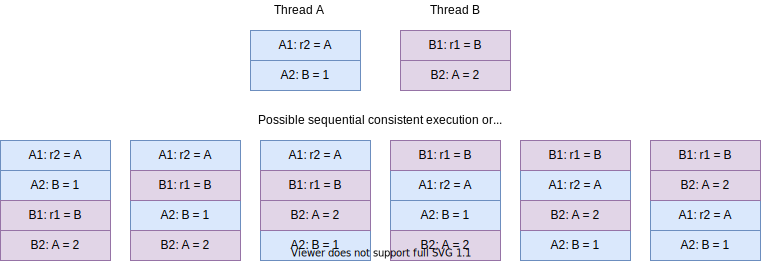

线程安全

### 并发那些事情

并发问题，或者说线程安全问题的根本原因是我们对编写代码的运行逻辑有某种预期，而这种预期 JVM 或机器无法满足。那么我们会有什么预期呢？

#### 像单线程一样执行

我们对代码运行逻辑的预期主要有两个：

1. 写在代码里的操作/语句，按先后顺序执行

2. 前面操作的结果对后面的操作可见

   ```java
   // 初始条件 x = 0; y = 0;
   1. x = 1;
   2. if (x > 0)
   3.    y = 2;
   ```

我们很自然地预期执行的顺序是 `1 > 2 > 3`，写在前面的先执行。同时在 #1 执行后，我们预期 #2 就能看到结果，于是 #2 的 `if` 判断结果为 `true`。

这是单线程的情况，我们预期代码的执行顺序就是代码撰写的顺序。那么多线程下呢？我们会有什么预期？

##### Sequential Consistency（线性一致性）

在多线程语境下，什么执行顺序才是合理的预期呢？Leslie Lamport 提出了 [Sequential Consistency](https://www.microsoft.com/en-us/research/uploads/prod/2016/12/How-to-Make-a-Multiprocessor-Computer-That-Correctly-Executes-Multiprocess-Programs.pdf) （顺序一致性）来更精确地定义我们的合理预期：

> ... the result of any execution is the same as if the operations of all the processors were executed in some sequential order, and the operations of each individual processor appear in this sequence in the order specified by its program.

考虑 CPU 多个核的执行顺序，多核的执行结果，相当于把每个核要执行的操作汇总排个序，在这个顺序里，要求每个核的操作依旧保持在单核内的相对顺序。例如，下图中有两个线程 `A` 和 `B`，它们各自要执行两个操作，则符合 Sequential Consistency 的顺序如下所示：



可以看到，这些顺序里，`A1` 永远在 `A2` 之前，`B1` 永远在 `B2` 之前，而 `A` 和 `B` 的相对顺序是没有指定的。换句话说，我们会希望，在并发的情况下，每个线程自己操作的执行顺序，在汇总的全局排序下依旧保持不变（代码撰写的顺序）。

可以理解为 Sequential Consistency 就是将多个线程要执行的代码交错(interleave)排成一个新的序列。

注意的是，Sequential Consistency 其实有两很强的隐藏假设：

1. 每一个操作都要是原子的，操作在执行过程中不能被打断。
2. 操作对下一个操作可见。如 `r1 = B` 执行结束后，后续操作读取 `r1` 时要读到 `B` 这个值。

这个假设很符合直接观感，后面我们会说明，其实jvm为了做到这一点做了大量的工作和约束（JMM）。我会单开一章来写所谓的 `内存顺序`

**注意**：本文提到的每一处代码都暗含了 此处代码执行的顺序和书写顺序一致 这个条件

#### 线程同步

Sequential Consistency 很好地描述了我们对多线程代码执行逻辑的合理预期，但 Sequential Consistency 对线程之间的操作先后并没有规定。如果我们希望先执行线程A 的某些操作，之后才允许执行线程 B 的某些操作（即线程同步）要怎么做呢？我们会看到，如果底层能满足 Sequential Consistency 的约定，则我们可以通过一些算法自己来实现同步。

首先为了方便描述如何 我们引入Dijkstra提出的信号量（semaphore）和P,V操作机制

注意P,V操作都是原子的，虽然有若干个指令组成，但是这些指令都是连续执行的，不会被其他指令打断

```c
struct semaphore{
    int value;
    queue* wait_queue
}
P(semaphore *s){
    s.value --;
    if s.value < 0 {
        s.queue.offer(current_thread);
        Block_thread(current_thread)
    }
}
V(semaphore *s){
    s.value ++;
    if s.value <= 0{
        Wake_thread(queue.pop());
    }
}
```

通过控制线程的阻塞和恢复，我们就可以控制进入某一个代码块的线程数目，当我们的信号量为1时就可以保证当前代码块同一时间只有一个线程在运行，这个代码块就称之为`临界区`

比如像这样

```c
semaphore mutex;
mutex.value = 1;
while(1){
    p(mutex);
    //do
    V(mutex)
}
```

#### 简单的线程模型和内存模型

Java内存模型的主要目的是定义程序中各种变量的访问规则，即关注在虚拟机中把变量值存储到内存和从内存中取出变量值这样的底层细节。此处的变量（Variables）与Java编程中所说的变量有所区别，它包括了实例字段、静态字段和构成数组对象的元素，但是不包括局部变量与方法参数，因为后者是线程私有的，不会被共享，自然就不会存在竞争问题。

> 此处请注意区分概念：如果局部变量是一个reference类型，它引用的对象在Java堆中可被各个线程共享，但是reference本身在Java栈的局部变量表中是线程私有的。

线程的工作内存中保存了被该线程使用的变量的主内存副本，线程对变量的所有操作（读取、赋值等）都必须在工作内存中进行，而不能直接读写主内存中的数据。不同的线程之间也无法直接访问对方工作内存中的变量，线程间变量值的传递均需要通过主内存来完成，线程、主内存、工作内存三者的交互关系如图12-2所示


> “假设线程中访问一个10MB大小的对象，也会把这10MB的内存复制一份出来吗？”，事实上并不会如此，这个对象的引用、对象中某个在线程访问到的字段是有可能被复制的，但不会有虚拟机把整个对象复制一次。

总结一下

变量如果要被线程访问，线程必须拷贝一份副本（值类型拷贝值，引用类型拷贝堆内地址），对其的操作都是对副本的操作，如果修改值其实就是修改副本的值然后save到主存中

即会发生这样的情况：


请问a = ?

我们预期的为5，事实上如果同时回写，我们并不知道是多少

这种在并发中不可知后果的情况 我们称之为线程不安全

#### 如何解决线程同步？

首先我们认识一个概念：原子性

原子性是指在一个操作中就是cpu不可以在中途暂停然后再调度，既不被中断操作，要不执行完成，要不就不执行

比如 a=0；（a非long和double类型） 这个操作是不可分割的，那么我们说这个操作是原子操作。

再比如：a++； 这个操作实际是a = a + 1；是可分割的，所以他不是一个原子操作。它由这么几个操作组成：1，从内存读取到寄存器2，对寄存器内的值+1 3，寄存器再回写到内存

我们大致可以认为在当前的64位环境下的基础数据类型的访问和赋值是具备原子性的。

对于上面入门部分提到的线程不安全的问题，我们只要把这个操作变为原子操作就可以了

试想如果一个变量同时只有一个线程操作它，是不是这些操作都可以视为原子操作？

即我们给临界资源加个权限认证，只有拿到权限的线程才能操作它

这个加个权限的行为，我们称之为**加锁** 

在Java中我们有两中加锁方式一种是利用关键字synchronized，一种是利用lock类，这两种就是我们之前提到的P，V操作在java的实现

#### synchronized

##### 使用

先看个例子

count初始值为0

首先这个方法肯定是线程不安全

```java
public void add(){
        //执行的过快，先休息一下
        try {
            Thread.sleep(10);
        } catch (InterruptedException e) {
            e.printStackTrace();
        }
        for (int i = 0; i < 100; i++) {
            count ++;
        }
    }
```

这样改造一下,就保证安全了

```java
public void safeAdd(){
        synchronized (this){
            add();
        }
    }
```

##### 讲解

看起来像是个方法，其实这是个关键字

首先小括号内可以填入任意实例对象

这个实例对象就是锁，在同一个锁的情况下大括号内的内容无论有多少行，无论有多少线程进入这个方法，其中都是原子操作，同时只有一条线程在执行里面的代码，其余线程则在等待

锁是需要争抢的，哪个线程抢到了哪个线程就独占执行

```java
synchronized (){
            
}
```

观察这个变种，虽然使用synchronized但仍旧不保持线程安全

为什么呢？因为每次都拿到一把新锁，每个线程都直接执行临界资源操作，也就是等于没做同步

```java
public void unsafeAdd(){
        synchronized (new Object()){
            add();
        }
    }
```

形象的说，一把锁就像一个看门人，一个看门人只许同时一个人进入，出来后才允许其他人进入

为了方便描述，我使用了锁这个词，实际上应该是管程（monitor）

##### 跨方法和可重入性

```java
public void reenter1(){
        synchronized (this){
            try {
                Thread.sleep(10000);
            } catch (InterruptedException e) {
                e.printStackTrace();
            }
            reenter2();
            System.out.println(Thread.currentThread());
        }
    }

    public void reenter2(){
       synchronized (this){
           System.out.println(Thread.currentThread());
       }
    }
```

启动两个线程

```java
LearnLock lock = new LearnLock();
        new Thread(lock::reenter1).start();
        new Thread(lock::reenter2).start();
```

你会观察到第二个线程很慢才打印出来

首先讲个前导知识：这一块和PV不太一样，是一种增强型的PV操作实现

获取锁A的线程，再次进入被A锁住的方法，不需要再次获取锁A，这个叫做可重入性

进入synchronized块一次计数+1，出去一次-1，到0时锁被释放，开始下一轮争夺

然后我们来讲一下这个代码发生了什么

从上到下我们称呼线程为A,B this锁为lock


A进入reenter1()获取lock开始休息，lock计数+1（lock = 1）

B进入reenter2()，因为lock在A“手”里，开始挂起等待lock被释放

A醒来执行逻辑，进入reenter2(),因为拥有lock所以直接执行逻辑并且lock计数+1 （lock = 2）

A执行完毕reenter2()，lock计数-1，（lock = 1）

A执行完毕reenter1()，lock计数-1，（lock = 0）

lock = 0,lock释放，B抢到锁开始执行reenter2() 

##### synchronized允许标注位置以及其对应的锁

1. 修饰一个代码块，被修饰的代码块称为同步语句块，其作用的范围是大括号{}括起来的代码，作用的对象是调用这个代码块的对象； 
2. 修饰一个方法，被修饰的方法称为同步方法，其作用的范围是整个方法，作用的对象是调用这个方法的对象； （this）
3. 修改一个静态的方法，其作用的范围是整个静态方法，作用的对象是这个类的所有对象； (类名.class)

#### lock

其用法和作用与synchronized一致

保证原子性，保证可重入性

```java
private Lock lock = new ReentrantLock();
```

##### 使用

用完记得解锁，否则会导致其他线程一直等待

```java
public void useLock(){
        lock.lock();
       try {
           //dosomething
       }finally {
           lock.unlock();
       }
        
    }
```

##### 高级特性

尝试获取锁

如果1s内无法获取锁就放弃去获取，`tryLock()`返回值标识有无获取到锁

```java
public void userTry(){
        try {
            if (lock.tryLock(1L, TimeUnit.SECONDS)) {
                //演示一直持有锁的情况
                //实际使用记得释放锁
                    System.out.println("获取锁"+Thread.currentThread());
                //                    lock.unlock();
            }else {
                System.out.println("放弃获取锁"+Thread.currentThread());
            }
        } catch (InterruptedException e) {
            e.printStackTrace();
        }
    }
```

#### 那线程的协作呢？

对于经典生产者消费者模型，则需要进行线程协作

线程A去消费，但是消费的资源没了，A休眠，B生产后唤起A

##### ｗait/notify机制

用单消费之单生产者举例

代码详见LearnCooperation类

```java
public synchronized void produce(){
        integerQueue.offer(((int) (Math.random() * 100)));
        //唤醒全部等待线程 notify()则是随机唤醒一个监视器中的等待线程
        this.notifyAll();
    }

    public synchronized void consumer(){
        //不该用if
        if (integerQueue.isEmpty()){
            try {
                this.wait();
                System.out.println("没有，开始休眠");
            } catch (InterruptedException e) {
                e.printStackTrace();
            }
        }else {
            System.out.println("消费一个"+integerQueue.poll());
        }
    }
public void singleToSingle(){
        //每秒生产一个
        Thread produce = new Thread(() -> {
            while (true) {
                produce();
                try {
                    Thread.sleep(1000);
                } catch (InterruptedException e) {
                    e.printStackTrace();
                }
            }
        });
        //每0.5s消费一次
        Thread consumer = new Thread(() -> {
            while (true) {
                try {
                    Thread.sleep(500);
                } catch (InterruptedException e) {
                    e.printStackTrace();
                }
                consumer();
            }
        });
        produce.start();
        consumer.start();
    }
```

请注意wait，notify的调用必须在同步代码块里面，而且其调用对象必须是当前同步代码块的锁

从wait中唤醒后还需要去抢锁

一对多

```java
 public void rightConsumer(){
        synchronized (this) {
            while (integerQueue.isEmpty()){
                try {
                    this.wait();
                    System.out.println("没有，开始休眠");
                } catch (InterruptedException e) {
                    e.printStackTrace();
                }
            }
        }

        System.out.println("消费一个"+integerQueue.poll());
    }
    public void singleToMulti(){
        //每秒生产一个
        Thread produce = new Thread(() -> {
            while (true) {
                produce();
                try {
                    Thread.sleep(1000);
                } catch (InterruptedException e) {
                    e.printStackTrace();
                }
            }
        });
        //每0.5s消费一次
        Thread consumer0 = new Thread(() -> {
            while (true) {
                try {
                    Thread.sleep(500);
                } catch (InterruptedException e) {
                    e.printStackTrace();
                }
                rightConsumer();
            }
        });
        Thread consumer1 = new Thread(() -> {
            while (true) {
                try {
                    Thread.sleep(500);
                } catch (InterruptedException e) {
                    e.printStackTrace();
                }
                rightConsumer();
            }
        });
        produce.start();
        consumer0.start();
        consumer1.start();
    }
```

请注意可能会发生虚假唤醒的可能

虚假唤醒就是一些obj.wait()会在除了obj.notify()和obj.notifyAll()的其他情况被唤醒，而此时是不应该唤醒的。

所以wait的调用一定要在while中

其实lock类也提供了相似的特性请查看lock.newCondition方法

其实现原理很简单

我使用一个伪代码展示一下

```java
class Monitor{
    private Queue<Thread> waitQueue;
    private Thread holdThread;
    public void wait(){
        if(holdThread != CurrentThread) throw new illegalException();
        waitQueue.offer(CurrentThread);
        unlock();
        LockSupport.park(CurrentThread);
    }
    
    public void signal(){
          if(holdThread != CurrentThread) throw new illegalException();
          Thread wait = waitQueue.pop();
          LockSupport.unpartk(wait);
    }
       
}
```

#### 死锁

当A拥有lockA，需要lockB，而B拥有lockB，需要lockA时就发生了死锁，这是我们编程时需要注意的

举个例子

```java
    public void getLock1(){
        synchronized (lock1){
            System.out.println(Thread.currentThread()+"获取锁1");
            getLock2();
        }
    }

    public void getLock2(){
        synchronized (lock2){
            System.out.println(Thread.currentThread()+"获取锁2");
            getLock1();
        }
    }

    public void deadLock(){
        new Thread(this::getLock1).start();
        new Thread(this::getLock2).start();
    }

```

调用deadLock即可以看到陷入死锁

如果在一个系统中以下四个条件同时成立，那么就能引起死锁：

1. 互斥：至少有一个资源必须处于非共享模式，即一次只有一个进程可使用。如果另一进程申请该资源，那么申请进程应等到该资源释放为止。
2. 占有并等待：—个进程应占有至少一个资源，并等待另一个资源，而该资源为其他进程所占有。
3. 非抢占：资源不能被抢占，即资源只能被进程在完成任务后自愿释放。
4. 循环等待：有一组等待进程 {P0，P1，…，Pn}，P0 等待的资源为 P1 占有，P1 等待的资源为 P2 占有，……，Pn-1 等待的资源为 Pn 占有，Pn 等待的资源为 P0 占有。

我们强调所有四个条件必须同时成立才会出现死锁。循环等待条件意味着占有并等待条件，这样四个条件并不完全独立。

本书的目的并不是教你学操作系统 所以如何避免死锁和死锁条件，如何设计锁请自行学习

#### 排除死锁

1，首先控制台输入指令jps获取java进程


2，找到当前进程 13792 Main,输入 jstack 13792获取堆栈信息

3，开始寻找打印出来的信息中的`Found one java-level deadlock`


得到死锁位置，去解决

或者使用jconole可视化排查 

## 附录

仅供参考 不理解也没关系

[Java内存模型与线程](https://juejin.cn/post/6890069015374102536)

[为什么条件锁会产生虚假唤醒现象](https://www.zhihu.com/question/271521213?sort=created)

