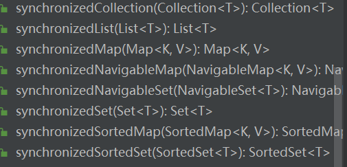
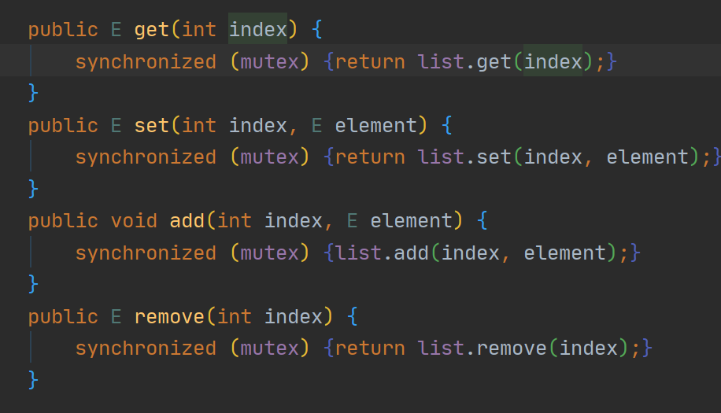
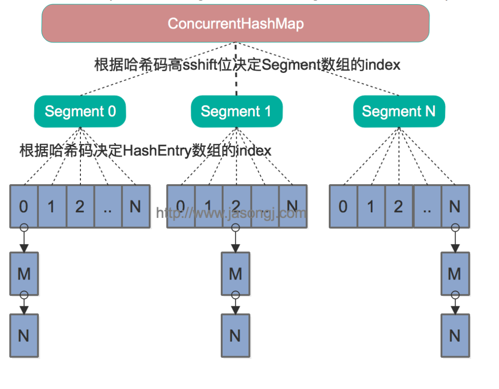
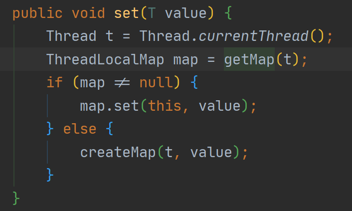

# 线程安全(2)

## 线程安全

### 常见的线程安全的例子

什么是线程安全，就是在多个线程并发的条件下仍然能够保障结果的一致性和正确性

举个例子：

五个线程执行i++一百次，在其并发条件下，无论这个操作执行多少次，结果必须为500

即线程安全最低的要就是结果的正确性，其中过程中正确性可以不保证

#### Time-Of-Check to Time-Of-Use

Time-Of-Check to Time-of-Use 简称为 TOCTOU 或 TOCTTOU，是指在检查某个状态到使用某个状态之间存在时间间隔，而在这段间隔中，状态被其它人修改了，从而导致软件Bug 或系统漏洞。在《Java 并发编程实战》里，也称为“先检查后执行” (Check-then-Act)模式。

不管是写Java 程序、与数据库打交道，TOCTOU 都是常见的问题。我们先来看看“延迟初始化”(Lazy Initialization)问题，它是一个典型的 TOCTOU 。

延迟初始化的初衷是有一些初始化操作代价比较大，因此希望：

1. 在调用时才真正执行初始化，不影响程序启动
2. 初始化后，后续再调用方法，则使用的是初始化的结果

延迟初始化有多种表现形式，我们以“单例”（Singleton）的实现为例：

```java
public static class LazyInitialization {
  private static ExpensiveObject instance;

  public static ExpensiveObject getInstance() {
    if (instance == null) {
      instance = new ExpensiveObject();
    }
    return instance;
  }
}
```

开始时先判断 `instance` 是否为空，如果为空则执行初始化操作（new 一个 `ExpensiveObject` 对象），最后返回初始化完成的对象。这是一个典型的 TOCTOU 的操作。

问题在于，如果有两个线程同时执行这段代码，可能执行顺序如下：

```
--------------- Thread A ----------------+--------------- Thread B --------------
if (instance == null) {                  |
                                         | if (instance == null) { // ①
                                         |     instance = new ExpensiveObject();
  instance = new ExpensiveObject(); // ② |
return instance;  // ③                   |
                                         | return instance; // ④
```

- ① 中，虽然线程 A 已经判断，准备初始化，但是由于初始化未完成，因此线程 B 的条件依旧满足，也会进行初始化
- 语句 ② 的执行，其实依赖 instance 为空，但实际执行时，这个条件已经被破坏了
- 于是在 ③ 和 ④ 中，线程 A 和线程 B 得到了不同的 instance，无法达到“单例”的效果。

解法：保证原子性

我们可以看到，TOCTOU 的主要问题在于状态的检查和状态的使用整体上不是原子的，而前面的章节中我们知道 Java 中最简单的实现原子性的方式是使用内置锁（intrinsic lock），即 `synchronized` 关键字：

```java
public static class LazyInitialization {
  private static ExpensiveObject instance;

  public synchronized static ExpensiveObject getInstance() {
    if (instance == null) {
      instance = new ExpensiveObject();
    }
    return instance;
  }
}
```

在 `getInstance` 方法前加上 `synchronized` 关键词，可以保证在同一时刻，只可能有一个线程在执行 `getInstance` 内的逻辑。这样保证了只会有一个线程在检查 instance 是否为空，且在状态使用之前，instance 不会被其它线程更改。换句话说，在状态的使用时，检查时得到的条件依旧成立。

当然，`synchronized` 是互斥锁，意味着即使初始化正确完成后，依然只有一个线程能执行代码，于是在并发下性能不好。

注意代码里的 `synchronized`。这个代码能正确运行，但是效率低下，因为 `synchronized` 是互斥锁，后续所有 `getHelper` 调用都得加锁。于是我们希望在 `helper` 正确初始化后就不再加锁了，尝试如下实现：

```java
class Foo {
  private Helper helper = null;
  public Helper getHelper() {
    if (helper == null)             // ① 第一次检查
      synchronized(this) {        // ② 对 helper 加锁
        if (helper == null)         // ③ 同上个实现
            helper = new Helper();
      }
    return helper;
  }
}

```

1. 如果正确初始化后，所有的 `getHelper` ① 的条件失败，于是不需要`synchronized`
2. 如果未被正确初始化，则同上个实现一样，加锁进行初始化。

看起来是不是没有问题了？但是现实世界比我们想象的更加复杂，本小册虽然探讨并发问题都是基于代码所见即所得的前提下的，如果只考虑这个前提那么确实是没问题的。但是我们要面对各种各样的复杂情况，比如说编译器（c1,c2）会不会把它重排获取更好性能？不同架构的CPU在确保因果一致性的基础上会不会乱序发送流水线执行？这些都是不可知的，当然了本文不会去探讨这些都如何避免 以及发生的根源，这里我只给一个通用的二重检测的单例延迟初始化代码

```java
class Foo {
    //把 helper 对象设置成 volatile 的
  private volatile Helper helper = null;
  public Helper getHelper() {
    if (helper == null)             // ① 第一次检查
      synchronized(this) {        // ② 对 helper 加锁
        if (helper == null)         // ③ 同上个实现
            helper = new Helper();
      }
    return helper;
  }
}
```


### 那些常见的线程不安全的类

对于一个类，其类名如果不包含诸如`Concurrent`，`safe`之类的则默认为线程不安全的类

极端的来讲，所有的类在未读文档说明的情况前，都应该认为它是线程不安全的

以`java.util.ArrayList`为例演示一下线程不安全的情况

```java
public static void unsafeList(){
        ArrayList<Integer> list = new ArrayList<>();
        getThread(5,() -> {
            try {
                Thread.sleep(100);
            } catch (InterruptedException e) {
                e.printStackTrace();
            }
            for (int i = 0; i < 20; i++) {
                list.add(i);
            }
        })
                .forEach(Thread::start);
        Runtime.getRuntime().addShutdownHook(new Thread(() -> {
            System.out.println(list.size());
        }));
    }
```

其结果是不可预料的，可能是正常结束但是数值不对，也可能抛出异常

这就是出现了线程不安全的情况

这只是丢了数据，而其他类在多线程未确保线程安全的情况下甚至会导致硬件损伤

比如HashMap可能发生死循环的问题，直接导致CPU100%进而损伤硬件

### 线程安全的解决方案*

对于线程对临界资源的争夺，我们在上节课里面讲到了加锁这种操作，即让涉及到临界资源的语句进行串行化处理

#### 粗颗粒度的方案

如果对所有涉及到数据变化的操作加锁是不是就是可以保证了？

对于这个操作`java.util.Collections`这个工具类提供了一些方法用于达成这个效果



```java
public static void normalSafeList(){
        ArrayList<Integer> list = new ArrayList<>();
        List<Integer> synchronizedList = Collections.synchronizedList(list);
        getThread(5, () ->{
            try {
                Thread.sleep(100);
            } catch (InterruptedException e) {
                e.printStackTrace();
            }
            for (int i = 0; i < 20; i++) {
                synchronizedList.add(i);
            }
        }).forEach(Thread::start);
        Runtime.getRuntime().addShutdownHook(new Thread(() -> {
            System.out.println(list.size());
        }));
    }
```

这个能不能确保线程安全？

可以，但是效果不好我们来看看源码再来解释

以 `synchronizedList`方法举例，其返回值实际类型为`java.util.Collections`中的一个静态内部类`SynchronizedList`，我们来看部分源码



这就是一个典型的代理模式，由`SynchronizedList`保证线程安全，其实际功能还是由传入的那个List实例执行

其最大的问题，在于并发读的时候是没必要加锁的，读操作会影响到写操作

造成了不必要的加锁

#### 细颗粒度的解决方案

##### 写时复制

这种解决方案就是结果保证正确性，其核心思想每一次添加都复制一遍原数组再加入

其读写相分离，即在所有操作未完成前，中间读取会读取到脏数据

其最大优点在于读写互不干涉，读并不加锁，但是频繁复制数组性能消耗过大，适用于读多写少的场景

```java
public static void safeList(){
        CopyOnWriteArrayList<Integer> integers = new CopyOnWriteArrayList<>();
      
        getThread(5, () ->{
            try {
                Thread.sleep(100);
            } catch (InterruptedException e) {
                e.printStackTrace();
            }
            for (int i = 0; i < 20; i++) {
                integers.add(i);
           
            }
        }).forEach(Thread::start);
        Runtime.getRuntime().addShutdownHook(new Thread(() -> {
            System.out.println(integers.size());
           
        }));
    }
```

##### 读写互斥，写写互斥，读读并行

线程不安全一个常见的情况就是读写并行了，导致了读的时候看到了修改到一半的变量状态

比如说

```c
struct Message{int a,int b}
int modify(struct Message *m){
    *m.a = 1;*m.b = 2 
}
```

此时读线程就可能看到a修改成1，但是b没有修改成2的情况，为了解决这个情况我们需要写变成原子操作，同时尽可能提高并行度，做到读写互斥，写写互斥，读读并行

```java
class RWDictionary {
  private final Map<String, Data> m = new TreeMap<>();
  private final ReentrantReadWriteLock rwl = new ReentrantReadWriteLock();
  private final Lock r = rwl.readLock();
  private final Lock w = rwl.writeLock();
  public Data get(String key) {
    r.lock();
    try { return m.get(key); }
    finally { r.unlock(); }
  }
  public List<String> allKeys() {
    r.lock();
    try { return new ArrayList<>(m.keySet()); }
    finally { r.unlock(); }
  }
  public Data put(String key, Data value) {
    w.lock();
    try { return m.put(key, value); }
    finally { w.unlock(); }
  }
  public void clear() {
    w.lock();
    try { m.clear(); }
    finally { w.unlock(); }
  }
}}
```

他的实现原理用PV操作描述是这样的：

读写问题

RC 读进程数目0 mutex=1保护RC W写信号量

读

```
R(){
    P(mutex);
    RC++;
    if(RC==1) P(W);
    V(mutex);
    read();
    P(mutex);
    RC--;
    if(RC==0) V(W);
    V(mutex);
}
```

写

```
W(){
    P(w);
    write();
    V(w);
}
```

##### 分段

以下代码的运行环境为jdk1.7

```java
public static void safeMap(){
        ConcurrentHashMap<String, String> hashMap = new ConcurrentHashMap<>();
        getThread(5, () ->{
            try {
                Thread.sleep(100);
            } catch (InterruptedException e) {
                e.printStackTrace();
            }
            for (int i = 0; i < 20; i++) {
                hashMap.put(UUID.randomUUID().toString(),UUID.randomUUID().toString());
            }
        }).forEach(Thread::start);
        Runtime.getRuntime().addShutdownHook(new Thread(() -> {
            System.out.println(hashMap.size());

        }));
    }
```

其中这个线程安全的hahsmap的底层实现是基于一个事实

我们读写数据往往是随机分布的，也就是说我们没必要读写一个数据把整个表锁住

即使用分段锁，写数据只要锁住一段就好



##### CAS

什么是CAS?

CAS全称是Compare and Swap，即比较并交换，是通过原子指令来实现多线程的同步功能，将获取存储在内存地址的原值和指定的内存地址进行比较，只有当他们相等时，交换指定的预期值和内存中的值，这个操作是原子操作，若不相等，则重新获取存储在内存地址的原值。

其在jdk中的应用就是Atomic*类

一种线程安全的增加，是完全无锁的

```java
public static void safeNumber(){
        AtomicInteger integer = new AtomicInteger();
        getThread(5, () ->{
            try {
                Thread.sleep(100);
            } catch (InterruptedException e) {
                e.printStackTrace();
            }
            for (int i = 0; i < 20; i++) {
                integer.getAndIncrement();
            }
        }).forEach(Thread::start);
        Runtime.getRuntime().addShutdownHook(new Thread(() -> {
            System.out.println(integer.intValue());
        }));

    }

```

其优点在于线程不会被挂起，不需要锁（这是一种自旋锁，并不意味着这是我们传统意义上的那种重量级锁）

缺点也很明显，线程不停的循环，在竞争很激烈的情况下会导致空循环浪费cpu资源

补充一点：

在jdk1.8中ConncurerentHashMap也是利用CAS+synchronized实现的

#### 变量线程隔离

先引入一个前提，对于一个线程访问其内部的资源一定是串行访问的

对于大部分的情况都是在争夺同一个资源，如果人均有一个就不会产生这个问题了，即线程私有变量

这样就可以做到线程隔离

```java
public static void ThreadLocal(){
        ThreadLocal<Integer> local = new ThreadLocal<>();
        local.set(1000);
        new Thread(() -> {
            System.out.println(local.get());
            local.remove();
        }).start();
    }

```

输出为 null

为什么呢？

ThreadLocal其实就是类似于Thread -> Value的Map，一个线程对应一个值



其底层实现利用了Thread包含的一个ThreadLocal.ThreadLocalMap引用

*在使用的时候记住，当你不需要这个变量的时候需要及时调用remove()清除

##### 实际使用

```java
public class UserContext {
    public static class User{

        public String username;

        public User(String username) {
            this.username = username;
        }
    }
    private static ThreadLocal<User> userThreadLocal = new ThreadLocal<>();

    public static void set(User user){
        userThreadLocal.set(user);
    }

    public static User get(){
        return userThreadLocal.get();
    }
}

public static void testContext(){
        getThread(2, () ->{
            UserContext.set(new UserContext.User(Thread.currentThread().getName()));
           getUser();
        }).forEach(Thread::start);
    }

    private static void getUser(){
        UserContext.User user = UserContext.get();
        System.out.println(Thread.currentThread().getName()+"当前线程绑定的user的username为"+user.username);
    }
```

所以只要还在这个线程的生命周期，我们就可以利用上下文直接获取到绑定的值，而且还不用显式传参

实际应用：

对于传统servlet构型的web项目，一个HttpServletRequest就是绑定在一个线程上的，这样我们就可以在任意地方取到这个线程绑定的数值了

*请注意这个是绑定在一个线程上的，所以如果你在其中开启了一个子线程，在子线程其中是不能取到绑定的值的

#### 如何无锁化

因为涉及到锁就会产生线程的挂起，线程的空转，上下文切换等消耗额外资源进行同步的情况

所以如果不产生需要同步的情况，我们就能消除锁

##### 原子化

类似于Atomic*，对于所有的操作都是原子的，就不需要同步了

##### 封闭化

如果对其的读写时串行的也就不会产生线程安全问题

举个例子，上面提到的ThreadLocal就是线程私有，对其私有内容任意读写都是不加锁的

即这个资源并不是共享的

##### 不变性（只读性）

如果一个资源只允许读，任何形式的修改都会产生一份副本，则其也没有线程同步的需求

举个例子，String类，每一个修改都会产生一个String副本

我们很容易认为，如果创建一个对象后，没有任何代码修改它，它就是“不可变”的。很可惜这种观点是错误的，在 Java 中，不可变对象有着明确的要求

- 对象创建后其状态不能修改
- 对象所有的成员变量都是 `final` 修饰的
- 对象是正确创建的（在对象的创建期间，this 引用没有逸出）

创建后状态不能修改，例如类中有一个字段是 `private final Set<String> names`，虽然 `names` 引用本身不能修改（有 `final` 修饰），但技术上我们却可以向 `Set` 里增减元素。而不可变要求我们不能做这样的修改。实际上 Java 并不会做这些检测，只是如果不遵守这个规则，则不能保证对象就是线程安全的。

成员变量都是 `final` 修饰，实际上这是 Java 真正能检测到的内容。Java 会保证只有当一个对象的所有 `final` 成员变量都正确初始化后，该对象才对其它线程可见。

对象是正确创建的，反例是在构造函数内，将 `this` 指针传递给其它对象使用。例如在构造函数中启动新的线程，这个新的线程中使用了 `this` 指针。为什么要求对象是“正确创建”的呢？是因为 Java 需要保证不可变对象的可见性，但是无法在构造函数执行过程中，做到可见性保证，因此其它对象在构造函数中通过 `this` 访问某个成员变量，得到的值可能是有问题的。

#### 一图解决你要的线程安全的问题


**有并发的地方就需要用线程安全类**。虽然可能显而易见，要注意的是只有包装类提供的方法才保证是原子的，而里面存储的内容则没有。例如 `ConcurrencyHashMap<String, HashMap<String, Card>> accounts;` 外层 `ConcurrencyHashMap` 存储的是“人”到“帐户”的映射，内层 `HashMap` 存储的是这个人的“卡号”到“卡信息”的映射。那么如果并发直接对内层信息进行修改，是保证不了线程安全的。

**迭代器不是原子的**。线程安全的集合类只有提供的方法是原子的（如`get()`、`put()`等），由于并没有全局锁（也不应该有），从集合类中获得的迭代器（Iterator ）**不是**线程安全的，如：

```java
for (Map.Entry<String, Object> entry: concurrentMap) {...} // 线程不安全
```

**TOCTOU 问题依旧存在**。尽管线程安全类提供的方法本身是原子的，前面说过，基本操作是原子的不代表复合操作是原子的，如：

```java
ConcurrencyMap<String, Object> cache = new ConcurrencyHashMap<>();
// ...
if (cache.containsKey(x)) {
  return cache.get(x);
}
```

尽管 `cache.containsKey` 与 `cache.get` 方法都是原子的，但可能在 `get` 之前，由另一个线程执行了 `remove`，导致 `get` 失败，或执行了另一个 `put` 导致 `get` 的数据不符合预期。

幸运的是 JUC 类中提供了一些常见的原子复合操作，例如 `ConcurrencyHashMap` 中的 `putIfAbsent` 只有当key 不存在时才执行函数并插入，`computeIfPresent` 只有当 key 存在时才执行某个变换操作。