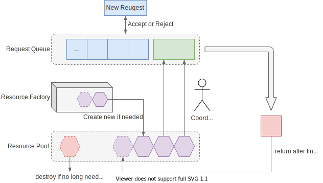
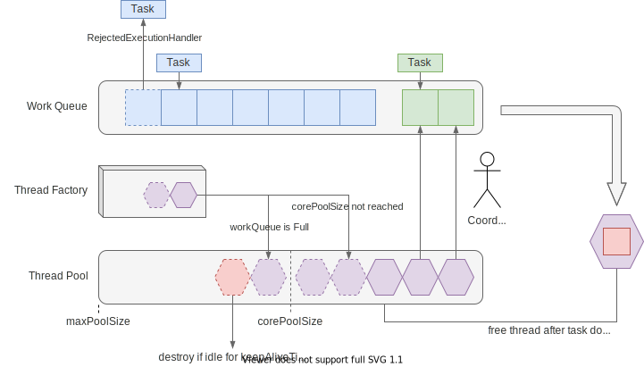
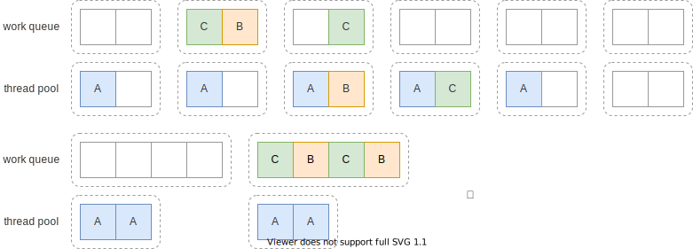

## 线程复用

> 我认为线程池本质上就是对于CPU执行任务的一种模拟

一个线程启动到销毁相对于其他正常代码运行消耗的性能要高

所以说我们可以复用多个线程，将其池化

## 如何使用jdk中的线程池

### 简单的线程池的实现

作为一个线程池其设计思路是这样的

1，需要复用线程，那么就需要让线程不终止。这里只要给一个while循环就好了

2，需要外界提交任务，并可以暂存一些来不及消费的任务，这里就是需要一个queue

3，综上一下，你会发现这就是一个生产者/消费者模型，即你可以写出来这种简单的线程池实现代码

```java
public class SimpleThreadPool {
    private Queue<Runnable> taskQueue = new LinkedList<>();
    private int count;
    public SimpleThreadPool(int count){
        this.count = count;
        IntStream.range(0,count)
                .mapToObj(i -> new Worker("Simple-ThreadPool"+i))
                .forEach(Thread::start);
    }

    public synchronized void execute(Runnable runnable){
        taskQueue.offer(runnable);
        this.notifyAll();
    }

    private synchronized Runnable getTask(){
        while (taskQueue.isEmpty()){
            try {
                this.wait();
            } catch (InterruptedException e) {
                e.printStackTrace();
            }
        }
        return taskQueue.poll();
    }

    private class Worker extends Thread{
        public Worker(String name) {
            super(name);
        }

        @Override
        public void run() {
            while (true){
                getTask().run();
            }
        }
    }
}

```

虽然存在很多性能问题，但是基础的线程复用也是达成了

### JDK的线程池

#### 利用工具类便捷创建线程池

Java通过Executors提供四种线程池，分别为：

- newCachedThreadPool创建可缓存的线程池，当任务多于当前线程，则会创建新的线程用于执行任务，当线程空闲时会被回收，创建的线程数**不受限制**。

- newFixedThreadPool 创建固定线程数的线程池，新任务提交时，线程池会不断创建新的线程，直到达到设定的最大值，其后不创建也不销毁线程，如果线程意外退出，会再创建新线程直到最大值。
- newScheduledThreadPool 创建固定大小的线程池，提交的任务可以指定以延迟或定时的方式运行，严格来说它返回的是 `ScheduledExecutorService`，虽然这个接口也继承了 `ExecutorService`
- newSingleThreadExecutor 创建一个单线程化的线程池，它只会用唯一的工作线程来执行任务，保证所有任务按照指定顺序(FIFO, LIFO, 优先级)执行。你可能会问有什么用，这个可以用来实现Actor模型，eventloop就是这种线程池
- newWorkStealingPool 构造工作窃取队列，是 JDK 1.8 新增的方法，基于 JDK 1.7 增加的 `ForkJoinPool` 实现，内部会使用多个工作队列来降低对队列的竞争，队列大小无上限。

```java
public static void JDKSimpleThreadPool(){
        ExecutorService pool = Executors.newCachedThreadPool();
        for (int i = 0; i < 1000; i++) {
            pool.execute(() -> {
                System.out.println(Thread.currentThread());
            });
        }
    }
```

#### 创建自定义一个线程池

```java
   ThreadPoolExecutor executor = new ThreadPoolExecutor(10, 20, 10, TimeUnit.SECONDS, new LinkedBlockingQueue<>(), Thread::new, new ThreadPoolExecutor.AbortPolicy());
    
```

#### 自定义线程池参数

##### **参数说明**

| 参数名              | 说明                                                         |
| ------------------- | ------------------------------------------------------------ |
| **corePoolSize**    | 线程池维护线程的最少数量。线程池至少会保持改数量的线程存在，即使没有任务可以处理。（注意：这里说的至少是指线程达到这个数量后，即使有空闲的线程也不会释放，而不是说线程池创建好之后就会初始化这么多线程） |
| **maximumPoolSize** | 线程池维护线程的最大数量。线程池最多可创建的线程数，即使队列中的任务满了线程数量也不会超过maximumPoolSize |
| **keepAliveTime**   | 线程池维护线程所允许的空闲时间。当线程池中的线程数量大于 corePoolSize时，超过corePoolSize的线程如果空闲时间超过keepAliveTime，线程将被终止 |
| **unit**            | 线程池维护线程所允许的空闲时间的单位，和keepAliveTime配合使用 |
| **workQueue**       | 线程池所使用的缓冲队列。ArrayBlockingQueue，LinkedBlockingQueue，SynchronousQueue，PriorityBlockingQueue |
| **handler**         | 线程池对拒绝任务的处理策略。AbortPolicy，CallerRunsPolicy，DiscardOldestPolicy，DiscardPolicy，自定义。即若缓冲队列满之后该怎么处理新增的任务 |

##### **各类型队列说明**

| 队列类型                  | 特性及使用场景                                               |
| ------------------------- | ------------------------------------------------------------ |
| **ArrayBlockingQueue**    | 有界队列，FIFO，需要指定队列大小，如果队列满了，会触发线程池的RejectedExecutionHandler逻辑 |
| **LinkedBlockingQueue**   | 无界队列，FIFO，可以无限向队列中添加任务，直到内存溢出       |
| **SynchronousQueue**      | 一种阻塞队列，其中每个 put 必须等待一个 take，反之亦然。同步队列没有任何内部容量，甚至连一个队列的容量都没有。可以简单理解为是一个容量只有1的队列。Executors.newCachedThreadPool使用的是这个队列 |
| **PriorityBlockingQueue** | 优先级队列，线程池会优先选取优先级高的任务执行，队列中的元素必须实现Comparable接口 |


##### **RejectedExecutionHndler类型**

| RejectedExecutionHandler | 特性及效果                                                   |
| ------------------------ | ------------------------------------------------------------ |
| **AbortPolicy**          | 线程池默认的策略，如果元素添加到线程池失败，会抛出RejectedExecutionException异常 |
| **DiscardPolicy**        | 如果添加失败，则放弃，并且不会抛出任何异常                   |
| **DiscardOldestPolicy**  | 如果添加到线程池失败，会将队列中最早添加的元素移除，再尝试添加，如果失败则按该策略不断重试 |
| **CallerRunsPolicy**     | 如果添加失败，那么主线程会自己调用执行器中的execute方法来执行改任务 |
| **自定义**               | 如果觉得以上几种策略都不合适，那么可以自定义符合场景的拒绝策略。需要实现RejectedExecutionHandler接口，并将自己的逻辑写在rejectedExecution方法内。 |

### 异步编程*

#### 第三个使用多线程线程的方法

Callable,允许返回值异步

```java
public static void Async(){
        Callable<Integer> action = () -> {
            //模拟耗时
            Thread.sleep(1000);
            return 10;
        };
        FutureTask<Integer> task = new FutureTask<>(action);
        new Thread(task).run();
        //阻塞直至获取到
        try {
            System.out.println(task.get());
        } catch (InterruptedException e) {
            e.printStackTrace();
        } catch (ExecutionException e) {
            e.printStackTrace();
        }
    }
```

这种一直阻塞至获取到值，显然不是我们想要的，但这算迈出了异步编程的一大步

#### 声明式异步编程

#### CompletableFuture

这就是一步步不断处理数据

```java
public static void modernAsync(){
        C CompletableFuture.supplyAsync(() -> {
            try {
                Thread.sleep(1000);
            } catch (InterruptedException e) {
                e.printStackTrace();
            }
            return 10;
        })
                .thenApply(Object::toString)
                .thenApplyAsync(Function.identity())
                .thenAccept(System.out::println);
    }
```

每一个都是传入了一个接口实现类(此处使用lambda代替)，用于声明原函数执行完后该做什么

#### 细节

1，其中` CompletableFuture.supplyAsync()`这个默认跑在`ForkJoinPool#commonPool()`中

也存在一个重载方法用于指定任务跑在哪个自定义线程池中

2，以*Async结尾的方法，传入的函数则会在指定线程池中运行

我认为这个设计是有点问题的，虽然Promise/Future设计为一个同一个类是很方便实现的，但是jdk提供的CompetableFuture同时暴露了Promise/Future语义的API，对于使用是非常不方便的。

注意此处的异步编程/并发都是依赖于多线程的，但是不意味着异步编程一定需要多线程，CompetableFuture只是一种拍平回调的工具

### 附录

[线程池](https://juejin.cn/post/6844903853695959054)

[java8：使用`CompletableFuture`编写异步代码（翻译）](https://juejin.cn/post/6844904058566754317)

## 扩展环节

### 概念

#### 为什么要复用内核线程？

- 线程生命周期的开销高。如线程的创建和销毁，需要操作系统辅助
- 资源消耗。大量如空闲的线程会占用内存，大量线程竞争 CPU 时会有额外开销
- 稳定性。通常操作系统限制了一些资源，如最大线程数，线程的栈大小等。过多线程会可能会出错

首先是内存消耗

操作系统会为每个线程的堆栈分配内存，线程不退出，内存就会不释放（注意栈的内存属于广义意义上的“堆外内存”）。

Java 中可以通过 `-Xss` 来设置，在调用诸如 `pthread_create` 等方法时，JVM 会将 `Xss` 的值作为参数，决定了创建线程的栈空间大小，默认是 `1024KB`。那么理论上，你创建了 1000 个线程，就占用了约 1G 的虚拟内存，如果只是申请内存，那么操作系统只分配了虚拟内，只有当真正去访问这些内存时，操作系统才会将虚拟内内存映射到物理内存上，才真正消耗物理内存。**除非线程栈真的被使用了，否则几乎不占用物理内存**。

其次是时间消耗，这就需要回到我们之前提到的线程切换上了，我们之前提到了线程切换本质上就是替换保存各种寄存器状态，结构体状态，你在有些文章可能会看到现代操作系统线程切换的时间其实是较短的，但是这种只是衡量了线程切换的直接代价，还存在一些间接代价，比如说重新预热tlb，页表，cache置换等代价。因此我们需要控制一下线程的个数，其实还有同等重要的一点在于控制线程的任务类型 （这一点我们讲非阻塞异步任务的时候再说）[测量 Linux 线程的上下文切换和内存开销](https://eli.thegreenplace.net/2018/measuring-context-switching-and-memory-overheads-for-linux-threads/)

同时我们也看到，绝大多数情况下，线程创建的开销、线程的内存占用及线程切换等开销都不太会成为瓶颈。因此虽然“线程池”技术本身的确能减少一些开销，但在我看来这并不能成为使用线程池的主要理由。

如果我们仔细挖掘，会发现我们使用线程执行任务，初衷是要并行执行任务，但是如果任务多了，我们其实有一些衍生的管理、编排的需求，例如：

- 顺序管理。任务按照什么顺序执行？（FIFO、LIFO、优先级）？
- 资源管理。同时有多少任务能并发执行？允许有多少任务等待？
- 错误处理。如果负载过多，需要取消任务，应该选哪个？如何通知该任务？
- 生命周期管理。如何在线程开始或结束时做一些操作？

上面列举的只是能想到的部分需求。其实推而广之，通常开始时我们只关注“任务”本身，但量变引起质变，数量多了，相应的会衍生出许多的管理、编排的需求。

#### 合理的线程池设计应该是什么样子的

其实不只是线程池，对于各种池化资源的设计思路都是一致的



- Request Queue（请求队列）。需要有一个队列来缓冲收到的请求
- 新的请求到来时，根据请求队列是否已满，选择接受或拒绝请求
- Resource Pool（资源池）。需要有一个“池子”来保存资源
- 资源不足时，可能向某个资源工厂申请创建新的资源
- 通常资源池中只保留一定数量的资源，当资源不再需要时，则销毁资源
- Coordinator（协调者）一般会有一个协调的策略，决定如何为请求分配资源
- 当请求的资源使用结束后，会将资源返还给资源池
- 创建和销毁也会有相应的策略

#### jdk的线程池的接口

##### Executor

这个接口见名知意——执行器

```java
public interface Executor {
    void execute(Runnable command);
}
```

我们进行任务投递时最基础的一个方法就是这个，这个接口语义非常的宽松，任务是同步执行还是异步执行，是创建新线程、用线程池还是直接在当前线程上运行，都没有规定。正因如此我们可以依据此实现各种特性的线程池和

线程池的各种特性。比如说CallerRunsPolicy这个策略就是可以无感知地根据实际任务积压情况选择执行线程

##### ExecutorService

这个接口则是进一步定义了线程池的生命周期，比如说shutdown之类的管理操作

```java
public interface ExecutorService extends Executor {
    void shutdown();
    List<Runnable> shutdownNow();
    boolean isShutdown();
    boolean isTerminated();
    boolean awaitTermination(long timeout, TimeUnit unit) throws InterruptedException;
    //...
}

```

 `ThreadPoolExecutor` 内部有很多多的状态：`RUNNING`, `SHUTDOWN`, `STOP`, `TIDYING`, `TERMINATED`，但从这个接口层面只有 `shutdown` 和 `terminated` 两种

#### 线程池参数

##### 线程数

让我们再回到上面那个图 再来结合之前的参数解释部分 我们很清楚地将其一一对应



其执行过程 让我抄一段美团的文章[Java线程池实现原理及其在美团业务中的实践 - 美团技术团队 (meituan.com)](https://tech.meituan.com/2020/04/02/java-pooling-pratice-in-meituan.html)

1. 首先检测线程池运行状态，如果不是RUNNING，则直接拒绝，线程池要保证在RUNNING的状态下执行任务。
2. 如果workerCount < corePoolSize，则创建并启动一个线程来执行新提交的任务。
3. 如果workerCount >= corePoolSize，且线程池内的阻塞队列未满，则将任务添加到该阻塞队列中。
4. 如果workerCount >= corePoolSize && workerCount < maximumPoolSize，且线程池内的阻塞队列已满，则创建并启动一个线程来执行新提交的任务。
5. 如果workerCount >= maximumPoolSize，并且线程池内的阻塞队列已满, 则根据拒绝策略来处理该任务, 默认的处理方式是直接抛异常


好 那么我们再来聊聊参数 到底给线程多少？


以上都是一种非常理想的情况给的参数，实际上我们在青柚的开发中我很推荐各位使用forkjoinpool，不用操心调这些参数，而且在我看了一些线上的应用源码发现我们往往使用线程池是在做阻塞的IO操作，尤其是网络IO操作，或者定时任务，这种东西之后我觉得可以使用java的loom协程来做，无脑开虚拟线程来跑，目前来说forkjoinpool足够使用了，也可以兼顾任务的CPU核负载均衡。

当然了，你会发现比如说美团这种公司会有研制的动态线程池实现，这种也是一种方法来做适配，比如说~~嵌入人工智能调参~~

其实作为云原生的时代，web服务又是无状态的，那么没必要对线程池进行自适应整定，一方面是不好测算具体值，一方面也可能对业务造成影响，还不如依靠容器平台的自动伸缩，负载或者请求量变化自动创建合适的容器数量。但是还是有很多组织的系统没有这种快速扩缩的能力，而且这也是两个不同维度，线程池更多偏重单机处理能力。

##### 拒绝策略

这一章节是非常主观的，其实不存在一个通用的解法。

还记得我们最开始说的吗？线程池本质上就是一个消费者/生产者模型，所以会存在一个生产和消费速度不匹配的情况，消费者快于生产者一般没什么问题，大不了消费者作为下游空闲一段实际，如果反过来呢？

思考一个情况，作为一个水管，上游的流量非常大，下游流量并不足就会发生堆积然后给管壁一个压力，若过大是不是就炸掉了？这种有个专有名词被压/回压（backpressure）我们要尽可能避免这种情况，所以要选择合适的拒绝策略，最理想的情况自然是让上下游匹配一下（比如说tcp中的窗口通知这种概念）

这里我建议的策略是自定义策略+自带策略，你需要记录一下此时触发了拒绝策略并且留下充足的上下文到日志中，然后再利用jdk提供的策略来处理

比如说：在线程池里，通过创建有界的队列，在队列满时会抛出异常，能及时给上游反馈，希望能减少生产的速率

#### 死锁

其实线程池死锁不是很常见，因为我们日常投递的任务都是单一任务，很少存在任务之间协作的，我在这里一提只是为了让你有个印象

若某个线程池是这样实现的，每一个线程都拥有自己的任务队列（forkjoin就是这种），投递任务不再是投递到一个公共的队列中，而是随机选择一个线程的队列投递。或者线程资源不足以支持并行运行这些任务

考虑任务 A 等待了任务 B、C 的结果，假设 A 将任务 B、C 提交到同一个线程的任务队列，那么可能发生下面的情形：



问题在于，在 B、C 任务执行完成前，任务 A 所在的线程会一直被占用。如果线程池中有空闲的线程，则 B、C 任务最终会被执行，从而任务 A 最终完成（图中上面的情况）。但是如果此时有两个任务 A 占用了线程池，导致提交的 B、C 任务无法执行，此时产生死锁（图中下面的情况）。

原因是任务 A 依赖 B、C 的结果，而 B、C 又依赖任务 A 退出释放线程资源。

注意若你使用的线程池包含任务窃取的功能，则也会存在这种情况

#### 任务延时

基础的线程池设计的一个前提是提交的任务的耗时都是差不多的，一些时间敏感的任务，和一些时长很长的任务一起提交到线程池中，可能出现大量线程被时长很长的任务占据，导致时间敏感的任务需要等待很长时间才能被运行，从而导致响应时间过长。

所以推荐在线程池中只运行同构的任务，同时为了防止死锁，尽量运行独立的任务。

所以你可以看到有一些系统里面设计了多个线程池，就是为了应对这种情况，避免任务的互相干扰