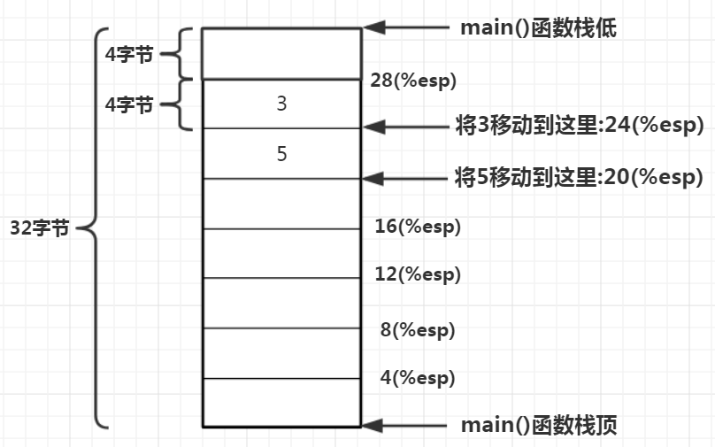
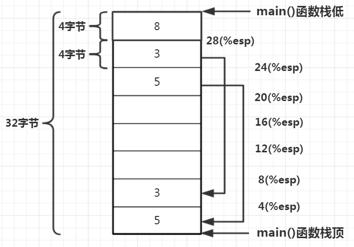
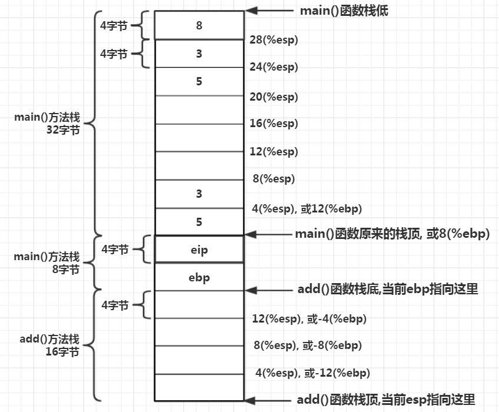
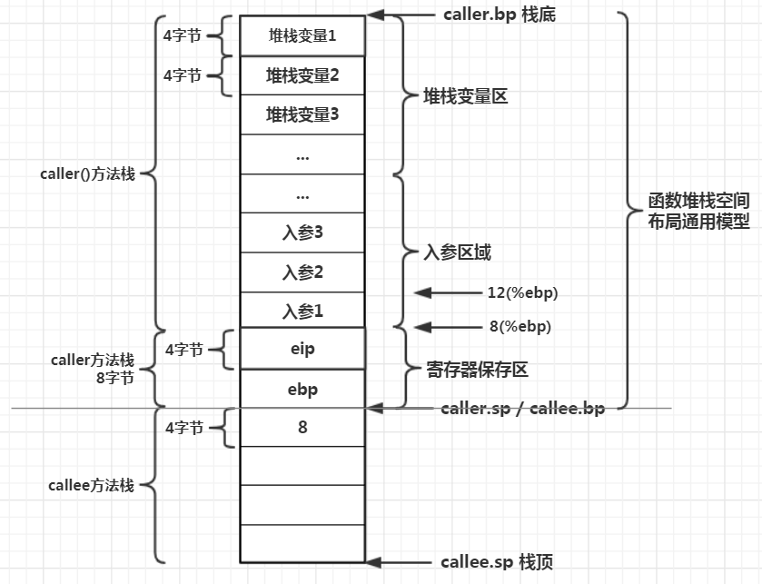
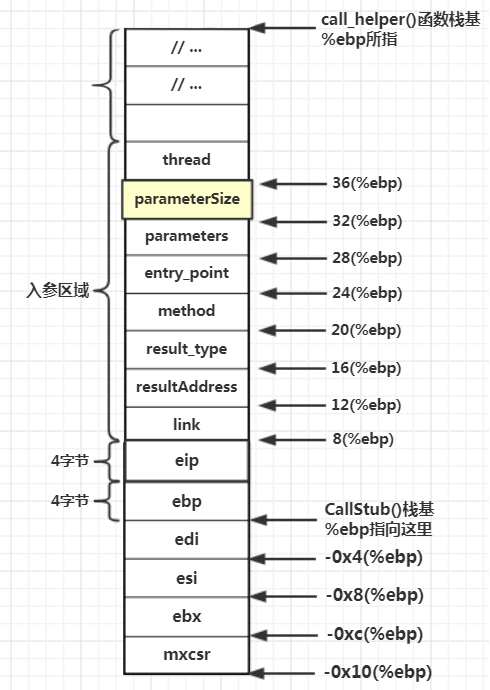
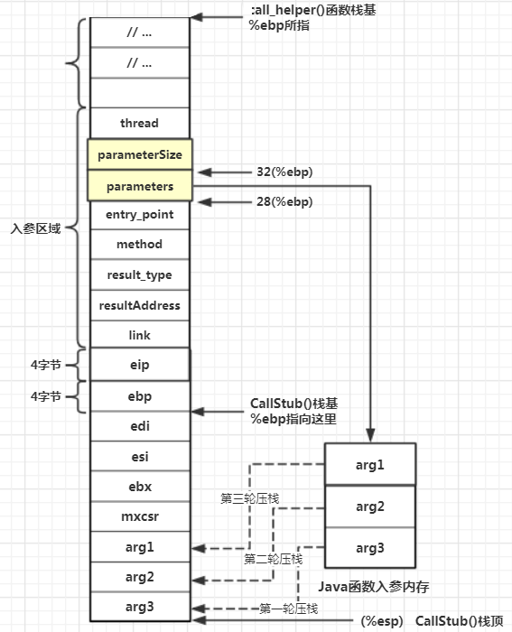

JVM作为一款虚拟机，必然要涉及计算机核心的3大功能：
1、**方法调用**：方法作为程序的基本单元，作为原子指令的初步封装，计算机必须支持方法的调用。同样Java语言的原子指令是字节码，Java方法是对字节码的封装，因此JVM必须支持对Java方法的调用
2、**取值**：指取出指令，方法是对原子的封装，计算机进入方法后最终需要逐条取出这些指令并逐条执行。同样JVM进入Java方法后，也要能模拟硬件CPU，能从Java方法中逐条取出字节码指令
3、**运算**：计算机取出指令后，就要根据指令进行相应的逻辑运算，实现指令的功能。同样JVM也需要具备对Java字节码的运算能力

# 方法调用

JVM作为一款虚拟机，想要具备执行一个完整的Java程序的能力，就必定得具备执行单个Java函数的能力。而要具备执行Java函数的能力，首先必须得能执行函数调用

## 真实的机器调用

比如用汇编编写的，对2个整数进行求和：

```asm
main:
	// 1.保存调用者栈基地址，并为main()函数分配栈空间
	pushl %ebp	// 保存调用者(操作系统)栈基地址
	movl%esp, %ebp	// 将调用者的栈基地址指向其栈顶，这2步是所有函数调用都会执行的指令
	subl$32, %esp	// 这里就是分配新栈，一共32个字节，%esp表示当前栈顶，subl表示减去，即将当前栈顶减去32字节的长度
			// 因为linux上栈是向下增长的，从内存的高地址位往低地址方向增长，因此每次调用一个新函数，需要分配栈空间都是做减法出来的
	
	// 2.初始化两个数据，一个是5，一个是3，将这两个整数保存到main()栈中
	movl$5, 20(%esp)	// 20(%esp)表示当前栈顶往上移20字节位置，数据5就被保存在这里
	movl$3, 24(%esp)	// 同理往上偏移24字节，由于在64位平台int占4位，即向上偏移6个整数的位置
	
	// 3.压栈：将5和3压入栈中
	movl24(%esp), %eax	// 将24(%esp)处的内存值传送到eax寄存器中
	movl%eax, 4(%esp)	// 又将eax寄存器中的值传到了4(%esp)这个地方，即中转后放到了4(%esp)这个位置
	movl20(%esp), %eax	// 同理，这么中转一下是因为CPU不支持数据从一个内存位置直接传送到另一个内存位置
	movl%eax, (%esp)	// 真实的物理机器，在发起函数调用之前，必定要进行压栈，压栈的目的是为了传参，这两个数据将被add()函数读取到
	
	// 4.调用add()函数
	calladd			// 调用add函数
	movl%eax, 28(%esp) 	// 得到add函数的返回结果，保存在eax寄存器中，因此从eax中拿

	// 返回
	movl$0, %eax	// 将值保存到eax寄存器中
	leave		// 执行后面这2条例行返回指令
	ret
```

下面来看add()函数：

```asm
add:
	// 1.保存调用者栈基地址
	pushl %ebp	// 栈基地址%ebp
	movl%esp, %ebp	// 栈顶%esp
	subl$16, %esp	// 往下开辟16字节栈空间
	
	// 2.获取入参
	movl12(%ebp), %eax	// ebp寄存器用于标识栈底位置，向内存地址高地址方向偏移12字节的位置取出数据，将数据传给eax寄存器
	movl8(%ebp), %edx	// 同理从add()栈底向上偏移8字节位置取出数据，传给edx寄存器
				// 随着堆栈寄存器ebp和esp所指向位置的变化，方法栈中同一个内存位置的偏移量也随之改变，
				// 对于压栈入参，既可以通过相对于调用者函数的栈顶偏移量来定位，也可以通过相对于被调用者的栈底偏移量来定位
	
	// 3.执行运算
	addl%edx, %eax		// 求和，将累加结果保存到eax寄存器中
	movl%eax, -4(%ebp)	// 把eax寄存器的值转移到栈基地址往下偏移4个字节的位置
	
	// 4.返回
	movl-4(%ebp), %eax	// 函数返回逻辑一般是，有返回值，就把返回值放到eax寄存器中
	leave			// 然后执行leave和ret指令，leave指令中其实顺带执行了mov %ebp, %esp 和 pop %eip
	ret			// add()执行完后把main()函数下一条指令地址出栈，存在eip，这样eip寄存器就又指向main()函数add指令的下一条指令了，当然之前先讲栈顶指向栈基位置
```

在main()与add()方法栈中间多了8个字节，是main()函数执行call add指令时，物理机器**自动往栈顶压了一个数值eip**。因为CPU所执行的指令位置由`CS:IP`这2个寄存器共同决定，**eip就是IP寄存器**，为了让main()函数执行完add调用回来后能继续处理main()函数接下来的指令，在main()函数接下来调用`movl%eax, 28(%esp)`这条指令之前，eip寄存器需要先指向这条指令，这样CPU才能读取到这条指令并执行。但是因为调用了add()函数，eip就会指向add()函数里面的指令内存位置，但是执行完函数后不知道接下来怎么做。**因此在机器执行call命令时自动将当前eip寄存器入栈，当被调用者执行完后物理机器再自动将eip出栈**，这样执行完被调用的函数后物理机器会接着执行调用者的后续命令。而另外的4个字节空间存放着**ebp**的值，是在执行add()函数时入栈的，add()函数开头第一条指令就是pushl %ebp，这里显示执行了push入栈操作

真实的物理机器在调用函数时，**先参数入栈，然后代码指针eip入栈，调用函数的栈基地址入栈，最后为调用方分配方法栈空间**。通过这段汇编可知，物理机器在执行程序时，将程序划分为若干函数，每个函数都对应一段机器代码，一段机器代码都放在一块**连续的**内存中，这块内存叫**代码段**。物理机器为每个函数分配一个**方法栈**，可以往里面放入数值，也可以将数值移到其他地方，或者读取数据，也可以从调用者的方法栈取值。**通过一条条指令和一个个栈**，物理机器得以运行完一整个程序

## C语言函数调用

C语言属于静态编译型语言，C语言代码被编译后**直接生成二进制代码**，而这些二进制代码正是由一条条机器指令组成，因此可以直接被物理机器执行，所以C语言中的函数调用本质上就是依靠物理机器提供的call指令完成的

```c
int add();
int main() {
	int c = add();
	return 0;
}

int add() {
	int z = 1 + 2;
	return z;
}
```

将这段C语言编译成汇编语言：

```asm
main:
	pusl %ebp
	movl%esp, %ebp
	andl$-16, %esp	// 与subl$16, %esp一样
			// 分配16字节空间是因为32位和64位机器上，堆栈内存都是按照16字节对齐的，多了不退少了一定补齐，主要为了能对内存快速定位、快速整理回收
	
	calladd			// 调用完add()函数又回到main()函数中后，物理机器会回收add()函数的堆栈空间
	movl%eax, 12(%esp)	// 同时eip和ebp这两个寄存器出栈，于是堆栈中仅剩下main()函数的内存，main()函数从eax寄存去中读取add()函数的返回值
	
	movl$0, %eax
	leave
	ret

add:
	pushl %ebp
	movl%esp, %ebp
	subl$16, %esp
	movl$3, -4(%ebp)
	movl-4(%ebp), %eax
	leave
	ret
```

s因此通过汇编和C语言，可以总结真实物理机器上执行函数调用的主要步骤：
1、保存调用者栈基地址(即当前栈基地址入栈)，当前IP寄存器入栈(即调用者中下一条指令地址入栈)
2、调用函数时，在X86平台上，参数从右到左依次入栈
3、一个方法分配的栈空间大小，取决于该方法内部的局部变量空间、为被调用者所传递的入参大小
4、被调用者在接受入参时，从8(%ebp)处开始，往上逐个获取每一个入参参数
5、被调用者将结果保存在eax寄存器上，调用者从该寄存器中获取返回值

## jvm函数调用

由于JVM是混合C/C++开发而成的，JVM执行引擎的最关键一点就在于实现了**由C语言动态执行机器命令**，这正是JVM与机器指令的边界所在。在JVM调用Java程序时，最终其实是执行机器指令，JVM内部边界的外面是C程序，边界里面则直接跳转到机器码。

C语言使用指针，可以访问内存，几乎能做机器指令所做的大部分事，所以几乎没搞不定的事情，而且相比汇编在语法上更加人性化，便于理解，因此一直很流行，只有对性能要求非常严苛的领域才需要汇编，例如视频软件的内存访问或操作系统底层的原子同步，而JVM内部的原子操作也基本全部采用汇编指令实现。言归正传，C语言的指针有一种重要的用法 —— **函数指针**，通过函数指针C语言可以将一个变量直接**指向一个函数的首地址**。C语言被编译时，C函数将被直接编译为机器指令，而这个函数指针将直接指向这段机器指令的首地址，那么就有人想到直接在源代码编译阶段就定义好一段机器指令，然后直接将一个C函数指针指向这段机器指令首地址，从而就间接实现了C语言直接调用机器指令的目的(除外C语言还有一种内嵌汇编的方式调用汇编指令，在Linux内核中大量使用)。JVM正是采用了这种方法，在JVM内部有一个类似于**函数指针**的结构，叫**call_stub**，这个函数指针正是**JVM内部C语言机器与机器指令的分水岭**，在JVM调用这个函数之前，主要执行C程序(其实还是C程序编译后的机器指令)，而JVM通过这个函数指针调用目标函数后，就直接进入了机器指令的领域

call_stub函数指针在JVM内部具有举足轻重的意义。Java字节码指令直接对应一段特定逻辑的本地机器码，而JVM在解释执行Java字节码指令时，会直接调用字节码所对应的本地机器码。而JVM是使用C/C++编写的，所以**JVM要直接执行本地机器码，便意味着必须要能够从C/C++程序中直接进入机器指令**，这种技术实现的关键便是使用C语言提供的一种高级功能 —— **函数指针**，通过函数指针能直接由C语言触发一段机器指令。而在JVM内部，**call_stub便是实现C程序调用字节码指令的第一步**，例如Java的main主函数的调用，在JVM执行Java主函数所对应的第一条字节码指令之前，必须经过call_stub函数指针进入对应的程序，然后在目标程序中触发对Java主函数第一条字节码指针的调用

## 函数指针

在C程序中，函数指针与指针函数很容易混淆，从定义上看：
1、如果函数名称前面的指针符号*没有被括号包含，则定义的是指针函数：int \*fun(int a, int b)
2、如果被括号包含，则定义的就是函数指针：int (*fun)(int a, int b)
函数指针与指针函数在含义上的差异就很大了：
1、指针函数声明的是一个函数，与一般函数声明无太大区别，唯一区别是指针函数返回类型是一个指针，一般函数返回的是普通变量类型
2、函数指针声明的是一个指针，只不过这个指针与一般指针不同，一般指针指向一个变量的内存地址，而函数指针则指向一个函数的首地址

函数指针的两种调用方式：
1、(*funcPointer)(参数列表)
2、funcPointer(参数列表)

函数指针作为C语言的高级应用，是实现C语言动态扩展能力的关键技术之一，如同Java中的反射与类动态加载技术。

这个动态特性就是：你可以用char*指向一段机器码，然后强行转化为函数指针调用就行了

## CallStub函数指针

```
// src/share/vm/runtime/stubRoutines.hpp
static CallStub call_stub() {
	// 宏，JVM中凡是函数名大写的基本都是宏
	return CAST_TO_FE_PTR(CallStub, _call_stub_entry);
}

// globalDefinitions.hpp
#define CAST_TO_FE_PTR(func_type, value)((func_type)castable_address(value))
```

将宏替换后，就是`return (CallStub)(castable_address(_call_stub_entry))`，内部其实就是让函数指针指向了某个内存地址，castable_address内部替换后(linux平台)就变成了`return (CallStub)(unsigned int(_call_stub_entry))`，即先将_call_stub_entry变量转换为unsigned int这一基本类型，然后再转换为CallStub这一自定义类型，该类型是函数指针类型，而**\_call_stub_entry** 本身是address类型，原型是unsigned int，**在JVM初始化的过程中被指向了某个内存地址**，在初始化的链路中最后调用generate_call_stub(StubRoutines::_call_stub_return_address)函数返回赋值给_call_stub_entry

CallStub是一种函数指针类型:其指向函数，返回类型是void，并且有8个入参(**注释里的内容很重要**):

```c
// /src/share/vm/runtime/stubRoutines.hpp
typedef void (*CallStub) (
	address link,		// 连接器，所属类型是JavaCallWrapper
				// 在Java函数的调用者和被调用者之间搭建了一座桥梁，通过这座桥梁，我们可以实现堆栈追踪，可以得到整个方法的调用链路
	intptr_t* result,	// 函数返回值地址
	BasicType result_type,	// 函数返回类型
	methodOopDesc* method,	// JVM内部所表示的Java方法对象，每个Java方法在被JVM加载时，JVM都会在内部为这个Java方法建立函数模型，即保存一份Java方法的全部原始描述信息
				// 调用CallStub()函数指针时将method()传进去是为了取到Java函数编译后的字节码信息，JVM拿到后就能对字节码进行解释执行了
	address entry_point,	// 继_call_stub_entry这个JVM最核心例程之后另一个主要入口，是JVM调用Java方法的例程入口，JVM内部的每一段例程都是在JVM启动过程中预先生成好的一段机器指令
				// 要调用Java方法，都必须经过本例程，即需要先执行这段机器指令
				// 事实上JVM每次从JVM内部调用Java函数时(相当于通过字节码指令调用目标Java函数)，必定调用CallStub函数指针，而该函数指针的值就是_call_stub_entry。JVM通过_call_stub_entry所指向的函数地址，最终调用到Java函数
				// 而在JVM通过_call_stub_entry所指向的函数调用Java函数之前，必须要经过entry_point例程。在在entry_point例程里面会真正从method()对象上拿到Java函数编译后的字节码
				// JVM通过entry_point可以得到Java函数所对应的第一个字节码指令，然后开始调用Java函数
				// _call_stub_entry与entry_point这两个例程其实就是两段机器指令，JVM提前写好了很多例程，例如函数进入、函数调用、函数返回、异常处理、静态函数调用、本地函数调用等，这些例程都直接使用机器指令写成
				// 对于例程其实可以想象成工具类，只不过例程是直接用机器指令写的(严格说是C语言运行期动态生成的)，工具类是用Java语言写的
				// 那么总结一下，在JVM主函数调用下，先调用CallStub指针，就是_call_stub_entry例程，然后调用entry_point，即entry_point例程，最后调用到Java函数						
	intptr_t* parameters,	// Java方法的入参集合，在JVM真正调用Java函数的第一个字节码指令前，会在CallStub()函数中解析入参，解析后JVM为Java函数分配堆栈，并将参数逐个入栈
				// 而Java解释型语言与C/C++等编译型语言不同，不直接在物理机器上运行，运行在虚拟机上，因此不能直接使用物理机器的方法栈，必须在虚拟机层面为每一个Java函数都建立堆栈模型
				// 这种堆栈模型中的局部变量都是Java语言的变量类型，所以JVM在正式调用Java函数前需要获取到参数类型、参数对象、参数顺序等信息
				// 而且Java在内存模型上，Java类的实例对象分配在堆中，堆栈中只保存了引用，在JVM内部就是一个指针，因为堆栈空间放不下大对象
	int size_of_parameters,	// Java方法的入参数量，让JVM在为Java函数分配堆栈空间时，根据这个值计算出Java堆栈空间大小
	TRAPS			// 当前线程对象
);
```

call_stub有8个入参，但是看到上面的call_stub()是没有参数的，那是为什么呢？其实这里**JVM隐式地调用了函数指针**，call_stub()函数最终返回的是一个函数指针的实例变量(初始化后的变量)，虽然call_stub()原型只有这么一行代码，可这行代码蕴含的逻辑十分丰富，编译器并不会真的将C语言程序转换为以下代码，编译器会自动生成中间变量，编译器编译后最终表现出来的逻辑类似以下形式：

```
static CallStub call_stub() {
	// 使用CallStub类型声明一个函数指针变量
	CallStub functionPointer;
	// 返回address类型的变量
	address returnAddress = castable_address(_call_stub_entry);
	// 转换为CallStub类型的变量
	functionPointer = (CallStub)returnAddress;
	return funcPointer;
}
```

call_stub()方法返回的**CallStub类型的函数指针变量**，调用者就可以像调用普通函数那样调用，只不过JVM不是显式调用这种函数指针变量，而是隐式进行了调用，还是要依靠编译器来实现隐式调用到显式调用的转变，让物理机器能够理解，编译器处理后的显示调用逻辑类似于：

```
// src/share/vm/runtime/javaCalls.cpp::call_helper()
void JavaCalls::call_helper(JavaValue* result, methodHandle* m, JavaCallArguments* args, TRAPS) {
	// ...

	// call_stub()调用开始
	{
		JavaCallWrapper link(method, receiver, result, CHECK);
		{
			HandleMark hm(thread);	// HandleMark used by HandleMarkClearner
			// 先声明一个CallStub类型的函数指针变量
			CallStub funcPointer;
			// 初始化函数指针变量，将其指向call_stub()函数首地址
			funcPointer = StubRoutines::call_stub();
			// 调用函数指针变量，传入8个参数
			funcPointer((address)&link,
					// (intptr_t*)&(result->_value), // see NOTE above (compiler problem)
					result_val_address,'
					result_type,
					method(),
					entry_point,
					args->parameters(),
					args->size_of_parameters(),
					CHECK);
			result = link.result();
			if(oop_result_flag) {
				thread->set_vm_result((oop)result->get_jobject());
			}			
		}
	}
	// call_stub()调用结束
	
	// ...
}
```

## _call_stub_entry例程

前面讲到JVM调用CallStub()时，先调动call_stub()函数，返回_call_stub_entry并被强转为CallStub这种自定义的函数指针类型，最终JVM调用这个函数指针，实现由C程序的世界转入机器指令的世界，完成分水岭的跨越，那么现在的问题就是需要了解，_call_stub_entry这个函数指针到底指向了哪里？

在X86 32位Linux平台上，JVM初始化过程中存在这么一条链路：

```
java.c: main()
	java_md.c: LoadJavaVM()
		jni.c: JNI_CreateJavaVM()
			Threads.c: create_vm()
				init.c: init_globals()
					StubRoutines.cpp: stubRoutines_init1()
						stubGenerator_x86_32.cpp: StubGenerator_generate()
							stubGenerator_x86_32.cpp: StubCodeGenerator()
								stubGenerator_x86_32.cpp: generate_initial()
```

在链路的最末端的stubGenerator_x86_32.cpp: generate_initial()函数对_call_stub_entry变量进行了初始化：

```
StubRoutines::_call_stub_entry = 
	generate_call_stub(StubRountines::_call_stub_return_address);

// 使用C语言动态生成机器码，即直接向内存空间写入汇编代码
address generate_call_stub(address& return_address) {	
    StubCodeMark mark(this, "StubRoutines", "call_stub");
    // 汇编器会将生成的例程在内存中线性排列。所以取当前汇编器生成的上个例程最后一行汇编指令的地址，用来作为即将生成的新例程的首地址
    // 因为本函数后续流程会继续往代码空间写入call_stub()的指令，而外面只要拿到这部分指令的首地址，因此先拿到start这个当前入口首地址，最后返回出去即可
    address start = __ pc();

    // stub code parameters / addresses
    assert(frame::entry_frame_call_wrapper_offset == 2, "adjust this code");
    bool  sse_save = false;
    const Address rsp_after_call(rbp, -4 * wordSize); // same as in generate_catch_exception()!
    const int     locals_count_in_bytes  (4*wordSize);

    // 定义一些变量，用于保存一些调用方的信息，这四个参数放在被调用者堆栈中，即call_stub例程堆栈中，所以相对于call_stub例程的栈基址（rbp）为负数（栈是向下增长）
    const Address mxcsr_save    (rbp, -4 * wordSize);
    const Address saved_rbx     (rbp, -3 * wordSize);
    const Address saved_rsi     (rbp, -2 * wordSize);
    const Address saved_rdi     (rbp, -1 * wordSize);
    // 传参，放在调用方堆栈中，所以相对call_stub例程的栈基址为正数，可以理解为调用方在调用call_stub例程之前，会将传参都放在自己的堆栈中，这样call_stub例程中就可以直接基于栈基址进行偏移取用了
    const Address result        (rbp,  3 * wordSize);
    const Address result_type   (rbp,  4 * wordSize);
    const Address method        (rbp,  5 * wordSize);
    const Address entry_point   (rbp,  6 * wordSize);
    const Address parameters    (rbp,  7 * wordSize);
    const Address parameter_size(rbp,  8 * wordSize);
    const Address thread        (rbp,  9 * wordSize); // same as in     generate_catch_exception()!
    sse_save =  UseSSE > 0;
    
    // stub code
    // enter()在X86对应的方法如下，用来保存调用方栈基址，并将call_stub栈基址更新为当前栈顶地址，C语言编译器其实在调用方法前都会插入这件事，这里JVM相对于借用了这种思想。这两句代码都调动emit()，向代码空间中加入机器指令
 ---------------------------------------------
|        void MacroAssembler::enter() {       |
|            push(rbp);                       |
|            mov(rbp, rsp);                   |
|       }                                     |
 ---------------------------------------------
    __ enter();

    // 接下来计算并分配call_stub堆栈所需栈大小
    // 先将参数数量放入rcx寄存器。这里类似汇编指令的C函数并不是运行时真正调用的函数，它们只不过是往代码空间中写入相同作用的机器码
    __ movptr(rcx, parameter_size);              // parameter counter
    // shl用于左移，这里将rcx中的值左移了Interpreter::logStackElementSize位，在64位平台，logStackElementSize=3；在32位平台，logStackElementSize=2；所以在64位平台上，rcx = rcx * 8，即每个参数占用8字节;32位平台rcx = rcx *4，即每个参数占4个字节
    __ shlptr(rcx, Interpreter::logStackElementSize); // convert parameter count to bytes

    // locals_count_in_bytes 在上面有定义：const int locals_count_in_bytes  (4*wordSize);这四个字节其实就是上面用来保存调用方信息所占空间
    __ addptr(rcx, locals_count_in_bytes);       // reserve space for register saves

    // rcx现在保存了计算好的所需栈空间，将保存栈顶地址的寄存器rsp减去rcx，即向下扩展栈
    __ subptr(rsp, rcx);

    // 为了加速内存寻址和回收，物理机器在分配堆栈空间时都会进行内存对齐，JVM也借用了这个思想。JVM中是按照两个字节，即16位进行对齐的：const int StackAlignmentInBytes = (2*wordSize)
    __ andptr(rsp, -(StackAlignmentInBytes));    // Align stack

    // save rdi, rsi, & rbx, according to C calling conventions
    // 将调用方的一些信息，保存到栈中分配的地址处，最后会再次还原到寄存器中
    __ movtr(saved_rdi, rdi);
    __ movptr(saved_rsi, rsi);
    __ movptr(saved_rbx, rbx);
    // save and initialize %mxcsr
	
    //......

    // 接下来就要进行参数压栈了
    Label parameters_done;
    // 检查参数数量是否为0，为0则直接跳到标号parameters_done处
    __ movl(rcx, parameter_size);  // parameter counter
    __ testl(rcx, rcx);
    __ jcc(Assembler::zero, parameters_done);

    Label loop
    //将参数首地址放到寄存器rdx中，并将rbx置0
    __ movptr(rdx, parameters);          // parameter pointer
    __ xorptr(rbx, rbx);

    // 标号loop处
    __ BIND(loop);

    // 此处开始循环；从最后一个参数倒序往前进行参数压栈，初始时，rcx = parameter_size；要注意，这里的参数是指java方法所需的参数，而不是call_stub例程所需参数！
    // 将（rdx + rcx * stackElementScale（）- wordSize ）移到 rax 中，（rdx + rcx * stackElementScale（）- wordSize ）指向了要压栈的参数。
    __ movptr(rax, Address(rdx, rcx, Interpreter::stackElementScale(), -wordSize));
    // 再从rax中转移到（rsp + rbx * stackElementScale（）） 处，expr_offset_in_bytes（0） = 0；这里是基于栈顶地址进行偏移寻址的，最后一个参数会被压到栈顶处。第一个参数会被压到rsp + （parameter_size-1）* stackElementScale（）处。
    __ movptr(Address(rsp, rbx, Interpreter::stackElementScale(),
                Interpreter::expr_offset_in_bytes(0)), rax);          // store parameter
    // 更新rbx
    __ increment(rbx);
    // 自减rcx，当rcx不为0时，继续跳往loop处循环执行。
    __ decrement(rcx);
    __ jcc(Assembler::notZero, loop);

    // 标号parameters_done处
    __ BIND(parameters_done);

    // 接下来要开始调用Java方法了
    // 将调用java方法的entry_point例程所需的一些参数保存到寄存器中
    __ movptr(rbx, method);           // get Method*
    __ movptr(rax, entry_point);      // get entry_point
    __ mov(rsi, rsp);                 // set sender sp
    // 跳往entry_point例程执行
    __ call(rax);

    //......
	
    __ BIND(is_double);
    // interpreter uses xmm0 for return values
    if (UseSSE >= 2) {
        __ movdbl(Address(rdi, 0), xmm0);
    } else {
        __ fstp_d(Address(rdi, 0));
    }
    __ jmp(exit);
	
    return start;
}
```

### pc()函数

`address start = __ pc();`保存当前例程所对应的一段机器码的**起始位置**。在JVM启动过程中，JVM会生成很多例程(即一段固定的机器指令，能够实现一种特定的功能逻辑)，每一个例程在开始都有这段代码，实际上JVM的所有例程都在一段**连续的内存中**，当JVM刚启动时，长度为0没有任何例程，第一个例程生成后，__pc()返回0，假设第一个例程占20字节，则当JVM生成第二个例程的时候，__pc()将返回20

### 定义入参

前面讲过的堆栈模型，一个函数的堆栈空间大致可以分3部分：
1、**堆栈变量区**：保存方法的局部变量、或对数据的地址引用(指针)。如果一个方法没有局部变量则编译器不分配堆栈变量区
2、**入参区域**：如果当前方法调用其他方法，传递了参数，那么这些入参会保存在调用者堆栈中，即压栈，参数会被复制一份放到压栈区域
3、**ip和bp区**：一个是代码段寄存器，一个是堆栈栈基寄存器，分别用于恢复调用者方法的代码位置，和恢复调用方法的堆栈位置

在pc()函数后面的代码，声明了许多Address类：

```
class Address {
private:
	// 表示一个物理寄存器，寄存器的作用是标记基址，因此命令为_base
	Register _base;
	// 表示偏移量
	int _disp;
public:
	// 构造函数
	Address()
		: _base(noreg),
		_disp(0)
	{   }
}
```

使用C++类对汇编堆栈寻址进行抽象后，便可以直接通过该类进行堆栈寻址了。比如`const Address result (rbp, 3 * wordSize);`，可以通过该对象还原出汇编指令12(%ebp)，其中`const int wordSize = sizeof(char*);`，在32位平台上sizeof(char*)返回4，64位平台下sizeof(char*)返回8

还有4个位置相对于rbp的偏移量是负的，这说明4个参数的位置在CallStub()函数的堆栈内部，而不是位于调用函数javaCalls::call_helper()堆栈内，因此相对于rbp的偏移量才是负的，这4个变量用于保存调用者的信息

### CallStub: 保存调用者堆栈

generate_call_stub()函数的逻辑部分从`__ enter();`开始:

```
void MacroAssembler::enter() {
	push(rbp);
	mov(rbp, rsp)
}
```

这两条指令最终会在JVM运行期被翻译为`push %bp`、`mov %sp, %bp`，就如同前面分析真实机器的调用，物理机器调用任何一个函数前都会执行这两条指令

### CallStub: 动态分配堆栈

对于C程序编译时，编译器会根据被调用函数中的变量声明，自动计算出被调用函数需要多大的堆栈空间，最终物理机器在执行这个C程序时，将按照编译器算出来的大小为被调用函数分配堆栈空间。而Java程序由于无法直接被编译为机器指令，因此Java编译器一般来说无法直接计算一个Java函数需要多大的堆栈空间，就算对堆栈空间进行了自动计算，还是无法实现Java函数的调用，因为Java有自己的变量类型，这些变量类型不像C语言的变量，是**并不能直接被编译为物理机器所识别的数据类型**的。(当然对于强类型的Java语言，是完全可以做到直接将Java语言编译为机器指令的，JVM的**JIT编译器**就是这种实现方式，不过这种直接编译为机器指令，既要实现高级语言到低级语言的转化，又要确保Java程序逻辑在编译后保持完全一致，难度很大，因此JIT提供多种选项，有些选项不进行任何优化就编译，有些则对Java程序进行激进式的编译)

那么JVM为了能调用Java函数，需要**在运行期知道Java函数的入参大小，然后动态计算出需要的堆栈空间**，这就是JVM能够调用Java函数的核心机制。由于物理机器不能识别Java程序，也不能直接执行Java程序，因此JVM必然要通过自己作为桥梁连接到Java程序，并让Java被调用的函数的堆栈能够”寄生”在JVM的某个函数的堆栈空间中，否则物理机器不会自动为Java方法分配堆栈，而JVM选择CallStub这个**函数指针(即generate_call_stub()函数)**作为JVM内部的C/C++程序与Java程序的分水岭或桥梁。当JVM启动后，执行完JVM自身一系列指令后，能够跳转到执行Java程序经翻译后所对应的二进制机器指令，**CallStub能实现机器逻辑指令上的链接，JVM将Java函数堆栈空间”寄生”在了CallStub()函数堆栈中**

前面在C语言函数调用里看到过，C编译器会自动计算一个函数所需要的堆栈空间大小，例子中编译器自动为add方法分配了16字节堆栈：`subl$16 %esp`。C/C++编译器会自动计算堆栈大小，还可以**人工**对计算结果值进行修改，比如改为`subl$64 %esp`分配64字节空间，这不影响最后的结果。JVM实现堆栈”寄生”就是采用这种机制，**扩展别人的堆栈，存储自己所需要的数据**

JVM通过javaCalls::call_helper()最终调用到Java函数，CallStub()作为被javaCalls::call_helper()调用的函数，javaCalls::call_helper()并没有直接将Java函数的入参传递给CallStub()，因为这个调用者并不直接是Java函数自己，因此在**JVM编译阶段**，并没有将Java函数压栈。而且在JVM编译期间，C/C++根本不知道Java程序的任何信息，更无从谈起将Java函数入参压栈。Java的解决办法是使用**动态分配堆栈**的方式，或者”寄生”。CallStub()函数所对应的机器指令时在**JVM启动时**动态生成的，而非编译期间生成，在CallStub()内部需要知道被调用的Java函数的入参数量，并依次计算入参所需空间大小，最终将其压栈，这样JVM在执行Java函数时，在被调用的Java函数中就能对入参进行寻址

```
// 生成 movl 0x20(%ebp), %ecx   意为将ebp栈基地址向高地址偏移32字节处的数据传送到ecx寄存器中
__ movptr(rcx, parameter_size);              		// parameter counter  
// 生成shl $0x2, %ecx   意为将ecx寄存器中的值左移2位，对于二进制左移2位即乘以4，在32位平台上每个入参指针都占32位空间，即4字节
// 0x20(%ebp)处的数据是parameter_size，每一个parameter指针占用4个字节
__ shlptr(rcx, Interpreter::logStackElementSize); 	// convert parameter count to bytes   
// 这样就计算出即将被调用的Java函数入参需要的堆栈空间

// 生成 add $0x10, %ecx   主要用于保存rdi、rsi、rbx、mxcsr这4个寄存器的值，这4个寄存器各占4字节，因此需要再将ecx寄存器加上16，最终JVM为将被调用的Java函数所分配的对战空间再增加16字节大小
// 基址和变址用于Java字节码取值，一个Java函数对应若干条字节码指令，一条字节码指令转换为若干条机器指令，物理机器能自动取值，但无法对JVM字节码进行自动取值，因此JVM需要自己实现对字节码取值
__ addptr(rcx, locals_count_in_bytes);       		// reserve space for register saves
// 生成 sub %ecx, %esp 即 sub operand, %esp   进行动态分配堆栈空间，operand就表示刚才计算出来的堆栈大小
__ subptr(rsp, rcx);
// 生成  and &0xfffffff0, %esp     为了加速内存寻址和回收，物理机器在分配堆栈空间时都会进行内存对齐
__ andptr(rsp, -(StackAlignmentInBytes));    		// Align stack
```

这就是JVM在对被调用的Java函数的入参进行计算。通过parameter_size将指向bp栈基往高地址偏移8个字长位置，32位平台一个字4字节，即实际相对bp偏移量为32字节，此时bp指向CallStub()函数的栈底。javaCalls::call_helper()在调用函数之前会读取Java函数的**入参大小**，这个Java函数入参大小由Java编译器在**编译期间计算出来**，因此JVM在执行Java函数之前，可以直接将其读取出来，JVM得到入参数量后，便可以直接计算出入参压栈所需要的堆栈空间。那么不同入参的类型不同，占用内存也肯定不同，为什么仅仅根据入参数量就能确定全部入参的内存空间呢？因为Java是面向对象的，在内存模型上也是如此，任何类型的变量(除了基本数据类型)都需要进行实例化，JVM在内存中为每个Java类型和对象创建了一个内存模型，也是Java能够在运行期能获取Java类型描述信息的根本前提，**即JVM内部对Java类型实例的访问全部通过指针来实现**，访问Java类型实例的成员变量和方法时，都**基于指针偏移量**获取到对应的内存数据。正因为Java函数传参，实际传递的只是指针，而在物理机器层面，不管何种数据类型的指针，**宽度**都是相同的，其宽度只与物理机器的数据总线宽度有关，因此JVM在为Java函数计算入参所需要的堆栈空间时，只需要知道入参的数量即可

### CallStub: 调用者保存

物理机器通过CS:IP来区分一个内存中的数据到底是真实的数据还是机器指令，而对于数据，物理机器一般会用**edi和esi分别保存目的偏移地址和源偏移地址**。而在JVM中，edi和esi被赋予更多职责，即在Java函数调用过程中，**esi会用于Java字节码寻址**。每当JVM开始执行Java函数的某个字节码指令时，JVM会首先将esi寄存器指向目标字节码指令的偏移地址，然后JVM跳转到该字节码对应的第一个机器指令开始执行。所以edi和esi在JVM中是与调用者函数紧密关联的寄存器，是调用者函数的**私有数据**

ebx是一个通用寄存器，也经常被用来作为一段数据的基地址，例如使用汇编对一个一维数组的成员元素进行寻址，可以将ebx定位到这个一维数组的起始地址，然后使用一个变址定位到数组中的某个元素。在JVM中ebx便被赋予了这个用途，在执行Java函数调用时，ebx会用来存放Java函数中**即将被执行的字节码指令的基地址**，然后通过jmp指令跳转到该字节码位置进行字节码解释执行。因此edx也会与edi、esi一样与调用者相关，是其私有数据

esi、edi、ebx在发生函数调用之前，调用者函数必须将这些数据**保存**起来，因为在被调用者函数中，这些数据也会被用到，其中的数据会被被调用者函数修改，这样被调用函数执行完，程序重新回到调用者函数中时，如果调用者函数之前没有保存这些数据，这些数据就无法恢复，从而使程序发生异常。因为它们是调用者私有数据，因此JVM直接将其保存到被调用者函数的堆栈中，并未保存到调用者函数堆栈中，这是一种约定俗成的做法，无论保存在谁的堆栈中，只要最后在被调用函数执行完后系统能**恢复调用者函数的这些私有数据**就可以了

```
// 生成 mov %edi, -0x4(%ebp)
__ movtr(saved_rdi, rdi);
// 生成 mov %esi, -0x8(%ebp)
__ movptr(saved_rsi, rsi);
// 生成 mov %ebx, -0xc(%ebp)
__ movptr(saved_rbx, rbx);
```



### CallStub: 参数压栈

前面分析动态分配堆栈时，分析出CallStub函数指针为即将调用的函数分配的堆栈空间大小为：`Java函数入参数量 * 4 + 4(4个寄存器) * 4`，假设这里被调用的java函数包含3个参数，那么CallStub还需要为剩余的3个堆栈空间进行数据填充。JVM会将即将被调用的Java函数的入参复制到剩余的堆栈空间去，这里需要知道即将被调用的Java函数入参数数量和参数集合在哪里，而32(%ebp)代表的堆栈位置保存的就是入参数量，28(%ebp)便是Java函数的第一个入参

不同函数入参数不同，因此CallStub进行了**循环处理**，这种循环是基于机器指令的，在机器层面进行循环，一个约定俗成的做法是将循环次数暂存到ecx寄存器，因此CallStub要先将入参数量保存到ecx寄存器中。同时Java函数的多个入参在内存中是个**队列**，是一个”串”，对串的寻址通常是使用**基址+变址的偏移寻址指令**，因此在CallStub中将以**edx寄存器存储基址**，以**ecx存储变址**。对于第一个入参(指针)位置记为`P1`，其后面的N个入参(指针)的位置是`P1+(N-1)*4`

```
// pass parameters if any
Label parameters_done;
// mov 0x20(%ebp), %ecx   32(%ebp)处的数据是入参数量
__ movl(rcx, parameter_size);  // parameter counter
// test %ecx, %ecx		检查参数数量是否为0，为0则直接跳过参数处理，跳到标号parameters_done处
__ testl(rcx, rcx);
// je 0xb370b68b;;  该地址每次启动JVM时都不一样
__ jcc(Assembler::zero, parameters_done);

Label loop
// mov 0x1c(%ebp), %edx      将参数第一个入参指针放到寄存器rdx
__ movptr(rdx, parameters);          // parameter pointer
// xor %ebx, %ebx     将%ebx设为0
__ xorptr(rbx, rbx);

// pass parameters if any
__ BIND(loop);

// mov -0x4(%edx, %ecx, 4), %eax      edx指向paramsters首地址，ecx指向Java函数入参数量
__ movptr(rax, Address(rdx, rcx, Interpreter::stackElementScale(), -wordSize));
// mov eax, (%esp, %ebx, 4)
__ movptr(Address(rsp, rbx, Interpreter::stackElementScale(),
			Interpreter::expr_offset_in_bytes(0)), rax);          // store parameter
// inc %ebx
__ increment(rbx);
// esc %ecx   通过减入参数量，进行逆向循环，从后往前遍历参数，并将读取到的入参传到堆栈中去
__ decrement(rcx);
// jne 0xb370b686
__ jcc(Assembler::notZero, loop);

__ BIND(parameters_done);
```



### CallStub: 调用entry_point例程

前面经过调用者框架栈帧保存(栈基)、堆栈动态扩展、现场保存、Java函数参数压栈这一系列逻辑流程，JVM终于为Java函数的调用准备好前奏，准备就绪后就是**负责调用方法的entry_point例程**。在JVM调用CallStub所指向的函数时，已经将entry_point例程的首地址传递给CallStub函数了，作为其第五个入参。entry_point也是个**指向函数的指针**，对CPU而言可以拿到函数的**入口地址**，就能执行函数调用，调用就是用`call`

```
// mov 0x14(%ebp), %ebx   将method首地址传给ebx寄存器
__ movptr(rbx, method);
// mov 0x18(%ebp), %ebx    将entry_point传给eax寄存器
__ movptr(rax, entry_point);
// mov %esp, %esi         将当前栈顶保存到esi寄存器中
__ mov(rsi, rsp);                 // set sender sp
// call *%eax           调用entry_point，跳往entry_point例程执行
__ call(rax);
```

此时物理寄存器的信息：

| 寄存器名 | 指向                                       |
| :------- | :----------------------------------------- |
| edx      | parameters首地址                           |
| ecx      | Java函数入参数量                           |
| ebx      | 指向Java函数，即Java函数所对应的method对象 |
| esi      | CallStub栈顶                               |
| eax      | entry_point例程入口                        |

在entry_point中，还会进行一些铺垫，最终寻找到Java函数的第一个字节码并从第一个字节码开始执行

### CallStub: 获取返回值


CallStub使用call执行entry_point调用，并非使用jmp，因此最终entry_point例程执行完毕后，CPU的控制权还是回到CallStub，继续进行后面的指令。调用完entry_point后会有返回值，CallStub会获取返回值并继续处理，在JVM内部，调用函数被压栈的ip寄存器有一个专门的称呼：**return address**，即返回地址。这个返回地址和返回值是不同的概念，返回地址只是调用函数被调用函数对应指令的下一条指令的内存地址，即在`call *%eax`后面的那条指令的地址，接下来CallStub调用以下两条指令：

```
// 返回result，0xc(%ebp)保存的是resultAddress
mov 0xc(%ebp), %edi
// result_type，0x10(%ebp)保存的是result_type
mov 0x10(%ebp), %esi
```

参考：
《揭秘Java虚拟机》
[JVM方法执行的来龙去脉](https://www.jianshu.com/p/b5967bbe02c4)
[JVM系列之 _call_stub_entry初始化](https://www.jianshu.com/p/8f12b10f6ed4)