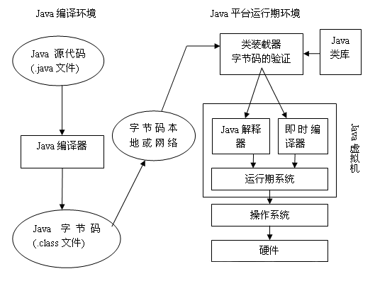
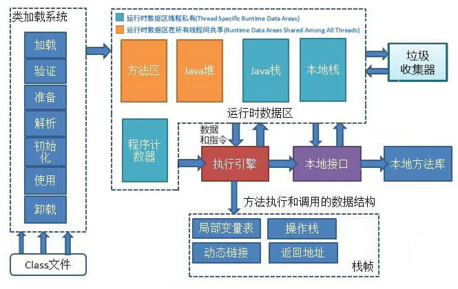
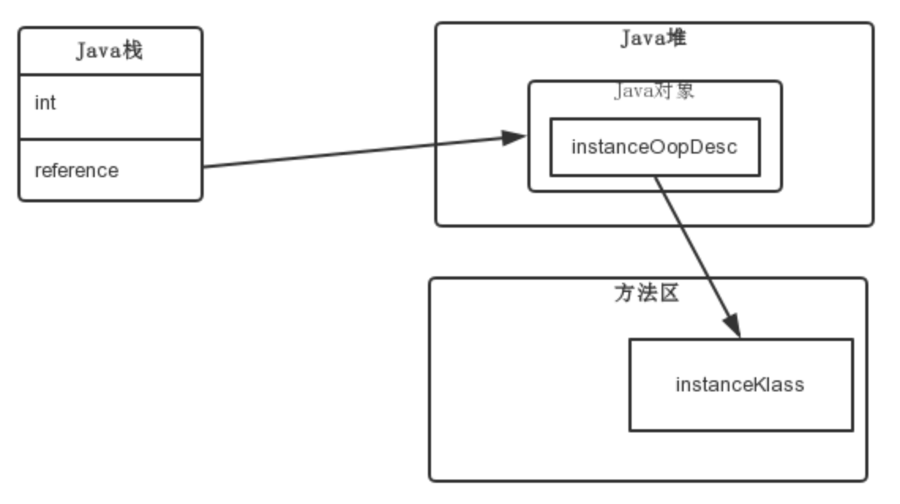
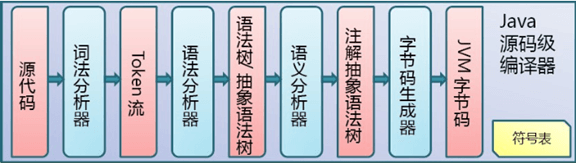
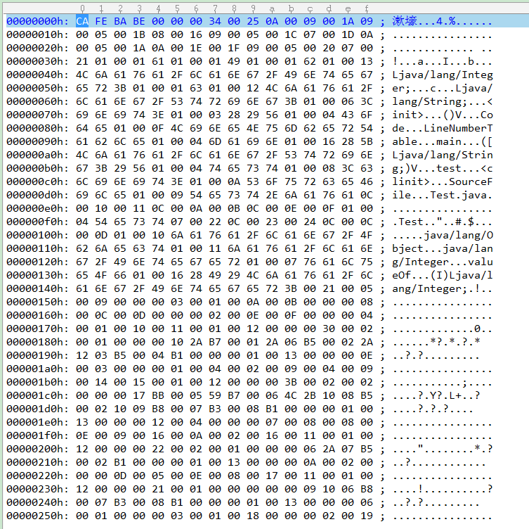

Java是一种技术，由四方面组成：Java编程语言、Java类文件格式、Java虚拟机和Java应用程序接口(Java API)



在编译环境中，使用Java语言编写java文件，然后编译为.class字节码文件。到了Java平台运行环境中，字节码被装入内存后进入JVM虚拟机，它就会被解释器解释执行或被即时代码编译器(JIT)有选择的转换成机器代码(缓存在系统中)运行。JVM通过移植接口在具体的平台和操作系统上实现，使程序与操作系统和硬件无关，在JVM上方的则是Java的基本类库和扩展类库以及它们的API，最上方就是我们用Java API编写的应用程序，达到与平台无关性，虚拟机为我们做了将中间语言(字节码指令)进行翻译和执行的工作

## 翻译与执行

将中间语言直接翻译为机器码，追根刨底就是利用了CPU执行代码的原理。要让CPU执行一段代码，只需将**CS:IP段寄存器指向到代码段入口**即可，CS和IP分别是物理CPU内部的两个寄存器，CPU在取指令时便完全依靠这两个寄存器。CS寄存器保存段地址，IP保存偏移量，那么CS和IP的值就能唯一确定内存中的一个地址，在CPU执行机器指令之前，变通过这两个寄存器定位到目标内存位置，并将该位置处的机器指令取出来进行运算。函数跳转的本质便是修改CS和IP这两个寄存器的内容，使其指向到目标函数所在内存的首地址，这样CPU便能执行目标函数了。Java虚拟机想要让物理CPU直接执行Java程序所对应的目标机器码，也得修改这两个寄存器才能实现

修改CS:IP段寄存器既可以使用汇编直接修改，也可以在高级语言中使用语法糖的形式修改，在C语言中就能通过定义函数指针实现间接修改CS:IP段寄存器的指向，因此可以在C语言中直接动态执行机器码。因此只需要将中间语言指令直接翻译成**机器码**，然后让CS:IP段寄存器直接指向这段机器码，就有能力实现将中间语言翻译成机器码并动态执行的目标(JVM中并不是完全这么做的)

虽然将中间语言直接翻译为机器码并直接运行，效率比使用C语言来解释执行提高了很多，但是由于中间语言有自己的一套内存管理和代码执行方式，因此执行同样的功能，虽然使用中间语言只需几行代码，但是翻译后的机器码比直接编写机器码还要多很多指令，指令数量增多，那么执行成本就会上升。即使与同样属于高级语言的C语言相比，其编译后所产生的的机器码也比中间语言直接翻译的机器码，数量上要精简的多。由此可见中间语言由于本身不能直接被CPU执行，为了能够被CPU执行，中间语言在完成同样的功能时，需要**准备更多便于自我管理的上下文环境**，最后才能执行目标机器指令，准备上下文环境最终也是依靠机器码去实现的，所以便生成了更多的机器码。为了能进一步提升性能，JVM提供了一种机制，能将中间语言(字节码)直接编译为**本地机器指令**。除此之外JVM在JIT(即时编译)、内存分配等方面倾注大量心血，能够对热点代码进行大幅度指令优化，将Java执行效率大幅提升。正是由于JVM可以在运行期基于上下文链路进行各种优化，因此动态优化后的指令质量比C/C++编译出的指令质量更高，使部分Java程序性能反超C/C++

> 既然中间语言在运行期能被逐个直接翻译为机器码，那么在编译期，现在本地编译成字节码，再将字节码逐个替换为机器指令，不就最终变为可以直接被CPU执行的、由机器码组成的程序了。这个思路在安卓和部分JVM所实现的AOT(ahead of time)特性便是这方面的尝试，但是这种方式并没有减少机器指令的数量级问题

说了这么多，Java本身并不是中间语言，所以虚拟机读不懂Java语言，因此Java程序还需要再进行一次翻译，成为Java字节码指令集。Java语言是面向对象的，而Java指令并不知道什么是对象，只知道压栈、读写局部变量表、调用目标方法等。在JVM源码中，定义了Java语言的全部指令集，由于Java的所有指令都使用8位二进制描述，因此Java的总指令数不超过255个

#### 常见汇编指令

**数据传输指令**：主要在寄存器与内存、寄存器与输入/输出端口之间传输数据

```
// 将自然数1传送到eax寄存器
mov1 1, %eax

// 将栈顶数据弹出至eax寄存器
pop %eax
```

**算术运算指令**：包括基本四则运算、浮点运算、数学运算等

```
// 将自然数3与eax寄存器中的数累加，并将结果存储进eax中
add 3, %eax

// 对eax寄存器中的数增加1
inc %eax
```

**逻辑运算指令**：与、或、非、左移、右移等指令

```
// 将eax中的数左移1个二进位
shl %eax, 1

// 对al寄存器中的数和操作数进行与运算
and al, 00111011B
```

**串指令**：连续空间分配，连续空间取值，传送等，都需要使用串命令，很多高级语言都支持字符串运算

**程序转移指令**：if..else判断、for循环、while循环、函数调用等，都需要依靠程序转移指令，常见的程序转移指令包括jmp跳转、loop循环、ret等

#### JVM指令

**数据交换指令**：
JVM内存分为操作数栈、局部变量表、Java堆、常量池、方法区，那么必须要有指令在支持数据在这些内存区域之间传送和交换。比如在Java方法中访问一个静态变量时，其运算过程必然伴随JVM将数据从常量池传送到操作数栈的指令调用。在硬件上直接执行的程序，其内存一般分为寄存器、数据段、堆栈、常量区、代码段，CPU为了完成运算，必然要涉及将数据从这些内存区域传送到寄存器的指令调用。而JVM执行逻辑运算的主战场是**操作数栈**(iinc指令除外，该指令可以直接堆局部变量进行运算)，不管数据在堆栈中，还是在常量池，需要执行运算时，JVM最终都会将数据传送到操作数栈中，对比硬件执行逻辑运算的主战场是在**寄存器**，不管将数据放在数据段还是代码段，最终CPU都将数据传送到寄存器中。逻辑运算完成后，再把结果移出去。例如iload、istore、lload、lstore、fload、fstore、dload、dstore、ldc、bipush等指令来实现操作数栈与局部变量表之间的数据交换，getfeild、putfeild来实现java堆中的对象的字段与操作数栈之间的数据交换，getstatic、putstatic来实现类中的字段与操作数栈之间的数据交换，baload、bastore、caload、castore来实现堆中数组与操作数栈之间的数据交换

**函数调用指令**：
可以归纳到程序转移指令集中。由于Java中函数类型比较丰富，因此要支持更多的函数调用方式，比如函数调用指令invokevirtual、invokeinterface、invokeespecial、invokestatic、return等，这比硬件所支持的函数调用指令集要丰富。比如X86中主要用call指令和ret指令来保存现场和恢复现场，往往伴随CPU物理寄存器入栈和出栈。而JVM没有物理寄存器，所以用操作数栈和PC寄存器来替代，保存现场和恢复现场则是向Java堆栈中亚茹一个栈帧，函数返回的时候从Java堆栈中弹出一个栈帧。而且JVM调用函数的时候，不能像CPU那样直接能找到对应的代码段，因为Java函数的代码并没有被存放到代码段中，而是被放在了一个code缓存中，每一个Java函数的代码块在这个code缓存中都会有一个索引位置，最终JVM会跳转到这个索引位置处执行Java函数调用。同时Java的函数一定是封装在类中的，因此JVM在执行函数调用时，还需要通过类寻址等一系列运算最终才能定位这个入口

**运算指令集**：
JVM与运算相关的指令集主要有算术运算、位运算、比较运算、逻辑运算等，JVM还为各种基本类型的运算提供不同的操作码。像X86也有算术运算、位运算等，但是所有操作都是直接针对寄存器中的二进制数进行的，不区分数据类型

**控制转移指令**：
与CPU一样，JVM规范提供了常见的控制转移指令，比如switch、if..else、for循环、while循环、return返回、break中断、continue继续等

**对象创建与类型转换指令**：
对于创建对象指令，在语法层面使用的关键字new实例化对象，对应字节码指令也是new。除此之外还有窄化类型转换、抛出异常的指令等

# Java数据结构

Java选择使用了**字节码中间语言**这条技术路线，程序是**算法与数据结构**的有机结合体，不管是算法还是数据结构都需要被物理机器所理解，任何一门编程语言，构成算法基础的指令都会被还原为机器指令，只有物理机器才有能力执行各种各样的算法指令。虽然广义的数据结构是一种抽象概念，但在工程实践上，数据结构必然需要由一种具体的编程语言去实现，其实现背后依然是物理机器在支撑，离不开机器指令。Java使用了**面向对象**的思想，对JVM来说，所有数据结构都是Class，或者反过来说Java中的Class都是一种专门的数据结构，整个Java程序都由数据结构所组成，Java算法也由数据结构的动作所驱动，所以**数据结构可以说是Java的核心**

数据结构与物理机器之间有千丝万缕的联系，程序算法告诉物理机器应该怎么做，而数据结构则告诉物理机器拿什么去做，而数据结构的实现需要依赖数据类型的支持。任何一种编程语言最终都能实现任何一种复杂的数据结构，因为最终都是依靠机器指令实现的，区别在于编程语言所支持的数据类型越多，则实现复杂数据结构的难度和成本就越小。C语言为了实现”数据结构”的可视化，定义了”结构体”这种类型，而且能嵌套使用，从而定义出多维度的结构。但是C语言中的数据结构对物理机器是有依赖的，在源代码被编译后便产生了，被转换成了对应平台上的机器指令，因此被物理机器直接识别并运行，原本C语言中的结构体数据类型被彻底抹去，打回最原始的类型，因此说C语言的数据结构依赖于特定平台上的特定编译器。而Java语言则完全不同，编译器在编译时能准确分析出Java的类型信息，类型信息通过字节码进行了格式化，但是这种编译后的、格式化的数据类型并不能直接被物理机器所识别、直接在内存中构建出对应的结构体，因此Java语言的类型信息并不完全在编译期维护，而是推迟到了运行期

C++/Delphi等编程语言也具有面向对象特性，但是到了运行期就已经完全消除了类型概念，无法在运行期反射到类型的成员变量、方法等信息。而JVM加载Java类的时候，将Java类的类元信息保存到了内存中，这样运行期直接读取目标内存中的数据便能获取到相应的信息，这种类元信息，其实就是一种打包好的数据结构模板，并且在运行中可被识别。类型本身就是一种”闭包”的技术手段，Class是实现将若干属性和动作打包成一个整体对象进行统一识别的策略。而当一门语言实现了完全的闭包语法策略(使用类型包装可以认为是闭包的一种)，便自然而然具备了自动内存管理的技术基础，或者说实现自动内存管理更加容易。所以闭包便成为很多具备自动内存回收特性的编程语言的语法基础，例如GO、Python、JavaScript等。因此Java选择面向对象编程和内存管理模型(数据结构总是与内存管理机制联系在一起)是一种选择的最终结果

总体而言，Java的数据结构的实现机制是，**编译时变成字节码，运行期实现**

## Java类型识别

Java类在编译期生成的字节码有**特定的组织规律**，因此JVM虚拟机在加载类时，对编译器生成的字节码信息按照固定格式进行解析，一步步解析出字节码中所存储的类型结构信息，从而在运行期完全还原出原始的Java类的全部结构

class字节码文件中，数据都是以**二进制流**的形式存储的，这些字节流之间按夜歌的规定顺序排列，字节之间不存在任何空隙，对于超过8位的数据，将按照Big-Endian(大端)的顺序存储，即高位字节存储在低的地址上面，而低位字节存储到高地址上面，这也是class文件跨平台的关键，因为PowerPC架构的处理器采用Big-Endian的存储顺序，而X86系列处理器采用Little-Endian(小端)的存储顺序，因此为了class文件能在各种异构处理器架构下能保持统一的存储顺序，虚拟机必须设置统一的存储规范

class字节码文件采用类似C语言的结构体来存储数据，主要由两类数据项：**无符号数和表**。无符号数用来表述数字、索引引用和字符串等，比如u1、u2、u4和u8，分别代表1、2、4、8字节。而表是由多个无符号数以及其他的表组成的复杂结构

一个class字节码文件由10个部分组成：MagicNumber、Version、Constant_pool、Access_flag、This_class、Super_class、Interfaces、Fields、Methods、Attributes。这些数据的类型和长度都是不同的，例如魔数占用4个字节，在JVM内使用u4这种自定义数据类型存放`typedef juint u4`，juint也是自定义类型，与平台相关，在linux上便定义为`typedef uint32_t juint`，而uint32_t仍然是自定义类型，只是一个按照POSIX标准的别名，在linux上代表的C语言类型是unsigned int

### 常量池与oop-klass模型

常量池是Java字节码文件中比较重要的概念，是整个Java类的核心所在，因为常量池中记录了一个Java类的所有成员变量、成员方法、静态变量、静态方法、构造函数等全部信息，包括变量名、方法名、访问标识、类型信息等。JVM内部定义了一个C++类型constantPoolOop来记录解析后的常量池信息，这是个别名，其原始类型为constantPoolOopDesc，JVM内部为了在运行期描述Java类的类型信息和内部结构，定义了很多以Desc结尾的oop类，详细在/src/share/vm/oops/oopsHierarchy.hpp文件内

JVM内部对Java对象的表现模型便是**“oop-klass”模型**。Hotspot虚拟机在内部使用两组类来表示Java的类和对象：
1、**oop**(ordinary object pointer)，用来描述对象实例信息
2、**klass**，用来描述Java类，是虚拟机内部Java类型结构的对等体
JVM内部定义了各种oop-klass，在JVM看来，不仅Java类是对象，Java方法也是对象，字节码常量池也是对象，一切皆对象。JVM使用不同的oop-klass模型来表示各种不同的对象，这些不同的模型就使用不同的oop类和klass类来表示，由于JVM使用C/C++编写，因此这些oop和klass类便是各种不同的C++类。对于Java类型与实例对象，JVM使用instanceOop和instanceKlass这2个C++类来表示

根据oop与klass体系的定义，可以发现oop与klass基本被划分来分别描述instance、method、constaneMethod、methodData、array、objArray、typeArray、constantPool、constantPoolCache、klass、compoiledICHolder这几种模型，每种模型对应一个xxxOopDesc和对应的xxxKlass，即分别用来描述Java类类型和类型指针、Java方法类型和方法指针、常量池类型及指针、基本数据类型的数组类型及指针、引用类型的数组类型及指针、常量池缓冲类型及指针、Java类实例对象类型及指针。HotSpot认为使用这几种类型就能勾画出Java程序的全部：数据、方法、类型、数组和实例



oop其实就是普通对象指针，指向klass类实例。比如`ClassA a = new ClassA()`，HotSpot在执行到这里时，会先将ClassA这个类型加载到方法区，然后在堆中为其实例对象a开辟一块内存空间存放实例数据，在JVM加载ClassA到方法区时，JVM就会创建一个instanceKlass，其保存了ClassA这个Java类定义的一切信息，随意intanceKlass就是ClassA这个Java类类型结构的对等体。而instanceOop这个”普通对象指针”对象中包含了一个指针，指向instanceKlass这个实例，在JVM实例化ClassA时JVM又会创建一个instanceOop，通过这个指针，JVM便可以在运行期获取这个类实例对象的类元信息

oopDesc类是虚拟机核心数据结构：

```
class oopDesc {
private:
    volatile markOop _mark;
    union _metadata {
        Klass* _klass;
        narrowKlass _compressed_klass;
    } _metadata;
    // ...
}
```

除去友元类VMStructs以及用于内存屏障的_bs，oopDesc重要的两个成员变量_mark和_metadata。**_mark**是一种标记，Java类在整个生命周期中，涉及到线程状态、并发锁、GC分代信息等内部表示都打在_mark变量上。而**_metadata**用于标识元数据(Java类的结构信息)，起到指针的作用，指向Java类的数据结构被解析后所保存的内存位置

扩展：
[OpenJDK9 Hotspot ：oops，klass 与 handle](https://segmentfault.com/a/1190000008355645)
☆[HotSpotVM 对象机制实现浅析#1](https://yq.aliyun.com/articles/20279)
[JVM源码分析之Java类的加载过程](https://www.jianshu.com/p/252e27863822)
[JVM源码分析之Java对象的创建过程](https://www.jianshu.com/p/0009aaac16ed)

## 大端与小端

数据在不同平台寄存器、内存、硬盘上的存储格式不同 ——— 数据存储顺序不同，这种不同的存储顺序衍生了计算机底层两个概念：大端与小端

大端和小端的概念是由一位网络协议开创者提出的，因为只有在跨平台以及网络程序中才会涉及到一个叫做”字节序”的问题，这也是一个必须被考虑的基础问题。字节序就是指字节的顺序，就是数值大于一个字节类型的数据在内存中存放的顺序。在各种计算机体系结构中，对于字节、字的存储机制各有不同，通信双方交流的信息单元(比特、字节、字、双字等)的存储顺序不同，因此需要考虑双方数据传送顺序，如果传送顺序达不成一致，通信双方将无法进行正确的编码解码从而导致通信失败。目前在各种体系计算机中通常采用的直接存储机制主要有两种：Big-Endian和Little-Endian。大端为高位字节存储在内存的低地址上面，而低位字节存储到内存的高地址上面。小端正好相反，低位字节排放在内存的低地址端，高位直接排放在内存的高地址端

在计算机体系结构中，内存由存储单元构成，一个存储单元的长度是1个字节，即每个存储单元都对应着1个字节，能够存储8bit数据。但是C及其他高级语言中除了8bit的char外，还有16bit的short，32bit的int和64bit的long(int与long看具体编译器和CPU平台架构)，那么物理内存的存储单位是1字节，而现代计算机总线线宽和寄存器的宽度都大于1个字节，这就造成存储器宽度与内存存储单元宽度之间不一致。而软件程序中很多操作都涉及数据在内存和寄存器之间的传送，因为计算机不允许数据直接在内存之间传送，更不支持数据直接从内存传送到外部设备，唯一支持不同部件之间直接数据传送的只有寄存器。由于高级语言中不能直接操作寄存器，所以所有的数据传送的指令以及针对寄存器读写的指令都被封装成面向变量的编程，而变量的存储介质是内存，所以**高级编程语言中所有数据传送指令都必须经过寄存器的中转**。寄存器的宽度越大，就意味着CPU传送数据的能力越强，对于一个数据来说本身是有高字节与低字节区分的，而一个寄存器也会区分高低，那么由于不同厂家定义的CPU标准不同，寄存器左端为高位还是右端为高位没有统一的标准。所以大小端的问题，本质上是由**寄存器引起的**

虽然大端小端问题存在于内存、寄存器、计算机总线甚至软件中，但是得益于整个软硬件架构的良好设计，无论往内存中写入还是读取数据，由于采用的是同一套标准，要么全是大端模式，要么全是小端模式，所以不会产生大小端数据转换的问题。但是当网络传输和文件共享时，由于数据在网络的一端写入，另一端读取，网络两端的CPU架构并不总是相同，很可能出现大小端不同的场景，这时不进行大小端转换，数据必定会出现不一致。在遇到这个问题时，就必须处理大小端问题，其中在linux平台可以调用bswap指令进行字节序反转

大小端问题不仅出现在计算机硬件体系中，软件中也同样存在，绝大多数下都被编译器处理了，Java所输出的直接信息全部是大端模式，比如对于魔数，字节码文件的写入顺序一定是0xCA 0xFE 0xBA 0xBE，这种写入顺序不受计算机硬件大小端影响，这是Java与其他编程语言比如C的一个重要区别，因为C在将int类型魔数写入字节码文件之前，需要将魔数信息写入变变量，由于硬件体系关系，从寄存器写入内存时可能魔数的字节序已经发生反转。但是对于Java来说，Java编译器一般由Java开发，因此字节码文件写入由Java语言完成，而读取字节码文件的JVM一般由C/C++混合写成，因此Java字节码的写入与读取端属于两种不同的编程语言，因此**引起Java字节码的字节序读取不一致是读取端编程语言的大小端导致的**，这时就需要对字节序进行反转的兼容性处理

# Java字节码



例子：

```
public class Test {
    public int a = 3;
    static Integer b = 6;
    private String c = "test";

    public static void main(String[] args) {
        Test test = new Test();
        test.a = 8;
        b = 9;
    }

    private void test() {
        this.a = 4;
    }
}
```

使用javac编译后，通过命令`javap -verbose Test.class`分析字节码信息：

```
Classfile /D:/workspace/Test.class
  Last modified 2019-3-11; size 608 bytes
  MD5 checksum 481e800a4bba6533c59c0c931cb49026
  Compiled from "Test.java"
public class Test
  minor version: 0
  major version: 52
  flags: ACC_PUBLIC, ACC_SUPER
Constant pool:
   #1 = Methodref          #9.#26         // java/lang/Object."<init>":()V
   #2 = Fieldref           #5.#27         // Test.a:I
   #3 = String             #22            // test
   #4 = Fieldref           #5.#28         // Test.c:Ljava/lang/String;
   #5 = Class              #29            // Test
   #6 = Methodref          #5.#26         // Test."<init>":()V
   #7 = Methodref          #30.#31        // java/lang/Integer.valueOf:(I)Ljava/lang/Integer;
   #8 = Fieldref           #5.#32         // Test.b:Ljava/lang/Integer;
   #9 = Class              #33            // java/lang/Object
  #10 = Utf8               a
  #11 = Utf8               I
  #12 = Utf8               b
  #13 = Utf8               Ljava/lang/Integer;
  #14 = Utf8               c
  #15 = Utf8               Ljava/lang/String;
  #16 = Utf8               <init>
  #17 = Utf8               ()V
  #18 = Utf8               Code
  #19 = Utf8               LineNumberTable
  #20 = Utf8               main
  #21 = Utf8               ([Ljava/lang/String;)V
  #22 = Utf8               test
  #23 = Utf8               <clinit>
  #24 = Utf8               SourceFile
  #25 = Utf8               Test.java
  #26 = NameAndType        #16:#17        // "<init>":()V
  #27 = NameAndType        #10:#11        // a:I
  #28 = NameAndType        #14:#15        // c:Ljava/lang/String;
  #29 = Utf8               Test
  #30 = Class              #34            // java/lang/Integer
  #31 = NameAndType        #35:#36        // valueOf:(I)Ljava/lang/Integer;
  #32 = NameAndType        #12:#13        // b:Ljava/lang/Integer;
  #33 = Utf8               java/lang/Object
  #34 = Utf8               java/lang/Integer
  #35 = Utf8               valueOf
  #36 = Utf8               (I)Ljava/lang/Integer;
{
  public int a;
    descriptor: I
    flags: ACC_PUBLIC

  static java.lang.Integer b;
    descriptor: Ljava/lang/Integer;
    flags: ACC_STATIC

  public Test();
    descriptor: ()V
    flags: ACC_PUBLIC
    Code:
      stack=2, locals=1, args_size=1
         0: aload_0
         1: invokespecial #1                  // Method java/lang/Object."<init>":()V
         4: aload_0
         5: iconst_3
         6: putfield      #2                  // Field a:I
         9: aload_0
        10: ldc           #3                  // String test
        12: putfield      #4                  // Field c:Ljava/lang/String;
        15: return
      LineNumberTable:
        line 1: 0
        line 2: 4
        line 4: 9

  public static void main(java.lang.String[]);
    descriptor: ([Ljava/lang/String;)V
    flags: ACC_PUBLIC, ACC_STATIC
    Code:
      stack=2, locals=2, args_size=1
         0: new           #5                  // class Test
         3: dup
         4: invokespecial #6                  // Method "<init>":()V
         7: astore_1
         8: aload_1
         9: bipush        8
        11: putfield      #2                  // Field a:I
        14: bipush        9
        16: invokestatic  #7                  // Method java/lang/Integer.valueOf:(I)Ljava/lang/Integer;
        19: putstatic     #8                  // Field b:Ljava/lang/Integer;
        22: return
      LineNumberTable:
        line 7: 0
        line 8: 8
        line 9: 14
        line 10: 22

  static {};
    descriptor: ()V
    flags: ACC_STATIC
    Code:
      stack=1, locals=0, args_size=0
         0: bipush        6
         2: invokestatic  #7                  // Method java/lang/Integer.valueOf:(I)Ljava/lang/Integer;
         5: putstatic     #8                  // Field b:Ljava/lang/Integer;
         8: return
      LineNumberTable:
        line 3: 0
}
SourceFile: "Test.java"
```

通过UltraEdit打开Test.class，每行16个字节，用十六进制显示：

## 魔数 MagicNumber

所有.class字节码文件前4个字节都是魔数，且值一定是十六进制数值0xCAFEBABE。如果起始4个字节不是则JVM将认为该文件不是.class字节码文件，而拒绝解析加载该文件，从而防止加载非class文件而造成虚拟机崩溃

## 版本号 Version

根据字节码文件规范，魔数之后的4个字节为版本信息，前两个字节表示minor version，即**次版本号**，后两个字节表示major versoin，即**主版本号**。在这里我们的次版本号为0，主版本号为0x0034对应52，目前的version为1.8(0 52)，因为我本地用的是JDK1.8，javac决定了class文件的版本号，当用java.exe运行字节码文件时，首先检查字节码文件的版本号。当字节码文件版本号对应的JDK版本小于等于java.exe的版本时可以正常运行，软件兼容，反之不行，会报错

## 常量池 Constant_pool

**一个Java类中绝大多数的信息都由常量池描述**，尤其是类中定义的变量和方法，都由常量池保存，其主要由常量池数量和常量池数组两部分组成，常量池数量紧跟在版本号后面，占2个字节；常量池数组则跟在常量池数量后面，其由多个元素组成，常量池数组中不同元素的类型、结构都是不同的，长度也是不同的，但是每一种元素的第一个数据都是一个u1类型，该字节为标志位，占用1个字节。JVM解析常量池时，根据这个u1类型来获取该元素的具体类型

常量池不同元素的结构与类型不同，JVM定义了**元素类型**，并针对类型进行专门的解析。例如CONSTANT_Class_info(7:表示类或接口)、CONSTANT_Fieldref_info(9:字段信息表)、CONSTANT_Methodref_info(10:方法)、CONSTANT_String_info(8:java.lang.String 类型的常量对象)、CONSTANT_MethodHandle_info(15:方法句柄表)等等，具体可以在网上找到定义，不同元素类型的结构比如：

```
// CONSTANT_Class_info    表示类或接口
CONSTANT_Class_info {
    u1 tag;    // 7
    u2 name_index;    // 指向全限定名常量项的索引
}

// CONSTANT_Fieldref_info
CONSTANT_Fieldref_info {
    u1 tag;    // 9
    u2 class_index;    // 指向声明字段的类或接口描述符 CONSTANT_Class_info 的索引项
    u2 name_and_type_index;    // 指向字段描述符 CONSTANT_NameAndType_info 的索引项
}
```

首先看本例中在版本号后的是0x0025，即常量池长度37，JVM规定不使用第0个元素，那么实际上一共有36个常量池元素。后面跟的是0x0A，即10类中方法的符号引用，由u1:tag+u2:index+u2:index组成，则为1+2+2个字节，即0x0A，0x0009，0x001A

## 访问标识 Access_flag

保存**当前类的访问权限**，结构类型是u2，图中140h找到，0x0021，即0x0001为public，0x0020允许使用invokespecial字节码指令(JDK1.2以后编译该标志为真)

## 继承信息 This_class、Super_class、Interfaces

This_class保存**当前类的全局限定名在常量池里的索引**，结构类型是u2，在访问标识后面的为0x0005，通过上面使用`javap -verbose`打印出来的常量池信息，找到#5为#29，就是Test，即类的全限定名就是Test

Super_class保存**当前类的父类的全局限定名在常量池里的索引**，结构类型是u2，即0x0009，同样查找#9得知为#33，即java/lang/Object，显然没有显示继承任何基类，编译时默认继承java.lang.Object

Interfaces保存**当前实现的接口列表**，包含interfaces_count和interfaces[interfaces_count]，即实现接口数量和这些接口的全局限定名的索引数组，interfaces_count的结构类型是u2，即接口数量为0x0000，所以说明没有实现任何接口，因此字节码文件中没有interfaces信息

## 字段信息 Fields + attributes

Fields保存**当前类的成员列表**，包含fields_count和fields[fields_count]，即类变量、实例变量的字段总数和字段详细信息的列表。fields_count的结构类型是u2，即0x0003，有3个成员变量

fields结构长度不确定，不同的变量类型所占的长度是不同的，该记录中定义了各个变量的详细信息，包括变量名、变量类型、访问标识、属性等：

```
field_info {
    u2 access_flags;    // 标识变量访问标识，值是可选的：public、private、protected、static、final、volatile、transient、是否编译器自动产生、是否为enum
    u2 name_index;    // 变量的简单名称引用，其值指向常量池的索引
    u2 descriptor_index;    // 变量的类型信息引用，其值指向常量池的索引
    u2 attributes_count;    // 属性数量
    attribute_info attributes[attributes_count];
}
```

看第一个0x0001，即public的；第二个0x000A，即常量池#10变量名为a；第三个0x000B，即常量池#11数据类型为I(对应基本类型int)；第四个0x0000，即变量a的属性数量是0，字节码文件中不包含attributes信息，因此第一个变量只占用了8个字节。后面2个也是同样的分析方法

## 方法信息 Methods + attributes

Methods保存**当前类的方法列表**，包含methods_count和methods[methods_count]，即该类或接口显示定义的方法总数和方法信息的详细列表。methods_count的结构类型是u2，即0x0004，Test类有4个方法。然而我们只写了2个方法，那是因为编译期间，编译器会自动为一个类增加void ()这样的方法，作用主要是执行类的初始化，源程序中所有static类型的变量和被static{}包围的程序都在这个方法中被初始化和执行。另外由于没有定义构造方法，所以编译器会自动添加一个默认的构造方法

method_info的结构与field_info一样，仅在访问标志位和属性表集合的可选项有所不同。那么来看第一个0x0001，即public方法；第二个0x0010，即常量池#16方法为；第三个0x0011，即常量池#17描述信息为()V，表示没有入参返回void；第四个0x0001，即当前方法包含1个属性；对于attributes结构简略来说包含9大属性：Code、ConstantValue、Deprecated、Exceptions、InnerClasses、LineNumberTale、LocalVariableTable、SourceFile、Synthetic，而每一种属性又都是一个复合结构，均有各自的表结构

比如看第一个值0x0012，即常量池#18表示Code方法表，后面跟的是u4类型的attribute_length，即0x00000030，后面跟的又是u2类型的max_stack和u2类型的max_locals，即0x0002和0x0001，再后面的是u4类型的code_length，即0x00000010，之后是code属性，**真正开始描述Java方法所对应的字节码指令**，这是Java的精华所在，其长度由前面的code_length决定，因此这16位字节码值是0x2A B7 00 01 2A 06 B5 00 02 2A 12 03 B5 00 04 B1。JVM是基于栈的指令集系统，其设计的指令仅占1字节，因此最多描述256种指令，JVM的指令总数只有200多个，同时JVM的指令属于一元操作数类型，其后面只有一个操作数(很多指令后不跟操作数，比如return)，因此JVM指令需要区别对待，有些字节是**代表指令**，但是有些则**代表数据(操作数)**。下面分析当前方法的指令逻辑，第一个字节一定代表指令，不会是操作数，这里是0x2A，查询JVM指令集为aload_0(将第0个引用类型本地变量推送至栈顶)；第二条指令为0xB7，查询为invokespecial(调用超类构造方法，实例初始化方法，私有方法)，由于是一元指令，后面跟的是u2类型的操作数，即0x0001表示常量池#1方法java/lang/Object.”":()V；第三条指令为0x2A和第一条指令一样；第四条指令为0x06，查询为iconst_3(将int型3推送至栈顶)；第五条指令为0xB5，查询为putfield(为指定的类的实例域赋值)，那么看后面的操作数0x0002，即常量池#2操作数Test.a:I；第六条指令还是0x2A；第七条指令0x12，查询为ldc(将int, float或String型常量值从常量池中推送至栈顶)，那么看操作数0x03，即常量池#3为String test；第七条指令为0xB5，操作数为0x0004，即常量池#4为Test.c:Ljava/lang/String；最后第八条指令为0xB1，查询为return(从当前方法返回void)。其实这就是对应了通过`javap -verbose`打印出来的public Test()下的描述

参考：
[Java核心技术》 JVM指令集](https://www.jianshu.com/p/bc91c6b46d7b)
《揭秘Java虚拟机》