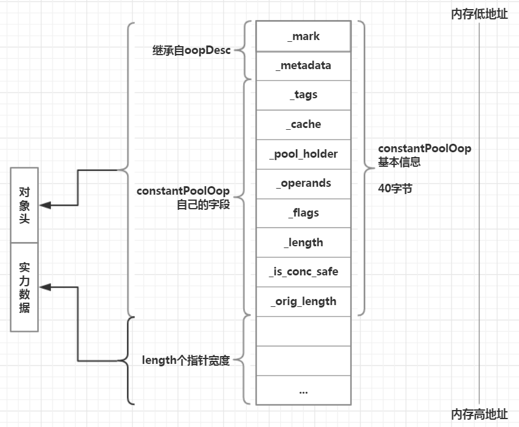
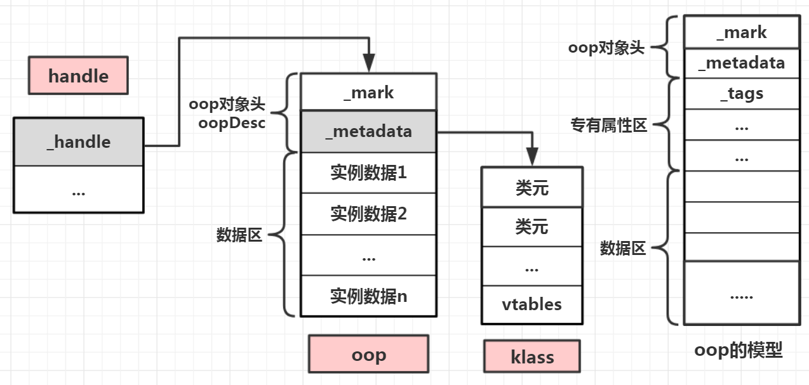
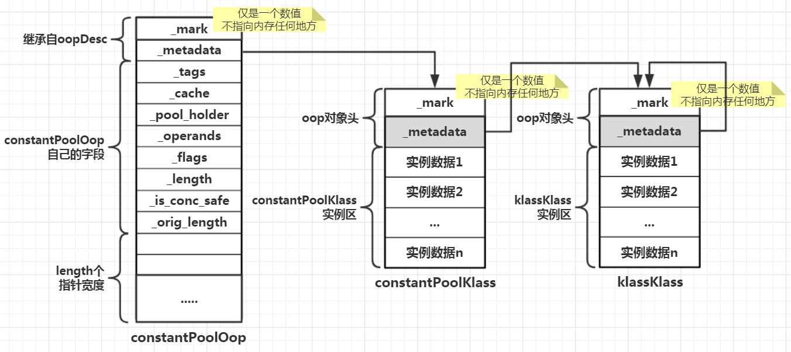
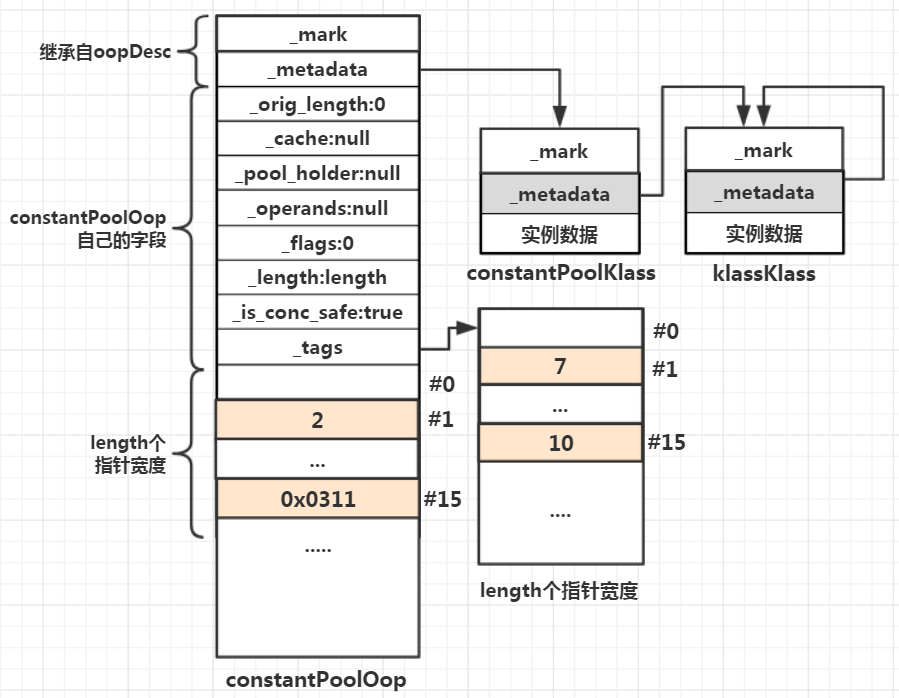

# 常量池

从Java字节码文件看，其实主要包含三部分：常量池、字段信息、方法信息。其中常量池存储了字段和方法的相关符号信息，也是Java字节码文件的核心。这里说的常量池不同于JVM内存模型中的常量区，这里的常量池仅仅是字节码中的一部分信息，是**Java编译器对Java源代码进行语法解析后的产物**，比较粗糙，包含了各种引用，信息不够直观。而JVM最终会将字节码文件中的**常量池信息进行二次解析**，还原出所有常量元素的全部信息，并存储到JVM内存模型中的**常量区**，让内存与编写的Java源代码保持一致

JVM解析Java类字节码文件的接口是ClassFileParser::parseClassFile()，其步骤为：
解析魔数 - 解析版本号 - 解析常量池 - 解析父类 - 解析接口 - 解析类变量 - 解析类方法 - 构建类结构
其中在解析完魔数、版本号后对常量池进行解析，主要链路为：
ClassFileParser::parseClassFile() - > ClassFileParser::parse_constant_pool() - >
oopFactory::new_constantPool()分配常量池内存 / ClassFileParser::parse_constant_pool_entries()解析常量池信息

## 内存分配

JVM想要解析常量池信息，就必须先划出一块内存空间，将常量池的结构信息加载进来，然后才能进一步解析。内存空间的划分主要考虑两点：分配多大的内存、分配在哪里。JVM使用一个专门的C++类**constantPoolOop**来保存常量池的结构信息，而该类里实际保存数据的是属于**typeArrayOop**类型的_tags实例对象。typeArrayOop类是继承与oopDesc顶级结构，且没有新增字段，也就是这种类型仅仅只有标记和元数据

oopFactory::new_constantPool()链路比较长，从宏观层面看，大体可以分为3个步骤：
**1、在堆区分配内存空间**：最终在psOldGen.hpp中通过`object_space()->allocate(word_size)`实现
**2、初始化对象**：主要通过collectedHeap.inline.hpp中调用`init_obj()`进行对象初始化，其实就仅仅是清零
**3、初始化oop**：collectedHeap.inline.hpp中调用`post_allocation_install_obj_klass()`完成oop初始化并赋值。JVM内部通过oop-klass来描述一个Java类。一个Java类的**实例数据**会被存放在堆中，而为了支持运行时反射、虚函数分发等高级操作，Java类**实例指针**oop(堆中)会保存一个指针，用于指向Java类的**描述对象**(方法区中)，类描述对象中保存一个Java类中所包含的全部成员变量和全部方法信息，本步骤就是为了这一目标设计的

涉及到的类：
1、**oopFactory**：即oop的工厂类。Java是面向对象的语言，在JVM内部实现层面也得到彻底实现。在JVM内部，常量池、字段、符号、方法等一切都被对象包装起来，所有**这一切对象在内存中都通过oop这种指针进行跟踪(指向)**，JVM根据oop所指向的实际内存位置便可获取到对象的具体信息。而在JVM内部，所有这些对象的内存分配、对象创建与初始化(清零)工作都通过oopFactory这个入口得以统一实现。oopFactory为各种JVM内建对象分配内存空间并初始化类型实例的机制在本质上是一样的，**都先获取对应的klass类描述信息，然后为oop分配内存空间**
2、**constantPoolKlass**：常量池内存对象。JVM内部都通过oop指向某个内存位置，这个内存位置往往便是与该oop相对应的klass类型。**klass用于描述JVM内部一个具体对象的结构信息(“元”信息)**，例如一个Java类中包含哪些字段、哪些方法、哪些常量，相当于**JVM内部对数据结构的实现**。同理常量池在JVM内部也被表示为一种对象，不同Java类被编译后产生的字节码文件中的常量池大小、元素顺序和结构等都不同，因此JVM内部必须要预留一段内存区块来描述常量池的结构信息，这便是constantPoolKlass的意义所在
3、**collectedHeap**：表示JVM内部的堆内存区，可被垃圾收集器回收并反复利用，代表了JVM内部广义的堆内存区域。在JVM内部，除了堆栈变量之外的一切内存分配，都需要经过该区域。如果JVM内部的一个实例对象不在这一区域申请内存空间，那么只能跑到JVM堆外内存去申请了
4、**psPermGen**：表示perm区内存，在JDK6时代Java类的字节码信息会保存到该区域，而在JDK8时代，**perm区的概念被metaSpace取代**。perm是指内存的永久保存区，用于**存放Class和Meta的信息**，Class被加载的时候放入permGen space区域，它和存放Java类实例对象的堆内存区域不同，如果Java程序加载了太多Java类，就很可能出现PermGen space错误；而在metaSpace时代，这块区域属于”本地内存”区域，就是指相对于JVM虚拟机内存而言的操作系统内存，由JVM直接向操作系统申请内存存储Java类的元信息，因此类元数据空间的申请只受可用本地内存的限制(32位/64位操作系统)，理论上只要物理机器尚有可用的虚拟内存，JVM便能加载新的类元数据。而当JVM所加载的类元信息所占内存空间达到MaxMetaspaceSize设定值时，会触发对僵死的类及类加载器的垃圾回收，而且相比permSpace的性能上也做了优化
PS.虽然meatSpace相比permSpace有重大改进，但是从JVM角度而言，并没有本质改变，JVM的类结构在运行期的描述机制并没有改变，JVM仍然从字节码文件中解析出常量池、字段、方法等类元信息，然后保存到内存的某个位置，**所以后续以JDK6为主分析**

由于JVM的堆在JVM初始化过程中便完成了指定大小的空间分配，因此完成当前被加载的类所对应的常量池内存分配没有真正向操作系统申请，仅从JVM已申请的堆内存中划拨了一块空间用于存储常量池结构信息。内存的申请最终通过`object_space->allocate()`实现，该函数定义在mutableSpace.cpp中，会先执行`HeapWord* obj = top()`，再执行`HeapWord* new_top = obj + size`，将permSpace内存区域的top指针往高地址方向移动size大小的字节数，而最终返回的依旧是obj指针，该指针指向的是原来堆的最顶端，这样调用方通过指针可以还原从原堆顶到当前堆顶之间的内存空间，将其强制转换为常量池对象。在JVM启动过程中完成permSpace的内存申请和初始化，但是这块区域一开始是空的，随着不断有常量池信息写入到这块区域，top()指针也会不断往高内存地址方向移动，每次新写入一个对象，该对象的内存首地址便是写入前top()指针所指的位置

#### constantPool的内存有多大

为一个Java类创建对应的常量池，需要在JVM堆区为常量池先申请一块连续的内存空间，其大小取决于一个Java类在编译时所确定的常量池大小

在常量池初始化链路中会调用constantPoolKlass::allocate()方法，该方法会调用constatnPoolOopDesc::object_size(length)方法来获取常量池大小：

```
// src/share/vm/oops/constantPoolOop.hpp
// length为Java类在编译期间由编译器所计算出来的常量池的大小
static int object_size(int length) {
	// 将header_size与length相加后再进行内存对齐，便于GC进行工作时能高效回收垃圾，但会造成一定的空间浪费
	return align_object_size(header_size() + length);
}
// 对象头大小
static int header_size() {
	return sizeof(constantPoolOopDesc)/HeapWordSize;
}
```

sizeof()函数在计算C++类时，该函数返回的是其所有变量的大小加上虚函数指针的大小。对于constantPoolOopDesc本身包含8个字段，由于继承oopDesc父类，还会包含父类的2个成员变量：

```
typeArrayOop			_tags;
constantPoolCacheOop		_cache;
klassOop			_pool_holder;
typeArrayOop			_operands;
int				_flags;
int				_length;
volatile bool			_is_conc_safe;
int				_orig_length;
volatile markOop		_mark;		// 类型是指针
union _metadata{..}		_metadata;	// 联合体内部是指针类型
```

而对于oopDesc包含的static BarrierSet* bs这个静态类型变量，在JVM启动之初会被操作系统直接分配到JVM程序的数据段内存区，因此10个字段在32位平台上将返回40(字节)。而对于HeapWordSize是HeapWord类的大小，而该类只包含一个char*指针型变量，即返回指针宽度，因此32位平台上返回4(字节)，64位平台上返回8(字节)，这样header_size()函数就是计算出constantPoolOopDesc这个类型实例在内存汇总所占用的双字数(32位平台一个指针宽度为4字节，即双字)因此最终constantPoolKlass::allocate()从JVM堆内存中所申请的内存空间大小包含两个部分：**constantPoolOopDesc大小 + Java类常量池元素数量(length)**，即JVM最终在32位平台分配出(40 + length)*4字节的内存大小

#### 内存空间布局

在为constantPoolOop常量池对象分配内存时，需要分析JVM为常量池所申请的内存空间布局模型，前面说过JVM为constantPoolOop实例分配的内存大小是(headSize + length)个指针宽度。在JDK6中JVM为常量池申请的内存位于perm区的一片连续空间，而JVM为常量池申请内存时也是整片区域**连续划分，不会存在碎片化**

JVM内部几乎所有的对象都是这种布局。总体而言JVM内部为对象分配内存时，会先分配**对象头**，然后分配对象的**实例数据**，不管字段对象还是方法对象还是数组，JVM内部为对象实例分配内存空间的模型都是**“对象头+实例数据”**的结构。对于常量池而言，其对象头就是constantPoolOop对象本身，而实例数据所占空间的大小等于Java字节码文件中所有常量池元素所占空间的大小，那么应该就是保存Java字节码文件中的常量池元素的某些特殊信息，后面再细说

## 初始化内存

JVM为Java类对应的常量池分配好空间后，就需要执行这段内存空间的初始化，所谓的初始化就是清零操作。由于在申请内存空间时执行了内存对齐，同时由于JVM堆区会反复加载新类和擦除旧类，因此如果不执行清零，则会影响后续对Java类的解析

在CollectedHeap::common_permanent_mem_allowcate_init()中调用init_obj(obj, size)，其内部调用其他函数对JVM内部对象清零，会将制定内存区的内存数据全部清空为零值

## opp-klass模型

上一篇文章和这篇之前也讲到过opp-klass模型 —— 一分为二的内存模型。为了消灭指针的目的，JVM本身的类模型非常更复杂，而且这种复杂性从JVM发布以来，即使从JDK6到JDK8也仅仅是对JVM内部的几种具体类型进行了重组和去繁就简，并没有根本上的变革，只要Java语言对外提供的功能特性不发生巨大变化，则JVM内部的类模型就不会发生巨大的质变

前面讲过，JVM内部基于oop-klass模型描述一个Java类，将一个Java类一拆为二分别描述，第一个模型是oop，第二个模型是klass。**oop是普通对象指针，用来表示对象的实例信息**，看起来像个指针，而实际上对象实例数据都藏在**指针所指向的内存首地址后面的一片内存区域中**。而**klass包含元数据和方法信息**，用来描述Java类或JVM内部自带的C++类型信息，便是前面讲的数据结构，Java类的基层信息、成员变量、静态变量、成员方法、构造函数等信息都在klass中保存，JVM据此可以在运行期反射出Java类的全部结构信息，当然JVM本身所定义的用于描述Java类的C++类也使用klass去描述

JVM使用oop-klass这种一分为二的模型描述一个Java类，虽然模型只有两种，但是其实从3个不同的维度对一个Java类进行了描述。侧重于描述Java类的实例数据的第一种模型oop，主要为Java类生成一张**“实例数据视图”**，**从数据维度描述一个Java类实例对象中各个属性在运行期的值**。而第二种模型klass则分别从两个维度去描述一个Java类，第一个维度是Java类的**“元信息视图”**，另一个维度则是**虚函数列表，或者叫做方法分发规则**。元信息视图为JVM在运行期呈现Java类的”全息”**数据结构信息**，这是JVM在运行期以动态反射出类信息的基础。

在Java语言中并没有**虚函数**这个概念，就是不能使用**virtual**这个关键字去修饰一个Java方法。而C++实现面向对象多态性的关键字主要就是virtual，而JVM在内部使用C++类定义的一套对象机制去表达Java类的面向对象机制，这样Java类最终被表达成为JVM内部的C++类，并且Java类方法的调用最终要通过对应的C++，而Java方法本身不支持virtual这个关键字修饰，那么面对一个多重继承的Java类体系，C++如何知道类中哪个方法是虚函数，哪个不是呢？而Java的做法是**将Java类的所有函数都视为是virtual的**，这样Java类中的每个方法都可以直接被其子类、子子类覆盖而不需要增加任何关键字作为修饰。正因如此，Java类中的每个方法都可以晚绑定，只不过对于一些确定的调用，在编译器就可以实现早绑定。正因为JVM将Java类中每个函数都视为虚函数，所以最终在**JVM内部的C++层面就必须维护一套函数分发表**

### 体系总览

在JVM内部定义了3种结构去描述一种类型：oop、klass、handle类，这3种数据结构不仅能够描述外在的Java类，也能够描述JVM内在的C++类型对象

前面讲过klass主要描述Java和JVM内部C++类的元信息和虚函数，这些元信息的实际值就保存在oop里面。oop中保存一个指针指向klass，这样在运行期JVM便能知道每一个实例的数据结构和实际类型。handle则是对oop的行为的封装，在访问Java类时一定是通过handle内部指针得到oop实例的，再通过oop就能拿到klass，如此handle最终便能操纵oop的行为了(特别的，如果是调用JVM内部C++类型所对应的oop的函数，就不需要通过handle来中转，直接通过oop拿到指定klass便能实现)。klass不仅包含自己所固有的行为接口，而且也能够操作Java类的函数。由于Java函数在JVM内部都被表示为虚函数，因此handle模型其实就是Java类行为的表达

它们三者的关系如下，可以看到Handle类内部只有一个成员变量_handle，类型为oop*，最终指向一个oop的首地址，因此只要拿到handle，就能进一步获取oop和关联的klass实例，从而取到klass对象实例后，便能实现对oop对象方法的调用前面讲到的constantPool常量池对象，其oop对象就是constantPoolOop，对象结构与模型完全符合。JVM内部定义了若干oop类型，每一种oop类型都有自己特有的数据结构，oop的专有属性区就是用于存放各个oop所特有的数据结构的地方

### oop体系

Hotspot里的oop其实就是GC所托管的指针，每一个oop都是一种xxxOopDesc*类型的指针。所有oopDesc及其子类(除markOopDesc外)的实例都由GC所管理，这才是最重要的，是oop区分Hotspot里所使用的其他指针类型的地方

对象指针本质而言就是个指针，由于OOP的鼻祖SmallTalk语言，它的对象也由GC管理，但是其一些简单的值类型对象会使用”直接对象”的机制实现，例如整数类型就并不是在GC堆上分配的对象实例，而是直接将实例内容存在了对象指针里的对象，这种指针也叫做带标记的指针，这一点与markOopDesc类型如出一辙，因为markOopDesc也是将整数值直接存储在指针里面，这个指针其实没有指向内存的功能。所以在SmallTalk运行期，每拿到一个指针需要判断是直接对象还是真的指针，如果是真的指针，那么就是普通的对象指针了。所以在Hotspot里，oop就是指一个真的指针，而markOop则是一个看起来像指针但实际上是藏在指针里的对象(数据)，这也是markOop实例不受GC托管的原因，因为只要出了函数作用域，指针变量就直接从堆栈中释放掉了，不需要垃圾回收

在oopsHierarchy.hpp中定义了oop体系的所有成员，有十多种不同的oop，其中最常用的是constantPoolOop和instanceOop，前者前面讲过，后者作为Java程序的解释器和虚拟运行介质，JVM将Java实例映射为instanceOop

### klass体系

klass提供了2种能力：
1、提供一个与Java类对等的C++类型描述
2、提供虚拟机内部的函数分发机制
即klass分别从类结构与类行为这两方面去描述一个Java类(也包含JVM内部非开放的C++类)

与oop相同，在klassHierarchy.hpp中也定义了klass体系的所有成员，除去constantPoolOop对应的constantPoolKlass外，最重要的就是instanceKlass和klassKlass(在JDK8中已被去除)了

| 字段名          | 含义/作用                                              |
| :-------------- | :----------------------------------------------------- |
| _layout_helper  | 对象布局的综合描述符                                   |
| _name           | 类名，例如java.lang.String的该属性值是java/lang/String |
| _java_mirror    | 类的镜像类                                             |
| _super          | 父类                                                   |
| _subklass       | 指向第一个子类，若无则为NULL                           |
| _next_sibling   | 指向下一个兄弟节点，若无则为NULL                       |
| _modifier_flags | 修饰符标识，例如static                                 |
| _access_flags   | 访问权限标识，例如public                               |

如果一个Klass既不是instance也不是array，则其_layout_helper为0；如果是instance则值为正数，表示instance的大小；如果是一个数组，则值为负数

### handle体系

handle封装了oop，通过oop拿到klass，因此handle间接封装了klass，JVM内部使用一个**table**来存储oop指针

如果oop是对普通对象的直接引用，那么handle就是对普通对象的一种间接引用，是因为GC考虑使用这种方式的：
1、通过handle，能够让GC知道其内部代码都有哪些地方持有GC所管理的对象的引用，这只要扫描handle所对应的table，这样JVM便无须关注其内部到底那些地方持有对普通对象的引用
2、在GC过程中，如果发生了对象移动(比如从新生代移到老一代)，那么JVM的内部引用无须跟着更改为被移动对象的新地址，JVM只需要更改handle table里对应的指针即可

在涉及Java类的继承和接口继承，C++领域类的继承和多态性最终通过vptr(虚函数表)来实现，在klass内部记录了每一个类的vptr信息

**vtable虚函数表**：vtable中存放Java类中非静态和非private的方法入口，JVM调用Java类的方法(非static/private)时，最终会访问vtable，找到对应的方法入口

**itable接口函数表**：Itable中存放Java类所实现的接口类方法，同样JVM调用接口方法时，最终会访问itable，找到对应的接口方法入口

不过要注意，vtable和itable里存放的并不是Java类方法和接口方法的直接入口，而是指向了Method对象入口，JVM会通过Method最终拿到真正的Java类方法入口，得到方法所对应的字节码/二进制机器码并执行。当然对于被JIT进行动态编译后的方法，JVM最终拿到的是其对应的被编译后的本地方法入口

同样在handles.hpp里定义了handle体系的成员，还通过宏分别批量声明了oop和klass家族的各个类所对应的handle类型，在编译器宏被替换后，便有opp和klass其对应的handle体系。但是为啥定义了2套不同的handle体系，那是因为JVM使用oop-klass这种一分为二的模型去描述Java类以及JVM内部的特殊类群体，为此JVM内部特定义了各种oop和klass类型。但是对于每一个oop都是一个C++类型，即klass；而对于每个klass所对应的class，在JVM内部又被封装为oop。JVM在具体描述一个类型时，会用oop去存储这个类型的实例数据，并用klass去存储这个类型的元数据和虚方法表。当一个类型完成生命周期后JVM触发GC去回收，回收时既要回收一个类实例对应的实例数据oop也要回收对应的元数据和虚方法表(不是同时回收，一个在堆垃圾回收，一个在方法区垃圾回收)。为了让GC既能回收oop又能回收klass，**因此oop本身被封装成oop，而klass也被封装为oop**，只是JVM内部恰好将描述实例的oop全部定义为以oop结尾的类，并将描述类结构和方法的klass全部定义为以klass结尾的类，**正好与JVM内部描述类信息的模型oop-klass重名了**，所以产生了误解。

### 互相转换

**1、oop和klass到handle**：
handle主要用于封装oop和klass，因此往往在声明handle类实例时，直接将oop或者klass传递进去，便完成了这种封装。同时当JVM执行Java类的方法时，最终也是通过handle拿到对应的oop和klass

**2、klass与oop相互转化**：
为了便于GC回收，每一种klass实例最终都被封装成对应的oop，具体操作时先分配对应的oop实例，接着**将klass实例分配到oop对象头的后面**，从而实现oop+klass这种内存布局结构。对于任何一种给定的oop和其对应的klass，oop对象首地址到其对应的klass对象的**首地址距离是固定的**，因此只要得到oop对象首地址，便能通过**偏移**固定的距离得到klass对象的首地址，相反得到klass的首地址后，也能通过偏移固定的距离得到oop的首地址。通过内存偏移，便能实现oop和klass的相互转换。对于每一种oop，都提供了klass_part()这样的函数，通过该函数可以直接由oop得到对应的klass实例

### klass模型创建

在JVM启动过程中，先创建了klassKlass实例，再根据该实例，创建了常量池所对应的Klass类 —— constantPoolKlass。因此要分析constantPoolKlass需要先了解klassKlass实例的构建

klassKlass创建大体上分为6步：
1、**为klassOop申请内存**(内存申请，标识初始化)
2、**klassOop内存清理**
3、**初始化klassOop._mark标识**(markOopDesc不是真正的oop，仅用于存储JVM内部对象的哈希值、锁状态标识等信息)
4、**初始化klassOop._metadata**(设置为NULL)
5、**初始化klass**(klassOop也是一个oop，因此对象头的内存后面也会接一段数据区，这段数据区正是klassKlass类型实例存放的地方)
6、**自指**(_metadata指向自己)

同样，constantPoolKlass模型构建的步骤也是这样，只不过不需要第6步。JVM最终在方法区创建的对象是constantPoolKlass，但由于每个klass最终都被包装为oop，因此在内存中构建的模型为：在JVM构建constantPoolOop的过程中，由于其本身大小不确定，这种不确定体现在”length个指针宽度”这块区域，因为不同的Java class被编译后，常量池元素的数量不同。因此JVM需要**使用constantPoolKlass来描述这些不固定的信息**，这样最终GC在回收垃圾的时候才能准确地知道到底要回收多大的内存空间，这便是constantPoolKlass的意义所在。而constantPoolKlass的实例大小也是不确定的，因此constantPoolKlass本身也需要其他klass来描述，这便是JVM在构建constantPoolKlass的过程中会引用klassKlass的原因。但是不能一个klass一直由另一个klass来描述，所以JVM将**klassKlass作为整个引用链的终结符**，并且让klassKlass指向自己，这便是klassKlass自指的原因

## 常量池解析

Java类源代码被编译成字节码，字节码中使用常量池来描述Java类中的结构信息，JVM加载某个类时需要解析字节码中的常量池信息，从字节码文件中还原出Java源代码中定义的全部变量和方法。而JVM运行时的对象constantPoolOop便是用来保存JVM对字节码常量池信息分析结果的

constantPoolOop在创建的过程中，会执行constantPoolKlass::allocate()函数，该函数主要干了3件事情：
1、**创建constantPoolOop对象实例**(前文已经讲了)
2、**初始化constantPoolOop实例域变量**(将自己的字段设置默认值0/null/true)
3、**初始化tag**(_tag实际上会存放字节码常量池中的所有元素的标记，前一步被设为null，会先为_tags申请内存空间，大小也为length个指针宽度)

完成constantPoolOop的基本构建工作，然后JVM就是一步一步将字节码信息翻译成可被物理机器识别的动态的数据结构，即本文顶端步骤里写到的ClassFileParser::parse_constant_pool_entries()解析常量池信息，这个函数中通过一个**for循环**处理所有的常量池元素，每次循环开始先执行`u1 tag = cfs->get_u1_fast()`从字节码文件中读取占1字节宽度的字节流，这时因为每个常量池元素起始的1字节都用于描述常量池元素类型，这在[上一篇文章](https://zhouj000.github.io/2019/03/11/java-base-jvm1/)中有说过，JVM解析常量池的第一步就是需要知道这是哪个元素类型。在获取常量池元素类型后，通过**swtich**对不同元素进行处理，由于不同类型的组成结构不同，例如JVM_CONSTANT_Class类型的结构是u1标识+u2索引，因此JVM只需要再调用`cfs->get_u2_fast()`获取索引即可，在获取到索引后将当前信息保存到constantPoolOop中，将当前常量池元素的**类型**保存到constantPoolOop所指的tag对应位置的数组中，然后将**名称索引**保存到constantPoolOop的数据区中对应的位置对于像JVM_CONSTANT_Class，由于其在常量区中的位置是1，因此最终在tag和constantPoolOop数据区中的位置也是1，其中在constantPoolOop数据区存储的值为2，因为当前常量池元素的名称索引为2，而tag的存储值为7，即当前常量池元素类型是JVM_CONSTANT_Class枚举值7。然而并非所有元素类型在标识后面只有1个属性，方法元素就是其中之一，那么类型存在tag中，而因为有2个索引，JVM给出的方案就是将这两个索引进行**拼接**，变成一个值，然后再保存。对于常量池来说字符串的概念比较广泛，并不单指字符串变量，类名、方法名、类型、this指针名等等，都可以看做字符串，最终都会被JVM当做字符串处理，存储到符号区。由于无论是tag还是constantPoolOop的数据区，一个存储位置只能存放一个指针宽度的数据，而字符串往往很大，因此JVM专门设计了一个**“符号表”**的内存区(Symbol Table)，tag和constantPoolOop数据区内仅保存指针指向符号区

参考：
《揭秘Java虚拟机》