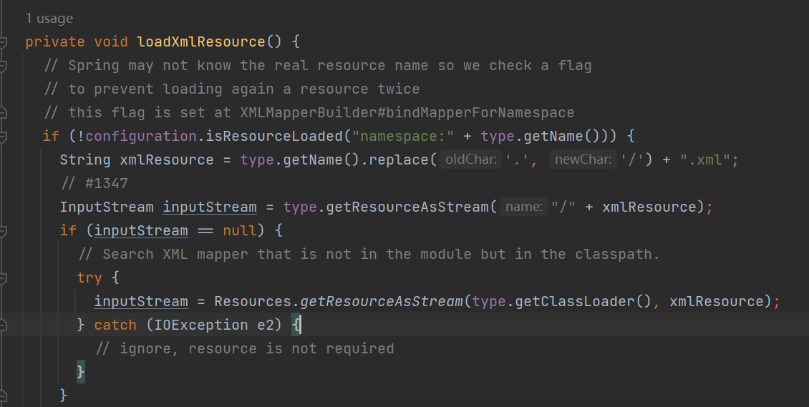

# mybatis GetStart

> 本小节内容不会超过[mybatis – MyBatis 3 | 简介](https://mybatis.org/mybatis-3/zh/index.html)的范围
>
> 相关的demo代码请看
>
> [dreamlike-ocean/qingyou_backend_code](https://github.com/dreamlike-ocean/backend_qingyou_code/tree/master/mybatis/src/main/java/top/dreamlike/qingyou/get_start)

写在最前面的话：

本节是从最基础，最烦琐的地方开始介绍的，关于配置如果整不明白，请直接使用[MyBatis Spring Boot Starter](https://mvnrepository.com/artifact/org.mybatis.spring.boot/mybatis-spring-boot-starter)在SpringBoot中使用

mybatis

### 为什么是mybatis

MyBatis 是一款优秀的持久层框架，它支持自定义 SQL、存储过程以及高级映射。MyBatis 免除了几乎所有的 JDBC 代码以及设置参数和获取结果集的工作。MyBatis 可以通过简单的 XML 或注解来配置和映射原始类型、接口和 Java POJO（Plain Old Java Objects，普通老式 Java 对象）为数据库中的记录。

这一段是抄的原文，实际上这么多操作数据库的框架，都很好用。可以试试hibernate，JOOQ，exposed都很好用。

### 准备工作

1，首先执行[sql脚本](https://github.com/dreamlike-ocean/backend_qingyou_code/tree/master/mybatis/src/main/resources/sql)生成本节使用的数据库表

2，创建一个maven项目 导入两个依赖

这里我们就使用mysql作为数据库

```xml
 <dependencies>
    <dependency>
        <groupId>org.mybatis</groupId>
        <artifactId>mybatis</artifactId>
        <version>3.5.9</version>
    </dependency>
    <dependency>
        <groupId>mysql</groupId>
        <artifactId>mysql-connector-java</artifactId>
        <version>8.0.28</version>
    </dependency>
</dependencies>
```

3，准备一个jdk就行了，这里我以jdk11为例

### 使用

#### 小问题提醒

maven默认情况下只会把resource文件夹下面的文件放到类路径下

若你把一些文件放到其他目录，就可能运行时找不到

加入我们在src/main/java下放了几个xml文件，你应该在pom.xml如此配置

```xml
<build>
        <resources>
            <resource>
                <directory>src/main/java</directory>
                <includes>
                    <include>**/*.xml</include>
                </includes>
                <filtering>false</filtering>
            </resource>
        </resources>
    </build>
```

#### 构建配置

每个基于 MyBatis 的应用都是以一个 SqlSessionFactory 的实例为核心的。SqlSessionFactory 的实例可以通过 SqlSessionFactoryBuilder 获得。而 SqlSessionFactoryBuilder 则可以从 XML 配置文件或一个预先配置的 Configuration 实例来构建出 SqlSessionFactory 实例。

下面给出两种使用方式，任选其一就行

##### xml

先看看xml怎么写

```xml
<?xml version="1.0" encoding="UTF-8" ?>
<!DOCTYPE configuration
        PUBLIC "-//mybatis.org//DTD Config 3.0//EN"
        "http://mybatis.org/dtd/mybatis-3-config.dtd">
<!--dtd是xml的约束文件，可以不写，写上了idea可以帮你做自动提示-->
<configuration>
<!--    默认使用哪个配置-->
    <environments default="development">
        <environment id="development">
            <transactionManager type="JDBC"/>
            <dataSource type="POOLED">
<!--                jdbc驱动的全限定名-->
                <property name="driver" value="com.mysql.cj.jdbc.Driver"/>
<!--                基础的url格式为jdbc:{子协议名}://{ip}:{端口}/{表名}-->
                <property name="url" value="jdbc:mysql://localhost:3306/app"/>
                <property name="username" value="root"/>
                <property name="password" value="12345678"/>
            </dataSource>
        </environment>
    </environments>
    <mappers>
 <mapper resource="top/dreamlike/qingyou/UserMapper.xml"/>
    </mappers>
</configuration>
```

当然，还有很多可以在 XML 文件中配置的选项，上面的示例仅罗列了最关键的部分。 注意 XML 头部的声明，它用来验证 XML 文档的正确性。environment 元素体中包含了事务管理和连接池的配置。mappers 元素则包含了一组映射器（mapper），这些映射器的 XML 映射文件包含了 SQL 代码和映射定义信息

接下来获取SqlSessionFactory

```java
InputStream inputStream = Resources.getResourceAsStream("mybatis-config.xml");
SqlSessionFactory sqlSessionFactory = new SqlSessionFactoryBuilder()
        .build(inputStream);
```

注意对应的xml文件放到里resource文件夹下了

##### java代码配置

如果你更愿意直接从 Java 代码而不是 XML 文件中创建配置，或者想要创建你自己的配置构建器，MyBatis 也提供了完整的配置类，提供了所有与 XML 文件等价的配置项。

想想也是，xml最后也会转换为java配置，所以肯定可以通过java代码来配置

```java
public SqlSessionFactory buildFromJava() throws IOException {
    PooledDataSource dataSource = new PooledDataSource(Driver.class.getName(),"jdbc:mysql://localhost:3306/app","root","1234678");
    TransactionFactory transactionFactory = new JdbcTransactionFactory();
    Environment environment = new Environment("development", transactionFactory, dataSource);
    Configuration configuration = new Configuration(environment);
    configuration.addMapper(UserMapper.class);
    return new SqlSessionFactoryBuilder().build(configuration);
}
```

注意该例中，configuration 添加了一个映射器类（mapper class）。映射器类是 Java 接口，它们包含 SQL 映射注解从而避免依赖 XML 映射文件。不过，由于 Java 注解的一些限制以及某些 MyBatis 映射的复杂性，要使用大多数高级映射（比如：嵌套联合映射），仍然需要使用 XML 映射文件进行映射。

有鉴于此，如果存在一个同名 XML 映射文件，MyBatis 会自动查找并加载它（在这个例子中，基于类路径和 BlogMapper.class 的类名，会加载 UserMapper.xml）

从这里就可以看出到底从哪加载接口对应的xml文件，即同级目录下面



#### 正式使用

先来个与数据库表和对应的实体类

```java
public class LoginUser {
    //省略getter setter
    private Integer id;
    private String username;
    private String password;
}
```

```sql
CREATE TABLE `user` (
  `id` int NOT NULL AUTO_INCREMENT,
  `username` varchar(255) NOT NULL,
  `password` varchar(255) NOT NULL,
  PRIMARY KEY (`id`)
) ENGINE=InnoDB AUTO_INCREMENT=1 DEFAULT CHARSET=utf8mb4 COLLATE=utf8mb4_0900_ai_ci
```

然后给一个操作的接口

```java
public interface UserMapper {
    LoginUser selectById(@Param("userId") Integer id);
}
```

在同级创建一个xml文件

```xml
<mapper namespace="top.dreamlike.qingyou.UserMapper">
    <select id="selectById" resultType="top.dreamlike.qingyou.LoginUser">
        select * from login_user where user_id = #{userId}
    </select>
</mapper>
```

既然有了 SqlSessionFactory，顾名思义，我们可以从中获得 SqlSession 的实例。SqlSession 提供了在数据库执行 SQL 命令所需的所有方法。你可以通过 SqlSession 实例来直接执行已映射的 SQL 语句。例如：

```java
 public static void main(String[] args) throws IOException {
     SqlSessionFactory factory = buildFromXml();
     try (SqlSession session = factory.openSession()) {
         System.out.println(session.getMapper(UserMapper.class).selectById(31));
     }
 }
```
