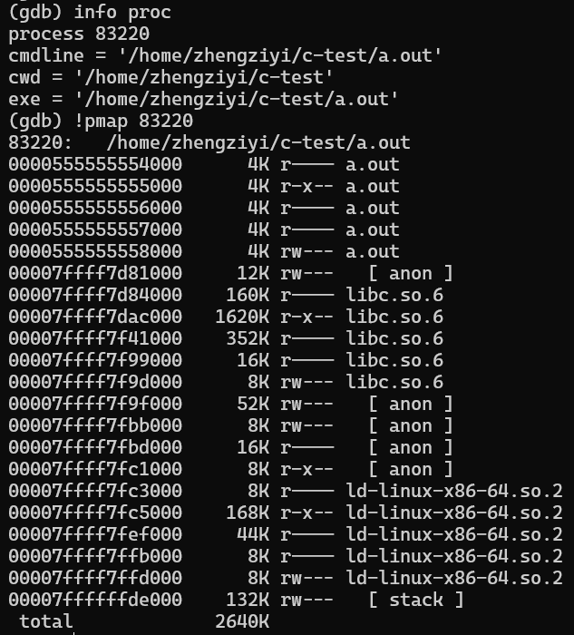
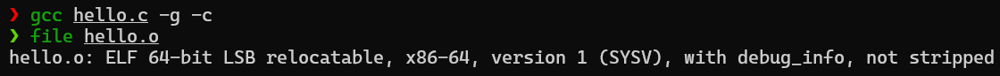
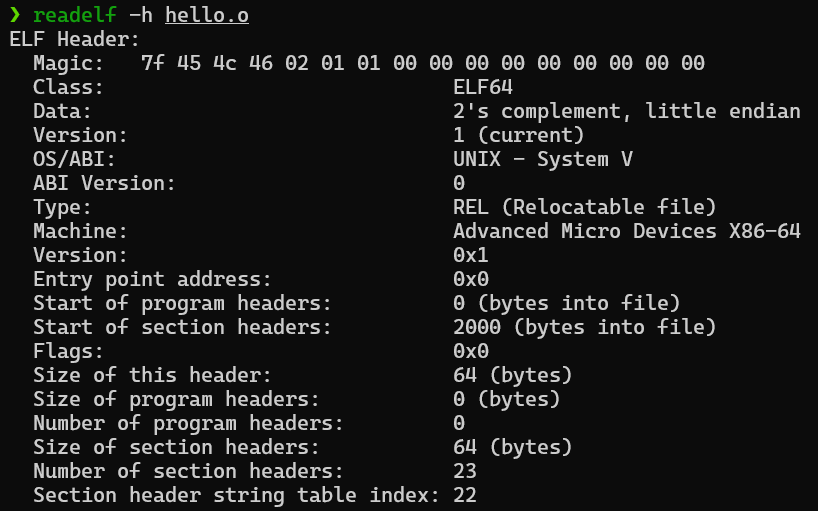
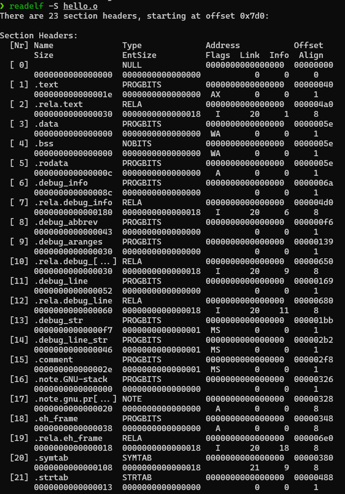
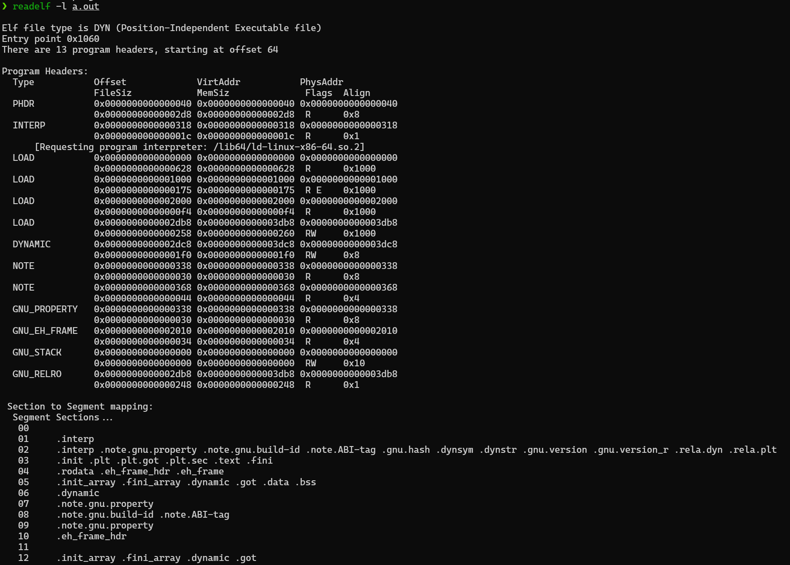
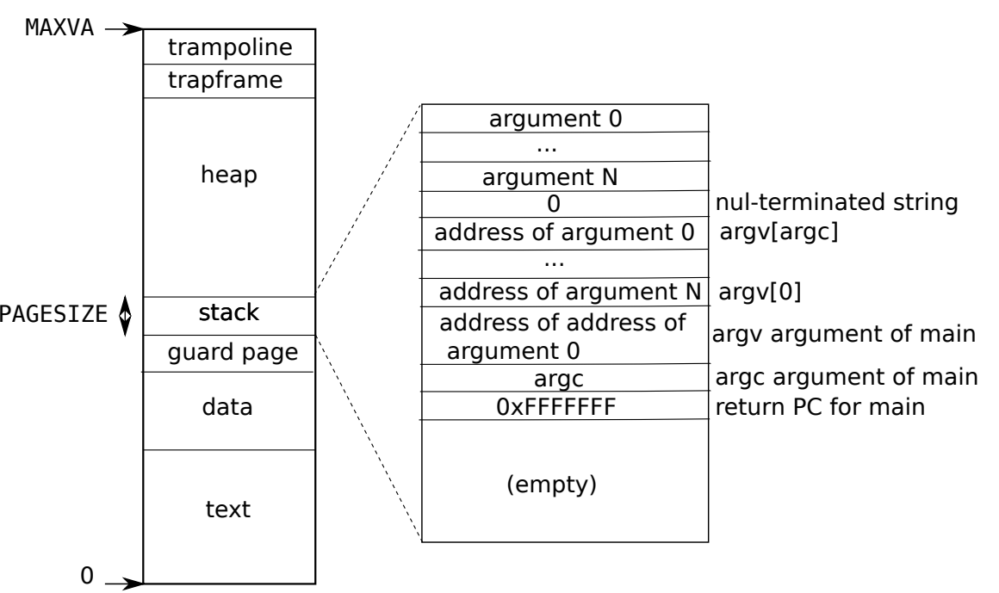

# 前言

这是做mit6.s081和看jyy老师一些课的感悟，这篇文章主要还是引入一些思想的一些导论，主要讲的是进程是什么样的，我该怎么加载一个进程，为了跟进时代的变化这里还用了`chatgpt`来做了一些名词的解释之类的（相当好用！）

# 什么是进程

很多人可能一上来就是概念，阿吧阿巴，进程是：**进程**（英语：process），是指电脑中已执行的[程式](https://zh.wikipedia.org/wiki/程式)，曾经是[分时系统](https://zh.wikipedia.org/wiki/分時系統)的基本运作单位。在面向进程设计的系统（如早期的[UNIX](https://zh.wikipedia.org/wiki/UNIX)，[Linux](https://zh.wikipedia.org/wiki/Linux) 2.4及更早的版本）中，是程式的基本执行实体；在面向线程设计的系统（如当代多数操作系统、[Linux](https://zh.wikipedia.org/wiki/Linux) 2.6及更新的版本）中，行程本身不是基本执行单位，而是[执行绪](https://zh.wikipedia.org/wiki/執行緒)的容器。（来源于wiki）

> tl;dr
>  在冯诺依曼架构下面 进程就是一块内存其中填充了一堆当前CPU认识的指令 
>  
>  并且操作系统给他做了特殊标识 并把对应的资源附着在这上面

但是，有没有什么能让我们感觉到真实的进程是什么样的呢？

有，甚至很确切

```c
#include <stdio.h>

int main () {
  printf("hello world\n");
  return 0;
}
```

这是一个简单的hello world代码，我们把它编译成**可执行文件** `a.out`后`gdb`调试他，在源代码里面随便打一个断点，之后使用`pmap`命令来获取进程号，具体过程如下面图所示

>在 Linux 操作系统中，pmap 命令用于查看指定进程或进程中指定线程的内存映射情况。pmap 命令会输出指定进程或线程使用的内存地址、使用的内存大小、内存权限等相关信息。pmap 命令是一个非常有用的诊断工具，可以帮助用户检测内存泄漏、内存碎片等问题。通常情况下，pmap 命令需要 root 权限才能运行。以下是 pmap 命令的常见用法：
>
>```shell
>pmap PID  # 查看指定进程的内存映射情况
>pmap -x PID # 查看指定进程的详细内存映射情况
>pmap -d PID # 显示指定进程或线程的内存映射中的数据段
>pmap -s PID # 显示指定进程或线程的内存映射中的栈段
>```
>
>来源于`chatgpt`,有兴趣的可以自己`man 1 pmap`查看



> 在这里同样你也可以通过`!cat /proc/83220/maps`来查看，`pmap`其实对前者封装了一下而已，让他更`human friendly`

上面的内存信息就是我们的进程真实的样子啦，很多人可能会很懵，你这进程长这逼样谁看得懂啊，别急，慢慢来。

这里简单介绍一下

- `linux`的内存都是4k为一个块，所以这里内存都是4k对齐的
- `a.out`就是我们的可执行文件
- `libc.so.6`和`ld-linux-x86-64.so.2`就是我们进程动态链接过来的内存页，比如`hello world`用到的`printf`就是从`libc.so.6`动态链接过来的
- anno其实就是匿名页，比如说`mmap`映射的在这里就是匿名页
- stack就不用多说了
- 其实细心同学用别的代码尝试的话还可能发现有`vdso`和`vvar`等，由于篇幅原因可以自行`man`手册和`chatgpt`

具体细节可以去看jyy老师的课：[进程的地址空间](https://www.bilibili.com/video/BV1Er4y1q7xo)

## elf文件

那操作系统是怎么知道我们要创建这样的进程的呢？

没错，**elf文件**，也就是我们的`xxx.o`文件（当然我们的`a.out`其实也是，毕竟是从`xxx.o`链接过来的），我们可以通过`file xxx.o`来查看文件类型



>ELF（Executable and Linkable Format）文件是一种常见的二进制文件格式，在Linux及其他类UNIX系统中被广泛使用。ELF文件可以包含可执行程序、共享库、目标文件等类型的程序代码。ELF格式的设计目标是提供一种通用、可移植、灵活的二进制格式，能够适应各种CPU架构和操作系统。
>
>ELF文件具有丰富的头部、节区、符号表和重定位等元信息，这些元信息描述了程序的各种属性和结构，如**代码段、数据段、链接信息、调试信息**等等。这些元信息使得在运行时对程序进行加载、链接和执行变得简单和高效。ELF文件中包含的重定位信息，也可以帮助程序进行动态链接和库加载并在运行时进行代码共享。
>
>ELF文件的结构十分清晰、灵活，使得他们能够满足不同类型的程序的需要。它被广泛应用于Linux系统的各种应用场景，无论是编译器、链接器、动态链接器、调试器，还是其他形式的二进制文件，都使用了ELF文件格式。(来源于chatgpt)

其实`elf文件`就是我们学到的一种数据结构而已，包括他的程序头，各种`section`，都在`elf.h`中定义，在你的`/usr/include/elf.h`就可以看到，这里随便列举点片段，这边建议搞懂elf具体长什么样再看后面的例子，可以看看`csapp`的第七章

```c
typedef struct
{
  unsigned char e_ident[EI_NIDENT];     /* Magic number and other info */
  Elf64_Half    e_type;                 /* Object file type */
  Elf64_Half    e_machine;              /* Architecture */
  Elf64_Word    e_version;              /* Object file version */
  Elf64_Addr    e_entry;                /* Entry point virtual address */
  Elf64_Off     e_phoff;                /* Program header table file offset */
  Elf64_Off     e_shoff;                /* Section header table file offset */
  Elf64_Word    e_flags;                /* Processor-specific flags */
  Elf64_Half    e_ehsize;               /* ELF header size in bytes */
  Elf64_Half    e_phentsize;            /* Program header table entry size */
  Elf64_Half    e_phnum;                /* Program header table entry count */
  Elf64_Half    e_shentsize;            /* Section header table entry size */
  Elf64_Half    e_shnum;                /* Section header table entry count */
  Elf64_Half    e_shstrndx;             /* Section header string table index */
} Elf64_Ehdr; //64位elf文件头

typedef struct
{
  Elf64_Word    sh_name;                /* Section name (string tbl index) */
  Elf64_Word    sh_type;                /* Section type */
  Elf64_Xword   sh_flags;               /* Section flags */
  Elf64_Addr    sh_addr;                /* Section virtual addr at execution */
  Elf64_Off     sh_offset;              /* Section file offset */
  Elf64_Xword   sh_size;                /* Section size in bytes */
  Elf64_Word    sh_link;                /* Link to another section */
  Elf64_Word    sh_info;                /* Additional section information */
  Elf64_Xword   sh_addralign;           /* Section alignment */
  Elf64_Xword   sh_entsize;             /* Entry size if section holds table */
} Elf64_Shdr;//64位section头

typedef struct
{
  Elf64_Word    p_type;                 /* Segment type */
  Elf64_Word    p_flags;                /* Segment flags */
  Elf64_Off     p_offset;               /* Segment file offset */
  Elf64_Addr    p_vaddr;                /* Segment virtual address */
  Elf64_Addr    p_paddr;                /* Segment physical address */
  Elf64_Xword   p_filesz;               /* Segment size in file */
  Elf64_Xword   p_memsz;                /* Segment size in memory */
  Elf64_Xword   p_align;                /* Segment alignment */
} Elf64_Phdr;//64位程序头
```

### 具体elf长啥样？

我们可以通过`readelf`命令来读取`elf文件`

>readelf是一个用于查看ELF文件的命令行工具。它支持读取并显示ELF文件的所有表头信息、段头信息、符号表信息、重定位信息、动态节信息、动态符号表信息等。
>
>常用的readelf命令选项包括：
>
>- -a/--all：显示ELF文件的所有内容；
>- -h/--file-header：显示ELF文件的文件头信息；
>- -S/--section-header：显示ELF文件的节表信息；
>- -s/--symbols：显示ELF文件的符号表信息；
>- -r/--relocs：显示ELF文件的重定位表信息；
>- -d/--dynamic：显示ELF文件的动态节信息；
>- -V/--version-info：显示ELF文件使用的动态库版本信息。
>
>示例：
>
>读取ELF文件的文件头信息：`readelf -h test.out`
>
>读取ELF文件的节表信息：`readelf -S test.out`
>
>读取ELF文件的程序头信息：`readelf -l test.out`（来源于chatgpt）感兴趣可以自行`man 1 readelf`

以下是一些`helloworld`的例子

###### elf文件头




###### elf文件的各种section



###### 可执行文件的程序头

注意这里是`a.out`这种已经链接过的可执行文件才有的程序头，用于告诉操作系统该怎么加载这个进程，那些东西得放哪里......



### 来点实际的🌰

再比如，在`riscv`中，一个用户进程被要求长这样



**那么我们只要把我们的elf文件按照如下格式放进一块内存里面，就得到了一个操作系统可以识别到的用户进程**

这里是xv6中的exec系统调用的代码段，当然你完全可以自己实现一些用户级别的`elf文件加载器`

这里我会忽略用户页表以及文件系统的一些调用，主要还是看elf文件加载，之后你就会体会到，**哦！原来操作系统真的不是魔法**（doge）

```c
int
exec(char *path, char **argv)
{
  ........

  // Check ELF header
  //检查文件头
  if(readi(ip, 0, (uint64)&elf, 0, sizeof(elf)) != sizeof(elf)) //读取elf文件
    goto bad;
  if(elf.magic != ELF_MAGIC) //检查文件头魔数，类似于java的0xCAFEBABE
    goto bad;

	.......

  // Load program into memory.
  for(i=0, off=elf.phoff; i<elf.phnum; i++, off+=sizeof(ph)){
    if(readi(ip, 0, (uint64)&ph, off, sizeof(ph)) != sizeof(ph))
      goto bad;
    if(ph.type != ELF_PROG_LOAD) //程序头类型是否要被加载
      continue;
    if(ph.memsz < ph.filesz) //检验大小而已
      goto bad;
    if(ph.vaddr + ph.memsz < ph.vaddr)
      goto bad;
    uint64 sz1;
    if((sz1 = uvmalloc(pagetable, sz, ph.vaddr + ph.memsz)) == 0) //只是在用户进程上分配一块内存
      goto bad;
    sz = sz1;
    if(ph.vaddr % PGSIZE != 0)
      goto bad;
    if(loadseg(pagetable, ph.vaddr, ip, ph.off, ph.filesz) < 0) //加载具体的程序段
      goto bad;
  }

  p = myproc(); //获取用户进程
  uint64 oldsz = p->sz;

  // Allocate two pages at the next page boundary.
  // Use the second as the user stack.
  sz = PGROUNDUP(sz);
  uint64 sz1;
  if((sz1 = uvmalloc(pagetable, sz, sz + 2*PGSIZE)) == 0)
    goto bad;
  sz = sz1;
  uvmclear(pagetable, sz-2*PGSIZE);
  sp = sz;
  stackbase = sp - PGSIZE;

  // Push argument strings, prepare rest of stack in ustack.
  for(argc = 0; argv[argc]; argc++) {
    if(argc >= MAXARG)
      goto bad;
    sp -= strlen(argv[argc]) + 1;
    sp -= sp % 16; // riscv sp must be 16-byte aligned
    if(sp < stackbase)
      goto bad;
    if(copyout(pagetable, sp, argv[argc], strlen(argv[argc]) + 1) < 0)//这里就是一些内存的copy,所有的操作都是为了把参数给丢到进程的栈里面去
      goto bad;
    ustack[argc] = sp;
  }
  ustack[argc] = 0;

  //同上
  // push the array of argv[] pointers. 
  sp -= (argc+1) * sizeof(uint64);
  sp -= sp % 16;
  if(sp < stackbase)
    goto bad;
  if(copyout(pagetable, sp, (char *)ustack, (argc+1)*sizeof(uint64)) < 0) //一些内存的copy,所有的操作都是为了把参数给丢到进程的栈里面去
    goto bad;

  // arguments to user main(argc, argv)
  // argc is returned via the system call return
  // value, which goes in a0.
  p->trapframe->a1 = sp;

    
  // Commit to the user image. //设置一个进程的一些参数，比如页表等
  oldpagetable = p->pagetable; 
  p->pagetable = pagetable;
  p->sz = sz;
  p->trapframe->epc = elf.entry;  // initial program counter = main 
  p->trapframe->sp = sp; // initial stack pointer

  return argc; // this ends up in a0, the first argument to main(argc, argv)

 bad: //就是一系列异常处理，c语言只能这样了
  if(pagetable)
    proc_freepagetable(pagetable, sz);
  if(ip){
    iunlockput(ip);
    end_op();
  }
  return -1;
}
```

有兴趣的同学可以看jyy老师实现的`x86 elf文件加载器`代码，代码只有几十行，这里不列出来了，留下一些自我想象空间吧

# 结尾

其实在这里就阐明了进程是什么了，你甚至可以去读一读手册，看看x86或者其他架构里面的操作系统，是如何实现进程的，最后你甚至就可以去实现一个自己写的进程加载器~~~解开魔法啦

