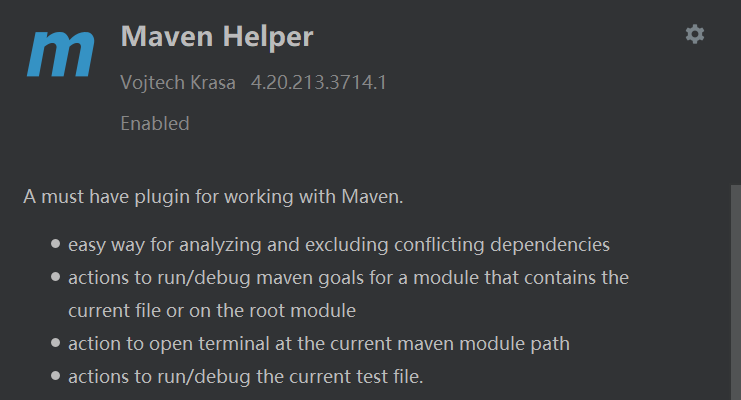
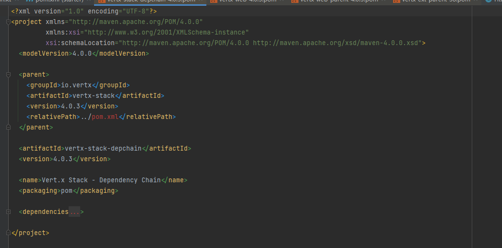
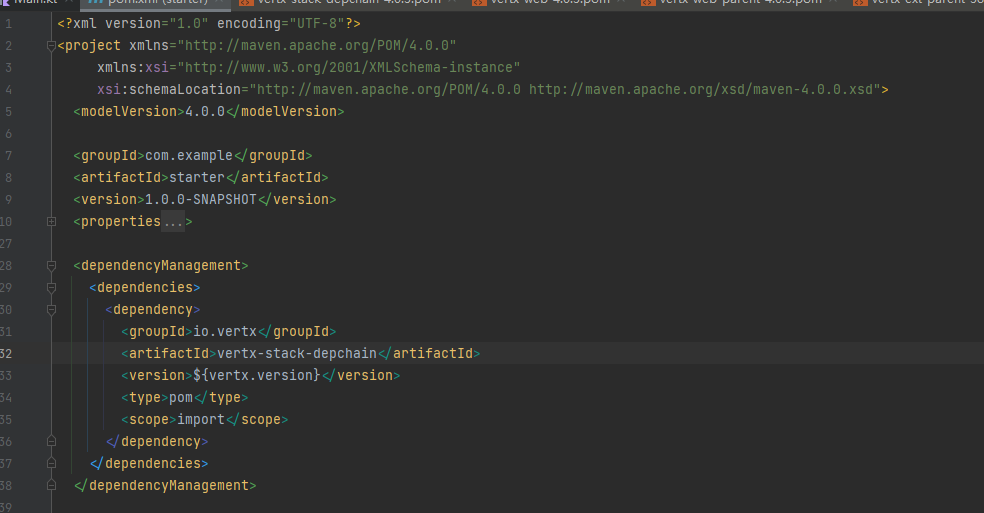

# maven dependencies

> 本文绝大部分来自于翻译
>
> [Maven – Introduction to the Dependency Mechanism (apache.org)](https://maven.apache.org/guides/introduction/introduction-to-dependency-mechanism.html)

作为构建工具最基础的就是对于依赖管理

#### 基础

对于之前生成的项目 你可能看到了pom.xml文件中<dependencies>标签的内容

```xml
<dependencies>
    <dependency>
      <groupId>junit</groupId>
      <artifactId>junit</artifactId>
      <version>4.11</version>
      <scope>test</scope>
    </dependency>
  </dependencies>
```

你会发现一个依赖存在四个元素，即groupId、artifactId、version和scope，前三个可以在仓库中唯一定位一个jar包的位置，简单来说就是groupId代表它属于哪个组织（姓），artifactId代表它的项目名（名）。在实际开发中我们会使用一个总依赖管理机制来统一管理版本，所以在大部分情况下我们只需要关注groupId、artifactId这两者即可。

Maven 从哪里获取依赖？首先Maven 在本地存储库（默认位置）中查找所有依赖项

> windows默认位置是当前用户对应文件夹下的.m2文件中 
>
> C:\Users\\${username}\\.m2\repository
>
> linux类似

每当项目引用本地存储库中没有的依赖时，Maven 都会将依赖从远程存储库下载到本地存储库中。

您可能注意到 Maven 在构建第一个项目时下载了很多东西（这些下载是用于构建项目的各种插件的依赖项）。

默认情况下， https://repo.maven.apache.org/maven2/ 是Maven 使用的远程存储库。您还可以设置自己的远程存储库（可能是贵公司的中央存储库，或者镜像），以代替默认远程存储库或作为默认远程存储库的补充，当然这不是本章内容，后面会讲

举个例子 如果我需要添加一个依赖怎么办呢？

你可以先去[Maven Repository: Search/Browse/Explore (mvnrepository.com)](https://mvnrepository.com/)这个网站找到你要的包

拷贝maven部分的xml代码到pom.xml即可


```xml
 <dependencies>
    <dependency>
      <groupId>io.vertx</groupId>
      <artifactId>vertx-core</artifactId>
      <version>4.2.7</version>
    </dependency>
    <dependency>
      <groupId>junit</groupId>
      <artifactId>junit</artifactId>
      <version>4.11</version>
      <scope>test</scope>
    </dependency>
  </dependencies>
```

只要你掌握了如何添加和搜索依赖，你就已经可以cover绝大部分常见maven使用的场景了

#### 依赖传递关系

由于java繁荣的生态和模块化的设计哲学，各种库或多或少会依赖于其他的包，零依赖的包是非常少见的，所以会产生依赖关系，那么若两个包声明了两个相同的依赖但是版本不同那么应该引入哪个呢？这就是本节要讨论的内容

##### 最近依赖关系

以当前项目为根的依赖树，相同距离根最近的依赖为实际使用的依赖,若距离相同则第一个声明优先

下图使用的D版本为1.0

```
  A
  ├── B
  │   └── C
  │       └── D 2.0
  └── E
      └── D 1.0
```

但是这带来了一些问题，我们假定jar的升级都是向下兼容的，那么D2.0可以无缝取代D1.0,而反之不行，当我们真实使用时会发现报某些函数不存在的错误，这种就是典型的依赖冲突，这时候就可以利用**最近依赖关系**来解决

我们显示依赖一下D的2.0版本即可

```
  A
  ├── B
  │   └── C
  │       └── D 2.0
  ├── E
  │   └── D 1.0
  │
  └── D 2.0     
```

这里推荐一个idea插件，帮助你可视化分析依赖和冲突，同时只需要点击就可以解决冲突



##### 依赖范围

> 对于实际业务开发 其实没有那么复杂 大部分情况下使用默认即可
>
> 而对于你想开发一个基础的包则是必须要了解的

实际上最近依赖关系可以帮我们解决的大部分依赖冲突问题，但是并不是一个完全的解决方案，因为依赖冲突本质来源于依赖的传递性质，为了提出一个万全的方案，我们需要进一步学习依赖的范围分类(就是你在dependency中的scope标签)

依赖项作用域用于限制依赖项的可传递性，并确定依赖项何时包含在类路径（比如说要打fat-jar 需不需要打进去）中。

- **compile**
  这是默认作用域，如果未指定任何作用域，则使用该作用域。编译依赖项在项目的所有类路径中都可用。此外，这些依赖项将传播到上级依赖项目。即B依赖了C，A依赖B时会直接把C的依赖进来
- **provided**
  这很像`compile`但表示您希望 JDK 或容器在运行时提供依赖项。例如，在为javaEE 构建 Web 应用程序时，应将 Servlet API 和相关 Java EE API 的依赖关系设置为`provided`，因为 Web 容器提供了这些类。具有此作用域的依赖项将添加到用于编译和测试的类路径中，但不会添加到运行时类路径中。它不是可传递的。简单来说就是不打包进去
- **runtime**
  此作用域指示依赖项不是编译所必需的，而是执行所必需的。比如可能在编译的时候只需要JDBC API，而只有在运行的时候才需要JDBC驱动实现。会打包进去
- **test**
  此作用域指示应用程序正常使用不需要这个依赖项，并且仅适用于编译测试代码和执行测试阶段。此作用域不可传递的。通常，此作用域用于测试库，如 JUnit 和 Mockito。它也用于非测试库，如Apache Commons IO，当这些库只用于单元测试（src/test/java），但不在业务代码（src/main/java）中使用。
- **system**
  此作用域类似于`provided`，只是您必须提供显式包含它的 JAR。这个一般用于仓库里没有，但是你本地有一个，就可以利用  <systemPath>标签指定一个本地jar路径，比如说你开发了一个包，还没install到仓库
- **import**
  这个只用于<dependencyManagement>标签下面的依赖，用于导入一个pom来管理依赖

##### 父子依赖关系的管理

我们考虑这样一个场景情况

项目一：

```xml
<project>
  ...
  <dependencies>
    <dependency>
      <groupId>group-a</groupId>
      <artifactId>artifact-a</artifactId>
      <version>1.0</version>
      <exclusions>
        <exclusion>
          <groupId>group-c</groupId>
          <artifactId>excluded-artifact</artifactId>
        </exclusion>
      </exclusions>
    </dependency>
    <dependency>
      <groupId>group-a</groupId>
      <artifactId>artifact-b</artifactId>
      <version>1.0</version>
      <type>bar</type>
      <scope>runtime</scope>
    </dependency>
  </dependencies>
</project>
```

项目 B：

```xml
<project>
  ...
  <dependencies>
    <dependency>
      <groupId>group-c</groupId>
      <artifactId>artifact-b</artifactId>
      <version>1.0</version>
      <type>war</type>
      <scope>runtime</scope>
    </dependency>
    <dependency>
      <groupId>group-a</groupId>
      <artifactId>artifact-b</artifactId>
      <version>1.0</version>
      <type>bar</type>
      <scope>runtime</scope>
    </dependency>
  </dependencies>
</project>
```

有两个web项目A、B，一个java项目C，它们都需要用到同一个jar包：common.jar。
如果分别在三个项目的pom文件中定义各自对common.jar的依赖，那么当common.jar的**版本**发生变化时，三个项目的pom文件都要改，项目越多要改的地方就越多，很麻烦。
这时候就需要用到parent标签, 我们创建一个parent项目，打包类型为pom，parent项目中不存放任何代码，只是管理多个项目之间公共的依赖。在parent项目的pom文件中定义对common.jar的依赖，ABC三个子项目中只需要定义`<parent>...</parent>`，parent标签中写上parent项目的pom坐标就可以引用到common.jar了。

那么我们的父POM可以这样写

```xml
<project>
  ...
  <dependencyManagement>
    <dependencies>
      <dependency>
        <groupId>group-a</groupId>
        <artifactId>artifact-a</artifactId>
        <version>1.0</version>
 
        <exclusions>
          <exclusion>
            <groupId>group-c</groupId>
            <artifactId>excluded-artifact</artifactId>
          </exclusion>
        </exclusions>
 
      </dependency>
 
      <dependency>
        <groupId>group-c</groupId>
        <artifactId>artifact-b</artifactId>
        <version>1.0</version>
        <type>war</type>
        <scope>runtime</scope>
      </dependency>
 
      <dependency>
        <groupId>group-a</groupId>
        <artifactId>artifact-b</artifactId>
        <version>1.0</version>
        <type>bar</type>
        <scope>runtime</scope>
      </dependency>
    </dependencies>
  </dependencyManagement>
</project>
```

子项目只需要用parent标签引入即可，然后按需声明依赖即可，版本控制就交给父级了

```xml
<project>
  ...
  <dependencies>
    <dependency>
      <groupId>group-a</groupId>
      <artifactId>artifact-a</artifactId>
    </dependency>
 
    <dependency>
      <groupId>group-a</groupId>
      <artifactId>artifact-b</artifactId>
      <!-- This is not a jar dependency, so we must specify type. -->
      <type>bar</type>
    </dependency>
  </dependencies>
</project>
```

比如说实际开发中，我们的项目其实都是spring的一个子模块，这样就可以享受到统一依赖管理的好处了


##### import范围和parent标签

上一节中的示例介绍如何通过继承指定托管依赖项。但是，在较大的项目中，可能无法完成此操作，因为项目只能从单个父级继承。为了适应这种情况，项目可以从其他项目导入托管依赖项。这是通过`import`作用域做到的

这里就类似于java的继承 你只能继承一个父类 但是可以继承很多接口

举个例子 你只需要把当前maven项目的pom.xml中的packaging改为pom 那么它就变成了一个可被导入的依赖管理了



然后真正使用的时候只要这样引入即可



##### system依赖

这个用于引入一个本地的jar包

比如 在jdk8的版本里面你想用tool.jar中的一些api就可以这样写

```xml
<project>
  ...
  <dependencies>
    <dependency>
      <groupId>sun.jdk</groupId>
      <artifactId>tools</artifactId>
      <version>1.5.0</version>
      <scope>system</scope>
      <systemPath>${java.home}/../lib/tools.jar</systemPath>
    </dependency>
  </dependencies>
  ...
</project>
```

