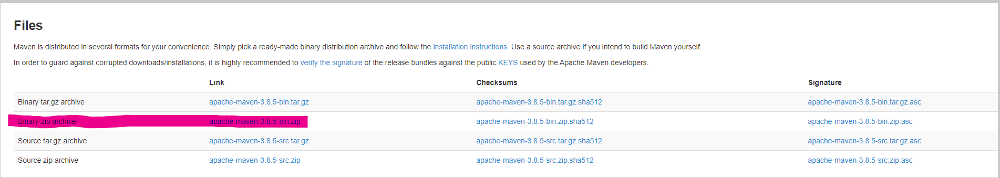
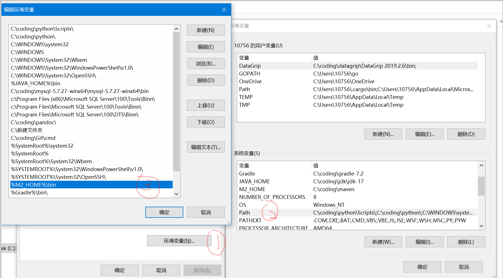
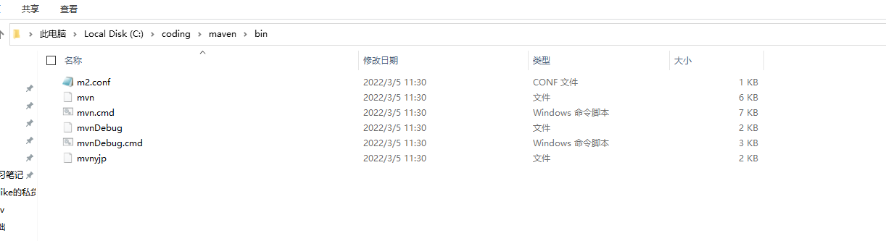
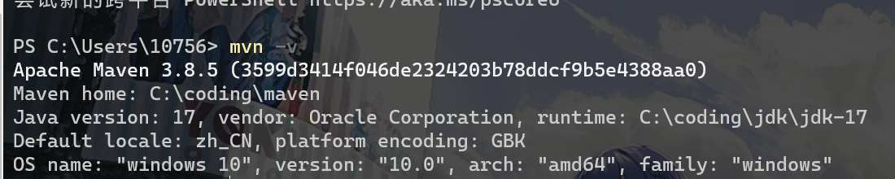
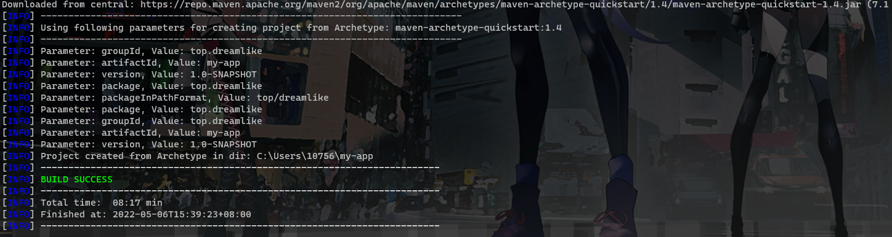
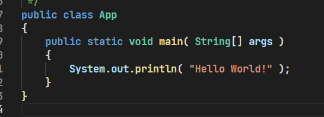
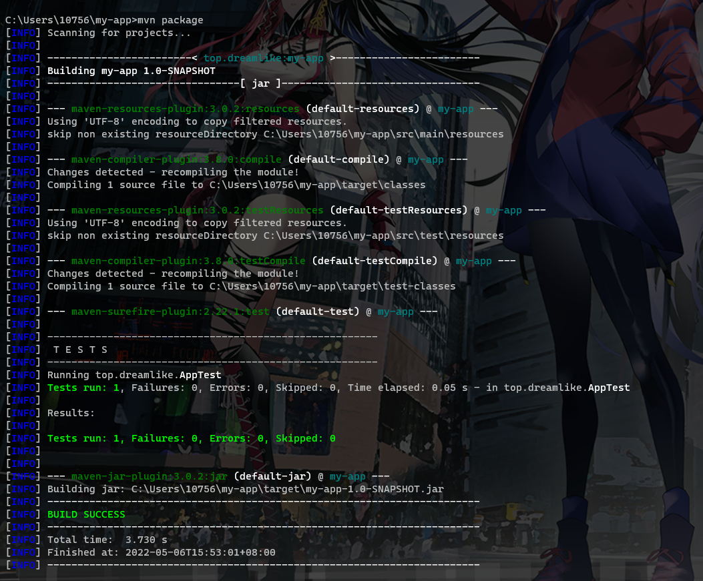

# maven（1）

> maven部分的所有内容均基于 [Maven – Welcome to Apache Maven](https://maven.apache.org/)
>
> 部分内容翻译自这个文档
>
> 若内容有冲突则以官方文档为准

### 为什么要使用构建工具？

我们先抛开maven，先来谈谈我们需要什么样子的工具帮助我们解决源码从编写到发布的问题

构建工具是一个把源码编译到可执行应用程序的过程自动化的程序（例如Android app生成apk）。构建包括编译、连接跟把代码打包成可用的或可执行的形式。

基本上构建的自动化是编写或使一大部分任务自动执行的一个动作，而这些任务则是软件开发者的日常，像是：

1. 下载依赖
2. 将源代码编译成二进制代码
3. 打包生成的二进制代码
4. 进行单元测试
5. 部署到生产系统

在小型项目中，开发者往往手动调用构建过程，这样在大型的项目中很不实用，在构建过程中难以跟踪什么需要被构建、按照什么顺序构建以及项目中存在哪些依赖。而使用自动化工具会使构建过程更为连续。

之所以使用maven则是它可以通过配置构建工具链帮助我们完成编译，测试，打包的工作，甚至它可以帮助我们管理跨语言的构建管理

具体的可以看看这个回答[What is a build tool? - Stack Overflow](https://stackoverflow.com/questions/7249871/what-is-a-build-tool)

### 安装

首先查看一下系统需求

| **Java Development Kit (JDK)** | jdk7以上版本                                                 |
| ------------------------------ | ------------------------------------------------------------ |
| **内存**                       | 无需担心，一般构建只需要启动jvm的内存即可，不同插件需求不同  |
| **磁盘**                       | Maven安装本身需要大约10MB的内存。但是实际上需要更多的空间用来储存你的本地依赖。本地依赖库的大小将根据使用情况而有所不同，但至少应为500MB。（我本地的库应该是1G起步了） |
| **操作系统**                   | 无需求，启动的脚本包含shell和window bat文件                  |

先从[Maven – Download Apache Maven](https://maven.apache.org/download.cgi)下载二进制包



下载之后放到一个你喜欢的路径并解压即可

然后你打开你的环境变量 在path中添加你之前得到的解压包中bin文件夹的全路径



就是这个全路径



然后打开你的cmd 输入mvn -v 看到以下输出就好了



### 五分钟入门maven

> 原文来自
>
> [Maven – Maven in 5 Minutes (apache.org)](https://maven.apache.org/guides/getting-started/maven-in-five-minutes.html)

虽然我们大部分情况不使用这种办法获得到一个maven风格项目，但是根据这个来学习maven风格的项目还是很有必要的

先找到一个文件夹 输入以下命令 稍等一段时间

如果您刚刚安装了 Maven，则在第一次运行时可能需要一段时间。这是因为 Maven 正在将最新的文件（插件 jar 和其他文件）下载到您的本地存储库中。您可能还需要执行该命令几次才能成功。这是因为远程服务器可能会在下载完成之前超时。别担心，有办法解决这个问题。

```shell
mvn archetype:generate -DgroupId=com.mycompany.app -DartifactId=my-app -DarchetypeArtifactId=maven-archetype-quickstart -DarchetypeVersion=1.4 -DinteractiveMode=false
```



然后你就可以看到这样的项目结构

```
my-app
|-- pom.xml
`-- src
    |-- main
    |   `-- java
    |       `-- com
    |           `-- mycompany
    |               `-- app
    |                   `-- App.java
    `-- test
        `-- java
            `-- com
                `-- mycompany
                    `-- app
                        `-- AppTest.java
```

pom.xml 该文件是 Maven 中项目配置的核心。它是一个配置文件，其中包含以您想要的方式构建项目所需的大部分信息。POM是巨大的，其复杂性可能令人生畏，但没有必要了解所有的复杂性才能有效地使用它。

你在这里面只需要知道如何添加依赖即可，你也可以简单理解为这个文件就是用来管理依赖的（版本之类的）

```xml
<project xmlns="http://maven.apache.org/POM/4.0.0" xmlns:xsi="http://www.w3.org/2001/XMLSchema-instance"
  xsi:schemaLocation="http://maven.apache.org/POM/4.0.0 http://maven.apache.org/xsd/maven-4.0.0.xsd">
  <modelVersion>4.0.0</modelVersion>
 
  <groupId>com.mycompany.app</groupId>
  <artifactId>my-app</artifactId>
  <version>1.0-SNAPSHOT</version>
 
  <properties>
    <maven.compiler.source>1.7</maven.compiler.source>
    <maven.compiler.target>1.7</maven.compiler.target>
  </properties>
 
  <dependencies>
    <dependency>
      <groupId>junit</groupId>
      <artifactId>junit</artifactId>
      <version>4.12</version>
      <scope>test</scope>
    </dependency>
  </dependencies>
```

而其他生成出来的很简单



然后我们切换到目录下面来把他打包

`mvn package` 



实际上你就可以看到它做了那些工作 编译源码 编译测试代码 打包测试资源 运行测试 打包

一系列工作只要一个命令 这个就是我们自动化构建工具的好处

您可以使用以下命令测试新编译和打包的 JAR：

```
java -cp target/my-app-1.0-SNAPSHOT.jar com.mycompany.app.App
```

这将打印经典的一句话：

```
Hello World!
```

然后我们来看看默认的执行流程（生命周期）

- **验证**：验证项目是否正确，并且所有必要的信息都可用
- **编译**：编译项目的源代码
- **测试**：使用合适的单元测试框架测试编译的源代码。这些测试不应要求打包或部署代码
- **打包**：获取编译后的代码，并将其打包为其可分发格式，例如JAR。
- **集成测试**：如有必要，将包处理并部署到可以运行集成测试的环境中
- **验证**：运行任何检查以验证包是否有效并符合质量标准
- **安装**：将软件包安装到本地存储库中，以便在本地的其他项目中用作依赖项
- **部署**：在集成或发布环境中完成，将最终包复制到远程存储库，以便与其他开发人员和项目共享。

实际情形下我们并不需要这么多周期，一般我们只需要走到打包这一步就行了，甚至有时候并不需要在这个过程中进行测试（而是在写代码时做测试），即简化来讲package指令是这样的 验证->编译->打包

除了上面的*默认*列表之外，还有另外两个 Maven 生命周期值得注意。他们是

- **清理**：清理先前构建创建的结果（大部分情况下就是把你的target文件下面的删除）

- **site**：为此项目生成站点文档

这些生命周期其实可以搭配起来使用，最常见的情况是这样的

`mvn clean package` 先清理上一次构建结果再进行这一次构建