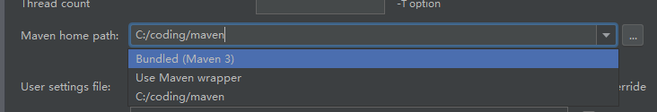
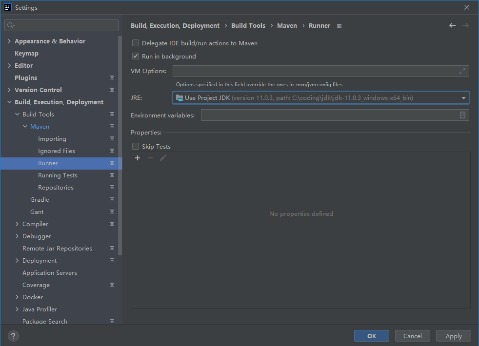
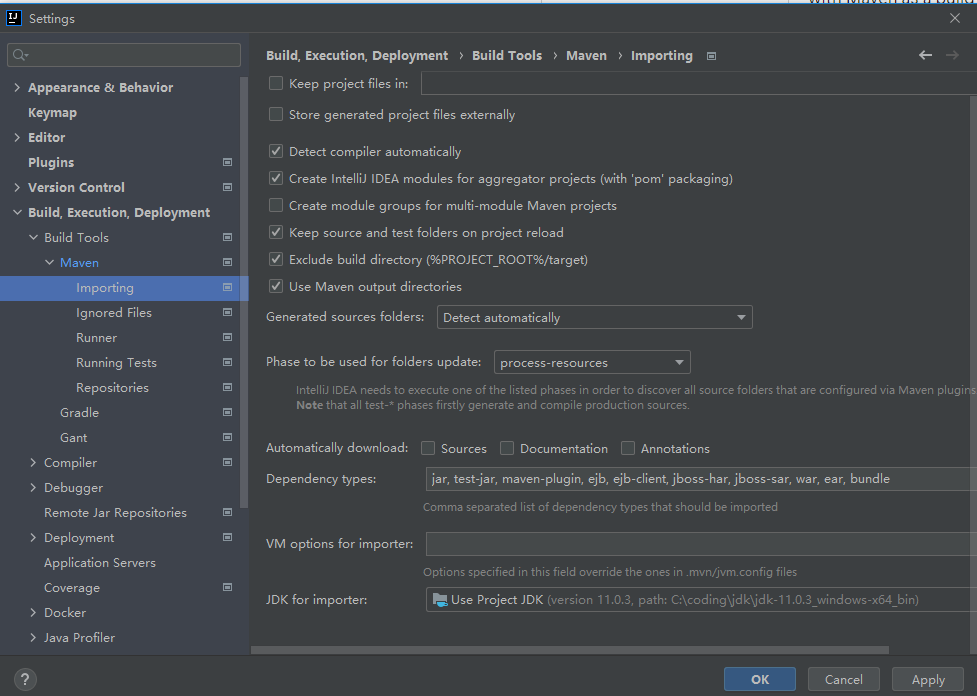
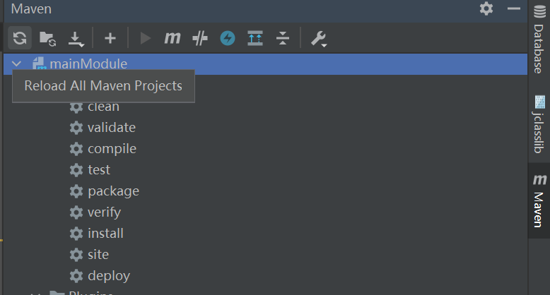
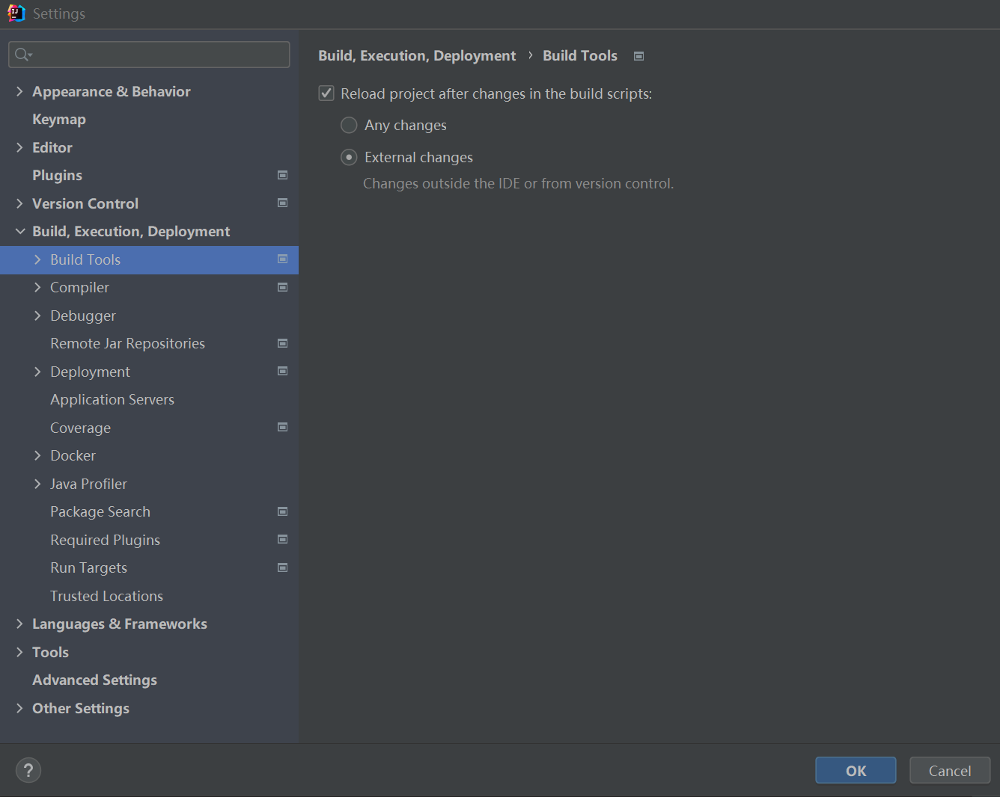
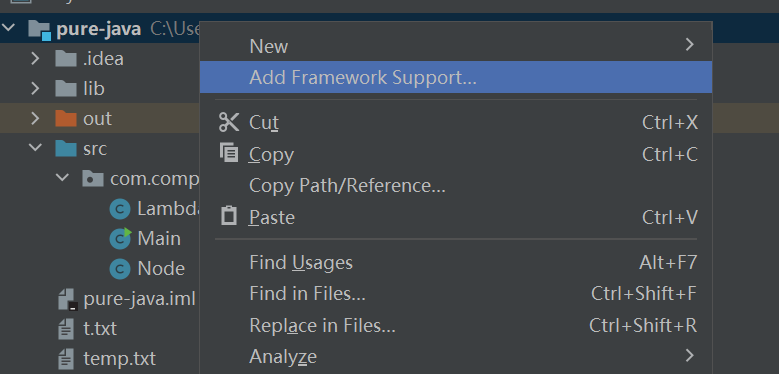
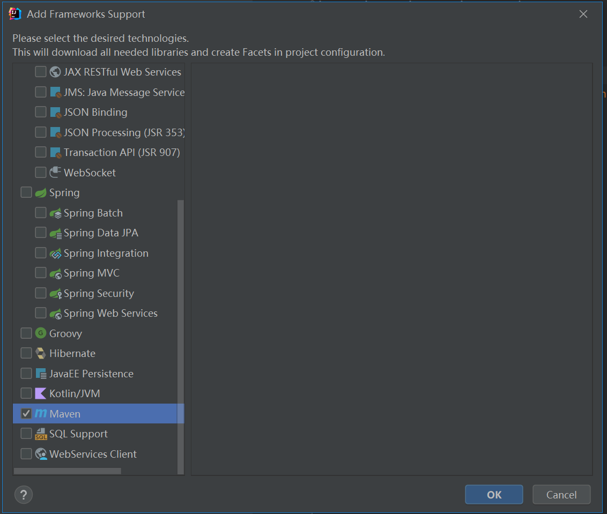

# maven_idea

> 本文内容来自于
>
> [Maven | IntelliJ IDEA (jetbrains.com)](https://www.jetbrains.com/help/idea/maven-support.html)
>
> 版本为2022.1 ultimate edition

主要内容为讲述如何自定义idea中的maven插件

#### 首先是替换idea自己的maven插件

File | Settings/Preferences | Build, Execution, Deployment |Build Tools | Maven

从上到下分别是 idea自带的maven，项目指定的maven wrapper，当前环境变量中指定的maven



这里推荐使用自己当前环境变量中的maven

maven wrapper：有些仓库会指定特定版本的maven和maven配置，所以你可以见到有些仓库clone后带有这样的文件夹

```
my-project
├── .mvn
│   └── wrapper
│       ├── MavenWrapperDownloader.java
│       ├── maven-wrapper.jar
│       └── maven-wrapper.properties
├── mvnw
├── mvnw.cmd
├── pom.xml
└── src
    ├── main
    │   ├── java
    │   └── resources
    └── test
        ├── java
        └── resources
```

要使用的话直接执行对应脚本即可，这样就会自动下载对应的maven版本

具体情况参考[Apache Maven Wrapper – Maven Wrapper](https://maven.apache.org/wrapper/)

#### 替换maven运行的jdk

默认情况下是你当前项目指定的jdk，有些情况需要用不同的jdk来运行maven

下面这个在runner界面更改的只用于当前项目



而在这里更改的会影响到idea全局的配置



#### 重新导入pom.xml依赖

有些时候你在更改pom.xml时，idea并不会自动执行导入或者刷新的操作，这个时候就需要你手动刷新一下

侧边栏 点击 即可



或者你也可以进行配置自动重新导入

选择为Any changes即可



#### 将一个普通java项目变为maven项目

首先我们具有一个普通的java项目

右键项目点击Add Framework Support.



勾选maven即可



