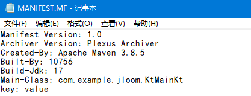
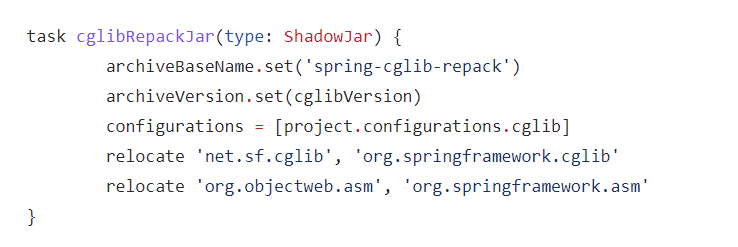
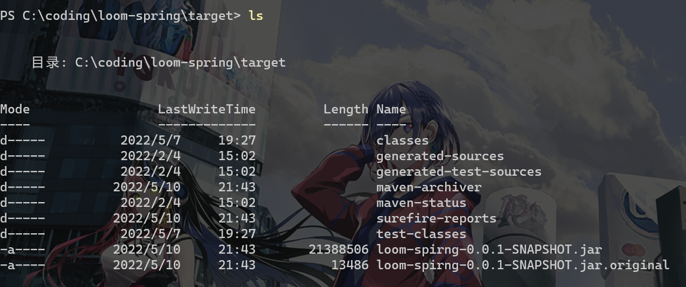

# maven_plugin

> 本文翻译自：[Maven – Available Plugins (apache.org)](https://maven.apache.org/plugins/index.html)

本篇主要内容为你常用的插件的配置，帮助你了解你使用的插件到底做了什么

实际上你在工作中只需要理解compile标签中的source和target即可

### clean

当你使用`mvn clean`时实际上就是在调用这个插件 默认情况下会帮你删除`target`文件夹

如果你需要删除额外的文件/文件夹则可以进行额外的配置

```xml
<build>
  [...]
<plugins> 
  <plugin>
    <artifactId>maven-clean-plugin</artifactId>
    <version>3.2.0</version>
    <configuration>
      <filesets>
        <fileset>
          <directory>some/relative/path</directory>
          <includes>
            <include>**/*.tmp</include>
            <include>**/*.log</include>
          </includes>
          <excludes>
            <exclude>**/important.log</exclude>
            <exclude>**/another-important.log</exclude>
          </excludes>
          <followSymlinks>false</followSymlinks>
        </fileset>
      </filesets>
    </configuration>
  </plugin>
</plugins>   
  [...]
</build>
```

其实fileset标签中的路径是相对路径 其等价于

```xml
  <directory>${basedir}/some/relative/path</directory>
```

如果你想要跳过clean也是可以的

```xml
<pluign>
    <artifactId>...</artifactId>
    <version>..</version>
    <configuration>
        <skip>true</skip>
    </configuration>
</pluign>
```

或者在执行命令的时候

```shell
mvn clean -Dmaven.clean.skip=true
```

### compile

这个插件是个非常重要的插件，用来编译你的java代码

编译器插件的目标与构建生命周期中各自的阶段有关。因此，要编译源代码，只需告诉maven要执行哪个生命周期。

```java
mvn compile
```

如果指定要编译test部分的代码你需要这样指定

```
mvn test-compile
```

#### 使用不同的jdk进行编译

Maven默认使用的是JAVA_HOME的环境变量来找到Java环境进行编译，即找到JAVA_HOME\bin\javac来进行编译

有些时候本地使用的jdk和实际需要的jdk是不一样的，比如说你本地环境是jdk17，然而你目前正在尝鲜jdk19ea，而又不想切换本地环境，那就可以在编译的时候指定这个jdk

这里你需要指定fork为true，然后指定一下executable为你想要的jdk

```xml
<plugin>
		<groupId>org.apache.maven.plugins</groupId>
		<artifactId>maven-compiler-plugin</artifactId>
		<version>3.1</version>
		<configuration>
			<verbose>true</verbose>
			<fork>true</fork>
			<executable>${loom.path}/bin/javac</executable>
		</configuration>
</plugin>
```

#### 指定使用的jdk版本

如果你本地环境是17，而线上是11，而且你使用的api和语法都是降级到11也可以兼容的，那么你就可以设置jdk版本指定编译出来的版本。即对应javac的`-source`和`-target`参数

方法一

```java
<project>
  [...]
  <properties>
    <maven.compiler.source>11</maven.compiler.source>
    <maven.compiler.target>11</maven.compiler.target>
  </properties>
  [...]
</project>
```

方法二

```xml
<project>
  [...]
  <build>
    [...]
    <plugins>
      <plugin>
        <groupId>org.apache.maven.plugins</groupId>
        <artifactId>maven-compiler-plugin</artifactId>
        <version>3.10.1</version>
        <configuration>
          <source>11</source>
          <target>11</target>
        </configuration>
      </plugin>
    </plugins>
    [...]
  </build>
  [...]
</project>
```

#### 指定编译器参数

javac实际上是支持很多参数的

比如说最常用的`-paramters`参数用于将方法参数名编译进去,还有打开某些模块，开启预览功能等


你就可以这样指定

```xml
<plugins>
   <plugin>
      <groupId>org.apache.maven.plugins</groupId>
      <artifactId>maven-compiler-plugin</artifactId>
      <version>3.10.1</version>
      <configuration>
        <compilerArgs>
          <arg>-parameters</arg>
          <arg>--add-exports</arg>
          <arg>java.base/jdk.internal.vm=mainModule</arg>
          <arg>--enable-preview</arg>
        </compilerArgs>
      </configuration>
   </plugin>
</plugins>
```

### surefire （test阶段使用的）

这一部分最有用的应该还是如何跳过test

#### 跳过测试

方法一

```java
<project>
  [...]
  <build>
    <plugins>
      <plugin>
        <groupId>org.apache.maven.plugins</groupId>
        <artifactId>maven-surefire-plugin</artifactId>
        <version>...</version>
        <configuration>
          <skipTests>true</skipTests>
        </configuration>
      </plugin>
    </plugins>
  </build>
  [...]
</project>
```

方法二

```shell
mvn install -DskipTests
```

方法三

```shell
mvn install -Dmaven.test.skip=true
```

注意这个方法三连测试类都不会编译，而其他两种则会编译。

### shade

这个插件其实非常强大 但是往往我们只使用他的打fatjar的功能，把全部依赖都打到一个jar下面

没有这个插件直接`mvn package`只能把你的src文件夹下面的代码和pom.xml打包到一个jar下面


而shade这个插件会在package阶段调用，帮你把这些依赖一起打进去

#### 可执行的fat-jar/Uber-jar 

作为可执行的jar 应该是包含全部依赖且包含一个main函数

你只要这样配置就行了

```xml
<project>
  ...
  <build>
    <plugins>
      <plugin>
        <groupId>org.apache.maven.plugins</groupId>
        <artifactId>maven-shade-plugin</artifactId>
        <version>3.3.0</version>
        <executions>
          <execution>
            <phase>package</phase>
            <goals>
              <goal>shade</goal>
            </goals>
            <configuration>
              <transformers>
                <transformer implementation="org.apache.maven.plugins.shade.resource.ManifestResourceTransformer">
                  <manifestEntries>
                     <Main-Class>${main.class}</Main-Class>
                     <key>value</key>
                </transformer>
              </transformers>
            </configuration>
          </execution>
        </executions>
      </plugin>
    </plugins>
  </build>
  ...
</project>
```

实际上manifestEntries标签的子内容就是打包到jar包下面`META-INF/MANIFEST.MF`文件的内容

标签名就是key 标签内容就是value



#### 过滤不需要的文件

下面的POM代码片段显示了如何控制uber JAR中应该包含/排除哪些项目依赖项：

```xml
<project>
  ...
  <build>
    <plugins>
      <plugin>
        <groupId>org.apache.maven.plugins</groupId>
        <artifactId>maven-shade-plugin</artifactId>
        <version>3.3.0</version>
        <executions>
          <execution>
            <phase>package</phase>
            <goals>
              <goal>shade</goal>
            </goals>
            <configuration>
              <artifactSet>
                <excludes>
                  <exclude>classworlds:classworlds</exclude>
                  <exclude>junit:junit</exclude>
                  <exclude>jmock:*</exclude>
                  <exclude>*:xml-apis</exclude>
                  <exclude>org.apache.maven:lib:tests</exclude>
                  <exclude>log4j:log4j:jar:</exclude>
                </excludes>
              </artifactSet>
            </configuration>
          </execution>
        </executions>
      </plugin>
    </plugins>
  </build>
  ...
</project>
```

#### shade （重命名）

如果uber JAR被重用为其他项目的依赖项，直接将依赖项中的类包含在uber JAR中可能会由于类路径上的重复类而导致类加载冲突。为了解决这个问题，可以重命名其中包含的类，以便创建私有的字节码副本。

这个才是shade的本意，举个例子spring的cglib依赖就是从原依赖改名为其他的



当然了 spring-core维护用的是gradle 但是其实用的也是这个插件

然后我们直接来看配置

```xml
<project>
  ...
  <build>
    <plugins>
      <plugin>
        <groupId>org.apache.maven.plugins</groupId>
        <artifactId>maven-shade-plugin</artifactId>
        <version>3.3.0</version>
        <executions>
          <execution>
            <phase>package</phase>
            <goals>
              <goal>shade</goal>
            </goals>
            <configuration>
              <relocations>
                <relocation>
                  <pattern>org.codehaus.plexus.util</pattern>
                  <shadedPattern>org.shaded.plexus.util</shadedPattern>
                  <excludes>
                    <exclude>org.codehaus.plexus.util.xml.Xpp3Dom</exclude>
                    <exclude>org.codehaus.plexus.util.xml.pull.*</exclude>
                  </excludes>
                </relocation>
              </relocations>
            </configuration>
          </execution>
        </executions>
      </plugin>
    </plugins>
  </build>
  ...
</project>
```

一目了然

### SpringBoot插件

我们在springboot开发中会发现其实很多情况下我们只需要它自己带的一个SpringBoot插件，这个插件实际上是个复合插件（比如shade等），通过配置这个插件就可以做到很多事情

首先你的项目肯定是继承于 `spring-boot-starter-parent`的，所以它默认有这些特性

- 默认编译的目标版本是1.8
- 默认UTF-8作为文件编码
- 编译参数带有`-paramters`
- 过滤了一些合理的资源
- 合理的插件配置

#### 从命令行覆盖配置

例如，可以在运行应用程序时调整配置文件以选择启用哪个文件，如下所示：

```shell
mvn spring-boot:run -Dspring-boot.run.profiles=dev,local
```

#### 打包为可执行的jar包

你只需要`mvn package`

```xml
<build>
    <plugins>
        <plugin>
            <groupId>org.springframework.boot</groupId>
            <artifactId>spring-boot-maven-plugin</artifactId>
            <executions>
                <execution>
                    <goals>
                        <goal>repackage</goal>
                    </goals>
                </execution>
            </executions>
        </plugin>
    </plugins>
</build>

```

如果你的项目继承的是`spring-boot-starter-parent`，那么这样的执行已经预先配置了一个`repackage`execution ID，因此只需要添加插件定义就行了。

它同时会产生以一个同名但是以`.original`结尾的文件，这个就是一个只包含src代码的jar包



其余内容可以查看[Spring Boot Maven Plugin Documentation](https://docs.spring.io/spring-boot/docs/current/maven-plugin/reference/htmlsingle/#?)