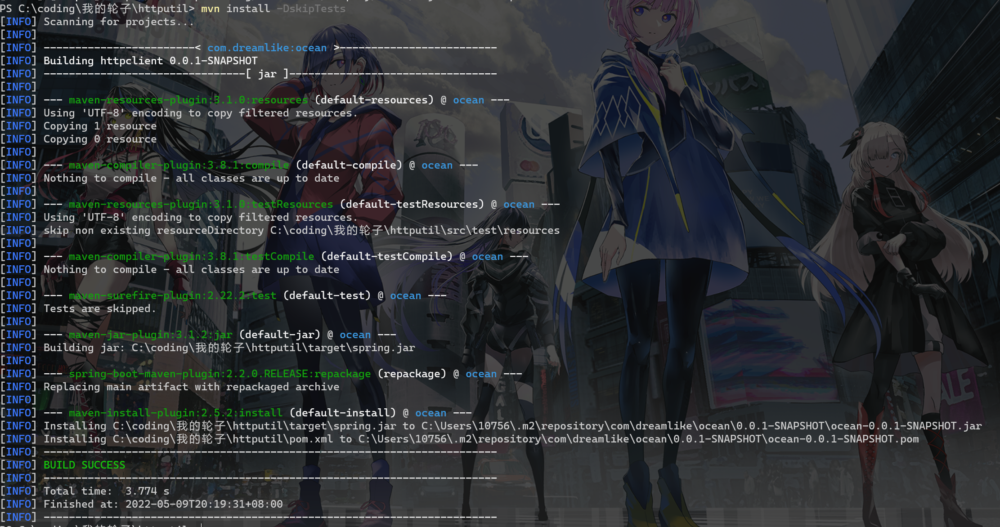

# Repositories

> 这一章翻译自[Maven – Introduction to Repositories (apache.org)](https://maven.apache.org/guides/introduction/introduction-to-repositories.html)

本章非常简单 只是帮你了解一下你的依赖到底从哪里来，到那里去

### 仓库

Maven中的仓库包含各种类型的构建产物和依赖包。

仓库有两种类型：本地仓库和远端仓库

1,本地仓库是本地上的一个文件夹。它会缓存从远端仓库获取的依赖，并储存尚未发布的临时构建产物。

2，远端仓库是指任何其他类型的仓库，可通过多种协议访问，如`file://`和`https://`。这些仓库可能是由第三方设置的真正远端仓库，用于提供可下载的构建产物（例如， [repo.maven.apache.org](https://repo.maven.apache.org/maven2/)）。其他“远端”仓库可能是在公司内的文件或HTTP服务器上设置的内部仓库，用于在开发团队之间共享私有构建产物并用于发布构建产物。

本地和远端仓库的结构相同，因此脚本可以在任意一侧运行，也同步以供脱机使用（即本地与远端仓库同步）。因此，存储库的分布对Maven用户来说是完全透明的。

### 使用仓库

一般来说，您不需要定期对本地仓库进行任何操作，除非在磁盘空间不足时将其清除（或者在愿意再次下载所有内容时将其完全删除）。对于远端仓库，它们可用于下载和上传（如果您有权限的话）。

#### 从远端仓库下载

当本地的项目声明了一个本地仓库不存在的依赖时会触发maven的下载操作（或者声明的是一个`SNAPSHOT`(快照版本)，远端的仓库会包含最新的版本）。在默认情况下，maven会从[中央仓库]([Central Repository: (apache.org)](https://repo.maven.apache.org/maven2/))获取这个依赖，如果您想优先从其他的地方下载，就需要指定一下`mirror`(镜像)地址。

你可以在`setting.xml`指定全局的镜像地址，你也可以通过`pom.xml`指定当前项目使用的地址。

#### 全局配置镜像地址

当我们希望有个仓库从地理位置上比较近可以节约传输的时间，或者我们所需要的包只有私有的仓库存在时，我们就可以配置一下镜像地址来帮助我们更快更好地获取到依赖。

首先找到`${user.home}/.m2/settings.xml`这个配置文件 若你是windows 应该是C:\Users\\{用户名}\\.m2\\setting.xml

这里我用ali的举个例子

```xml
<settings>
  ...
  <mirrors>
    <mirror>
  <id>aliyun</id>
  <mirrorOf>central</mirrorOf>   
  <name>aliyun</name>
  <url>http://maven.aliyun.com/nexus/content/groups/public/</url>
</mirror> 
<mirror>
  <id>aliyun</id>
  <mirrorOf>*</mirrorOf>   
  <name>aliyun</name>
  <url>http://maven.aliyun.com/nexus/content/groups/public/</url>
</mirror>
  </mirrors>
  ...
</settings>
```

虽然我们可以通过指定多个mirror的标签来填入多个镜像 但是mirrorOf相同的情况下，仅会选择靠前的镜像，当jar包下载失败后，是不会去第2个镜像下载的。

正确解法应该是setting.xml配置一个，需要特殊指定的仓库在pom.xml指定即可

#### 指定项目使用的仓库

你可以在你的项目中的pom.xml中加一条这个

```xml
<project>
  ...
  <repositories>
    <repository>  <!-- id可以随便取，只要不重名即可 -->
      <id>my-internal-site</id>
      <url>https://myserver/repo</url>
    </repository>
  </repositories>
  ...
</project>
```

如果你链接的仓库需要认证信息，就在id标签内设置登录信息即可

一般是你想要试试某些框架/库的快照版本，一般这种不会上传到maven中心仓库而是上传到自家的仓库，这种情况就可以用这个方法

比如说spring的快照仓库就是

```xml
<repository>
    <id>spring-milestone</id>
    <name>Spring Milestone Repository</name>
    <url>https://repo.spring.io/milestone</url>
</repository>
```

### 把构建产物放到仓库

有时，您需要将第三方 JAR 放在本地仓库才能在构建中使用，因为它们不存在于任何公共仓库中（如 [Maven Central）](https://search.maven.org/)中。

JAR 必须放置在本地仓库的正确位置，以便 Apache Maven 正确地找到它

1，若已经存在了jar包

```shell
mvn install:install-file -Dfile=<path-to-file> -DgroupId=<group-id> -DartifactId=<artifact-id> -Dversion=<version> -Dpackaging=<packaging>
```

2，存在jar 而且存在一个pom.xml

```shell
mvn install:install-file -Dfile=<path-to-file> -DpomFile=<path-to-pomfile>
```

3，从源码开始构建然后放到仓库

```shell
mvn install
```

举个例子


