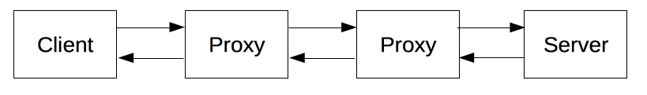

# http概述

> 请注意：
>
> http的所有讲解均来自于
>
> [HTTP概述 - HTTP | MDN (mozilla.org)](https://developer.mozilla.org/zh-CN/docs/Web/HTTP/Overview)的简化版
>
> 若读者有时间请务必浏览原文

### http是什么

HTTP是一种能够获取如 HTML 这样的网络资源的 [protocol](https://developer.mozilla.org/zh-CN/docs/Glossary/Protocol)(通讯协议)。它是在 Web 上进行数据交换的基础，是一种 client-server 协议，也就是说，请求通常是由像浏览器这样的**接受方**发起的。一个完整的Web文档通常是由不同的子文档拼接而成的，像是文本、布局描述、图片、视频、脚本等等。

由像浏览器这样的客户端发出的消息叫做 *requests*，被服务端响应的消息叫做 *responses。*

每一个发送到服务器的请求，都会被服务器处理并返回一个消息，也就是*response*。在这个请求与响应之间，还有许许多多的被称为 [proxies](https://developer.mozilla.org/zh-CN/docs/Glossary/Proxy_server) 的实体，他们的作用与表现各不相同，比如有些是网关，还有些是[caches](https://developer.mozilla.org/zh-CN/docs/Glossary/Cache)等。

比如说我们青柚线上的就是客户端发起一个请求，先过Nginx再代理到我们真实的服务器上面，Nginx就是指的下图的proxy



### http有哪些特性

1，简单：虽然下一代HTTP/2协议将HTTP消息封装到了帧（frames）中，HTTP大体上还是被设计得简单易读。HTTP报文能够被人读懂，还允许简单测试，降低了门槛，对新人很友好。

2，协议易于扩展：你可以任意在header部分加入任何扩展，只要服务端和客户端就新 headers 达成语义一致，新功能就可以被轻松加入进来。

3，无状态：HTTP是无状态的：在同一个连接中，两个执行成功的请求之间是没有关系的。这就带来了一个问题，用户没有办法在同一个网站中进行连续的交互，比如在一个电商网站里，用户把某个商品加入到购物车，切换一个页面后再次添加了商品，这两次添加商品的请求之间没有关联，浏览器无法知道用户最终选择了哪些商品。而使用HTTP的头部扩展，HTTP Cookies就可以解决这个问题。把Cookies添加到头部中，创建一个会话让每次请求都能共享相同的上下文信息，达成相同的状态。

因为是无状态的，理论上服务器内部并不保存当前的状态，所以可以轻易的横向扩展

### http协议是什么样子的？

当客户端想要和服务端进行信息交互时（服务端是指最终服务器，或者是一个中间代理），过程表现为下面几步：

1. 打开一个TCP连接：TCP连接被用来发送一条或多条请求，以及接受响应消息。客户端可能打开一条新的连接，或重用一个已经存在的连接，或者也可能开几个新的TCP连接连向服务端。

2. 发送一个HTTP报文：HTTP报文（在HTTP/2之前）是**语义可读**的。在HTTP/2中，这些简单的消息被封装在了帧中，这使得报文不能被直接读取，但是原理仍是相同的。

   ```html
   GET / HTTP/1.1
   Host: developer.mozilla.org
   Accept-Language: fr
   ```

3. 读取服务端返回的报文信息：

   ```html
   HTTP/1.1 200 OK
   Date: Sat, 09 Oct 2010 14:28:02 GMT
   Server: Apache
   Last-Modified: Tue, 01 Dec 2009 20:18:22 GMT
   ETag: "51142bc1-7449-479b075b2891b"
   Accept-Ranges: bytes
   Content-Length: 29769
   Content-Type: text/html
   
   <!DOCTYPE html... (here comes the 29769 bytes of the requested web page)
   ```


- 一个HTTP的[method](https://developer.mozilla.org/en-US/docs/Web/HTTP/Methods)，经常是由一个动词像[`GET`](https://developer.mozilla.org/zh-CN/docs/Web/HTTP/Methods/GET), [`POST`](https://developer.mozilla.org/zh-CN/docs/Web/HTTP/Methods/POST) 或者一个名词像[`OPTIONS`](https://developer.mozilla.org/zh-CN/docs/Web/HTTP/Methods/OPTIONS)，[`HEAD`](https://developer.mozilla.org/zh-CN/docs/Web/HTTP/Methods/HEAD)来定义客户端的动作行为。通常客户端的操作都是获取资源（GET方法）或者发送[HTML form](https://developer.mozilla.org/zh-CN/docs/Learn/Forms)表单（POST方法），虽然在一些情况下也会有其他操作。
- 要获取的资源的路径，通常是上下文中就很明显的元素资源的URL，它没有[protocol](https://developer.mozilla.org/zh-CN/docs/Glossary/Protocol) （`http://`），[domain](https://developer.mozilla.org/zh-CN/docs/Glossary/Domain)（`developer.mozilla.org`），或是TCP的[port (en-US)](https://developer.mozilla.org/en-US/docs/Glossary/Port)（HTTP一般在80端口）。
- HTTP协议版本号。
- 为服务端表达其他信息的可选头部[headers](https://developer.mozilla.org/en-US/docs/Web/HTTP/Headers)。
- 对于一些像POST这样的方法，报文的body就包含了发送的资源，这与响应报文的body类似。

即一次完整的http请求包含三部分

1，header部分：请求的方法，请求的路径，请求的http版本号，其中通过对于前两项的语义化约束，我们就得到了restful风格的规范。以及http header部分，这里就是一些约定俗成和自定义的header键值对

2，body部分，一般来说一些相较于header比较大的数据就会放在这里进行传输，比如说下载的文件