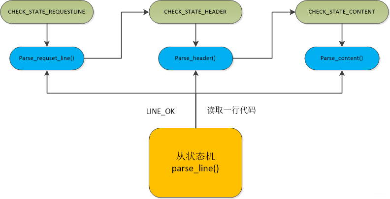

# http协议构成

> 请注意：
>
> http的所有讲解均来自于
>
> [HTTP消息 - HTTP | MDN (mozilla.org)](https://developer.mozilla.org/zh-CN/docs/Web/HTTP/Messages)的简化版
>
> 若读者有时间请务必浏览原文

为了方便讲解 本文采用的协议格式均为http1.1版本，http2.0其实也差不多但是消息包组成更复杂一点

HTTP消息是服务器和客户端之间交换数据的方式。有两种类型的消息︰ 请求（requests）--由客户端发送用来触发一个服务器上的动作；响应（responses）--来自服务器的应答。

HTTP消息由采用ASCII编码的多行文本构成。在HTTP/1.1及早期版本中，这些消息通过连接公开地发送。在HTTP/2中，为了优化和性能方面的改进，曾经可人工阅读的消息被分到多个HTTP帧中。

### http消息

HTTP 请求和响应具有相似的结构，由以下部分组成︰

1. 一行起始行用于描述要执行的请求，或者是对应的状态，成功或失败。这个起始行总是单行的。最后以`\r\n`结尾
2. 多行可选的HTTP头集合指明请求或描述消息正文。每一行最后以`\r\n`结尾
3. 一个空行指示所有关于请求的元数据已经发送完毕。即一行`\r\n`
4. 一个可选的包含请求相关数据的正文 (比如HTML表单内容), 或者响应相关的文档。 正文的大小有起始行的HTTP头来指定。

始行和  HTTP 消息中的HTTP 头统称为请求头，而其有效负载被称为消息正文。

插入一个思考题：若你在写协议解析 那么http解析过程中有多少种状态呢？


### http请求

#### 起始行：

HTTP请求是由客户端发出的消息，用来使服务器执行动作。*起始行 (start-line)* 包含三个元素：

1. 一个 *HTTP 方法*，一个动词 (像 [`GET`](https://developer.mozilla.org/zh-CN/docs/Web/HTTP/Methods/GET), [`PUT`](https://developer.mozilla.org/zh-CN/docs/Web/HTTP/Methods/PUT) 或者 [`POST`](https://developer.mozilla.org/zh-CN/docs/Web/HTTP/Methods/POST)) 或者一个名词 (像 [`HEAD`](https://developer.mozilla.org/zh-CN/docs/Web/HTTP/Methods/HEAD) 或者 [`OPTIONS`](https://developer.mozilla.org/zh-CN/docs/Web/HTTP/Methods/OPTIONS)), 描述要执行的动作. 例如, `GET` 表示要获取资源，`POST` 表示向服务器推送数据 (创建或修改资源, 或者产生要返回的临时文件)。

2. 请求目标 (request target)，通常是一个URL，或者是协议、端口和域名的绝对路径，通常以请求的环境为特征。请求的格式因不同的 HTTP 方法而异。它可以是：

   - 一个绝对路径，末尾跟上一个 ' ? ' 和查询字符串。这是最常见的形式，称为 *原始形式 (origin form)*，被 GET，POST，HEAD 和 OPTIONS 方法所使用。**这种是用的最多的一种形式**

     ```
     POST / HTTP/1.1
     GET /background.png HTTP/1.0
     HEAD /test.html?query=alibaba HTTP/1.1
     OPTIONS /anypage.html HTTP/1.0
     ```

   - 一个完整的URL，被称为 *绝对形式 (absolute form)*，主要在使用 `GET` 方法连接到代理时使用。
     `GET http://developer.mozilla.org/en-US/docs/Web/HTTP/Messages HTTP/1.1`

   - 由域名和可选端口（以`':'`为前缀）组成的 URL 的 authority component，称为 *authority form*。 仅在使用 `CONNECT` 建立 HTTP 隧道时才使用。
     `CONNECT developer.mozilla.org:80 HTTP/1.1`

   - *星号形式 (asterisk form)*，一个简单的星号(`'*'`)，配合 `OPTIONS` 方法使用，代表整个服务器。
     `OPTIONS * HTTP/1.1`

3. *HTTP 版本 (HTTP version*)*，*定义了剩余报文的结构，作为对期望的响应版本的指示符。

#### http header

来自请求的 [HTTP headers](https://developer.mozilla.org/en-US/docs/Web/HTTP/Headers) 遵循和 HTTP header 相同的基本结构：**不区分大小写的字符串**，紧跟着的冒号 `(':')` 和一个结构取决于 header 的值。 单个 header（包括值）由一行组成，这一行可以相当长，行尾为\r\n

有许多响应头可用，这些响应头可以分为几组：

有许多请求头可用，它们可以分为几组：

- *General headers，*例如`Connection`，适用于表示此次请求的状态。
- *Request headers，*例如 [`User-Agent`](https://developer.mozilla.org/zh-CN/docs/Web/HTTP/Headers/User-Agent)，[`Accept-Type`](https://developer.mozilla.org/zh-CN/docs/Web/HTTP/Headers/Accept-Type)，这一种用于传递此次请求的一些与body无关的参数
- *Entity headers，*例如 [`Content-Length`](https://developer.mozilla.org/zh-CN/docs/Web/HTTP/Headers/Content-Length)，适用于请求的 body。显然，如果请求中没有任何 body，则不会发送这样的头，其用于描述body的信息


#### body

请求的最后一部分是它的 body。不是所有的请求都有一个 body：例如获取资源的请求，GET，HEAD，DELETE 和 OPTIONS，通常它们不需要 body。 有些请求将数据发送到服务器以便更新数据：常见的的情况是 POST 请求（包含 HTML 表单数据）。注意，RFC中并没有限定get/delete不可以带body，你在开发中是否可以处理其的bdoy取决于你使用的http解析器是否支持

Body 大致可分为两类：

- Single-resource bodies，由一个单文件组成。该类型 body 由两个 header 定义： [`Content-Type`](https://developer.mozilla.org/zh-CN/docs/Web/HTTP/Headers/Content-Type) 和 [`Content-Length`](https://developer.mozilla.org/zh-CN/docs/Web/HTTP/Headers/Content-Length).
- [Multiple-resource bodies](https://developer.mozilla.org/zh-CN/docs/Web/HTTP/Basics_of_HTTP/MIME_types#multipartform-data)，由多部分 body 组成，每一部分包含不同的信息位。通常是和  [HTML Forms](https://developer.mozilla.org/en-US/docs/Learn/Forms) 连系在一起。

#### requet参数位置

综上之，http请求能够在哪些地方传递参数呢？

1，url，比如说url中的query param  `/test.html?query=alibaba` 的query

2，header，header本身就是一种key-value结构，在这里我们也可以进行传递参数

3，body，比如说body是一个json字符串，那么就可以拿到后进行反序列化成实例对象

### http响应

#### 起始行

HTTP 响应的起始行被称作 *状态行* *(status line)*，包含以下信息：

1. *协议版本*，通常为 `HTTP/1.1。`
2. *状态码 (**status code**)*，表明请求是成功或失败。常见的状态码是 [`200`](https://developer.mozilla.org/zh-CN/docs/Web/HTTP/Status/200)，[`404`](https://developer.mozilla.org/zh-CN/docs/Web/HTTP/Status/404)，或 [`302`](https://developer.mozilla.org/zh-CN/docs/Web/HTTP/Status/302)。
3. *状态文本 (status text)*。一个简短的，纯粹的信息，通过状态码的文本描述，帮助人们理解该 HTTP 消息。

一个典型的状态行看起来像这样：`HTTP/1.1 404 Not Found`。

#### header

- General headers，例如`Connection`，适用于表示此次请求的状态。
- *Response headers，*例如 [`Vary`](https://developer.mozilla.org/zh-CN/docs/Web/HTTP/Headers/Vary) 和 [`Accept-Ranges`](https://developer.mozilla.org/zh-CN/docs/Web/HTTP/Headers/Accept-Ranges)这一种用于传递此次请求的一些与body无关的参数
- *Entity headers，*例如 [`Content-Length`](https://developer.mozilla.org/zh-CN/docs/Web/HTTP/Headers/Content-Length)，适用于请求的 body。显然，如果请求中没有任何 body，则不会发送这样的头，其用于描述body的信息


#### body

响应的最后一部分是 body。不是所有的响应都有 body：具有状态码 (如 [`201`](https://developer.mozilla.org/zh-CN/docs/Web/HTTP/Status/201) 或 [`204`](https://developer.mozilla.org/zh-CN/docs/Web/HTTP/Status/204)) 的响应，通常不会有 body。

Body 大致可分为三类：

- Single-resource bodies，由**已知**长度的单个文件组成。该类型 body 由两个 header 定义：[`Content-Type`](https://developer.mozilla.org/zh-CN/docs/Web/HTTP/Headers/Content-Type) 和 [`Content-Length`](https://developer.mozilla.org/zh-CN/docs/Web/HTTP/Headers/Content-Length)。
- Single-resource bodies，由**未知**长度的单个文件组成，通过将 [`Transfer-Encoding`](https://developer.mozilla.org/zh-CN/docs/Web/HTTP/Headers/Transfer-Encoding) 设置为 `chunked `来使用 chunks 编码。
- [Multiple-resource bodies](https://developer.mozilla.org/en-US/docs/Web/HTTP/Basics_of_HTTP/MIME_types#multipartform-data)，由多部分 body 组成，每部分包含不同的信息段。但这是比较少见的。

### 思考题解答

若你在写协议解析 那么http解析过程中有多少种状态呢？

简单来说可以分为三个状态，**正在解析起始行**，**正在解析header**，**正在解析body**，然后回到第一个状态，这就是一个简单的有限状态机

主状态机有三种状态

- CHECK_STATE_REQUESTLINE，解析起始
- CHECK_STATE_HEADER，解析header
- CHECK_STATE_CONTENT，解析body



其实如果考虑基于tcp这种流式协议的http实现，因为你对于读取一次socket fd能读到多少字节是不确定的，其状态还会更多。这里就需要拆成两个状态机，一个用于处理协议解析假设称之为A，一个用于按行读取buffer假设称之为B，当A的状态切换到解析body时其也要通知B不再按行进行解析buffer

