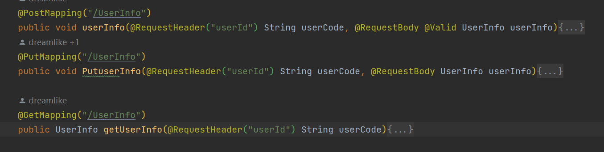

# REST

> 请注意：
>
> http的所有讲解均来自于
>
> [REST - 术语表 | MDN (mozilla.org)](https://developer.mozilla.org/zh-CN/docs/Glossary/REST)的简化版
>
> 和
>
> [What is REST? (restapitutorial.com)](https://www.restapitutorial.com/lessons/whatisrest.html)的翻译
>
> 若读者有时间请务必浏览原文

表述性状态传递（**REST，**Representational State Transfer) 是一组实现效率、可读性、还有可拓展分散式系统的软件架构设计规范。如果一个系统能坚守这些规范，那么它就是 RESTful。

这种风格是我们开发中用到最多的接口定义风格，可以帮助我们增强接口的语义性，同时也可以提高内部实现的可维护性

#### 前言

REST风格由六个方面进行约束，这些应用于体系结构的约束最初是由罗伊·菲尔丁在他的博士论文中提出的（参见[Fielding Dissertation: CHAPTER 5: Representational State Transfer (REST) (uci.edu)](https://www.ics.uci.edu/~fielding/pubs/dissertation/rest_arch_style.htm)）并且定义了基础的RESTful样式。

六个约束为

- 统一接口 （uniform interface）
- 无状态（stateless）
- 可缓存（cacheable）
- 客户端-服务端（client-server）
- 分层系统（layered system）
- 按需编码（code on demand） 

#### 统一接口 （uniform interface）

统一接口约束定义了客户端和服务器之间的接口。它简化和解耦了体系结构，使每个部分都能够独立发展。统一接口的四个指导原则是：

##### 基于资源（resource-based）

在请求中使用 URI 作为资源标识符来标识单个资源。在概念上，资源本身与返回给客户端的表示是不同的的。例如，服务器不发送它的数据库，而是发送一些 HTML、XML 或 JSON，它们代表一些数据库记录，例如发回的响应可以以用芬兰语表示并以 UTF-8 编码，具体取决于请求的细节和服务器实现.

##### 通过表述来操作资源(Manipulation of Resources Through Representations)

资源的表述是一段对于资源在某个特定时刻的状态的描述，比如说用json代表数据库里的一行

当客户端持有资源的表述，包括任何附加的元数据时，若它拥有足够的权限，那么它就有足够的信息来修改或删除服务器上的资源。

##### 自描述性的信息

每条消息都包含足够的信息来描述如何处理消息。例如，要调用的解析器可能由Internet媒体类型（以前称为MIME类型）指定。响应还明确表示资源是否的可缓存性。

比如说我们对应的`content-type`这种header

##### 超媒体即应用状态引擎（Hypermedia as the Engine of Application State (HATEOAS)）

客户端通过body、query param、head和请求的URI（资源名称）传递状态。服务通过body、response codes和header向客户端传递状态。这在技术上被称为超媒体（或超文本中的超链接）。 

除了上面的描述之外，HATEOS还意味着，在必要时，返回的body（或header）中包含链接，以提供URI来检索对象本身或相关对象。

比如说 我们可以利用http method表示对资源的操作，url作为资源的表述

GET即获取一个资源  POST即新建一个资源 PUT即更新一个资源 DELETE即删除一个资源

任何REST服务必须提供的统一接口(uniform interface)是HATEOS设计的基础。

#### 无状态（stateless）

由于REST是表述性状态传递(REpresentational State Transfer)的首字母缩略词，所以无状态是关键。本质上，这意味着处理请求所需的状态包含在请求本身中，无论是作为URI、query param、body还是header的一部分。URI唯一标识资源，body包含该资源的状态（或状态更改）。然后，在服务器进行处理之后，适当的状态或重要的状态片段将通过header、statue和body传回客户端。

我们中的大多数人在这个行业已经有一段时间了，他们习惯于在一个容器（比如说tomcat）中编程，这个容器为我们提供了“会话（session）”的概念，它可以跨多个HTTP请求维护状态。在REST中，客户端必须包含服务器完成请求所需的所有信息，如果该状态必须跨越多个请求，则根据需要重新发送状态。无状态支持更大的可伸缩性，因为服务器不必维护、更新或通信该会话状态。此外，负载平衡器不必担心无状态系统的会话亲和性（亲和性指的是保证相同会话的请求都转发到同一个服务器）。

那么，状态和资源之间有什么区别呢？状态，或应用程序状态，是服务器为完成请求而关心的状态，是当前会话或请求所需的数据。资源或资源状态是定义资源表述(resource representation)的数据，例如存储在数据库中的数据。所以应该将应用程序的状态视为可能因客户端和每个请求而异的数据。另一方面，每个请求资源的客户端的资源状态都是恒定的。

曾经有一个web应用程序的后退按钮问题，它在某一点上出现了问题，是因为它希望你按照特定的顺序来操作吗？那是因为它违反了无状态的原则。有些情况不符合无状态原则，例如three-legged OAuth、API调用速率限制等。但是，请尽一切努力确保应用程序状态不会跨越服务的多个请求。

#### 可缓存（cacheable）

与万维网一样，客户端可以缓存响应。因此，响应必须隐式或显式地定义自己是否可缓存，以防止客户端在进一步的请求中重用了响应中的过期数据或不合适的数据。管理良好的缓存部分或完全消除了一些客户端-服务器交互，进一步提高了可扩展性和性能。

#### 客户端-服务端（client-server）

统一接口（uniform interface）将客户端与服务器分开。这种关注点分离意味着，客户端不关心数据存储，数据存储仍然是由每个服务器的内部决定，因此客户端代码的可移植性得到了改进。服务器与用户界面或用户状态无关，因此服务器可以更简单、更具可扩展性。只要不改变接口，服务器和客户端也可以独立更换和开发。

#### 分层系统（layered system）

客户端通常无法判断它是直接连接到末端服务器，还是连接到中间层。中间服务器可以通过实现负载平衡和提供共享缓存来提高系统的可伸缩性。中间层还可以强制执行安全策略。

#### 按需编码（code on demand） 

服务器可以通过向客户端传输可执行的逻辑来临时扩展或自定义客户端的功能。这方面的示例可能包括已编译组件（如Java小程序）和客户端脚本（如JavaScript）。

遵守这些约束，从而遵守REST体系结构风格，将使任何类型的分布式超媒体系统都具有理想的重要属性，例如性能、可扩展性、简单性、可修改性、可见性、可移植性和可靠性。

注意：REST体系结构的唯一可选约束是按需编码。如果服务违反了任何其他约束，则不能严格地将其称为RESTful。

#### 一些例子

这些url是完全一样的 但是方法并不一样，从上到下为 更新用户信息，上传用户信息，获取用户信息

而对于取值位置，比如说从header，body中取值就是在从请求中获取对象状态