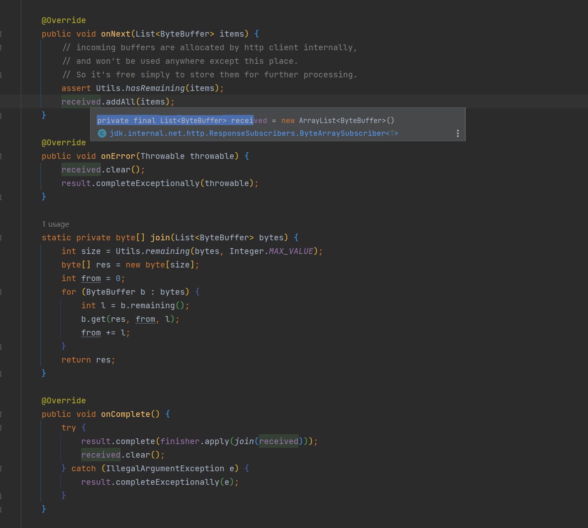

# httpclient

> 尝试本篇代码前请确定你的jdk版本在11以上

现在我们已经了解了http协议的一些方面，然后让我们从代码角度直观地看看httpclient的api是什么样子的

### api使用

#### get方法

```java
HttpClient client = HttpClient.newHttpClient();
HttpRequest request = HttpRequest.newBuilder().GET().uri(URI.create("http://www.baidu.com")).header("key", "value").build();
HttpResponse<String> response = client.send(request,HttpResponse.BodyHandlers.ofString(StandardCharsets.UTF_8));
        String body = response.body();
```

首先我们先来关注一下`send`方法的第二个参数`BodyHandler`，这里我使用了一个简单的handler——直接把全部的body读到内存中然后转化为字符串，这种方法只适用于我明确知道响应是什么的情况。当然了大部分情况我们遇到的响应都是一个json字符串 全部读到内存也没什么关系

思考一个问题，如果我们所面对的响应的body非常大呢？全部读到内存是不是会oom？

所以我们来看看，如果我们不使用jdk提供的方法，应该怎么写

```java
var  response = client.send(request, responseInfo -> new HttpResponse.BodySubscriber<Object>() {
            @Override
            public CompletionStage<Object> getBody() {
                return null;
            }

            @Override
            public void onSubscribe(Flow.Subscription subscription) {

            }

            @Override
            public void onNext(List<ByteBuffer> item) {

            }

            @Override
            public void onError(Throwable throwable) {

            }

            @Override
            public void onComplete() {

            }
        });
```

是不是很复杂？当然了 我们先来看一个实现



tostring这种实现本质上就是当流终止时再把接收到的全部数据合并起来

其实httpclient的api本意是异步的，其底层实现就是基于selector体系的，而tcp的数据什么时候来是不确定的，每次从socket读到数据就会丢给onNext方法，当http协议本次请求解析完毕的时候就会回调onComplete方法，这个就是jdk9引入的reactive stream api。

通过这一套我们就可以很方便地分块处理响应，而不必担心oom的风险。

#### post

```java
HttpClient client = HttpClient.newHttpClient();
HttpRequest request = HttpRequest.newBuilder().POST(HttpRequest.BodyPublishers.ofString("body")).uri(URI.create("http://www.baidu.com")).header("key", "value").build();

var  response = client.send(request, HttpResponse.BodyHandlers.ofString());
```

reponse部分也不再赘述

我们来看看POST中BodyPublisher是个什么东西

它所解决的问题和BodySubscriber类似，比如说你要提交的body非常大，比如说上传一个大文件，你要是全部读到内存里面再请求就可能oom，这个就是解决这个问题的。

以文件上传为例子，publisher相当于你读一点文件就给socket写一点

### 原理简介

一个client会启动一个线程去做eventloop，涉及到异步网络io就开始切线程
先是实例化一个connect事件的asyncevent实例丢到线程中的registerions队列里面，然后再由eventloop取出注册到selector上面

然后io连接触发对应的回调，触发completeablefuture回调切一次线程，再重新注册一个read事件的asyncevent，再切一次线程。最后可读事件出发之后一层包一层把bybuffer丢到http parse里面，更离谱的在于bytebuffer来源 就一个来源 来自于一个factory,核心就一个bytebuffer.allocate申请一个堆内存

之后就是\r\n状态机解析http协议，然后拐弯抹角套一堆，把读到的body对应的List<ByteBuffer>丢到你一开始传入的bodysubscriber里面