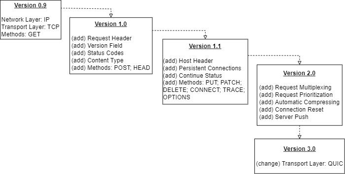

# HTTP：1.0 vs 1.1vs 2.0 vs 3.0

> 本文成文时间为：2022年5月21日

### 回顾

#### 1.0

HTTP的最开始只允许从服务器获取信息。然而，随着互联网的发展和新功能的出现，它变得不够。

**在这种情况下，HTTP的1.0版本于1996年发布，大约比0.9版本晚了五年。**

HTTP的1.0版本带来了几个新功能。让我们看看其中的一些：

- **header**：在http 0.9中`header`部分只由方法和资源名称组成。而HTTP 1.0引入了http header，从而允许传输元数据，使协议灵活且可扩展。
- **版本控制**：HTTP请求显式通知所使用的版本，并将其附加到请求行中
- **状态代码**：HTTP 响应现在包含状态代码，从而使接收方能够检查请求处理状态（成功或失败）
- **内容类型**：用特定的HTTP标头（content-type），来说明body的类型，这样HTTP可以传输除纯HTML文件以外的其他文件了
- **新方法**：除了GET之外，HTTP 1.0还提供了两种新方法（POST和HEAD）

**总而言之，HTTP 1.0比0.9版本更加健壮。** 协议最大的改进是HTTP header和新的HTTP方法。

#### 1.1

**HTTP的1.1版本于1997年发布，仅比以前的1.0版本晚了一年。** HTTP 1.1 是 HTTP 1.0 的增强功能，提供了多个扩展。就目前来说）1.1是我们使用的最多的一种规范之一

让我们看看其中的一些：

- **host header**：HTTP 1.0 并不需要host header。而HTTP 1.1 规范要求它必须存在。host header对于通过代理服务器路由消息特别重要，允许区分指向同一 IP 的域
- **持久连接**：在 HTTP 1.0 中，每个请求/响应对都需要打开一个新连接。在HTTP 1.1中，可以使用单个连接执行多个请求。HTTP1.1增加Connection字段，对于同一个host，通过设置Keep-Alive保持HTTP连接不断。避免每次客户端与服务器请求都要重复建立释放建立TCP连接。提高了网络的利用率。
- **Continue**状态：为避免服务器拒绝不可处理的请求，现在客户端可以首先仅发送请求标头并检查它们是否收到继续状态代码 （100）
- **新方法**：除了HTTP 1.0已经可用的方法外，1.1版本还增加了六种额外的方法：PUT，PATCH，DELETE，CONNECT，TRACE和OPTIONS
- **pipeline**：多个请求可以同时发送，但是服务器还是按照顺序，先回应 A 请求，完成后再回应 B 请求

除了突出显示的增强功能之外，HTTP 1.1 版中还引入了许多其他增强功能，例如压缩和解压缩（gzip）、多语言支持

**具体来说，新方法代表了让HTTP请求更加语义化。**PUT 方法负责替换现有资源。PATCH 方法更新现有资源的特定数据。另一方面，DELETE 会删除已存在的资源。

HTTP CONNECT 可以通过代理服务器创建隧道。TRACE 在从客户端到目标服务器的路径中执行环回测试。最后，OPTIONS 返回有关与服务器的可用通信选项的信息。

#### 2.0

**HTTP版本2.0于2015年正式发布，大约比HTTP 1.1晚了十八年。** 特别是，HTTP 2.0专注于提高协议性能。

为此，HTTP 2.0实现了几个功能来改善连接和数据交换。让我们看看其中的一些：

- **请求多路复用**：HTTP 1.1 是一种顺序协议。响应顺序必须和请求顺序一致。而HTTP 2.0允许异步发送请求和接收响应。通过这种方式，我们可以使用单个连接同时执行多个请求。
- **请求优先级**：使用HTTP 2.0，我们可以在一批请求中设置数字优先级。因此，我们可以明确期望响应的顺序，例如在其JS文件之前获取网页CSS。
- **压缩**：在之前的HTTP版本（1.1）中，我们必须明确要求压缩请求和响应。但是，HTTP 2.0 会自动执行 GZip 压缩。而且客户端和服务端共同维护一张header表，既避免重复header的传输，又减少了需要传输的大小。
- **连接重置**：一种功能，允许出于某种原因关闭服务器和客户端之间的连接，从而立即打开新连接
- **服务器推送**：服务器除了最初请求的响应外，服务器还可以额外向客户端推送资源，而无需客户端明确的请求

此外，HTTP 2.0成为二进制协议，取代了以前的HTTP纯文本版本。**总而言之，我们可以将HTTP 2.0视为一个增强的补丁，以解决上一个HTTP版本的问题和限制。**

#### 3.0*

基于Google的QUIC，HTTP3 背后的主要思想是放弃 TCP，转而使用基于 UDP 的 QUIC 协议。

与 HTTP2 在技术上允许未加密的通信不同，QUIC 严格要求加密后才能建立连接。此外，加密不仅适用于 HTTP 的payload，还适用于流经连接的所有数据，从而避免了一大堆安全问题。建立持久连接、协商加密协议，甚至发送第一批数据都被合并到 QUIC 中的单个请求/响应周期中，从而大大减少了连接等待时间。如果客户端具有本地缓存的密码参数，则可以通过简化的握手（0-RTT）重新建立与已知主机的连接。

截止到目前仍为草案状态 [draft-ietf-quic-http-33](https://datatracker.ietf.org/doc/html/draft-ietf-quic-http-33)，但是如果你使用一些谷歌服务，抓抓包可能就能看到quic的http3.0实现了

#### 总结

来一张图来总结一下http的更新

### http演化的促进因素

随着网络的普及，很多东西从原来的能用就行到追求效率，http协议也是这样

#### **持久连接 keep-alive**：

1.1新增的特性，在header头里面添加`connection`指示此次请求结束后不切断连接，避免每次客户端与服务器请求都要重复建立释放建立TCP连接，而现实中基本默认的实现都是即使不加也是持久连接，需要一次请求一次连接则需要手动加入`connect：close`头

#### **pipeline机制**：

1.1新增的特性，之前的协议则是一个请求被响应后才能发送下一个请求，而pipeline之后可以一口气发多个请求，响应按请求顺序发回，看起来似乎增强了我们网络的吞吐，实际上这个特性比较鸡肋，甚至**目前没有现代浏览器默认启用这个特性**。因为它实际上没有解决http协议层面的`队头拥塞问题`，即若队头的请求响应过慢，后面的请求就会在排队。由于这些原因，pipeline已经被更好的算法给代替，如 用于的http2.0*multiplexing*（多路复用）

#### **压缩**：

我们往往希望利用更小的网络包减小请求的时延和带宽，流量成本。所以客户端和用户端分别通过`Accept-Encoding`和`Content-Encoding`来讨论使用哪种压缩方案压缩body，比如说gzip或deflate。既然可以压缩body，是不是我们也可以压缩header？header不同于body，同一个连接的多次请求的body可能没有相同之处，但是header却有，具体的协议规范请看[RFC 7541 - HPACK: Header Compression for HTTP/2 (ietf.org)](https://datatracker.ietf.org/doc/html/rfc7541)，header 字段列表视为 name-value 对的有序集合，其中可以包括重复的对。名称和值被认为是八位字节的不透明序列，并且 header 字段的顺序在压缩和解压缩后保持不变。header 字段表将 header 字段映射到索引值，从而得到编码。

#### **websocket和服务端推送**：

对于传统的http协议来讲，往往是一问一答这种单工通讯，而http又是建立在tcp这种双工协议上面的，有些时候我们一种推送技术，比如说站内私信的推送，早期都是轮询，轮询是指由浏览器每隔

一段时间（如每秒）向服务器发出HTTP请求，然后服务器返回最新的数据给客户端。

- websocket：这种传统的模式带来很明显的缺点，即浏览器需要不断的向服务器发出请求，然而HTTP请求与回复可能会包含较长的header，其中真正有效的数据可能只是很小的一部分，所以这样会消耗很多带宽资源。因此出现了WebSocket协议，能更好的节省服务器资源和带宽，并且能够更实时地进行通讯。请注意websocket协议只是利用http握手升级，而不是意味着websocket是http协议之上的一个协议，它实际上是基于tcp的
- 服务端推送：类似于就是一次请求，服务端可以“响应”多次，比如，浏览器只请求了`index.html`，但是服务器把`index.html`、`style.css`、`example.png`全部发送给浏览器

#### **多路复用**：

我们之前提到的pipeline队头拥塞问题其关键在于响应必须按请求顺序来，这就导致了最长的阻塞住了后面的请求响应，如果我们可以“乱序”响应呢？HTTP/2将一个TCP连接分为若干个流（Stream），每个流中可以传输若干消息（Message），每个消息由若干最小的二进制帧（Frame）组成。HTTP/2中，每个用户的操作行为被分配了一个**流编号（Stream ID）**，即我们只要响应带上这个编号就可以让对端知道我们送的到底是哪个请求的响应了。

#### **QUIC**：

队头拥塞问题的解决：http2.0只是解决了http层面的队头拥塞问题，而TCP 使用序列号来标识数据的顺序，数据必须按照顺序处理，如果前面的数据丢失，后面的数据就算到达了也不会通知应用层来处理，因此也会存在队头拥塞问题。所以 QUIC 协议选择了 UDP，因为 UDP 本身没有连接的概念，利用在应用程序层面实现了 TCP 的可靠性，从而避免了这个问题。当然了QUIC不只是这些特性，有兴趣的请阅读[draft-ietf-quic-transport-22](https://datatracker.ietf.org/doc/html/draft-ietf-quic-transport-22#section-1)

### 杂项

1，虽然http2.0协议中支持从1.1升级到2.0，这种称之为h2c,但是由于chrome并未实现该功能，又加之其事实垄断地位，导致基于tls实现的HTTP/2成为事实标准。简单来说，如果你的服务器并没有上ssl/tls证书那么只能以http1.1方式访问。

2，quic由于使用udp实现，所以运营商会对其做QoS限制，比如说限速，故意丢包等。但是由于某些互联网巨无霸公司对于IETF的领导力量非常大而且具有自建机房，自建通讯交换机等可以直接自己做自己运营商的能力，完完全全可能使得这种缺点消失